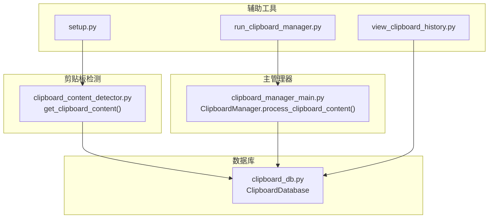
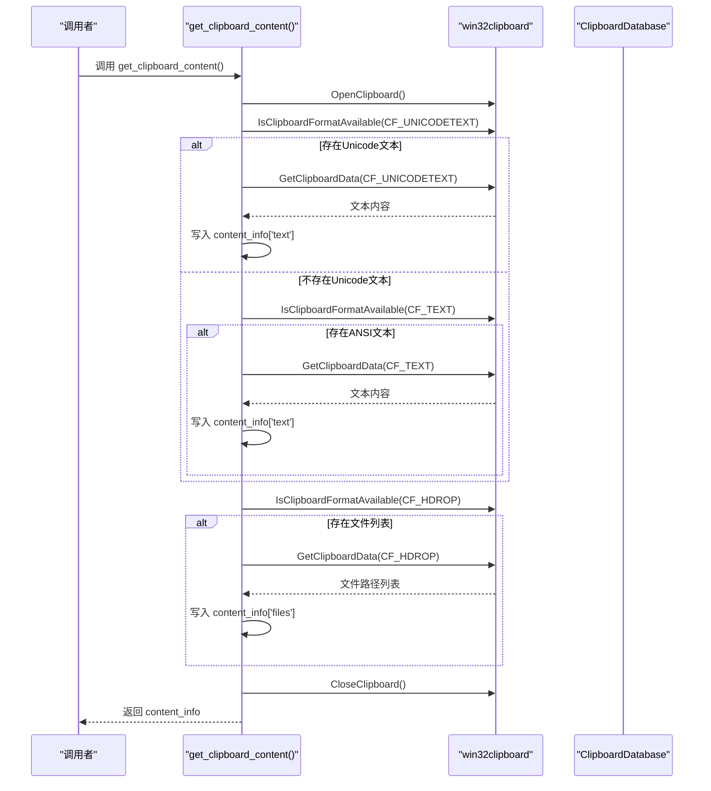
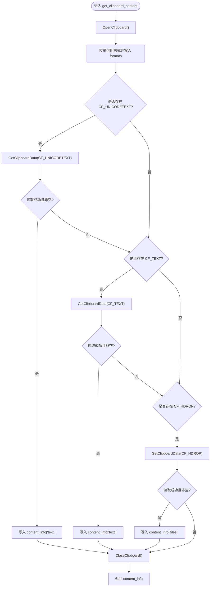
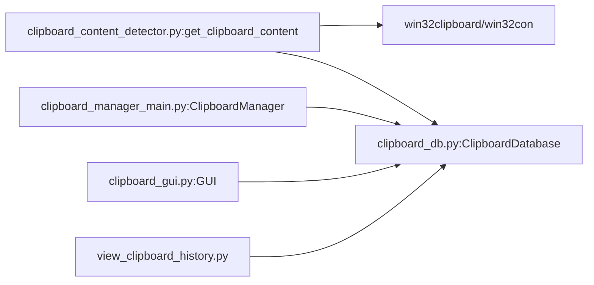

# 内容检测机制

<cite>
**本文引用的文件**
- [clipboard_content_detector.py](file://clipboard_content_detector.py)
- [clipboard_manager_main.py](file://clipboard_manager_main.py)
- [clipboard_db.py](file://clipboard_db.py)
- [view_clipboard_history.py](file://view_clipboard_history.py)
- [run_clipboard_manager.py](file://run_clipboard_manager.py)
- [setup.py](file://setup.py)
</cite>

## 目录
1. [简介](#简介)
2. [项目结构](#项目结构)
3. [核心组件](#核心组件)
4. [架构总览](#架构总览)
5. [详细组件分析](#详细组件分析)
6. [依赖关系分析](#依赖关系分析)
7. [性能考量](#性能考量)
8. [故障排查指南](#故障排查指南)
9. [结论](#结论)
10. [附录](#附录)

## 简介
本文件围绕剪贴板内容检测器中的 get_clipboard_content 函数展开，系统性说明其如何通过 win32clipboard.OpenClipboard() 获取剪贴板访问权限，如何使用 IsClipboardFormatAvailable 检查 CF_UNICODETEXT、CF_HDROP、CF_TEXT 等格式可用性，并据此区分文本与文件内容。文档还解释 content_info 字典的数据结构设计（text、files、formats、timestamp），给出调用示例与错误处理策略，讨论多格式兼容性与为何需要检查多种文本格式的原因。

## 项目结构
本仓库采用“功能模块化”组织方式：
- 剪贴板内容检测器：clipboard_content_detector.py
- 主管理器与GUI：clipboard_manager_main.py、clipboard_gui.py
- 数据库层：clipboard_db.py
- 辅助工具：view_clipboard_history.py、run_clipboard_manager.py、build_exe.py、setup.py

图表来源
- [clipboard_content_detector.py](file://clipboard_content_detector.py#L87-L137)
- [clipboard_manager_main.py](file://clipboard_manager_main.py#L395-L496)
- [clipboard_db.py](file://clipboard_db.py#L1-L120)
- [view_clipboard_history.py](file://view_clipboard_history.py#L1-L75)
- [run_clipboard_manager.py](file://run_clipboard_manager.py#L1-L71)
- [setup.py](file://setup.py#L65-L81)

章节来源
- [clipboard_content_detector.py](file://clipboard_content_detector.py#L1-L137)
- [clipboard_manager_main.py](file://clipboard_manager_main.py#L355-L496)
- [clipboard_db.py](file://clipboard_db.py#L1-L120)
- [view_clipboard_history.py](file://view_clipboard_history.py#L1-L75)
- [run_clipboard_manager.py](file://run_clipboard_manager.py#L1-L71)
- [setup.py](file://setup.py#L65-L81)

## 核心组件
- get_clipboard_content：负责一次性检测剪贴板中的文本与文件内容，返回标准化的 content_info 字典。
- ClipboardDatabase：提供数据库初始化、文本/文件记录保存、查询、统计与设置管理。
- ClipboardManager：在监控循环中调用剪贴板接口，执行复制限制检查与文件/文本保存流程。
- GUI与历史查看：提供可视化界面与控制台历史查看工具。

章节来源
- [clipboard_content_detector.py](file://clipboard_content_detector.py#L87-L137)
- [clipboard_manager_main.py](file://clipboard_manager_main.py#L355-L496)
- [clipboard_db.py](file://clipboard_db.py#L1-L120)
- [view_clipboard_history.py](file://view_clipboard_history.py#L1-L75)

## 架构总览
get_clipboard_content 的调用链路如下：上层监控器或独立检测器调用该函数，函数内部通过 win32clipboard 接口读取剪贴板数据，随后返回标准化的 content_info 结构，供上层决定是否保存或进一步处理。

图表来源
- [clipboard_content_detector.py](file://clipboard_content_detector.py#L87-L137)

## 详细组件分析

### get_clipboard_content 函数详解
- 功能概述
  - 通过 win32clipboard.OpenClipboard() 打开剪贴板句柄，枚举可用格式，优先尝试 Unicode 文本（CF_UNICODETEXT），其次 ANSI 文本（CF_TEXT），最后尝试文件列表（CF_HDROP）。最终返回标准化的 content_info 字典。
- 关键步骤
  - 打开剪贴板：OpenClipboard()
  - 枚举格式：EnumClipboardFormats() 并写入 content_info['formats']
  - 文本检测：
    - 先检查 CF_UNICODETEXT，成功则读取并写入 content_info['text']
    - 若未获取到文本，再检查 CF_TEXT，成功则读取并写入
  - 文件检测：
    - 检查 CF_HDROP，成功则读取文件路径列表并写入 content_info['files']
  - 关闭剪贴板：CloseClipboard() 放在 finally 中确保异常也能释放资源
- 返回结构：content_info
  - text：字符串或 None
  - files：字符串列表（文件路径）
  - formats：整数列表（可用格式ID）
  - timestamp：字符串（本地时间）

图表来源
- [clipboard_content_detector.py](file://clipboard_content_detector.py#L87-L137)

章节来源
- [clipboard_content_detector.py](file://clipboard_content_detector.py#L87-L137)

### content_info 字典数据结构设计
- 字段说明
  - text：当前剪贴板中的文本内容，若无文本则为 None
  - files：当前剪贴板中的文件路径列表，若无文件则为空列表
  - formats：当前剪贴板中所有可用格式ID列表，便于调试与诊断
  - timestamp：本地时间字符串，用于记录检测时刻
- 设计目的
  - 统一上层处理逻辑：无论文本还是文件，都以同一结构返回，便于后续保存、去重、限制检查与显示
  - 降低耦合：调用方无需关心底层格式细节，只需读取 content_info 即可

章节来源
- [clipboard_content_detector.py](file://clipboard_content_detector.py#L87-L137)

### 错误处理机制
- try-except 包裹
  - 打开/读取剪贴板阶段出现异常会捕获并打印错误信息
- finally 保证资源释放
  - 无论是否发生异常，都会尝试 CloseClipboard()，避免句柄泄漏
- 格式读取异常隔离
  - 每种格式读取均独立 try-except，避免一种格式异常影响其他格式读取

章节来源
- [clipboard_content_detector.py](file://clipboard_content_detector.py#L87-L137)

### 多格式兼容性与文本格式优先级
- 为什么需要检查多种文本格式
  - 不同应用写入剪贴板时可能使用不同编码格式：Windows 原生应用常写入 Unicode（CF_UNICODETEXT），而部分旧应用或特定场景可能写入 ANSI（CF_TEXT）
  - 优先使用 Unicode 更能保证字符完整性与跨语言兼容性
- 文件格式
  - CF_HDROP 是 Windows 文件拖放的标准格式，通常用于表示“剪贴板中的文件列表”
- 其他格式
  - get_clipboard_formats() 会枚举并记录所有可用格式，便于调试与扩展

章节来源
- [clipboard_content_detector.py](file://clipboard_content_detector.py#L15-L33)
- [clipboard_content_detector.py](file://clipboard_content_detector.py#L87-L137)

### 调用示例与使用建议
- 独立检测器
  - 可直接运行剪贴板内容检测器可执行文件（由 setup.py 配置生成），或在命令行中运行对应脚本文件
  - 示例调用路径参考：
    - [clipboard_content_detector.py](file://clipboard_content_detector.py#L274-L274)
    - [setup.py](file://setup.py#L65-L81)
- 上层集成
  - 在监控循环中调用 get_clipboard_content()，根据返回的 content_info['text'] 或 ['files'] 决定后续处理
  - 可结合 ClipboardDatabase 进行去重与持久化

章节来源
- [clipboard_content_detector.py](file://clipboard_content_detector.py#L274-L274)
- [setup.py](file://setup.py#L65-L81)

## 依赖关系分析
- get_clipboard_content 依赖 win32clipboard/win32con 进行格式检测与数据读取
- 返回的 content_info 会被上层（如 ClipboardManager）进一步处理，调用 ClipboardDatabase 进行保存
- GUI 与历史查看工具依赖 ClipboardDatabase 进行查询与展示

图表来源
- [clipboard_content_detector.py](file://clipboard_content_detector.py#L87-L137)
- [clipboard_manager_main.py](file://clipboard_manager_main.py#L355-L496)
- [clipboard_db.py](file://clipboard_db.py#L1-L120)
- [view_clipboard_history.py](file://view_clipboard_history.py#L1-L75)

章节来源
- [clipboard_content_detector.py](file://clipboard_content_detector.py#L87-L137)
- [clipboard_manager_main.py](file://clipboard_manager_main.py#L355-L496)
- [clipboard_db.py](file://clipboard_db.py#L1-L120)
- [view_clipboard_history.py](file://view_clipboard_history.py#L1-L75)

## 性能考量
- 剪贴板访问为轻量 I/O，但频繁轮询会带来 CPU 占用，建议合理设置检测间隔
- 文本与文件读取均为同步阻塞操作，建议在独立线程中执行监控循环
- 对于超长文本，建议使用哈希或摘要进行去重，避免重复保存

## 故障排查指南
- 常见问题
  - “无法打开剪贴板”：可能是其他进程占用，稍后再试或检查互斥机制
  - “读取文本失败”：某些应用可能只提供 CF_TEXT 或无文本，应检查 formats 列表并降级读取
  - “读取文件列表失败”：确认剪贴板中确实包含文件（CF_HDROP），并检查路径有效性
- 调试建议
  - 使用 get_clipboard_formats() 输出 formats 列表，定位缺失的格式
  - 使用 format_name() 将格式ID转为名称，便于识别
  - 在 finally 中确保 CloseClipboard() 成功释放资源

章节来源
- [clipboard_content_detector.py](file://clipboard_content_detector.py#L15-L33)
- [clipboard_content_detector.py](file://clipboard_content_detector.py#L87-L137)

## 结论
get_clipboard_content 通过统一的格式检测与读取流程，将复杂多样的剪贴板内容抽象为标准化的 content_info 结构，既满足了文本与文件两类内容的识别需求，又提供了良好的错误处理与资源释放保障。配合 ClipboardDatabase 的去重与持久化能力，可构建稳定高效的剪贴板历史管理方案。

## 附录
- 相关文件与职责
  - clipboard_content_detector.py：剪贴板内容检测与格式枚举
  - clipboard_manager_main.py：监控循环、复制限制检查、文件/文本保存
  - clipboard_db.py：数据库初始化、记录保存与查询、设置管理
  - view_clipboard_history.py：控制台历史查看
  - run_clipboard_manager.py：GUI 启动与互斥运行
  - setup.py：可执行文件打包配置

章节来源
- [clipboard_content_detector.py](file://clipboard_content_detector.py#L1-L137)
- [clipboard_manager_main.py](file://clipboard_manager_main.py#L355-L496)
- [clipboard_db.py](file://clipboard_db.py#L1-L120)
- [view_clipboard_history.py](file://view_clipboard_history.py#L1-L75)
- [run_clipboard_manager.py](file://run_clipboard_manager.py#L1-L71)
- [setup.py](file://setup.py#L65-L81)