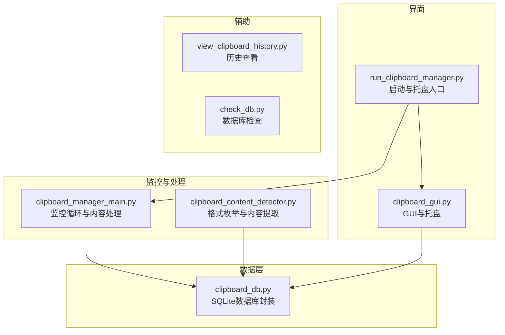
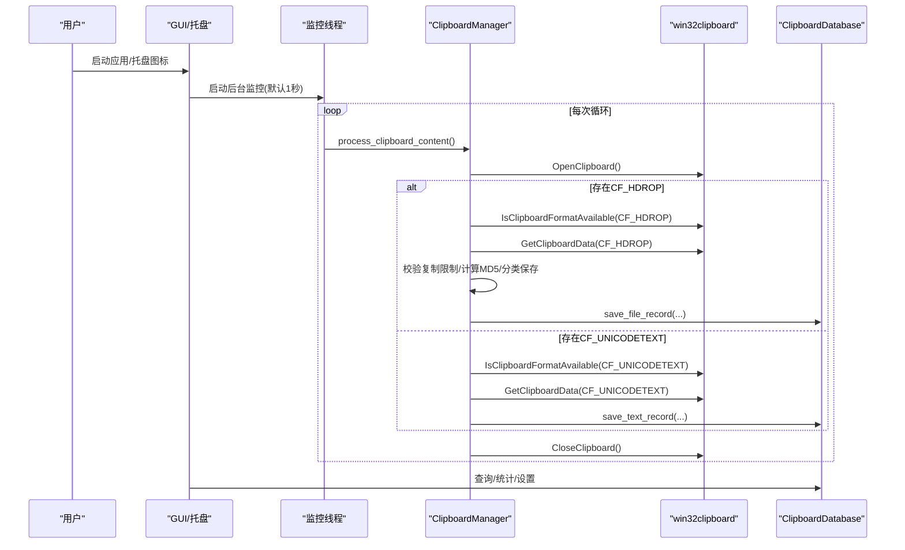
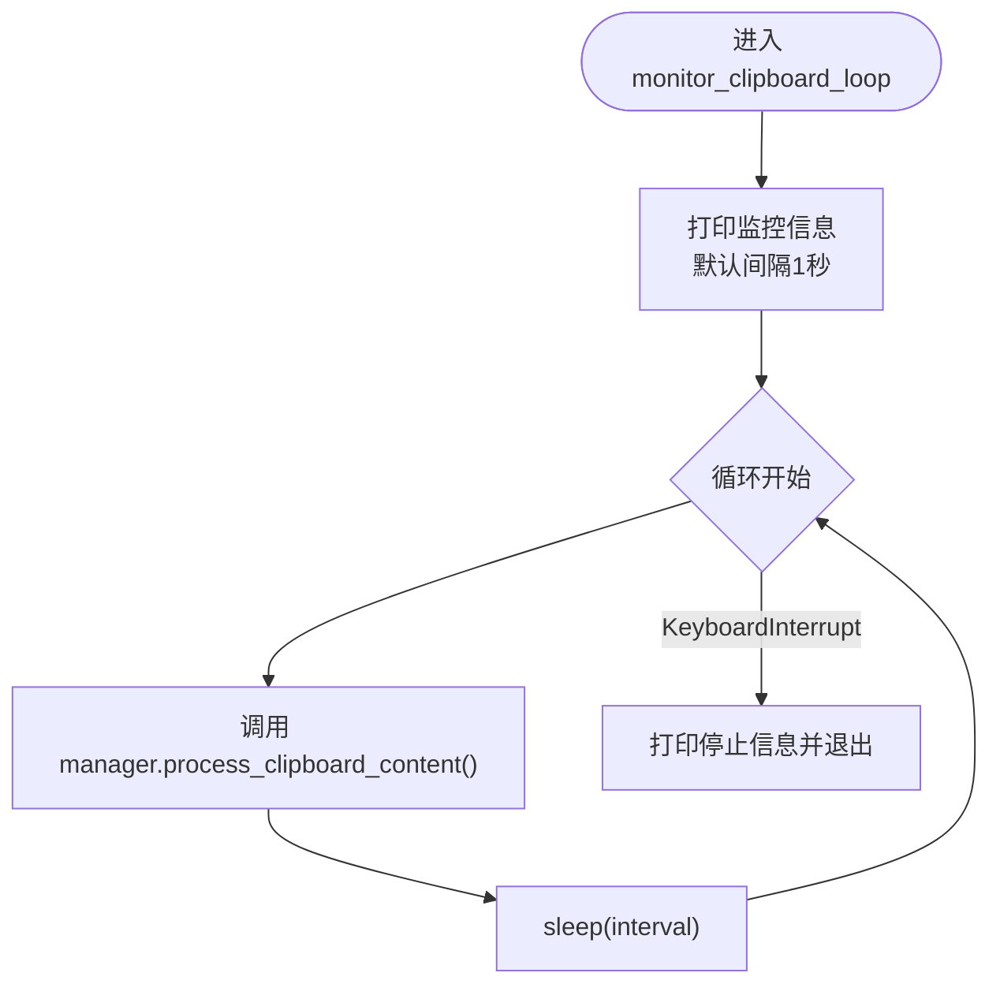
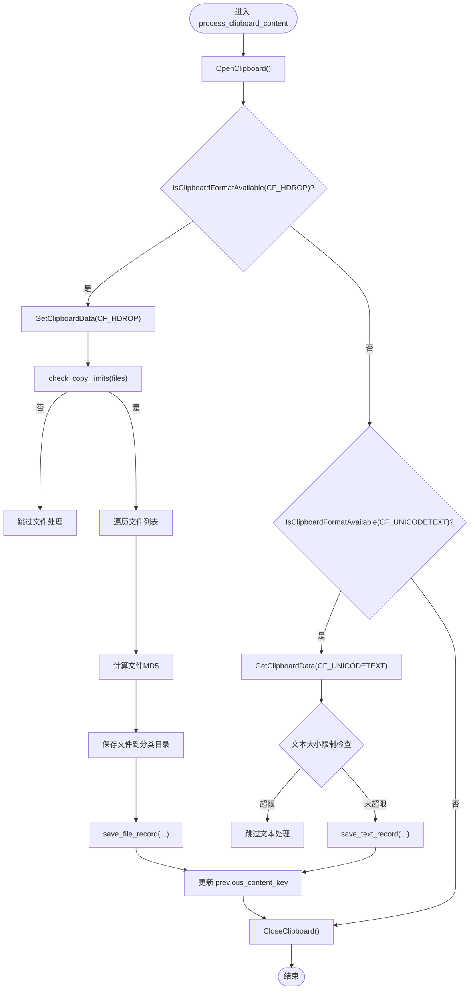
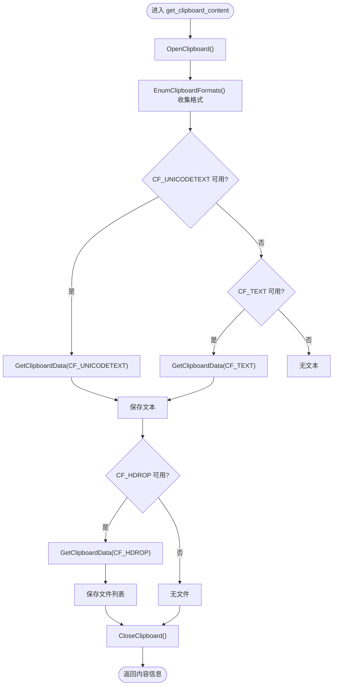
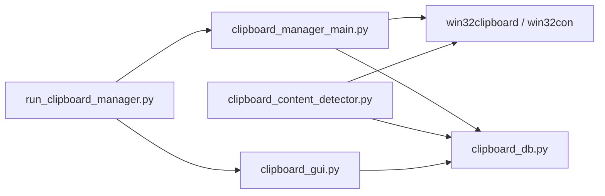

# 剪贴板监控

<cite>
**本文引用的文件**
- [clipboard_manager_main.py](file://clipboard_manager_main.py)
- [clipboard_content_detector.py](file://clipboard_content_detector.py)
- [clipboard_db.py](file://clipboard_db.py)
- [clipboard_gui.py](file://clipboard_gui.py)
- [run_clipboard_manager.py](file://run_clipboard_manager.py)
- [view_clipboard_history.py](file://view_clipboard_history.py)
- [check_db.py](file://check_db.py)
</cite>

## 目录
1. [简介](#简介)
2. [项目结构](#项目结构)
3. [核心组件](#核心组件)
4. [架构总览](#架构总览)
5. [详细组件分析](#详细组件分析)
6. [依赖关系分析](#依赖关系分析)
7. [性能考量](#性能考量)
8. [故障排查指南](#故障排查指南)
9. [结论](#结论)
10. [附录](#附录)

## 简介
本文件面向“剪贴板监控机制”的实现进行全面文档化，重点覆盖：
- 如何通过 win32clipboard API 获取剪贴板数据，区分文本与文件类型（CF_UNICODETEXT vs CF_HDROP），并处理多格式兼容性。
- monitor_clipboard_loop 在 clipboard_manager_main.py 中的实现，包括监控间隔配置、异常处理与多线程集成。
- get_clipboard_content 函数如何枚举所有剪贴板格式并提取有效内容。
- 监控循环的性能优化策略（默认1秒检测间隔、资源释放机制、错误捕获）。
- 实际代码片段路径展示关键功能，例如 process_clipboard_content 方法如何协调内容检测与数据保存。
- 高频率监控对系统资源的影响及应对策略。

## 项目结构
该项目采用模块化设计，围绕“剪贴板监控 + 数据持久化 + GUI查询”三大块组织：
- 剪贴板监控与处理：clipboard_manager_main.py、clipboard_content_detector.py
- 数据库层：clipboard_db.py
- 图形界面：clipboard_gui.py
- 启动与托盘：run_clipboard_manager.py
- 辅助工具：view_clipboard_history.py、check_db.py

图表来源
- [clipboard_manager_main.py](file://clipboard_manager_main.py#L717-L761)
- [clipboard_content_detector.py](file://clipboard_content_detector.py#L1-L274)
- [clipboard_db.py](file://clipboard_db.py#L1-L455)
- [clipboard_gui.py](file://clipboard_gui.py#L1-L800)
- [run_clipboard_manager.py](file://run_clipboard_manager.py#L1-L71)
- [view_clipboard_history.py](file://view_clipboard_history.py#L1-L75)
- [check_db.py](file://check_db.py#L1-L31)

章节来源
- [clipboard_manager_main.py](file://clipboard_manager_main.py#L1-L120)
- [clipboard_content_detector.py](file://clipboard_content_detector.py#L1-L120)
- [clipboard_db.py](file://clipboard_db.py#L1-L120)
- [clipboard_gui.py](file://clipboard_gui.py#L1-L120)
- [run_clipboard_manager.py](file://run_clipboard_manager.py#L1-L71)

## 核心组件
- 剪贴板监控循环：在 clipboard_manager_main.py 中实现，负责周期性调用内容处理逻辑并睡眠指定间隔。
- 内容处理与保存：ClipboardManager.process_clipboard_content 使用 win32clipboard 判断格式并保存文本或文件。
- 剪贴板内容提取：clipboard_content_detector.py 的 get_clipboard_content 枚举所有格式并优先提取文本与文件列表。
- 数据库封装：ClipboardDatabase 提供 SQLite 表结构、增删改查、统计与设置管理。
- GUI 与托盘：clipboard_gui.py 提供记录浏览、搜索、统计与设置；run_clipboard_manager.py 支持托盘与互斥运行。
- 辅助工具：view_clipboard_history.py 快速查看历史；check_db.py 检查重复MD5等。

章节来源
- [clipboard_manager_main.py](file://clipboard_manager_main.py#L355-L500)
- [clipboard_content_detector.py](file://clipboard_content_detector.py#L87-L138)
- [clipboard_db.py](file://clipboard_db.py#L116-L183)
- [clipboard_gui.py](file://clipboard_gui.py#L1-L200)
- [run_clipboard_manager.py](file://run_clipboard_manager.py#L1-L71)

## 架构总览
整体流程：GUI/托盘入口启动监控线程，监控线程周期性调用内容处理逻辑；内容处理逻辑通过 win32clipboard 读取剪贴板，识别文本或文件，计算MD5，去重计数，写入数据库；GUI 侧提供查询、统计与设置。

图表来源
- [clipboard_manager_main.py](file://clipboard_manager_main.py#L395-L496)
- [clipboard_manager_main.py](file://clipboard_manager_main.py#L717-L761)
- [clipboard_db.py](file://clipboard_db.py#L116-L183)

## 详细组件分析

### 监控循环 monitor_clipboard_loop
- 功能：在独立线程中持续执行内容处理，按固定间隔休眠。
- 间隔配置：默认1秒；可通过命令行参数 -i 指定自定义间隔。
- 异常处理：捕获键盘中断优雅退出；内部 try/finally 保证剪贴板句柄释放。
- 多线程集成：主线程启动守护线程运行监控循环，避免阻塞GUI事件循环。

图表来源
- [clipboard_manager_main.py](file://clipboard_manager_main.py#L717-L761)

章节来源
- [clipboard_manager_main.py](file://clipboard_manager_main.py#L717-L761)

### 内容处理 process_clipboard_content
- 打开剪贴板：统一在 try 块内 OpenClipboard，finally 中 CloseClipboard，确保异常也能释放句柄。
- 文本检测：优先判断 CF_UNICODETEXT，其次尝试 CF_TEXT；过滤空白内容；根据设置检查文本大小限制。
- 文件检测：判断 CF_HDROP；校验复制限制（数量与总大小/单文件大小）；计算MD5，按类型分类保存到日期子目录；去重计数。
- 去重与计数：通过 md5_hash 唯一约束与 number 字段实现重复内容计数累加。
- 保存数据库：分别调用 save_text_record/save_file_record，内部处理 IntegrityError 并更新计数。

图表来源
- [clipboard_manager_main.py](file://clipboard_manager_main.py#L395-L496)

章节来源
- [clipboard_manager_main.py](file://clipboard_manager_main.py#L355-L500)

### 剪贴板内容提取 get_clipboard_content
- 枚举格式：通过 EnumClipboardFormats 循环获取所有可用格式，收集为列表。
- 文本提取：优先 CF_UNICODETEXT；若无则尝试 CF_TEXT；均过滤空白。
- 文件提取：检测 CF_HDROP 并读取文件路径列表。
- 资源释放：统一在 finally 中 CloseClipboard。

图表来源
- [clipboard_content_detector.py](file://clipboard_content_detector.py#L1-L138)

章节来源
- [clipboard_content_detector.py](file://clipboard_content_detector.py#L1-L138)

### 数据库层 ClipboardDatabase
- 表结构：text_records（含 content、timestamp、char_count、md5_hash、number）、file_records（含 original_path、saved_path、filename、file_size、file_type、md5_hash、timestamp、number）、settings（max_copy_size、max_copy_count、unlimited_mode、retention_days、auto_start、float_icon）。
- 去重计数：通过 md5_hash 唯一约束与 number 字段实现重复内容计数累加。
- 设置管理：支持查询/更新复制限制、保存天数、开机自启、悬浮图标等。
- 过期清理：按设置的 retention_days 删除过期记录并同步删除磁盘文件。

章节来源
- [clipboard_db.py](file://clipboard_db.py#L1-L120)
- [clipboard_db.py](file://clipboard_db.py#L116-L183)
- [clipboard_db.py](file://clipboard_db.py#L316-L455)

### GUI 与托盘
- GUI：提供文本/文件记录浏览、搜索、统计、设置等功能；支持双击查看详情、右键打开文件位置。
- 托盘：run_clipboard_manager.py 支持系统托盘图标、互斥运行、隐藏主窗口、快捷键 Alt+C 显示界面。
- 自动更新：GUI 内部使用定时任务定期刷新记录。

章节来源
- [clipboard_gui.py](file://clipboard_gui.py#L1-L200)
- [run_clipboard_manager.py](file://run_clipboard_manager.py#L1-L71)

## 依赖关系分析
- clipboard_manager_main.py 依赖 win32clipboard/win32con 进行剪贴板读取；依赖 ClipboardDatabase 进行数据持久化；在 GUI 模式下通过线程运行监控循环。
- clipboard_content_detector.py 独立实现格式枚举与内容提取，便于调试与测试。
- clipboard_db.py 为所有模块提供统一的数据访问接口。
- clipboard_gui.py 与 run_clipboard_manager.py 共同构成用户交互入口。

图表来源
- [clipboard_manager_main.py](file://clipboard_manager_main.py#L1-L40)
- [clipboard_content_detector.py](file://clipboard_content_detector.py#L1-L20)
- [clipboard_db.py](file://clipboard_db.py#L1-L20)
- [run_clipboard_manager.py](file://run_clipboard_manager.py#L1-L20)

章节来源
- [clipboard_manager_main.py](file://clipboard_manager_main.py#L1-L40)
- [clipboard_content_detector.py](file://clipboard_content_detector.py#L1-L20)
- [clipboard_db.py](file://clipboard_db.py#L1-L20)
- [run_clipboard_manager.py](file://run_clipboard_manager.py#L1-L20)

## 性能考量
- 默认检测间隔：1秒，平衡实时性与CPU占用。
- 资源释放：统一在 finally 中 CloseClipboard，避免句柄泄漏。
- 错误捕获：对剪贴板访问、文件IO、数据库操作进行异常捕获，避免崩溃。
- 去重计数：通过 md5_hash 唯一约束减少重复写入与存储空间浪费。
- 复制限制：在保存前检查数量与大小，防止大范围复制导致资源压力。
- GUI 与监控分离：监控线程设为守护线程，避免阻塞 GUI 事件循环。

章节来源
- [clipboard_manager_main.py](file://clipboard_manager_main.py#L717-L761)
- [clipboard_manager_main.py](file://clipboard_manager_main.py#L395-L496)
- [clipboard_db.py](file://clipboard_db.py#L116-L183)

## 故障排查指南
- 剪贴板访问失败：确认 OpenClipboard 是否抛出异常；检查 finally 中 CloseClipboard 是否执行；查看异常日志。
- 文件保存失败：检查目标目录权限、磁盘空间、文件名合法性；确认 MD5 计算是否成功。
- 数据库完整性冲突：当 md5_hash 已存在时会更新计数；若出现异常，检查数据库结构与索引。
- GUI 无法显示：确认托盘图标依赖库是否安装；检查窗口隐藏与显示逻辑。
- 重复记录过多：使用 check_db.py 检查重复MD5；必要时清理数据库或调整去重策略。

章节来源
- [clipboard_manager_main.py](file://clipboard_manager_main.py#L488-L496)
- [check_db.py](file://check_db.py#L1-L31)
- [clipboard_db.py](file://clipboard_db.py#L116-L183)

## 结论
该系统通过 win32clipboard API 实现对剪贴板的稳定监控，结合去重计数与复制限制策略，兼顾了实用性与资源控制。监控循环默认1秒间隔，配合资源释放与异常处理，能够在长时间运行中保持稳定性。GUI 提供便捷的历史查询与设置管理，托盘入口增强了用户体验。建议在高负载场景下适当提高间隔或启用“无限模式”以减少频繁IO。

## 附录
- 关键实现路径参考
  - 监控循环：[clipboard_manager_main.py](file://clipboard_manager_main.py#L717-L761)
  - 内容处理：[clipboard_manager_main.py](file://clipboard_manager_main.py#L395-L496)
  - 格式枚举与内容提取：[clipboard_content_detector.py](file://clipboard_content_detector.py#L1-L138)
  - 数据库封装：[clipboard_db.py](file://clipboard_db.py#L116-L183)
  - GUI 与托盘：[clipboard_gui.py](file://clipboard_gui.py#L1-L200)，[run_clipboard_manager.py](file://run_clipboard_manager.py#L1-L71)
  - 历史查看与数据库检查：[view_clipboard_history.py](file://view_clipboard_history.py#L1-L75)，[check_db.py](file://check_db.py#L1-L31)