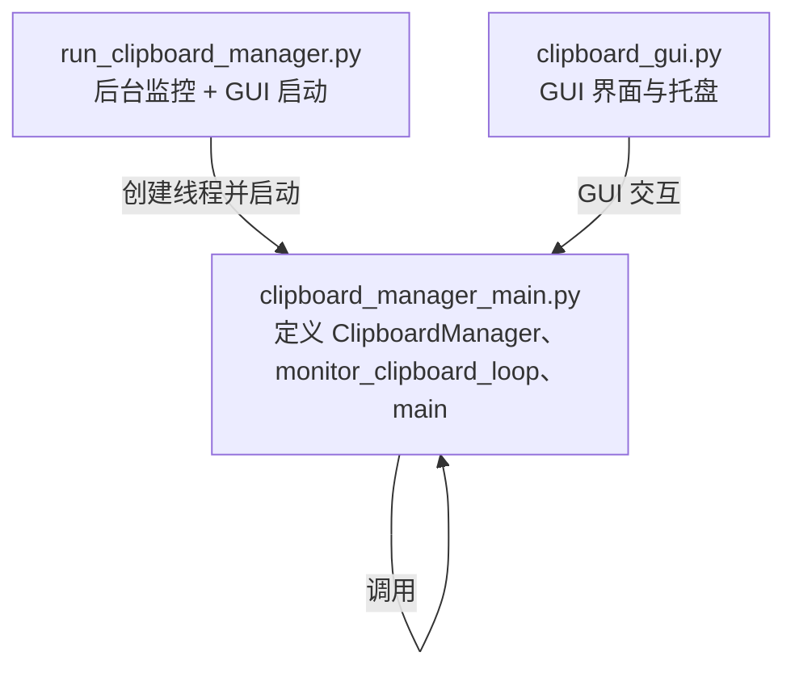
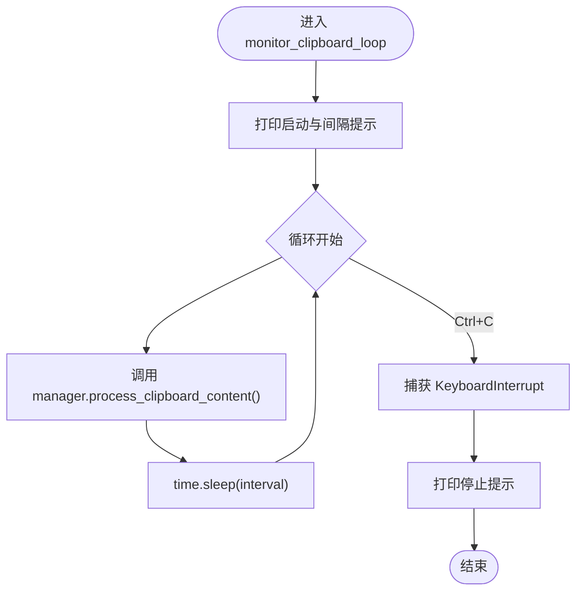

# 监控循环实现

<cite>
**本文引用的文件**
- [clipboard_manager_main.py](file://clipboard_manager_main.py)
- [run_clipboard_manager.py](file://run_clipboard_manager.py)
- [clipboard_gui.py](file://clipboard_gui.py)
</cite>

## 目录
1. [简介](#简介)
2. [项目结构](#项目结构)
3. [核心组件](#核心组件)
4. [架构概览](#架构概览)
5. [详细组件分析](#详细组件分析)
6. [依赖关系分析](#依赖关系分析)
7. [性能考量](#性能考量)
8. [故障排查指南](#故障排查指南)
9. [结论](#结论)

## 简介
本文档围绕 monitor_clipboard_loop 函数展开，系统性解析其在 clipboard_manager_main.py 中的实现细节，涵盖：
- 参数 interval 的默认值与 CLI 配置方式
- while True 循环的持续监控机制
- try-except 捕获 KeyboardInterrupt 实现优雅退出
- 与 ClipboardManager 实例协同工作，调用 manager.process_clipboard_content() 处理剪贴板内容
- 主线程与独立线程两种启动方式的实际代码片段路径
- 监控间隔配置对系统性能的影响及 1 秒间隔作为平衡响应速度与资源消耗的实践建议
- 控制台输出信息的设计与提示语义

## 项目结构
与监控循环直接相关的文件与角色如下：
- clipboard_manager_main.py：定义 ClipboardManager、monitor_clipboard_loop、main 等核心逻辑
- run_clipboard_manager.py：提供“后台监控 + GUI”组合启动方式，演示独立线程运行监控循环
- clipboard_gui.py：GUI 界面与托盘图标等，与监控循环通过线程协作



图表来源
- [clipboard_manager_main.py](file://clipboard_manager_main.py#L717-L761)
- [run_clipboard_manager.py](file://run_clipboard_manager.py#L32-L71)
- [clipboard_gui.py](file://clipboard_gui.py#L1-L200)

章节来源
- [clipboard_manager_main.py](file://clipboard_manager_main.py#L717-L761)
- [run_clipboard_manager.py](file://run_clipboard_manager.py#L32-L71)
- [clipboard_gui.py](file://clipboard_gui.py#L1-L200)

## 核心组件
- monitor_clipboard_loop(manager, interval=1)
  - 功能：持续监控剪贴板变化，按指定间隔执行处理
  - 关键点：
    - 默认 interval=1 秒
    - 使用 time.sleep(interval) 控制轮询频率
    - while True 循环持续运行
    - try-except 捕获 KeyboardInterrupt 实现优雅退出
    - 调用 manager.process_clipboard_content() 执行实际处理
- ClipboardManager
  - 负责：
    - 读取剪贴板（文本/文件）
    - 检查复制限制
    - 分类保存文件并计算 MD5
    - 保存文本到数据库
    - 维护 previous_content 以避免重复处理

章节来源
- [clipboard_manager_main.py](file://clipboard_manager_main.py#L717-L761)
- [clipboard_manager_main.py](file://clipboard_manager_main.py#L355-L496)

## 架构概览
监控循环在两种场景下运行：
- 单独运行监控器：通过命令行参数 --monitor 启动，interval 可由 -i 指定
- GUI 模式：GUI 主线程运行 Tkinter，监控循环在独立线程中以守护线程运行

```mermaid
sequenceDiagram
participant CLI as "命令行"
participant Main as "main()"
participant Loop as "monitor_clipboard_loop()"
participant Manager as "ClipboardManager"
participant DB as "ClipboardDatabase"
CLI->>Main : 传入 "--monitor" 与可选 "-i <秒>"
Main->>Loop : 调用 monitor_clipboard_loop(manager, interval)
Loop->>Loop : 打印启动与间隔提示
loop 每次循环
Loop->>Manager : process_clipboard_content()
Manager->>DB : 保存文本/文件记录
Loop->>Loop : time.sleep(interval)
end
CLI-->>Loop : Ctrl+C
Loop-->>CLI : 打印停止提示
```

图表来源
- [clipboard_manager_main.py](file://clipboard_manager_main.py#L717-L761)

## 详细组件分析

### monitor_clipboard_loop 函数实现细节
- 参数与默认值
  - interval 默认值为 1 秒
  - CLI 模式下可通过 -i 指定自定义间隔
- 循环与频率控制
  - while True 持续执行
  - 每次循环先调用 manager.process_clipboard_content()，再 time.sleep(interval)
- 优雅退出
  - try-except 捕获 KeyboardInterrupt
  - Ctrl+C 触发后打印停止提示
- 输出设计
  - 启动提示、间隔设置提示、停止提示，便于用户感知状态

章节来源
- [clipboard_manager_main.py](file://clipboard_manager_main.py#L717-L761)

### 与 ClipboardManager 的协同工作
- 调用链路
  - monitor_clipboard_loop 调用 manager.process_clipboard_content()
  - ClipboardManager 内部：
    - 打开剪贴板
    - 判断格式（文本/文件）
    - 检查复制限制
    - 分类保存文件并计算 MD5
    - 保存文本记录到数据库
    - 维护 previous_content 避免重复处理
    - 最终关闭剪贴板句柄
- 错误处理
  - OpenClipboard 异常、读取数据异常、CloseClipboard 异常均进行捕获与提示



图表来源
- [clipboard_manager_main.py](file://clipboard_manager_main.py#L717-L761)
- [clipboard_manager_main.py](file://clipboard_manager_main.py#L355-L496)

章节来源
- [clipboard_manager_main.py](file://clipboard_manager_main.py#L355-L496)
- [clipboard_manager_main.py](file://clipboard_manager_main.py#L717-L761)

### 监控循环的启动方式与应用场景
- 在主线程中运行（命令行监控器）
  - 通过命令行参数 --monitor 启动
  - 可选 -i 指定间隔
  - 适合纯命令行环境或最小化占用场景
  - 代码片段路径：
    - [clipboard_manager_main.py](file://clipboard_manager_main.py#L731-L761)
- 在独立线程中运行（GUI 模式）
  - GUI 主线程负责 Tkinter 事件循环
  - 监控循环在独立线程中以守护线程运行
  - 适合需要图形界面与后台监控并存的场景
  - 代码片段路径：
    - [clipboard_manager_main.py](file://clipboard_manager_main.py#L749-L759)
    - [run_clipboard_manager.py](file://run_clipboard_manager.py#L47-L66)

章节来源
- [clipboard_manager_main.py](file://clipboard_manager_main.py#L731-L761)
- [clipboard_manager_main.py](file://clipboard_manager_main.py#L749-L759)
- [run_clipboard_manager.py](file://run_clipboard_manager.py#L47-L66)

### 监控间隔配置对系统性能的影响
- 间隔越短，CPU 轮询越频繁，系统开销越大；但响应更及时
- 间隔越长，CPU 开销降低，但可能错过快速连续的剪贴板变更
- 1 秒间隔在大多数桌面环境下是折中选择：
  - 降低 CPU 占用
  - 仍能较好地捕捉常见复制行为
  - 避免过于频繁的磁盘 IO（文件保存、数据库写入）

章节来源
- [clipboard_manager_main.py](file://clipboard_manager_main.py#L717-L761)

## 依赖关系分析
- monitor_clipboard_loop 依赖 ClipboardManager
- ClipboardManager 依赖 ClipboardDatabase
- GUI 模式下，主线程与监控线程通过共享 ClipboardManager 实例协同工作


图表来源
- [clipboard_manager_main.py](file://clipboard_manager_main.py#L717-L761)
- [clipboard_manager_main.py](file://clipboard_manager_main.py#L355-L496)

章节来源
- [clipboard_manager_main.py](file://clipboard_manager_main.py#L355-L496)
- [clipboard_manager_main.py](file://clipboard_manager_main.py#L717-L761)

## 性能考量
- 轮询频率与 CPU 占用
  - interval=1 秒时，每秒一次轮询，CPU 占用极低
  - 若降低到 0.1 秒，CPU 占用显著上升，但收益有限
- I/O 开销
  - 文件保存涉及磁盘写入与 MD5 计算
  - 文本记录写入数据库
  - 建议保持适中间隔，避免频繁磁盘操作
- 线程模型
  - GUI 模式下监控线程设为守护线程，确保 GUI 退出时监控线程随主线程结束
- 资源释放
  - ClipboardManager 在 finally 中确保 CloseClipboard 被调用，避免句柄泄漏

章节来源
- [clipboard_manager_main.py](file://clipboard_manager_main.py#L355-L496)
- [clipboard_manager_main.py](file://clipboard_manager_main.py#L749-L759)

## 故障排查指南
- Ctrl+C 无法停止
  - 确认未在非标准终端或重定向环境中运行
  - 确认 monitor_loop 正在运行且未被异常阻塞
- 监控线程未生效（GUI 模式）
  - 检查线程创建与启动是否成功
  - 确认守护线程未被提前退出
- 剪贴板访问失败
  - 检查 OpenClipboard/CloseClipboard 是否抛出异常
  - 确保无其他进程长时间占用剪贴板
- 输出信息缺失
  - 确认 print 输出未被重定向或缓冲区问题影响

章节来源
- [clipboard_manager_main.py](file://clipboard_manager_main.py#L717-L761)
- [clipboard_manager_main.py](file://clipboard_manager_main.py#L355-L496)
- [run_clipboard_manager.py](file://run_clipboard_manager.py#L47-L66)

## 结论
monitor_clipboard_loop 是剪贴板监控系统的核心驱动函数，通过简洁的 while True + time.sleep(interval) 实现稳定高效的轮询机制。其与 ClipboardManager 的解耦设计使得监控逻辑与业务处理清晰分离；在 GUI 模式下通过独立线程运行，既保证了界面流畅，又实现了后台持续监控。1 秒间隔在响应速度与资源消耗之间取得良好平衡，适合大多数桌面应用场景。通过合理的错误处理与优雅退出机制，系统具备良好的可用性与稳定性。