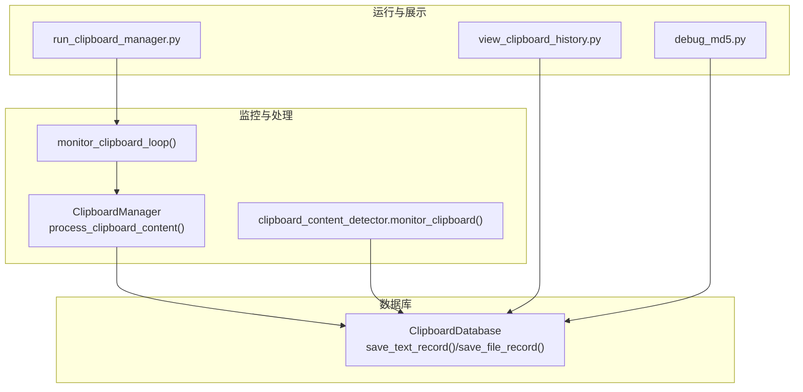
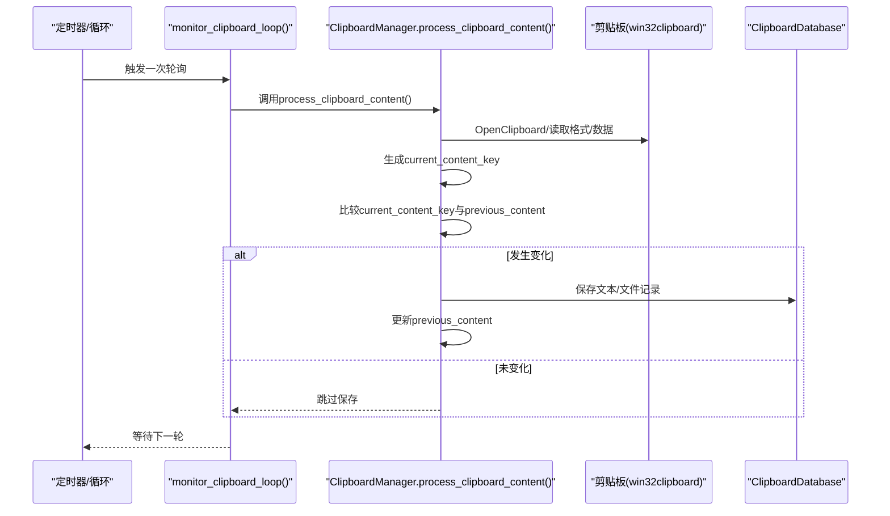
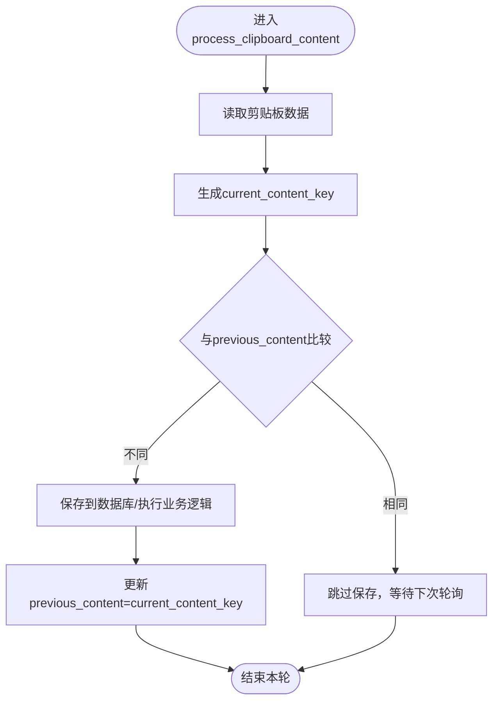
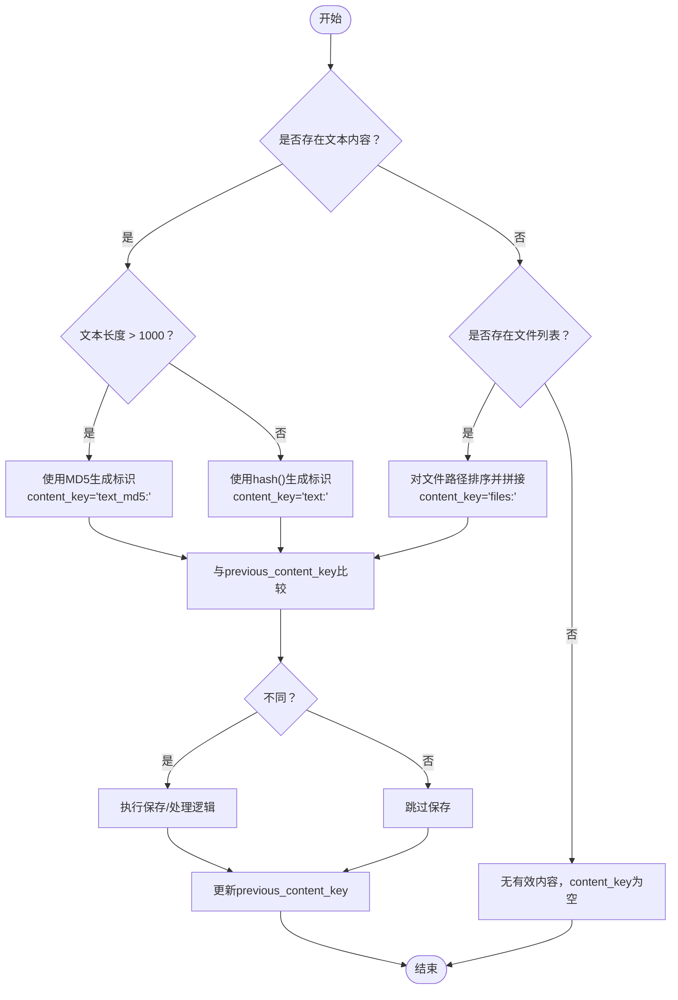
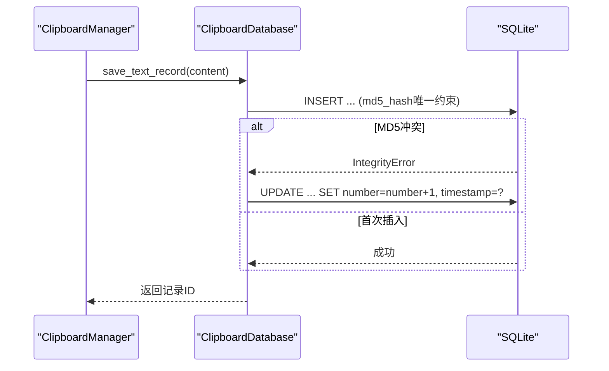
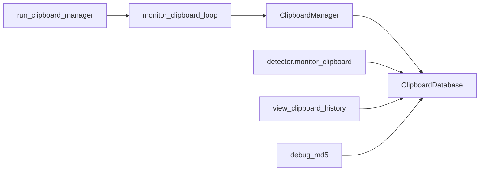

# 内容变更跟踪

<cite>
**本文引用的文件**
- [clipboard_manager_main.py](file://clipboard_manager_main.py)
- [clipboard_content_detector.py](file://clipboard_content_detector.py)
- [clipboard_db.py](file://clipboard_db.py)
- [run_clipboard_manager.py](file://run_clipboard_manager.py)
- [view_clipboard_history.py](file://view_clipboard_history.py)
- [debug_md5.py](file://debug_md5.py)
</cite>

## 目录
1. [简介](#简介)
2. [项目结构](#项目结构)
3. [核心组件](#核心组件)
4. [架构总览](#架构总览)
5. [详细组件分析](#详细组件分析)
6. [依赖关系分析](#依赖关系分析)
7. [性能考量](#性能考量)
8. [故障排查指南](#故障排查指南)
9. [结论](#结论)

## 简介
本文件聚焦于剪贴板监控循环中的“内容变更跟踪”机制，系统性说明以下要点：
- monitor_clipboard 函数如何通过 content_key 标识符避免重复处理相同内容
- 对于短文本使用 Python 内置 hash() 生成标识；对于长文本（>1000字符）与文件列表分别采用不同策略
- previous_content_key 如何存储上一次剪贴板状态，并通过与当前 content_key 比较实现变化检测
- 该机制作为第一道防线减少不必要的数据库操作，从而提升系统性能
- 提供 content_key 生成策略与状态比较逻辑的执行流程图示

## 项目结构
该项目围绕剪贴板监控、内容识别、数据持久化与 GUI 展示展开，其中与“内容变更跟踪”直接相关的模块包括：
- 剪贴板监控与处理：clipboard_manager_main.py 中的 ClipboardManager 和 monitor_clipboard_loop
- 独立监控脚本：clipboard_content_detector.py 中的 monitor_clipboard
- 数据库层：clipboard_db.py 中的 ClipboardDatabase
- 启动与运行：run_clipboard_manager.py、view_clipboard_history.py
- 调试辅助：debug_md5.py

图表来源
- [clipboard_manager_main.py](file://clipboard_manager_main.py#L355-L496)
- [clipboard_content_detector.py](file://clipboard_content_detector.py#L218-L274)
- [clipboard_db.py](file://clipboard_db.py#L116-L183)
- [run_clipboard_manager.py](file://run_clipboard_manager.py#L32-L66)
- [view_clipboard_history.py](file://view_clipboard_history.py#L21-L75)
- [debug_md5.py](file://debug_md5.py#L11-L56)

章节来源
- [clipboard_manager_main.py](file://clipboard_manager_main.py#L355-L496)
- [clipboard_content_detector.py](file://clipboard_content_detector.py#L218-L274)
- [clipboard_db.py](file://clipboard_db.py#L116-L183)
- [run_clipboard_manager.py](file://run_clipboard_manager.py#L32-L66)
- [view_clipboard_history.py](file://view_clipboard_history.py#L21-L75)
- [debug_md5.py](file://debug_md5.py#L11-L56)

## 核心组件
- ClipboardManager：负责读取剪贴板、生成 content_key、与 previous_content 比较、触发保存与日志输出
- monitor_clipboard_loop：周期性调度 ClipboardManager 的内容处理
- ClipboardDatabase：提供文本/文件记录的保存与去重计数逻辑
- clipboard_content_detector.monitor_clipboard：独立监控脚本，演示 content_key 生成与比较流程

章节来源
- [clipboard_manager_main.py](file://clipboard_manager_main.py#L355-L496)
- [clipboard_content_detector.py](file://clipboard_content_detector.py#L218-L274)
- [clipboard_db.py](file://clipboard_db.py#L116-L183)

## 架构总览
剪贴板监控循环在两个入口处实现：
- GUI/后台模式：由 run_clipboard_manager.py 启动 monitor_thread，周期调用 monitor_clipboard_loop，后者再委托 ClipboardManager 处理
- 独立监控模式：clipboard_content_detector.py 提供 monitor_clipboard，直接生成 content_key 并比较 previous_content_key

图表来源
- [clipboard_manager_main.py](file://clipboard_manager_main.py#L457-L496)
- [clipboard_manager_main.py](file://clipboard_manager_main.py#L717-L730)
- [clipboard_db.py](file://clipboard_db.py#L116-L183)

## 详细组件分析

### monitor_clipboard_loop 与 ClipboardManager 的内容变更跟踪
- previous_content 存储上一次的 content_key，初始为空
- 每次循环中，process_clipboard_content 会：
  - 读取剪贴板格式与数据
  - 生成 current_content_key
  - 与 previous_content 比较，若不同则继续处理并保存，最后更新 previous_content
- 该流程确保只有当剪贴板内容发生真正变化时才进行后续处理，避免重复写入

图表来源
- [clipboard_manager_main.py](file://clipboard_manager_main.py#L457-L496)

章节来源
- [clipboard_manager_main.py](file://clipboard_manager_main.py#L457-L496)
- [clipboard_manager_main.py](file://clipboard_manager_main.py#L717-L730)

### content_key 生成策略与比较逻辑
- 策略一：短文本（字符数 ≤ 1000）
  - 使用 Python 内置 hash() 生成标识
  - 形如："text:<hash值>"
- 策略二：长文本（字符数 > 1000）
  - 使用 MD5 哈希生成标识
  - 形如："text_md5:<md5值>"
- 策略三：文件列表
  - 对文件路径进行排序后以分号连接，再生成标识
  - 形如："files:<排序后的路径列表>"
- 比较逻辑
  - 若 content_key 非空且与 previous_content_key 不同，则判定为“内容变化”，执行后续处理
  - 否则视为“无变化”，直接跳过

图表来源
- [clipboard_content_detector.py](file://clipboard_content_detector.py#L236-L245)
- [clipboard_manager_main.py](file://clipboard_manager_main.py#L467-L468)

章节来源
- [clipboard_content_detector.py](file://clipboard_content_detector.py#L236-L245)
- [clipboard_manager_main.py](file://clipboard_manager_main.py#L467-L468)

### 与数据库层的协作与去重计数
- 文本记录保存：ClipboardDatabase.save_text_record 会计算内容 MD5，插入时若 MD5 已存在则更新计数 number 并刷新时间戳
- 文件记录保存：ClipboardDatabase.save_file_record 以文件 MD5 作为唯一键，重复时同样更新计数与时间戳
- 该设计与 content_key 的去重思想一致：先在应用层用 content_key 去重，再在数据库层用 MD5 去重，形成双重保护

图表来源
- [clipboard_db.py](file://clipboard_db.py#L116-L183)
- [clipboard_manager_main.py](file://clipboard_manager_main.py#L112-L147)

章节来源
- [clipboard_db.py](file://clipboard_db.py#L116-L183)
- [clipboard_manager_main.py](file://clipboard_manager_main.py#L112-L147)

### 独立监控脚本中的 content_key 流程
- clipboard_content_detector.monitor_clipboard 同样维护 previous_content_key 变量
- 生成 content_key 的策略与上述一致：短文本用 hash()，长文本用 MD5，文件列表用排序拼接
- 一旦检测到变化，打印内容摘要并可扩展为自动保存

章节来源
- [clipboard_content_detector.py](file://clipboard_content_detector.py#L218-L274)

## 依赖关系分析
- ClipboardManager 依赖 ClipboardDatabase 完成持久化
- monitor_clipboard_loop 依赖 ClipboardManager 的内容处理方法
- clipboard_content_detector.monitor_clipboard 独立于 GUI，直接依赖 ClipboardDatabase
- 运行脚本 run_clipboard_manager.py 启动监控线程并承载 GUI

图表来源
- [clipboard_manager_main.py](file://clipboard_manager_main.py#L355-L496)
- [clipboard_content_detector.py](file://clipboard_content_detector.py#L218-L274)
- [run_clipboard_manager.py](file://run_clipboard_manager.py#L32-L66)
- [view_clipboard_history.py](file://view_clipboard_history.py#L21-L75)
- [debug_md5.py](file://debug_md5.py#L11-L56)

章节来源
- [clipboard_manager_main.py](file://clipboard_manager_main.py#L355-L496)
- [clipboard_content_detector.py](file://clipboard_content_detector.py#L218-L274)
- [run_clipboard_manager.py](file://run_clipboard_manager.py#L32-L66)
- [view_clipboard_history.py](file://view_clipboard_history.py#L21-L75)
- [debug_md5.py](file://debug_md5.py#L11-L56)

## 性能考量
- 应用层去重（content_key）：避免重复写入数据库，降低磁盘 I/O 与事务开销
- 长文本使用 MD5：相比 hash()，MD5 更稳定且适合大文本场景，减少误判
- 文件列表使用排序拼接：保证顺序无关的等价性，避免重复保存
- 数据库层去重（MD5）：作为第二道防线，进一步减少重复记录
- 通过“先应用层后数据库层”的双重去重，显著降低数据库压力与存储冗余

## 故障排查指南
- 剪贴板访问异常
  - 现象：OpenClipboard 抛出异常
  - 排查：确认剪贴板是否被其他进程占用；参考异常处理逻辑
  - 参考路径：[clipboard_manager_main.py](file://clipboard_manager_main.py#L488-L495)
- 文件复制失败
  - 现象：文件复制或 MD5 计算失败
  - 排查：检查目标目录权限、磁盘空间、文件是否存在
  - 参考路径：[clipboard_manager_main.py](file://clipboard_manager_main.py#L416-L456)
- 重复记录问题
  - 现象：同一内容多次出现
  - 排查：确认 content_key 生成策略是否正确；检查 previous_content 是否被意外重置
  - 参考路径：[clipboard_content_detector.py](file://clipboard_content_detector.py#L236-L245)
- 数据库一致性
  - 现象：MD5 冲突导致计数异常
  - 排查：查看 save_text_record/save_file_record 的去重逻辑
  - 参考路径：[clipboard_db.py](file://clipboard_db.py#L116-L183)

章节来源
- [clipboard_manager_main.py](file://clipboard_manager_main.py#L488-L495)
- [clipboard_manager_main.py](file://clipboard_manager_main.py#L416-L456)
- [clipboard_content_detector.py](file://clipboard_content_detector.py#L236-L245)
- [clipboard_db.py](file://clipboard_db.py#L116-L183)

## 结论
本项目的“内容变更跟踪”机制通过两层去重策略实现高效稳定的剪贴板监控：
- 应用层：基于 content_key 的快速比较，避免重复处理
- 数据库层：基于 MD5 的唯一性约束，确保最终一致性
- 对于短文本使用 hash()、长文本使用 MD5、文件列表使用排序拼接，兼顾性能与稳定性
- 该机制有效减少了不必要的数据库操作，提升了整体性能与用户体验