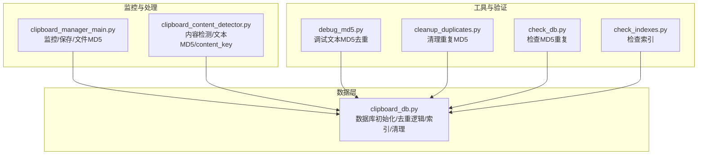
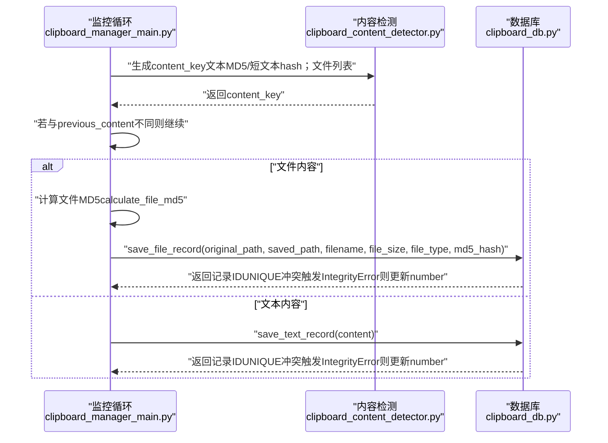
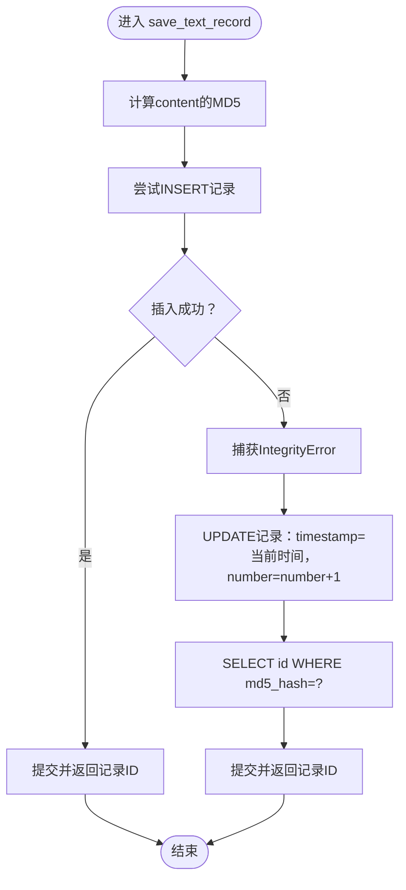
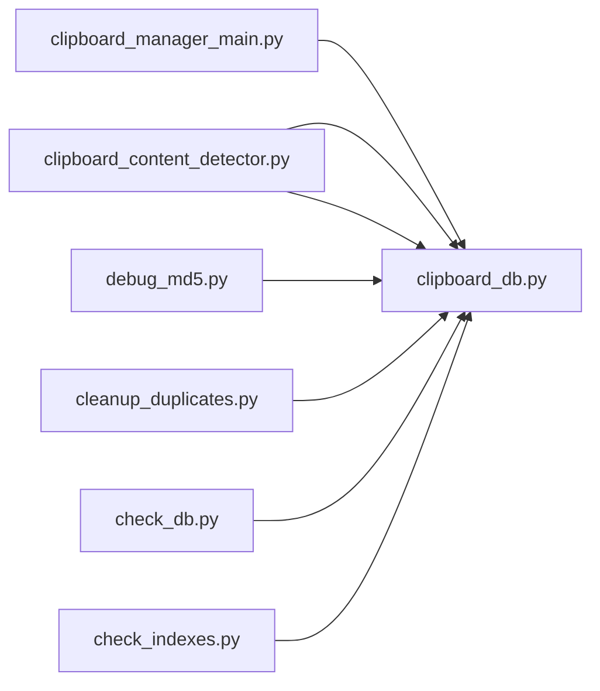

# 去重机制

<cite>
**本文引用的文件**
- [clipboard_manager_main.py](file://clipboard_manager_main.py)
- [clipboard_content_detector.py](file://clipboard_content_detector.py)
- [clipboard_db.py](file://clipboard_db.py)
- [debug_md5.py](file://debug_md5.py)
- [cleanup_duplicates.py](file://cleanup_duplicates.py)
- [check_db.py](file://check_db.py)
- [check_indexes.py](file://check_indexes.py)
</cite>

## 目录
1. [简介](#简介)
2. [项目结构](#项目结构)
3. [核心组件](#核心组件)
4. [架构总览](#架构总览)
5. [详细组件分析](#详细组件分析)
6. [依赖关系分析](#依赖关系分析)
7. [性能考量](#性能考量)
8. [故障排查指南](#故障排查指南)
9. [结论](#结论)
10. [附录](#附录)

## 简介
本文件系统性文档化剪贴板内容去重机制的实现，重点覆盖：
- MD5哈希在文本与文件内容去重中的应用，包括 calculate_text_md5 与 calculate_file_md5 的实现细节
- 数据库层面通过 UNIQUE 约束与 IntegrityError 异常处理实现去重
- save_text_record 方法中“插入或更新”的逻辑：当检测到重复 MD5 时，更新时间戳并递增 number 计数器
- content_key 机制在监控层面避免重复处理相同内容
- 实际代码片段路径展示去重逻辑的完整流程，从内容检测到数据库操作
- MD5 哈希的性能影响与在大数据量下的优化策略

## 项目结构
该项目围绕剪贴板监控、内容检测、数据库持久化与 GUI 展示展开，其中去重相关的关键文件如下：
- clipboard_manager_main.py：主监控与保存逻辑，包含 calculate_file_md5、save_text_record/save_file_record、content_key 使用
- clipboard_content_detector.py：内容检测与 content_key 生成，包含 calculate_text_md5
- clipboard_db.py：数据库初始化、表结构、save_text_record/save_file_record、索引与清理
- debug_md5.py：调试文本 MD5 去重功能
- cleanup_duplicates.py：清理重复 MD5 记录
- check_db.py、check_indexes.py：辅助检查数据库与索引

图表来源
- [clipboard_manager_main.py](file://clipboard_manager_main.py#L24-L55)
- [clipboard_content_detector.py](file://clipboard_content_detector.py#L139-L142)
- [clipboard_db.py](file://clipboard_db.py#L18-L115)
- [debug_md5.py](file://debug_md5.py#L1-L56)
- [cleanup_duplicates.py](file://cleanup_duplicates.py#L1-L67)
- [check_db.py](file://check_db.py#L1-L31)
- [check_indexes.py](file://check_indexes.py#L1-L27)

章节来源
- [clipboard_manager_main.py](file://clipboard_manager_main.py#L24-L55)
- [clipboard_content_detector.py](file://clipboard_content_detector.py#L139-L142)
- [clipboard_db.py](file://clipboard_db.py#L18-L115)

## 核心组件
- MD5 计算器
  - 文本：calculate_text_md5（clipboard_content_detector.py）
  - 文件：calculate_file_md5（clipboard_manager_main.py）
- 数据库层
  - 表结构：text_records、file_records（含 md5_hash、number、timestamp 等）
  - 去重逻辑：save_text_record/save_file_record 中的 UNIQUE 约束与 IntegrityError 处理
  - 索引：text_records 的 md5_hash 唯一索引
- 监控与 content_key
  - content_key：对文本采用 hash 或 MD5（超长文本），对文件采用排序后的文件列表拼接
  - 避免重复处理相同内容

章节来源
- [clipboard_content_detector.py](file://clipboard_content_detector.py#L139-L142)
- [clipboard_manager_main.py](file://clipboard_manager_main.py#L24-L55)
- [clipboard_db.py](file://clipboard_db.py#L18-L115)

## 架构总览
下图展示了从剪贴板监控到数据库去重的整体流程，以及 content_key 在监控阶段的作用。

图表来源
- [clipboard_manager_main.py](file://clipboard_manager_main.py#L412-L488)
- [clipboard_content_detector.py](file://clipboard_content_detector.py#L221-L253)
- [clipboard_db.py](file://clipboard_db.py#L116-L183)

## 详细组件分析

### MD5 哈希在文本与文件中的应用
- 文本 MD5
  - calculate_text_md5：对 UTF-8 编码的文本计算 MD5，用于 content_key 与数据库去重
  - 在 clipboard_content_detector.py 中用于长文本（>1000字符）的 content_key 生成
- 文件 MD5
  - calculate_file_md5：以 4096 字节块迭代读取文件并更新 MD5，避免大文件一次性加载内存
  - 在 clipboard_manager_main.py 中用于文件去重与保存

章节来源
- [clipboard_content_detector.py](file://clipboard_content_detector.py#L139-L142)
- [clipboard_manager_main.py](file://clipboard_manager_main.py#L24-L55)

### 数据库层面的去重：UNIQUE 约束与 IntegrityError
- 表结构
  - text_records：包含 md5_hash（UNIQUE）、number（计数）、timestamp、char_count 等
  - file_records：包含 md5_hash（UNIQUE）、number（计数）、timestamp 等
- 去重逻辑
  - 插入时若 md5_hash 已存在，抛出 IntegrityError
  - 捕获异常后执行 UPDATE，更新 timestamp 并递增 number
  - 最后查询并返回该记录的 id

图表来源
- [clipboard_db.py](file://clipboard_db.py#L116-L151)

章节来源
- [clipboard_db.py](file://clipboard_db.py#L18-L115)
- [clipboard_db.py](file://clipboard_db.py#L116-L183)

### save_text_record 的“插入或更新”逻辑详解
- 插入路径
  - 计算 MD5，构造记录，INSERT 成功即返回新记录 ID
- 更新路径
  - IntegrityError 触发后，UPDATE 对应 md5_hash 的记录，更新时间戳并递增 number
  - 查询并返回该记录 ID
- number 字段的作用
  - 记录重复次数，便于统计与后续清理

章节来源
- [clipboard_db.py](file://clipboard_db.py#L116-L151)

### content_key 机制：监控层面避免重复处理
- 文本 content_key
  - 短文本：使用 hash(content) 作为 key
  - 长文本：使用 calculate_text_md5(content) 作为 key
- 文件 content_key
  - 使用排序后的文件路径拼接，确保顺序无关性
- 作用
  - 在每次监控循环中比较 current_content_key 与 previous_content，不同才继续处理，避免重复保存

章节来源
- [clipboard_content_detector.py](file://clipboard_content_detector.py#L221-L253)
- [clipboard_manager_main.py](file://clipboard_manager_main.py#L412-L488)

### 完整去重流程（代码片段路径）
- 文本去重流程
  - 计算 MD5：[calculate_text_md5](file://clipboard_content_detector.py#L139-L142)
  - 保存记录（去重）：[save_text_record](file://clipboard_db.py#L116-L151)
- 文件去重流程
  - 计算 MD5：[calculate_file_md5](file://clipboard_manager_main.py#L24-L55)
  - 保存记录（去重）：[save_file_record](file://clipboard_db.py#L152-L183)
- content_key 生成与监控
  - 文本/文件 content_key：[clipboard_content_detector.py](file://clipboard_content_detector.py#L221-L253)
  - 监控循环与 previous_content 更新：[clipboard_manager_main.py](file://clipboard_manager_main.py#L412-L488)

章节来源
- [clipboard_content_detector.py](file://clipboard_content_detector.py#L139-L142)
- [clipboard_manager_main.py](file://clipboard_manager_main.py#L24-L55)
- [clipboard_db.py](file://clipboard_db.py#L116-L183)
- [clipboard_content_detector.py](file://clipboard_content_detector.py#L221-L253)
- [clipboard_manager_main.py](file://clipboard_manager_main.py#L412-L488)

### 数据库索引与清理
- 索引
  - text_records 的 md5_hash 唯一索引，加速去重判断
- 清理
  - cleanup_duplicates：按 md5_hash 分组统计重复，保留最新记录并合并 number，删除其余重复记录
  - check_db：检查最近带 MD5 的记录与重复 MD5
  - check_indexes：检查表索引是否存在

章节来源
- [clipboard_db.py](file://clipboard_db.py#L18-L115)
- [cleanup_duplicates.py](file://cleanup_duplicates.py#L1-L67)
- [check_db.py](file://check_db.py#L1-L31)
- [check_indexes.py](file://check_indexes.py#L1-L27)

## 依赖关系分析
- 组件耦合
  - clipboard_manager_main.py 依赖 clipboard_db.py 进行数据库操作
  - clipboard_content_detector.py 也依赖 clipboard_db.py 进行设置与内容检测
- 去重依赖
  - md5_hash 字段与 UNIQUE 约束是去重的核心
  - IntegrityError 是数据库层的去重保障
- 监控依赖
  - content_key 依赖 calculate_text_md5/calculate_file_md5 与文件列表排序

图表来源
- [clipboard_manager_main.py](file://clipboard_manager_main.py#L355-L496)
- [clipboard_content_detector.py](file://clipboard_content_detector.py#L1-L274)
- [clipboard_db.py](file://clipboard_db.py#L1-L455)
- [debug_md5.py](file://debug_md5.py#L1-L56)
- [cleanup_duplicates.py](file://cleanup_duplicates.py#L1-L67)
- [check_db.py](file://check_db.py#L1-L31)
- [check_indexes.py](file://check_indexes.py#L1-L27)

章节来源
- [clipboard_manager_main.py](file://clipboard_manager_main.py#L355-L496)
- [clipboard_content_detector.py](file://clipboard_content_detector.py#L1-L274)
- [clipboard_db.py](file://clipboard_db.py#L1-L455)

## 性能考量
- MD5 计算
  - 文本：UTF-8 编码后一次性计算，开销与文本长度线性相关
  - 文件：分块读取（4096 字节），避免大文件占用内存，I/O 为主要瓶颈
- 数据库写入
  - UNIQUE 约束与索引带来去重判断的 O(log N) 成本
  - IntegrityError 触发时的 UPDATE + SELECT 增加一次额外查询
- 监控频率
  - 降低检测间隔可提升实时性但增加 CPU/IO 压力
- 优化建议
  - 长文本 content_key 使用 MD5，避免 hash 的碰撞风险
  - 文件 content_key 使用排序后的路径，保证稳定性
  - 对 text_records 建立 md5_hash 唯一索引，减少冲突判断成本
  - 批量清理重复记录（cleanup_duplicates）定期执行，保持表规模可控
  - 对超大文本可考虑分片摘要或增量哈希（需评估复杂度）

[本节为通用性能讨论，无需列出具体文件来源]

## 故障排查指南
- 常见问题
  - 插入失败（UNIQUE 冲突）：确认 md5_hash 是否正确生成且未被篡改
  - 重复记录未合并：检查 number 字段是否更新，必要时执行清理脚本
  - content_key 未生效：确认文本长度阈值与文件列表排序逻辑
- 排查步骤
  - 使用 debug_md5.py 验证文本 MD5 去重行为
  - 使用 check_db.py 检查重复 MD5 与最近记录
  - 使用 check_indexes.py 检查 md5_hash 索引是否存在
  - 使用 cleanup_duplicates.py 清理重复记录并合并 number

章节来源
- [debug_md5.py](file://debug_md5.py#L1-L56)
- [check_db.py](file://check_db.py#L1-L31)
- [check_indexes.py](file://check_indexes.py#L1-L27)
- [cleanup_duplicates.py](file://cleanup_duplicates.py#L1-L67)

## 结论
本项目通过“content_key + MD5 + UNIQUE 约束 + IntegrityError”的组合，在监控阶段避免重复处理，在数据库层实现高效去重。文本与文件分别采用合适的哈希策略与存储结构，配合 number 计数器与定期清理脚本，可在大数据量场景下维持良好的性能与一致性。建议在生产环境中持续关注索引维护与清理策略，以确保长期稳定运行。

[本节为总结性内容，无需列出具体文件来源]

## 附录
- 关键实现路径参考
  - 文本 MD5：[calculate_text_md5](file://clipboard_content_detector.py#L139-L142)
  - 文件 MD5：[calculate_file_md5](file://clipboard_manager_main.py#L24-L55)
  - 文本去重保存：[save_text_record](file://clipboard_db.py#L116-L151)
  - 文件去重保存：[save_file_record](file://clipboard_db.py#L152-L183)
  - 文本 content_key 生成：[clipboard_content_detector.py](file://clipboard_content_detector.py#L221-L253)
  - 文件 content_key 生成：[clipboard_manager_main.py](file://clipboard_manager_main.py#L412-L488)
  - 索引与初始化：[clipboard_db.py](file://clipboard_db.py#L18-L115)
  - 重复清理：[cleanup_duplicates.py](file://cleanup_duplicates.py#L1-L67)
  - 数据检查：[check_db.py](file://check_db.py#L1-L31)
  - 索引检查：[check_indexes.py](file://check_indexes.py#L1-L27)

[本节为补充参考，无需列出具体文件来源]