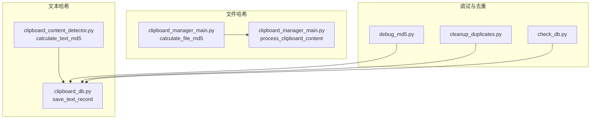
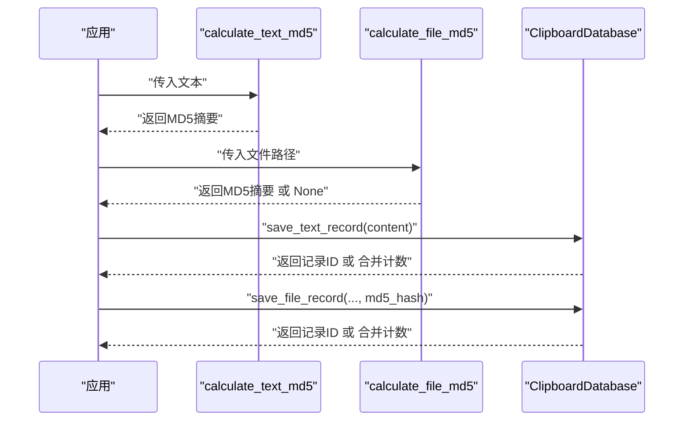
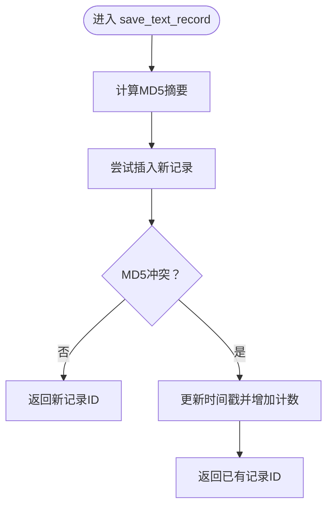
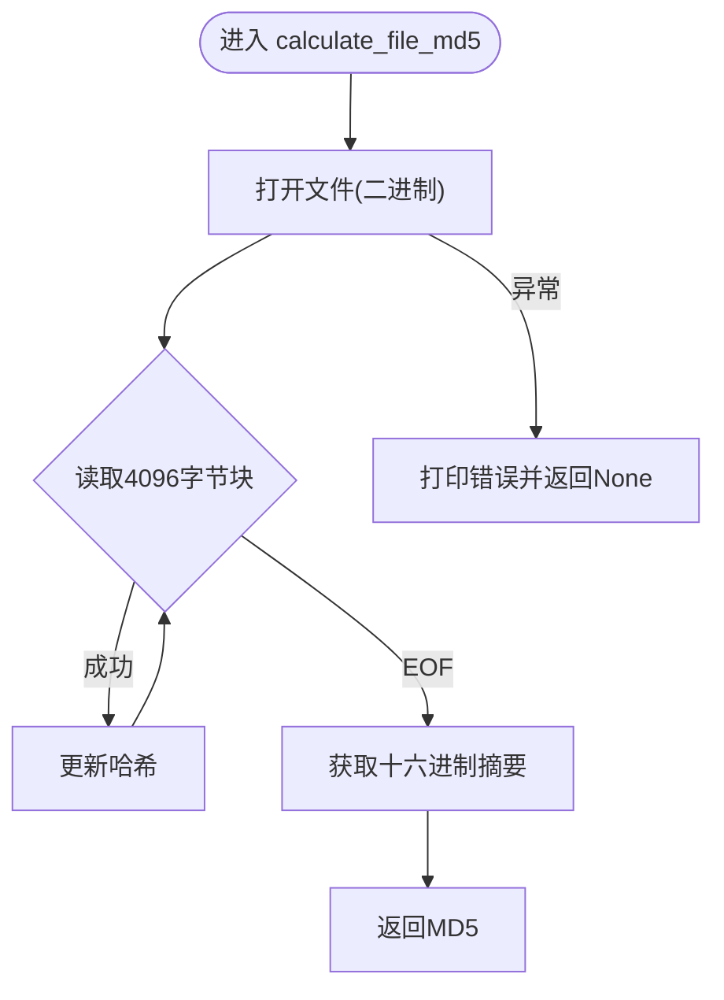
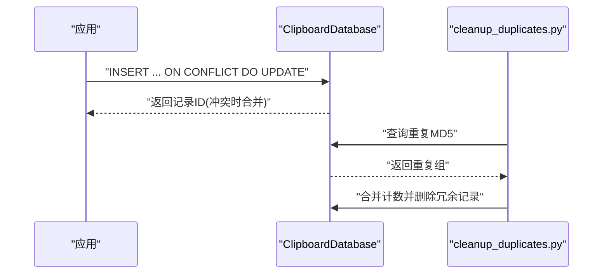
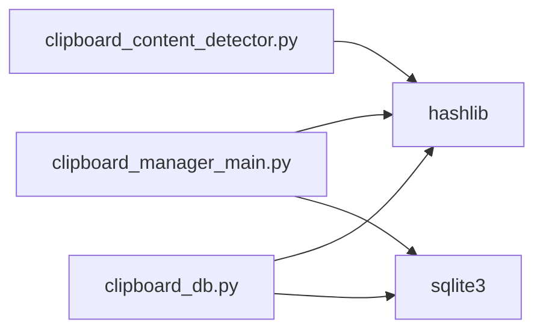

# 哈希计算机制

<cite>
**本文引用的文件**
- [clipboard_content_detector.py](file://clipboard_content_detector.py)
- [clipboard_manager_main.py](file://clipboard_manager_main.py)
- [clipboard_db.py](file://clipboard_db.py)
- [debug_md5.py](file://debug_md5.py)
- [cleanup_duplicates.py](file://cleanup_duplicates.py)
- [check_db.py](file://check_db.py)
</cite>

## 目录
1. [简介](#简介)
2. [项目结构](#项目结构)
3. [核心组件](#核心组件)
4. [架构总览](#架构总览)
5. [详细组件分析](#详细组件分析)
6. [依赖关系分析](#依赖关系分析)
7. [性能考量](#性能考量)
8. [故障排查指南](#故障排查指南)
9. [结论](#结论)
10. [附录](#附录)

## 简介
本文件聚焦于文本与文件内容的MD5哈希计算实现，系统性说明以下要点：
- 文本MD5计算：calculate_text_md5函数对传入文本进行UTF-8编码后生成MD5摘要。
- 文件MD5计算：calculate_file_md5函数采用4096字节分块读取，逐块更新哈希，避免大文件导致内存溢出。
- 去重原理：哈希算法将变长内容映射为固定长度的唯一标识，结合数据库唯一约束实现重复内容去重。
- 实际调用示例：提供代码片段路径，展示文本与文件哈希的实际使用方式。
- 异常处理：文件读取失败时返回None，数据库插入冲突时通过唯一约束合并计数。
- 哈希碰撞：在本应用场景下，MD5碰撞概率极低，可视为可忽略。

## 项目结构
围绕哈希计算的相关文件分布如下：
- 文本MD5计算与使用：clipboard_content_detector.py、clipboard_db.py
- 文件MD5计算与使用：clipboard_manager_main.py
- 调试与去重辅助：debug_md5.py、cleanup_duplicates.py、check_db.py

图表来源
- [clipboard_content_detector.py](file://clipboard_content_detector.py#L139-L141)
- [clipboard_db.py](file://clipboard_db.py#L116-L151)
- [clipboard_manager_main.py](file://clipboard_manager_main.py#L24-L35)
- [clipboard_manager_main.py](file://clipboard_manager_main.py#L395-L496)
- [debug_md5.py](file://debug_md5.py#L1-L56)
- [cleanup_duplicates.py](file://cleanup_duplicates.py#L1-L67)
- [check_db.py](file://check_db.py#L1-L31)

章节来源
- [clipboard_content_detector.py](file://clipboard_content_detector.py#L1-L274)
- [clipboard_manager_main.py](file://clipboard_manager_main.py#L1-L761)
- [clipboard_db.py](file://clipboard_db.py#L1-L455)
- [debug_md5.py](file://debug_md5.py#L1-L56)
- [cleanup_duplicates.py](file://cleanup_duplicates.py#L1-L67)
- [check_db.py](file://check_db.py#L1-L31)

## 核心组件
- 文本MD5计算：calculate_text_md5(text) -> str
  - 输入：字符串文本
  - 处理：UTF-8编码后计算MD5摘要
  - 输出：十六进制字符串
- 文件MD5计算：calculate_file_md5(file_path) -> str or None
  - 输入：文件路径
  - 处理：以4096字节为块迭代读取，逐块更新哈希
  - 输出：十六进制字符串；异常时返回None
- 数据库去重：save_text_record/save_file_record
  - 插入时若MD5冲突，通过唯一约束合并并增加计数

章节来源
- [clipboard_content_detector.py](file://clipboard_content_detector.py#L139-L141)
- [clipboard_manager_main.py](file://clipboard_manager_main.py#L24-L35)
- [clipboard_db.py](file://clipboard_db.py#L116-L183)

## 架构总览
文本与文件哈希在系统中的交互流程如下：

图表来源
- [clipboard_content_detector.py](file://clipboard_content_detector.py#L139-L141)
- [clipboard_manager_main.py](file://clipboard_manager_main.py#L24-L35)
- [clipboard_db.py](file://clipboard_db.py#L116-L183)

## 详细组件分析

### 文本MD5计算与去重
- calculate_text_md5
  - 功能：对文本进行UTF-8编码后计算MD5摘要
  - 典型调用：在clipboard_content_detector中用于长文本的唯一标识生成
- save_text_record
  - 功能：保存文本记录，若MD5已存在则合并计数
  - 去重策略：数据库表text_records的md5_hash字段具备唯一性约束

图表来源
- [clipboard_db.py](file://clipboard_db.py#L116-L151)

章节来源
- [clipboard_content_detector.py](file://clipboard_content_detector.py#L139-L141)
- [clipboard_db.py](file://clipboard_db.py#L116-L151)
- [debug_md5.py](file://debug_md5.py#L1-L56)

### 文件MD5计算与去重
- calculate_file_md5
  - 功能：以4096字节为块读取文件，逐块更新哈希，避免一次性加载大文件导致内存溢出
  - 异常处理：读取失败返回None
- process_clipboard_content
  - 功能：从剪贴板读取文件列表，计算MD5，去重后保存到数据库

图表来源
- [clipboard_manager_main.py](file://clipboard_manager_main.py#L24-L35)

章节来源
- [clipboard_manager_main.py](file://clipboard_manager_main.py#L24-L35)
- [clipboard_manager_main.py](file://clipboard_manager_main.py#L395-L496)
- [clipboard_db.py](file://clipboard_db.py#L152-L183)

### 去重与计数合并
- 数据库层
  - text_records：新增md5_hash字段并建立唯一索引；冲突时通过唯一约束合并计数
  - file_records：md5_hash字段唯一，冲突时合并计数
- 辅助工具
  - cleanup_duplicates.py：扫描重复MD5并合并计数、清理冗余记录
  - check_db.py：检查数据库中MD5重复情况

图表来源
- [clipboard_db.py](file://clipboard_db.py#L116-L183)
- [cleanup_duplicates.py](file://cleanup_duplicates.py#L1-L67)

章节来源
- [clipboard_db.py](file://clipboard_db.py#L1-L455)
- [cleanup_duplicates.py](file://cleanup_duplicates.py#L1-L67)
- [check_db.py](file://check_db.py#L1-L31)

## 依赖关系分析
- 模块间依赖
  - clipboard_content_detector依赖hashlib进行文本MD5计算
  - clipboard_manager_main依赖hashlib进行文件MD5计算，并在process_clipboard_content中调用
  - clipboard_db依赖hashlib进行文本MD5计算，并在save_text_record/save_file_record中使用
- 数据库约束
  - text_records.md5_hash唯一索引
  - file_records.md5_hash唯一约束

图表来源
- [clipboard_content_detector.py](file://clipboard_content_detector.py#L1-L20)
- [clipboard_manager_main.py](file://clipboard_manager_main.py#L1-L30)
- [clipboard_db.py](file://clipboard_db.py#L1-L20)

章节来源
- [clipboard_content_detector.py](file://clipboard_content_detector.py#L1-L20)
- [clipboard_manager_main.py](file://clipboard_manager_main.py#L1-L30)
- [clipboard_db.py](file://clipboard_db.py#L1-L40)

## 性能考量
- 分块读取：文件MD5采用4096字节分块，降低内存占用，适合超大文件
- 哈希更新：逐块更新哈希，CPU开销与文件大小线性相关
- 去重效率：数据库唯一索引/约束保证冲突时快速合并，避免重复存储
- 文本哈希：短文本直接计算MD5，长文本使用MD5作为唯一标识，减少比较成本

## 故障排查指南
- 文件读取失败
  - 现象：calculate_file_md5返回None
  - 排查：确认文件路径有效、权限正常、磁盘空间充足
  - 代码参考：[文件MD5计算](file://clipboard_manager_main.py#L24-L35)
- 数据库冲突
  - 现象：插入失败触发唯一约束冲突
  - 处理：通过ON CONFLICT合并计数，无需手动干预
  - 代码参考：[文本去重合并](file://clipboard_db.py#L116-L151)、[文件去重合并](file://clipboard_db.py#L152-L183)
- 重复MD5清理
  - 工具：cleanup_duplicates.py扫描并合并重复MD5记录
  - 代码参考：[重复清理](file://cleanup_duplicates.py#L1-L67)
- 快速检查
  - 工具：check_db.py列出最近带MD5记录与重复MD5组
  - 代码参考：[数据库检查](file://check_db.py#L1-L31)

章节来源
- [clipboard_manager_main.py](file://clipboard_manager_main.py#L24-L35)
- [clipboard_db.py](file://clipboard_db.py#L116-L183)
- [cleanup_duplicates.py](file://cleanup_duplicates.py#L1-L67)
- [check_db.py](file://check_db.py#L1-L31)

## 结论
- 文本与文件MD5计算均通过标准库实现，流程清晰、健壮性强
- 分块读取与唯一约束共同保障了大文件处理效率与去重可靠性
- 在本应用场景下，MD5碰撞概率极低，可视为可忽略；如需进一步降低风险，可考虑升级至更安全的哈希算法（如SHA-256）

## 附录

### 实际调用示例（代码片段路径）
- 文本MD5计算与保存
  - [calculate_text_md5](file://clipboard_content_detector.py#L139-L141)
  - [save_text_record](file://clipboard_db.py#L116-L151)
  - [调试脚本示例](file://debug_md5.py#L1-L56)
- 文件MD5计算与保存
  - [calculate_file_md5](file://clipboard_manager_main.py#L24-L35)
  - [process_clipboard_content](file://clipboard_manager_main.py#L395-L496)
  - [save_file_record](file://clipboard_db.py#L152-L183)

### 哈希碰撞说明
- MD5在本场景下的碰撞概率极低，可视为可忽略
- 若业务对安全性要求更高，可考虑使用SHA-256等更强哈希算法