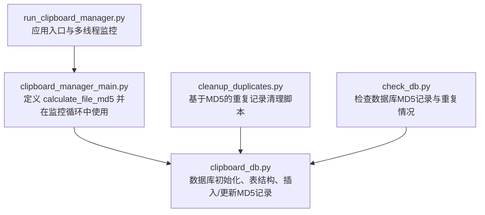
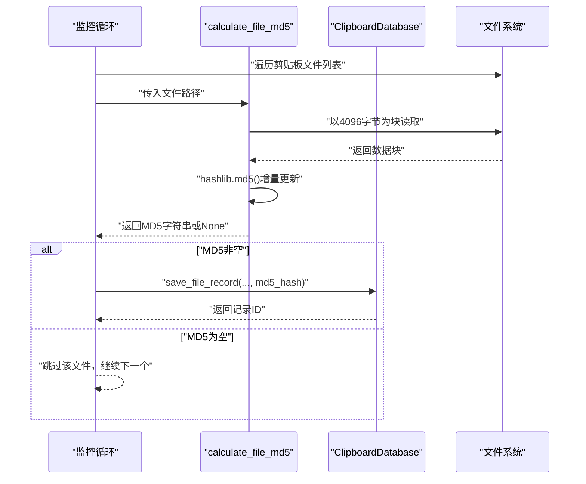
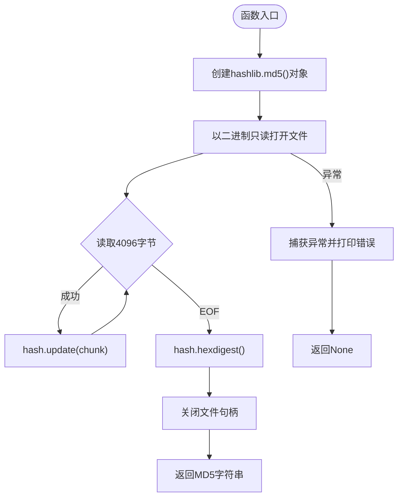
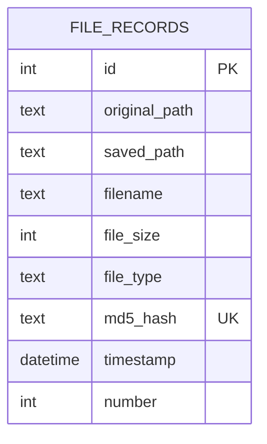
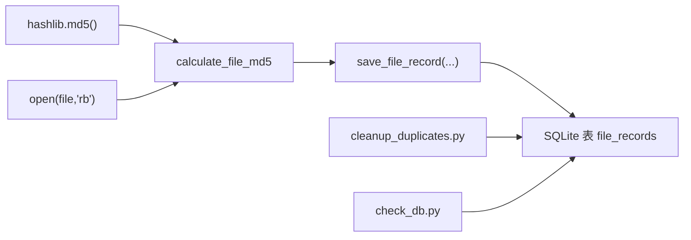

# 文件哈希计算

<cite>
**本文引用的文件**
- [clipboard_manager_main.py](file://clipboard_manager_main.py)
- [clipboard_db.py](file://clipboard_db.py)
- [cleanup_duplicates.py](file://cleanup_duplicates.py)
- [check_db.py](file://check_db.py)
- [run_clipboard_manager.py](file://run_clipboard_manager.py)
</cite>

## 目录
1. [简介](#简介)
2. [项目结构](#项目结构)
3. [核心组件](#核心组件)
4. [架构总览](#架构总览)
5. [详细组件分析](#详细组件分析)
6. [依赖关系分析](#依赖关系分析)
7. [性能考量](#性能考量)
8. [故障排查指南](#故障排查指南)
9. [结论](#结论)
10. [附录](#附录)

## 简介
本文件围绕 calculate_file_md5 函数展开，系统性阐述其通过“分块读取（每次4096字节）”方式高效计算大文件MD5值的实现原理与工程实践，解释增量更新机制、流式读取惯用法、异常处理策略，并结合数据库层的去重逻辑，说明该机制在文件去重中的核心地位与稳定性保障。

## 项目结构
本仓库围绕剪贴板历史记录管理构建，涉及文件监控、GUI界面、数据库持久化与重复数据清理等模块。calculate_file_md5 位于主流程入口文件中，被剪贴板监控循环调用；数据库层负责存储文件元数据与MD5，并通过唯一约束实现去重。



图表来源
- [clipboard_manager_main.py](file://clipboard_manager_main.py#L24-L35)
- [clipboard_db.py](file://clipboard_db.py#L1-L120)
- [cleanup_duplicates.py](file://cleanup_duplicates.py#L1-L67)
- [check_db.py](file://check_db.py#L1-L31)
- [run_clipboard_manager.py](file://run_clipboard_manager.py#L1-L71)

章节来源
- [clipboard_manager_main.py](file://clipboard_manager_main.py#L1-L761)
- [clipboard_db.py](file://clipboard_db.py#L1-L455)
- [cleanup_duplicates.py](file://cleanup_duplicates.py#L1-L67)
- [check_db.py](file://check_db.py#L1-L31)
- [run_clipboard_manager.py](file://run_clipboard_manager.py#L1-L71)

## 核心组件
- calculate_file_md5：以4096字节为块增量更新MD5，流式读取直至EOF，异常时返回None，保证监控循环稳定。
- 数据库层（ClipboardDatabase）：创建文件记录表，字段包含md5_hash与number，通过唯一约束与更新逻辑实现去重与计数聚合。
- 监控循环：在剪贴板变化时遍历文件列表，逐个计算MD5并写入数据库，遇到None则跳过，避免中断。

章节来源
- [clipboard_manager_main.py](file://clipboard_manager_main.py#L24-L35)
- [clipboard_db.py](file://clipboard_db.py#L55-L80)
- [clipboard_db.py](file://clipboard_db.py#L152-L183)
- [clipboard_manager_main.py](file://clipboard_manager_main.py#L416-L456)

## 架构总览
calculate_file_md5 的调用链路如下：监控循环 -> 计算MD5 -> 数据库插入/更新 -> 去重与计数。



图表来源
- [clipboard_manager_main.py](file://clipboard_manager_main.py#L416-L456)
- [clipboard_manager_main.py](file://clipboard_manager_main.py#L24-L35)
- [clipboard_db.py](file://clipboard_db.py#L152-L183)

## 详细组件分析

### calculate_file_md5 实现细节
- 分块读取与增量更新
  - 使用hashlib.md5()对象，通过多次update(chunk)实现增量更新，最终调用hexdigest()得到十六进制摘要。
  - 采用iter(lambda: f.read(4096), b"")惯用法，将文件读取包装为迭代器，每次读取4096字节，直到读到空字节b""为止，从而实现流式读取。
- 内存效率与稳定性
  - 每次仅在内存中持有4096字节的数据块，避免将超大文件一次性加载到内存，有效防止内存溢出。
  - 即使文件被占用或权限不足导致读取失败，函数捕获异常并返回None，确保监控循环不会中断。
- 返回值语义
  - 成功：返回MD5字符串；失败：返回None，调用方据此决定是否继续处理后续文件。



图表来源
- [clipboard_manager_main.py](file://clipboard_manager_main.py#L24-L35)

章节来源
- [clipboard_manager_main.py](file://clipboard_manager_main.py#L24-L35)

### 数据库层去重与计数
- 表结构要点
  - 文件记录表包含md5_hash字段，并设置为UNIQUE，确保同一内容的文件不会重复入库。
  - 引入number字段用于计数聚合，相同MD5的文件出现时，通过更新number实现去重计数。
- 插入与更新逻辑
  - 首次插入：md5_hash唯一，成功写入。
  - 重复MD5：捕获唯一约束冲突，转而更新timestamp与number，达到“去重+计数”的效果。
- 去重脚本与检查
  - cleanup_duplicates.py：按MD5分组统计重复，保留最新记录并合并计数，删除多余重复项。
  - check_db.py：查询最近带MD5的记录与重复MD5组，辅助验证去重效果。



图表来源
- [clipboard_db.py](file://clipboard_db.py#L55-L80)
- [clipboard_db.py](file://clipboard_db.py#L152-L183)

章节来源
- [clipboard_db.py](file://clipboard_db.py#L55-L80)
- [clipboard_db.py](file://clipboard_db.py#L152-L183)
- [cleanup_duplicates.py](file://cleanup_duplicates.py#L1-L67)
- [check_db.py](file://check_db.py#L1-L31)

### 监控循环与异常处理
- 监控循环
  - 在剪贴板变化时，遍历文件列表，逐个调用calculate_file_md5，若返回None则跳过，继续处理下一个文件，保证监控稳定性。
- 异常处理策略
  - calculate_file_md5内部捕获异常并返回None，调用方无需额外try-except即可安全继续。
  - 监控循环对每个文件的处理也包裹在try-except中，避免个别文件异常影响整体流程。

```mermaid
sequenceDiagram
participant Loop as "监控循环"
participant Proc as "process_clipboard_content"
participant Calc as "calculate_file_md5"
participant DB as "save_file_record"
Loop->>Proc : "触发处理"
Proc->>Loop : "遍历文件列表"
loop "逐个文件"
Loop->>Calc : "计算MD5"
alt "返回MD5"
Calc-->>Loop : "MD5字符串"
Loop->>DB : "保存记录"
DB-->>Loop : "记录ID"
else "返回None"
Calc-->>Loop : "None"
Loop-->>Loop : "跳过该文件"
end
end
```

图表来源
- [clipboard_manager_main.py](file://clipboard_manager_main.py#L416-L456)
- [clipboard_manager_main.py](file://clipboard_manager_main.py#L24-L35)
- [clipboard_db.py](file://clipboard_db.py#L152-L183)

章节来源
- [clipboard_manager_main.py](file://clipboard_manager_main.py#L416-L456)
- [clipboard_manager_main.py](file://clipboard_manager_main.py#L24-L35)
- [clipboard_db.py](file://clipboard_db.py#L152-L183)

### 不同大小文件的哈希计算过程示例（步骤说明）
以下为通用流程说明，不展示具体代码片段：
- 小文件（小于4096字节）
  - 读取一次后即到达EOF，完成一次update与一次hexdigest。
- 中等文件（约几MB）
  - 循环多次update，每次4096字节，最后一次可能不足4096字节，但不影响完整性。
- 大文件（几十GB级别）
  - 仍以4096字节为块，持续update直至EOF，内存占用始终维持在约4KB左右，避免OOM风险。

章节来源
- [clipboard_manager_main.py](file://clipboard_manager_main.py#L24-L35)

## 依赖关系分析
- calculate_file_md5 依赖hashlib.md5()对象与内置open()函数，实现增量哈希与流式读取。
- 监控循环依赖calculate_file_md5与ClipboardDatabase.save_file_record，形成“计算MD5 -> 去重入库”的闭环。
- 去重脚本与检查脚本依赖数据库层，验证去重效果与一致性。



图表来源
- [clipboard_manager_main.py](file://clipboard_manager_main.py#L24-L35)
- [clipboard_db.py](file://clipboard_db.py#L152-L183)
- [cleanup_duplicates.py](file://cleanup_duplicates.py#L1-L67)
- [check_db.py](file://check_db.py#L1-L31)

章节来源
- [clipboard_manager_main.py](file://clipboard_manager_main.py#L24-L35)
- [clipboard_db.py](file://clipboard_db.py#L152-L183)
- [cleanup_duplicates.py](file://cleanup_duplicates.py#L1-L67)
- [check_db.py](file://check_db.py#L1-L31)

## 性能考量
- I/O与CPU平衡
  - 4096字节为块大小兼顾I/O吞吐与CPU开销，适合大多数磁盘与SSD场景。
- 内存占用
  - 固定块大小确保内存占用稳定，避免大文件导致峰值内存飙升。
- 哈希计算成本
  - MD5计算开销极低，远小于I/O成本，因此分块读取对整体性能影响可忽略。
- 去重收益
  - 通过md5_hash唯一约束与number计数，显著减少重复存储，降低数据库体积与查询压力。

[本节为通用性能讨论，不直接分析具体文件]

## 故障排查指南
- 文件被占用或权限不足
  - 现象：calculate_file_md5返回None，监控循环跳过该文件。
  - 处理：确认文件是否被其他进程占用或权限不足；修复后再重试。
- 数据库唯一约束冲突
  - 现象：save_file_record在插入时抛出唯一约束异常，随后进入更新分支。
  - 处理：系统自动合并计数，无需人工干预；如需清理重复，可运行cleanup_duplicates.py。
- 监控循环中断
  - 现象：个别文件异常导致监控停止。
  - 处理：监控循环已包裹异常捕获，遇到None会跳过并继续；如仍有异常，检查日志输出定位具体文件。

章节来源
- [clipboard_manager_main.py](file://clipboard_manager_main.py#L24-L35)
- [clipboard_manager_main.py](file://clipboard_manager_main.py#L416-L456)
- [clipboard_db.py](file://clipboard_db.py#L152-L183)
- [cleanup_duplicates.py](file://cleanup_duplicates.py#L1-L67)

## 结论
calculate_file_md5 通过“4096字节分块+增量更新+流式读取”的组合，实现了对任意大小文件的高效、稳定MD5计算；配合数据库层的唯一约束与计数聚合，确保相同内容的文件无论名称或路径如何都不会被重复保存，从而在文件去重中发挥核心作用。异常处理策略进一步提升了监控循环的鲁棒性，保障系统长期稳定运行。

[本节为总结性内容，不直接分析具体文件]

## 附录
- 关键实现位置参考
  - calculate_file_md5 定义与使用：[clipboard_manager_main.py](file://clipboard_manager_main.py#L24-L35), [clipboard_manager_main.py](file://clipboard_manager_main.py#L416-L456)
  - 数据库表结构与去重逻辑：[clipboard_db.py](file://clipboard_db.py#L55-L80), [clipboard_db.py](file://clipboard_db.py#L152-L183)
  - 重复记录清理与检查：[cleanup_duplicates.py](file://cleanup_duplicates.py#L1-L67), [check_db.py](file://check_db.py#L1-L31)
  - 应用入口与监控线程：[run_clipboard_manager.py](file://run_clipboard_manager.py#L1-L71)