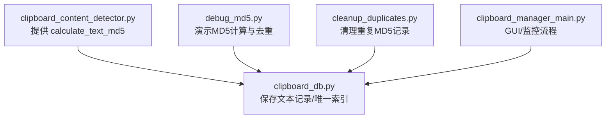
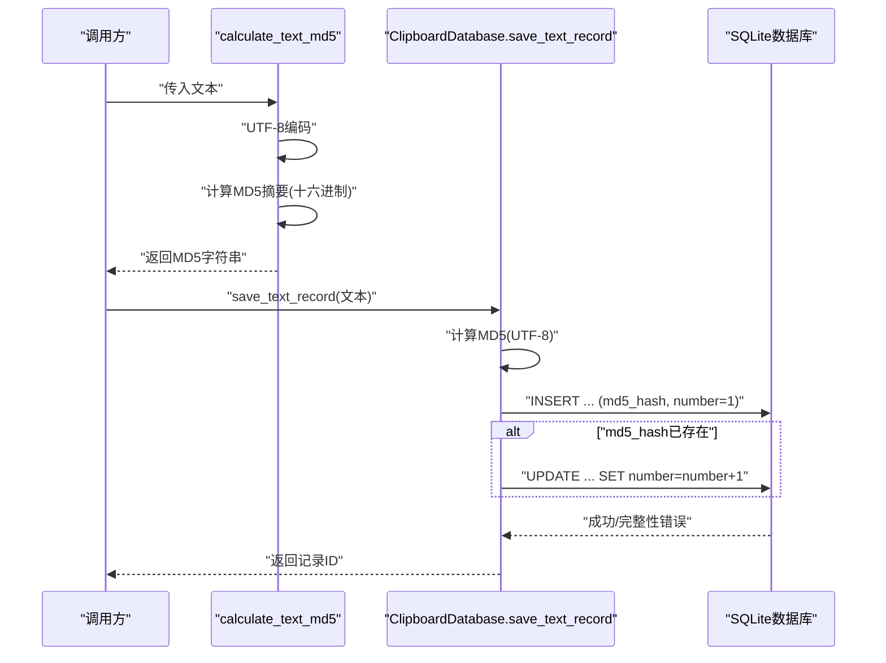
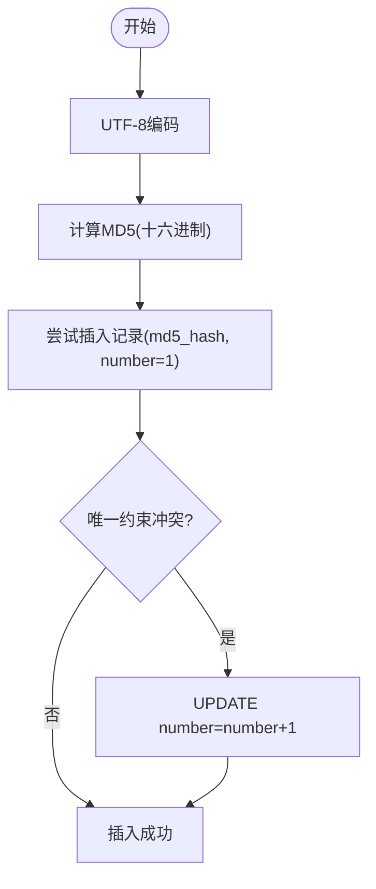
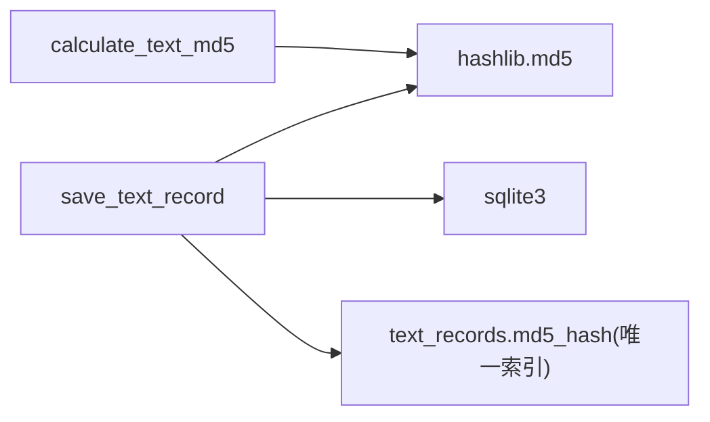

# 文本哈希计算

<cite>
**本文引用的文件**
- [clipboard_content_detector.py](file://clipboard_content_detector.py)
- [clipboard_db.py](file://clipboard_db.py)
- [debug_md5.py](file://debug_md5.py)
- [cleanup_duplicates.py](file://cleanup_duplicates.py)
- [clipboard_manager_main.py](file://clipboard_manager_main.py)
</cite>

## 目录
1. [简介](#简介)
2. [项目结构](#项目结构)
3. [核心组件](#核心组件)
4. [架构总览](#架构总览)
5. [详细组件分析](#详细组件分析)
6. [依赖关系分析](#依赖关系分析)
7. [性能与安全考量](#性能与安全考量)
8. [故障排查指南](#故障排查指南)
9. [结论](#结论)

## 简介
本文件围绕 calculate_text_md5 函数展开，系统性说明其在本项目中的实现机制、数据流、去重策略以及异常处理方式。calculate_text_md5 的职责是将任意文本输入以 UTF-8 编码后计算 MD5 摘要，从而将变长文本转换为固定长度的唯一标识符，用于后续的去重与关联存储。本文还结合数据库层的唯一约束与计数叠加逻辑，解释该机制如何在本应用场景下有效避免重复记录。

## 项目结构
本仓库围绕“剪贴板内容检测与历史管理”构建，涉及以下与文本哈希相关的关键文件：
- clipboard_content_detector.py：提供 calculate_text_md5 及剪贴板内容检测、去重标识生成等能力
- clipboard_db.py：负责 SQLite 数据库存取、文本记录表结构、MD5 唯一索引与计数叠加
- debug_md5.py：演示文本 MD5 的计算与数据库写入/去重行为
- cleanup_duplicates.py：清理重复 MD5 记录的辅助脚本
- clipboard_manager_main.py：完整 GUI/监控流程，其中也包含文本记录保存逻辑

图表来源
- [clipboard_content_detector.py](file://clipboard_content_detector.py#L139-L141)
- [clipboard_db.py](file://clipboard_db.py#L116-L151)
- [debug_md5.py](file://debug_md5.py#L1-L56)
- [cleanup_duplicates.py](file://cleanup_duplicates.py#L1-L67)
- [clipboard_manager_main.py](file://clipboard_manager_main.py#L395-L496)

章节来源
- [clipboard_content_detector.py](file://clipboard_content_detector.py#L1-L274)
- [clipboard_db.py](file://clipboard_db.py#L1-L200)
- [debug_md5.py](file://debug_md5.py#L1-L56)
- [cleanup_duplicates.py](file://cleanup_duplicates.py#L1-L67)
- [clipboard_manager_main.py](file://clipboard_manager_main.py#L1-L200)

## 核心组件
- calculate_text_md5：对输入文本进行 UTF-8 编码后计算 MD5 摘要，返回十六进制字符串
- ClipboardDatabase.save_text_record：保存文本记录时计算 MD5 并写入数据库；若 MD5 已存在，则更新计数而非插入重复记录
- 唯一索引与计数叠加：text_records 表的 md5_hash 字段建立唯一索引，配合 number 字段实现去重计数

章节来源
- [clipboard_content_detector.py](file://clipboard_content_detector.py#L139-L141)
- [clipboard_db.py](file://clipboard_db.py#L116-L151)

## 架构总览
calculate_text_md5 在本系统中的工作链路如下：
- 输入文本经 UTF-8 编码
- 计算 MD5 摘要（十六进制）
- 作为唯一标识参与去重判断与存储

图表来源
- [clipboard_content_detector.py](file://clipboard_content_detector.py#L139-L141)
- [clipboard_db.py](file://clipboard_db.py#L116-L151)

## 详细组件分析

### calculate_text_md5 实现机制
- 接收参数：任意文本对象（通常为字符串）
- 编码策略：使用 UTF-8 编码
- 哈希算法：MD5，输出十六进制字符串
- 返回值：固定长度的 32 位十六进制字符串

该函数位于 clipboard_content_detector.py 中，实现简洁稳定，直接委托给标准库的 hashlib.md5。

章节来源
- [clipboard_content_detector.py](file://clipboard_content_detector.py#L139-L141)

### 去重流程与唯一标识
- 唯一标识生成：calculate_text_md5 返回的 MD5 作为文本记录的唯一标识
- 存储策略：save_text_record 在插入时将 md5_hash 写入数据库；若唯一约束冲突（MD5 已存在），则执行计数叠加（number 字段递增）
- 查询与展示：cleanup_duplicates.py 展示了基于 md5_hash 的重复查找与合并逻辑

图表来源
- [clipboard_content_detector.py](file://clipboard_content_detector.py#L139-L141)
- [clipboard_db.py](file://clipboard_db.py#L116-L151)
- [cleanup_duplicates.py](file://cleanup_duplicates.py#L1-L67)

章节来源
- [clipboard_db.py](file://clipboard_db.py#L116-L151)
- [cleanup_duplicates.py](file://cleanup_duplicates.py#L1-L67)

### 函数调用示例与执行过程
以下示例展示 calculate_text_md5 的典型调用与返回值形态（以路径引用代替具体代码片段）：
- 示例调用路径：[clipboard_content_detector.py](file://clipboard_content_detector.py#L139-L141)
- 示例调用路径：[clipboard_db.py](file://clipboard_db.py#L116-L151)
- 调试脚本演示：[debug_md5.py](file://debug_md5.py#L1-L56)

章节来源
- [clipboard_content_detector.py](file://clipboard_content_detector.py#L139-L141)
- [clipboard_db.py](file://clipboard_db.py#L116-L151)
- [debug_md5.py](file://debug_md5.py#L1-L56)

### 与剪贴板监控流程的集成
- 长文本去重标识：当剪贴板文本长度超过阈值时，使用 calculate_text_md5 生成的标识参与内容键生成，避免重复处理
- 文本保存：monitor_clipboard 流程最终会调用 save_text_record 完成去重与计数叠加

章节来源
- [clipboard_content_detector.py](file://clipboard_content_detector.py#L228-L245)
- [clipboard_manager_main.py](file://clipboard_manager_main.py#L395-L496)

## 依赖关系分析
- calculate_text_md5 依赖 hashlib（标准库）
- save_text_record 依赖 sqlite3（标准库）与 hashlib
- 唯一索引与计数叠加由数据库层约束与更新语句共同保证

图表来源
- [clipboard_content_detector.py](file://clipboard_content_detector.py#L139-L141)
- [clipboard_db.py](file://clipboard_db.py#L116-L151)

章节来源
- [clipboard_content_detector.py](file://clipboard_content_detector.py#L1-L274)
- [clipboard_db.py](file://clipboard_db.py#L1-L200)

## 性能与安全考量
- 性能特征
  - 计算复杂度：O(n)，n 为文本字节数；UTF-8 编码与 MD5 哈希均为线性复杂度
  - 存储与查询：md5_hash 字段建立唯一索引，INSERT/UPDATE 均具备良好性能
  - 去重效率：通过唯一索引与计数叠加，避免重复写入与冗余存储
- 安全性考量
  - MD5 在密码学上已被证明存在碰撞风险，但在本场景中仅用于去重与唯一标识，不承担安全敏感任务
  - 项目中未使用 MD5 进行加密或认证，仅作为内容指纹，碰撞概率在正常业务规模内极低且可接受
  - 若未来业务升级至安全敏感场景，建议迁移到更安全的哈希算法（如 SHA-256）

[本节为通用指导，无需特定文件引用]

## 故障排查指南
- 异常处理机制
  - calculate_text_md5 本身不显式抛出异常；UTF-8 编码与 MD5 计算在 Python 标准库层面较为稳健
  - 去重失败主要由数据库唯一约束导致 IntegrityError，save_text_record 已捕获并回退为计数叠加
- 常见问题定位
  - 文本编码问题：确保输入为可被 UTF-8 编码的字符串
  - 数据库一致性：确认 md5_hash 唯一索引已创建
  - 重复记录：使用 cleanup_duplicates.py 检查并合并重复 MD5 记录

章节来源
- [clipboard_db.py](file://clipboard_db.py#L116-L151)
- [cleanup_duplicates.py](file://cleanup_duplicates.py#L1-L67)

## 结论
calculate_text_md5 通过 UTF-8 编码与 MD5 摘要，将变长文本转换为固定长度的唯一标识，配合数据库层的唯一索引与计数叠加，实现了高效的去重与历史记录管理。在本应用场景下，MD5 的碰撞风险极低且可接受；函数本身异常较少，稳定性高。结合调试脚本与清理工具，可快速验证与维护去重效果。