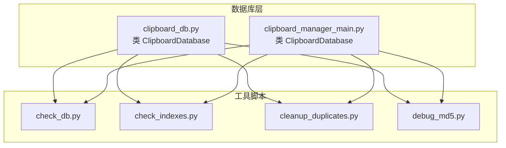
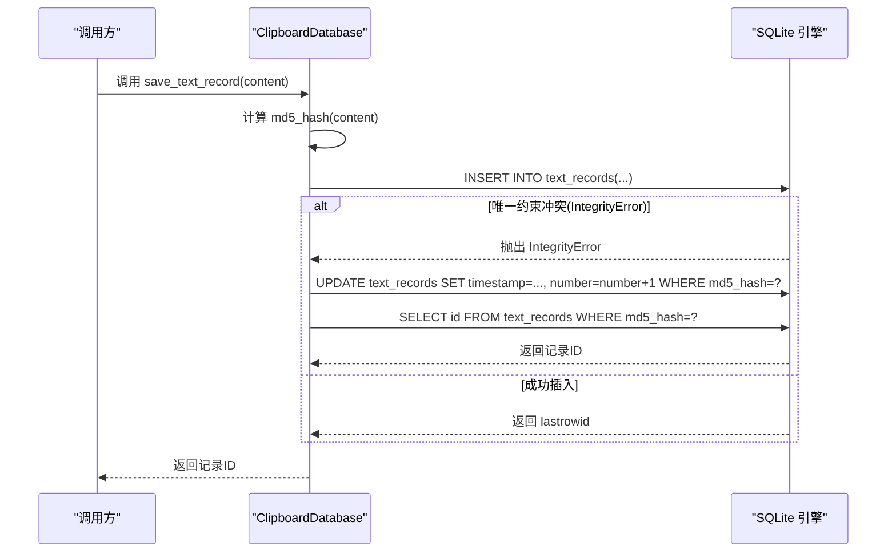
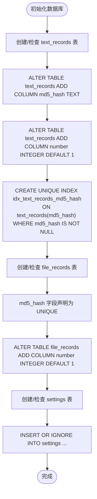
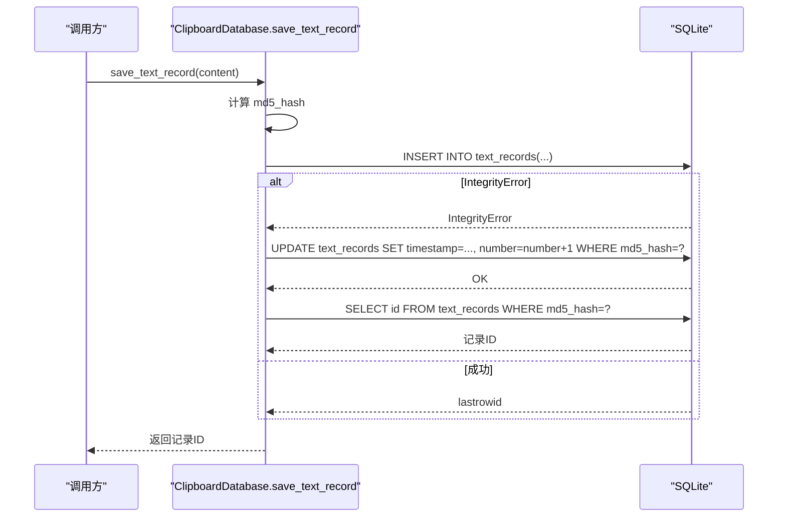
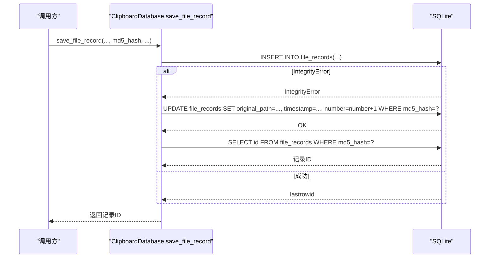
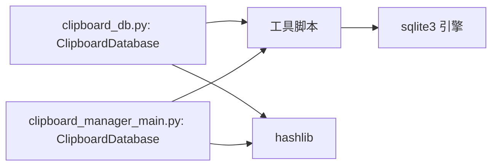

# 数据库去重实现

<cite>
**本文引用的文件**
- [clipboard_db.py](file://clipboard_db.py)
- [clipboard_manager_main.py](file://clipboard_manager_main.py)
- [check_db.py](file://check_db.py)
- [check_indexes.py](file://check_indexes.py)
- [cleanup_duplicates.py](file://cleanup_duplicates.py)
- [debug_md5.py](file://debug_md5.py)
</cite>

## 目录
1. [简介](#简介)
2. [项目结构](#项目结构)
3. [核心组件](#核心组件)
4. [架构总览](#架构总览)
5. [详细组件分析](#详细组件分析)
6. [依赖关系分析](#依赖关系分析)
7. [性能考量](#性能考量)
8. [故障排查指南](#故障排查指南)
9. [结论](#结论)
10. [附录](#附录)

## 简介
本文件系统性地文档化数据库层面的去重机制实现，聚焦于 text_records 和 file_records 表中 md5_hash 字段的唯一性约束设计与数据完整性保障。通过对初始化流程、唯一索引创建、INSERT OR IGNORE 与 IntegrityError 异常处理的“插入或更新”模式进行深入解析，阐明如何在重复 MD5 场景下避免冗余存储并保留使用频率信息（number 计数器）。同时，提供数据库模式变更历史说明，包括 ALTER TABLE 语句对既有表的兼容性处理策略。

## 项目结构
本仓库围绕剪贴板历史管理展开，数据库相关逻辑主要集中在两个模块：
- clipboard_db.py：独立的数据库管理类，负责表初始化、字段迁移、唯一索引创建、文本与文件记录的保存与查询等。
- clipboard_manager_main.py：主程序模块，包含与数据库同名的内部类 ClipboardDatabase，负责表结构定义、记录保存、查询与 GUI 集成。

图表来源
- [clipboard_db.py](file://clipboard_db.py#L1-L115)
- [clipboard_manager_main.py](file://clipboard_manager_main.py#L56-L111)
- [check_db.py](file://check_db.py#L1-L31)
- [check_indexes.py](file://check_indexes.py#L1-L27)
- [cleanup_duplicates.py](file://cleanup_duplicates.py#L1-L67)
- [debug_md5.py](file://debug_md5.py#L1-L56)

章节来源
- [clipboard_db.py](file://clipboard_db.py#L1-L115)
- [clipboard_manager_main.py](file://clipboard_manager_main.py#L56-L111)

## 核心组件
- 唯一性约束与索引
  - text_records 表：通过在初始化阶段为 md5_hash 字段创建“条件唯一索引”，确保相同内容仅存一条记录；同时为 number 字段提供默认值以支持使用频率统计。
  - file_records 表：在表定义阶段直接声明 md5_hash 字段为 UNIQUE，保证文件级去重。
- “插入或更新”模式
  - save_text_record/save_file_record 方法采用先尝试 INSERT 的策略，若因唯一约束冲突抛出 IntegrityError，则回退执行 UPDATE，更新时间戳与 number 计数器，从而实现“插入或更新”的幂等行为。
- 兼容性迁移
  - 对既有数据库，通过 ALTER TABLE 动态添加 md5_hash 与 number 字段，并用 try/except 忽略“字段已存在”的操作错误，确保升级过程平滑无中断。

章节来源
- [clipboard_db.py](file://clipboard_db.py#L23-L74)
- [clipboard_db.py](file://clipboard_db.py#L116-L183)
- [clipboard_manager_main.py](file://clipboard_manager_main.py#L66-L91)
- [clipboard_manager_main.py](file://clipboard_manager_main.py#L112-L179)

## 架构总览
下图展示数据库初始化、记录保存与查询的整体流程，突出 md5_hash 唯一性约束与“插入或更新”模式的关键节点。

图表来源
- [clipboard_db.py](file://clipboard_db.py#L116-L151)

章节来源
- [clipboard_db.py](file://clipboard_db.py#L116-L151)

## 详细组件分析

### 组件A：数据库初始化与唯一性约束设计
- text_records 表
  - 初始创建包含 content、timestamp、char_count 等字段。
  - 通过 ALTER TABLE 为 md5_hash 添加列（若不存在），并为 number 添加默认值。
  - 使用 CREATE UNIQUE INDEX idx_text_records_md5_hash ON text_records(md5_hash) WHERE md5_hash IS NOT NULL 实现“条件唯一索引”，仅对非空 md5_hash 生效，兼容历史数据。
- file_records 表
  - 在表定义阶段直接声明 md5_hash 字段为 UNIQUE，确保文件级去重。
  - 同样为 number 字段提供默认值。
- settings 表
  - 通过 INSERT OR IGNORE 插入默认设置，避免重复初始化导致的错误。

图表来源
- [clipboard_db.py](file://clipboard_db.py#L23-L74)
- [clipboard_db.py](file://clipboard_db.py#L86-L91)

章节来源
- [clipboard_db.py](file://clipboard_db.py#L23-L74)
- [clipboard_db.py](file://clipboard_db.py#L86-L91)

### 组件B：save_text_record 的“插入或更新”模式
- 流程要点
  - 计算 content 的 md5_hash。
  - 尝试 INSERT，若唯一约束冲突（IntegrityError），捕获异常并执行 UPDATE，更新 timestamp 与 number。
  - 最终返回该 md5_hash 对应的记录 ID。
- 设计优势
  - 避免重复存储相同内容，节省空间。
  - number 计数器反映使用频率，便于后续统计与排序。

图表来源
- [clipboard_db.py](file://clipboard_db.py#L116-L151)

章节来源
- [clipboard_db.py](file://clipboard_db.py#L116-L151)

### 组件C：save_file_record 的“插入或更新”模式
- 流程要点
  - 直接使用传入的 md5_hash（由外部计算）。
  - 尝试 INSERT，若唯一约束冲突（IntegrityError），捕获异常并执行 UPDATE，更新 original_path、timestamp 与 number。
  - 最终返回该 md5_hash 对应的记录 ID。
- 设计优势
  - 与文件去重策略一致，避免重复存储相同文件内容。
  - number 计数器反映使用频率。

图表来源
- [clipboard_db.py](file://clipboard_db.py#L152-L183)

章节来源
- [clipboard_db.py](file://clipboard_db.py#L152-L183)

### 组件D：数据库模式变更历史与兼容性处理
- text_records 表
  - 早期版本未包含 md5_hash 与 number 字段。
  - 升级时通过 ALTER TABLE 动态添加字段，并用 try/except 忽略“字段已存在”的 OperationalError，确保幂等升级。
  - 为 md5_hash 创建条件唯一索引，兼容历史数据。
- file_records 表
  - 早期版本未包含 md5_hash 与 number 字段。
  - 升级时通过 ALTER TABLE 动态添加 number 字段，并在表定义阶段声明 md5_hash 为 UNIQUE。
- settings 表
  - 通过 INSERT OR IGNORE 插入默认设置，避免重复初始化导致的错误。

章节来源
- [clipboard_db.py](file://clipboard_db.py#L33-L52)
- [clipboard_db.py](file://clipboard_db.py#L69-L74)
- [clipboard_db.py](file://clipboard_db.py#L86-L91)

### 组件E：索引与唯一性验证工具
- check_indexes.py
  - 查询 text_records 与 file_records 的索引名称，确认唯一索引是否存在。
- check_db.py
  - 展示最近带 MD5 的记录，以及按 MD5 分组后出现重复的记录，辅助验证去重效果。
- cleanup_duplicates.py
  - 针对历史遗留重复数据，聚合相同 MD5 的多条记录，保留最新的一条并合并 number 计数，再删除其余重复记录。
- debug_md5.py
  - 通过连续两次保存相同文本，验证去重与计数叠加的行为。

章节来源
- [check_indexes.py](file://check_indexes.py#L1-L27)
- [check_db.py](file://check_db.py#L1-L31)
- [cleanup_duplicates.py](file://cleanup_duplicates.py#L1-L67)
- [debug_md5.py](file://debug_md5.py#L1-L56)

## 依赖关系分析
- 组件耦合
  - 两个模块均包含同名的 ClipboardDatabase 类，分别承担数据库初始化与记录保存职责，彼此通过公共接口交互。
  - 工具脚本与数据库模块之间为松耦合：工具脚本直接连接数据库并执行查询，不依赖业务逻辑。
- 外部依赖
  - sqlite3：用于数据库连接、事务提交与异常处理。
  - hashlib：用于计算文本与文件的 MD5 哈希值。
- 可能的循环依赖
  - 当前结构未见循环导入；工具脚本与数据库模块通过各自文件独立存在。

图表来源
- [clipboard_db.py](file://clipboard_db.py#L1-L115)
- [clipboard_manager_main.py](file://clipboard_manager_main.py#L56-L111)
- [check_db.py](file://check_db.py#L1-L31)
- [check_indexes.py](file://check_indexes.py#L1-L27)
- [cleanup_duplicates.py](file://cleanup_duplicates.py#L1-L67)
- [debug_md5.py](file://debug_md5.py#L1-L56)

章节来源
- [clipboard_db.py](file://clipboard_db.py#L1-L115)
- [clipboard_manager_main.py](file://clipboard_manager_main.py#L56-L111)

## 性能考量
- 唯一索引与查询效率
  - text_records 的条件唯一索引可显著加速基于 md5_hash 的查找与去重判断。
  - file_records 的 UNIQUE 约束在插入时触发唯一性检查，但能避免重复存储，整体收益明显。
- UPDATE vs INSERT
  - 发生重复时，UPDATE 比 INSERT 更轻量，仅更新时间戳与计数器，避免额外写放大。
- 批量处理建议
  - 若存在大量重复数据，建议先运行 cleanup_duplicates.py 进行历史数据归并，再启用实时去重，以减少索引维护压力。
- 索引维护成本
  - 唯一索引会带来 INSERT 时的唯一性检查开销，但相较重复数据带来的存储与查询成本，收益更高。

## 故障排查指南
- 常见问题与定位
  - 插入失败且提示唯一约束冲突：检查 md5_hash 是否正确计算，或是否存在历史重复数据未清理。
  - number 计数未增长：确认异常分支是否被执行（IntegrityError），以及 UPDATE 语句是否成功。
  - 索引缺失：使用 check_indexes.py 检查索引是否存在，必要时重新初始化数据库。
- 排查步骤
  - 使用 debug_md5.py 验证相同文本多次保存后的 number 是否递增。
  - 使用 check_db.py 观察重复 MD5 的分组统计，确认去重是否生效。
  - 使用 cleanup_duplicates.py 对历史重复数据进行归并，再观察后续插入行为。
- 错误处理要点
  - IntegrityError 是预期的异常，不应视为错误；应确保 UPDATE 与 SELECT 步骤正确执行。
  - ALTER TABLE 的 try/except 仅用于兼容性迁移，不影响正常业务流程。

章节来源
- [debug_md5.py](file://debug_md5.py#L1-L56)
- [check_db.py](file://check_db.py#L1-L31)
- [check_indexes.py](file://check_indexes.py#L1-L27)
- [cleanup_duplicates.py](file://cleanup_duplicates.py#L1-L67)

## 结论
本项目通过“条件唯一索引 + INSERT OR IGNORE + IntegrityError 异常处理”的组合策略，在不破坏历史数据的前提下实现了高效的去重与使用频率统计。text_records 与 file_records 的 md5_hash 字段分别采用条件唯一索引与 UNIQUE 约束，配合 number 计数器，既避免了重复存储，又保留了使用频次信息。ALTER TABLE 的兼容性处理确保了数据库演进过程中的平滑升级。配套工具脚本进一步增强了可观测性与可维护性。

## 附录
- 关键实现路径参考
  - 初始化与唯一索引创建：[clipboard_db.py](file://clipboard_db.py#L23-L74)
  - INSERT OR IGNORE 与 IntegrityError 异常处理（文本）：[clipboard_db.py](file://clipboard_db.py#L116-L151)
  - INSERT OR IGNORE 与 IntegrityError 异常处理（文件）：[clipboard_db.py](file://clipboard_db.py#L152-L183)
  - 表定义与 UNIQUE 约束（文件）：[clipboard_manager_main.py](file://clipboard_manager_main.py#L66-L91)
  - 索引检查工具：[check_indexes.py](file://check_indexes.py#L1-L27)
  - 重复数据检查工具：[check_db.py](file://check_db.py#L1-L31)
  - 历史重复数据清理工具：[cleanup_duplicates.py](file://cleanup_duplicates.py#L1-L67)
  - 文本 MD5 调试工具：[debug_md5.py](file://debug_md5.py#L1-L56)