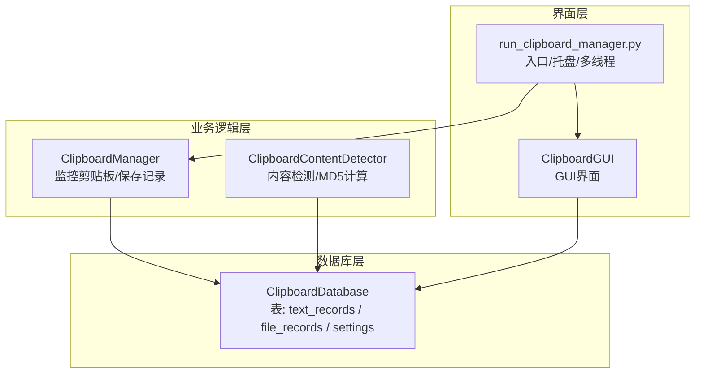
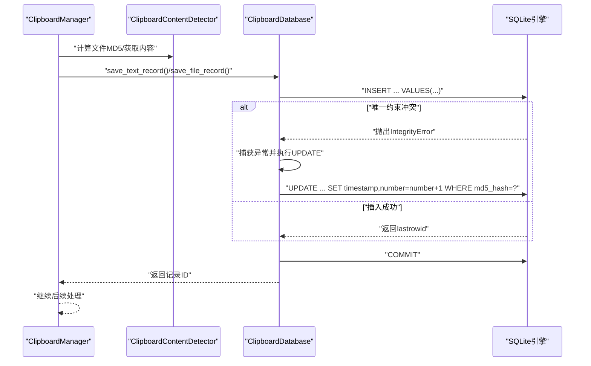
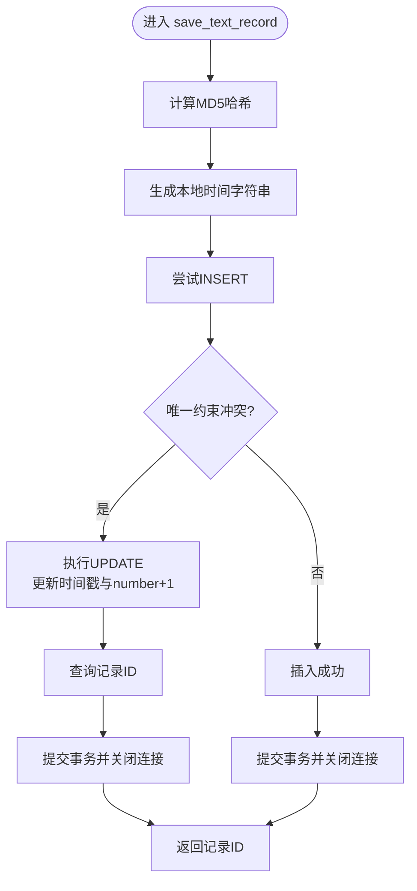
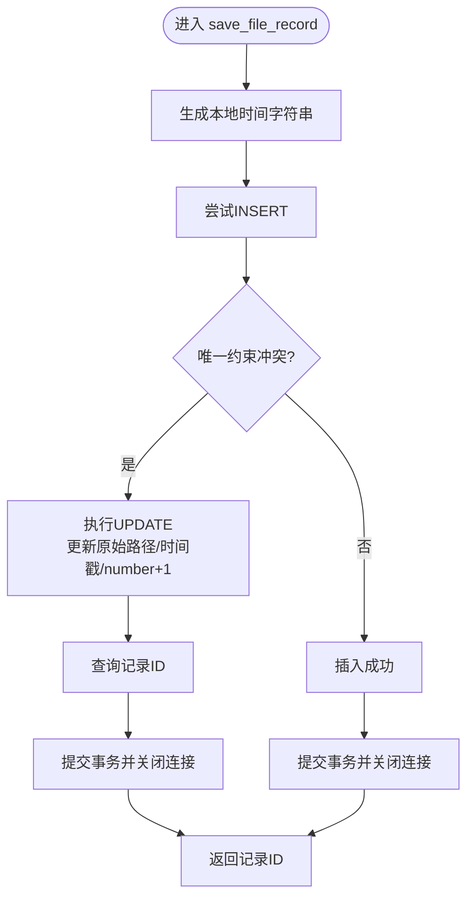
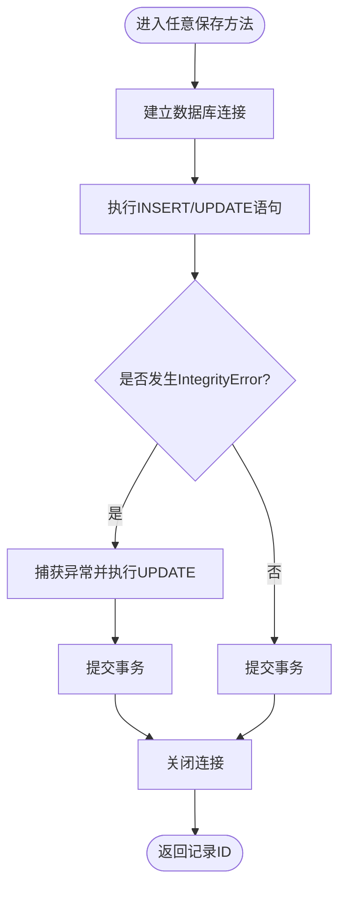
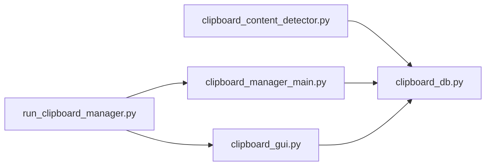
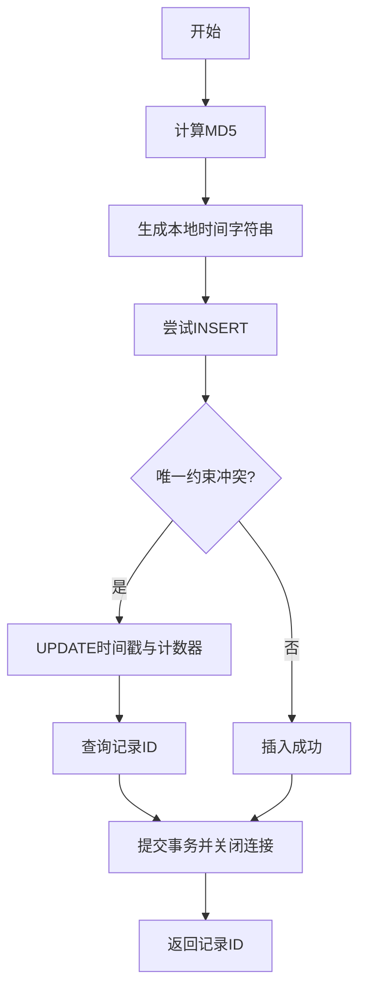

# 数据库去重操作逻辑

<cite>
**本文引用的文件**
- [clipboard_db.py](file://clipboard_db.py)
- [clipboard_manager_main.py](file://clipboard_manager_main.py)
- [clipboard_content_detector.py](file://clipboard_content_detector.py)
- [clipboard_gui.py](file://clipboard_gui.py)
- [cleanup_duplicates.py](file://cleanup_duplicates.py)
- [check_db.py](file://check_db.py)
- [run_clipboard_manager.py](file://run_clipboard_manager.py)
</cite>

## 目录
1. [简介](#简介)
2. [项目结构](#项目结构)
3. [核心组件](#核心组件)
4. [架构总览](#架构总览)
5. [详细组件分析](#详细组件分析)
6. [依赖关系分析](#依赖关系分析)
7. [性能考量](#性能考量)
8. [故障排查指南](#故障排查指南)
9. [结论](#结论)
10. [附录](#附录)

## 简介
本文件聚焦于数据库去重操作逻辑，特别是通过 save_text_record 与 save_file_record 方法实现的“插入或更新”模式。该模式利用 SQLite 的唯一约束与 IntegrityError 异常处理，实现对重复 MD5 记录的去重：首次插入时若唯一约束冲突，则捕获异常并执行 UPDATE 语句更新时间戳与使用频率计数器。同时，本文详细解释 local_time 时间戳的生成与格式化策略，并给出完整的异常处理流程图，覆盖数据库连接、事务提交与资源释放的生命周期管理。

## 项目结构
本仓库围绕剪贴板历史记录管理展开，涉及数据库层、业务逻辑层与 GUI/CLI 层：
- 数据库层：负责表结构初始化、记录保存、查询与清理等
- 业务逻辑层：负责剪贴板内容检测、MD5 计算、文件分类与保存路径生成
- GUI/CLI 层：提供图形界面与命令行入口，驱动监控与展示

图表来源
- [clipboard_db.py](file://clipboard_db.py#L1-L115)
- [clipboard_manager_main.py](file://clipboard_manager_main.py#L355-L496)
- [clipboard_content_detector.py](file://clipboard_content_detector.py#L1-L120)
- [clipboard_gui.py](file://clipboard_gui.py#L1-L120)
- [run_clipboard_manager.py](file://run_clipboard_manager.py#L1-L71)

章节来源
- [clipboard_db.py](file://clipboard_db.py#L1-L115)
- [clipboard_manager_main.py](file://clipboard_manager_main.py#L355-L496)
- [clipboard_content_detector.py](file://clipboard_content_detector.py#L1-L120)
- [clipboard_gui.py](file://clipboard_gui.py#L1-L120)
- [run_clipboard_manager.py](file://run_clipboard_manager.py#L1-L71)

## 核心组件
- ClipboardDatabase：封装数据库初始化、文本与文件记录的保存、查询、统计与清理等能力
- ClipboardManager：负责监控剪贴板变化、计算文件 MD5、分类保存文件、调用数据库保存接口
- ClipboardContentDetector：辅助检测剪贴板内容类型与格式，提供 MD5 计算工具
- ClipboardGUI：提供 GUI 界面与托盘图标，驱动数据库查询与展示
- run_clipboard_manager.py：应用入口，负责多线程监控与托盘集成

章节来源
- [clipboard_db.py](file://clipboard_db.py#L1-L115)
- [clipboard_manager_main.py](file://clipboard_manager_main.py#L355-L496)
- [clipboard_content_detector.py](file://clipboard_content_detector.py#L1-L120)
- [clipboard_gui.py](file://clipboard_gui.py#L1-L120)
- [run_clipboard_manager.py](file://run_clipboard_manager.py#L1-L71)

## 架构总览
下图展示了“插入或更新”去重模式在整体架构中的位置与调用链路。

图表来源
- [clipboard_manager_main.py](file://clipboard_manager_main.py#L419-L481)
- [clipboard_db.py](file://clipboard_db.py#L116-L183)

章节来源
- [clipboard_manager_main.py](file://clipboard_manager_main.py#L419-L481)
- [clipboard_db.py](file://clipboard_db.py#L116-L183)

## 详细组件分析

### 数据库初始化与表结构
- 文本记录表 text_records：包含内容、时间戳、字符数、MD5 唯一键与使用计数字段
- 文件记录表 file_records：包含原始路径、保存路径、文件名、大小、类型、MD5 唯一键与使用计数字段
- 设置表 settings：包含复制大小/数量限制、保存天数、开机自启、悬浮图标等配置
- 初始化阶段会为 text_records 表添加 md5_hash 字段与唯一索引，确保去重有效性

章节来源
- [clipboard_db.py](file://clipboard_db.py#L23-L115)

### save_text_record 去重逻辑
- MD5 计算：基于文本内容计算 md5_hash
- 时间戳生成：使用本地时间字符串格式 "%Y-%m-%d %H:%M:%S"
- 插入策略：尝试 INSERT，若 md5_hash 唯一约束冲突则捕获 sqlite3.IntegrityError
- 更新策略：UPDATE 对应记录的时间戳与 number 计数器，并再次查询返回记录 ID
- 事务与资源：每个操作独立开启/关闭连接，显式 commit

图表来源
- [clipboard_db.py](file://clipboard_db.py#L116-L151)

章节来源
- [clipboard_db.py](file://clipboard_db.py#L116-L151)

### save_file_record 去重逻辑
- MD5 计算：由上层传入（文件复制前已计算）
- 时间戳生成：同样使用本地时间字符串格式 "%Y-%m-%d %H:%M:%S"
- 插入策略：尝试 INSERT，若 md5_hash 唯一约束冲突则捕获 sqlite3.IntegrityError
- 更新策略：UPDATE 对应记录的原始路径、时间戳与 number 计数器，并再次查询返回记录 ID
- 事务与资源：每个操作独立开启/关闭连接，显式 commit

图表来源
- [clipboard_db.py](file://clipboard_db.py#L152-L183)

章节来源
- [clipboard_db.py](file://clipboard_db.py#L152-L183)

### 去重设计的收益与权衡
- 避免重复数据存储：通过 md5_hash 唯一约束与 INSERT OR IGNORE/异常回退，确保同一内容只保留一条记录
- 保留使用频率信息：通过 number 计数器记录重复次数，便于统计与展示
- 保持时间线连续：每次命中重复时更新时间戳，反映最新出现时间

章节来源
- [clipboard_db.py](file://clipboard_db.py#L33-L45)
- [clipboard_db.py](file://clipboard_db.py#L63-L66)
- [clipboard_db.py](file://clipboard_db.py#L116-L183)

### local_time 时间戳生成机制与格式化
- 生成方式：使用本地时间而非 UTC，格式为 "%Y-%m-%d %H:%M:%S"
- 作用：用于记录最后一次出现时间，便于排序与过期清理
- 注意：该格式为字符串，非 ISO8601，排序行为取决于字典序；如需严格排序建议统一为 ISO8601 或使用 DATETIME 列类型

章节来源
- [clipboard_db.py](file://clipboard_db.py#L124-L126)
- [clipboard_db.py](file://clipboard_db.py#L157-L159)
- [clipboard_manager_main.py](file://clipboard_manager_main.py#L418-L454)

### 异常处理流程图（含连接、事务与资源释放）

图表来源
- [clipboard_db.py](file://clipboard_db.py#L116-L183)

章节来源
- [clipboard_db.py](file://clipboard_db.py#L116-L183)

### 与剪贴板监控与保存流程的衔接
- ClipboardManager 在检测到剪贴板变化后，计算文件 MD5 并保存文件与元数据，随后调用 save_file_record
- 对于文本内容，直接调用 save_text_record
- 两者均遵循相同的去重与计数策略

章节来源
- [clipboard_manager_main.py](file://clipboard_manager_main.py#L419-L481)
- [clipboard_content_detector.py](file://clipboard_content_detector.py#L139-L142)

### 数据库一致性与清理
- cleanup_duplicates.py：扫描 text_records 中重复 MD5，合并计数并删除冗余记录
- check_db.py：检查最近带 MD5 的记录与重复 MD5 分组，辅助诊断

章节来源
- [cleanup_duplicates.py](file://cleanup_duplicates.py#L1-L67)
- [check_db.py](file://check_db.py#L1-L31)

## 依赖关系分析
- ClipboardDatabase 是核心依赖点，被 ClipboardManager、ClipboardContentDetector、ClipboardGUI 等模块调用
- run_clipboard_manager.py 作为入口，协调多线程监控与 GUI 托盘
- GUI 层通过 ClipboardDatabase 查询与展示历史记录

图表来源
- [clipboard_content_detector.py](file://clipboard_content_detector.py#L1-L120)
- [clipboard_manager_main.py](file://clipboard_manager_main.py#L355-L496)
- [clipboard_gui.py](file://clipboard_gui.py#L1-L120)
- [run_clipboard_manager.py](file://run_clipboard_manager.py#L1-L71)
- [clipboard_db.py](file://clipboard_db.py#L1-L115)

章节来源
- [clipboard_content_detector.py](file://clipboard_content_detector.py#L1-L120)
- [clipboard_manager_main.py](file://clipboard_manager_main.py#L355-L496)
- [clipboard_gui.py](file://clipboard_gui.py#L1-L120)
- [run_clipboard_manager.py](file://run_clipboard_manager.py#L1-L71)
- [clipboard_db.py](file://clipboard_db.py#L1-L115)

## 性能考量
- 唯一索引与冲突处理：text_records 的 md5_hash 唯一索引与 file_records 的 md5_hash 唯一约束保证了 O(log N) 的冲突检测成本
- UPDATE 与 SELECT：命中重复时执行 UPDATE(number+1) 与一次 SELECT 获取 ID，整体为单次写入 + 单次读取
- 事务粒度：每个保存操作独立事务，避免长事务带来的锁竞争
- 建议：若频繁重复场景，可考虑批量去重或引入内存缓存以减少重复 UPDATE 次数

[本节为通用性能讨论，无需列出具体文件来源]

## 故障排查指南
- IntegrityError 异常：确认 md5_hash 是否正确传入且未被外部修改；检查表结构是否包含 md5_hash 唯一约束
- 时间戳格式问题：若需严格排序，请统一为 ISO8601 或使用 DATETIME 列类型
- 连接泄漏：确保每个方法都显式关闭连接；如需批量操作，建议使用上下文管理器或统一事务包装
- 重复数据残留：运行 cleanup_duplicates.py 进行修复；使用 check_db.py 检查重复 MD5 分布

章节来源
- [clipboard_db.py](file://clipboard_db.py#L116-L183)
- [cleanup_duplicates.py](file://cleanup_duplicates.py#L1-L67)
- [check_db.py](file://check_db.py#L1-L31)

## 结论
通过 md5_hash 唯一约束与 INSERT OR IGNORE/异常回退的“插入或更新”模式，系统实现了高效、可靠的去重与使用频率统计。local_time 采用本地时间字符串格式，满足直观展示需求。配合独立事务与显式资源释放，整体流程清晰、可控。建议在高并发或大量重复场景下进一步优化事务粒度与索引策略，以提升吞吐量与稳定性。

[本节为总结性内容，无需列出具体文件来源]

## 附录

### 关键流程图（概念性）

[本图为概念性流程示意，不对应具体源码文件，故不附图表来源]