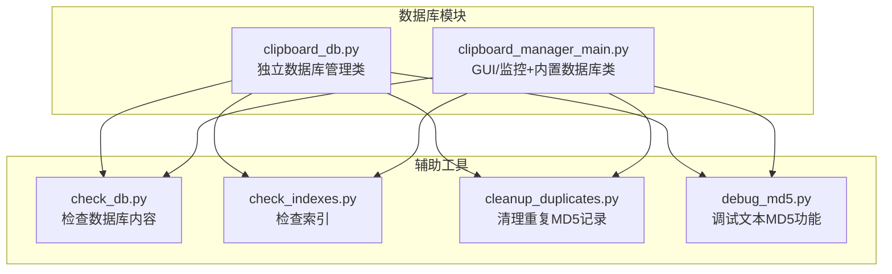
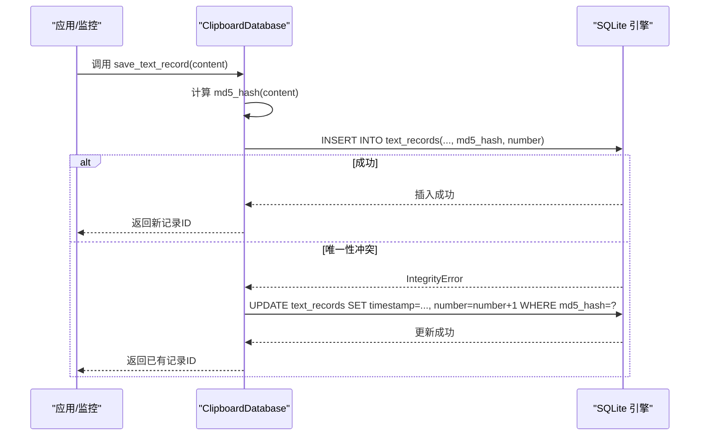
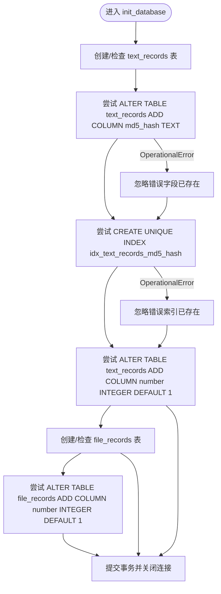
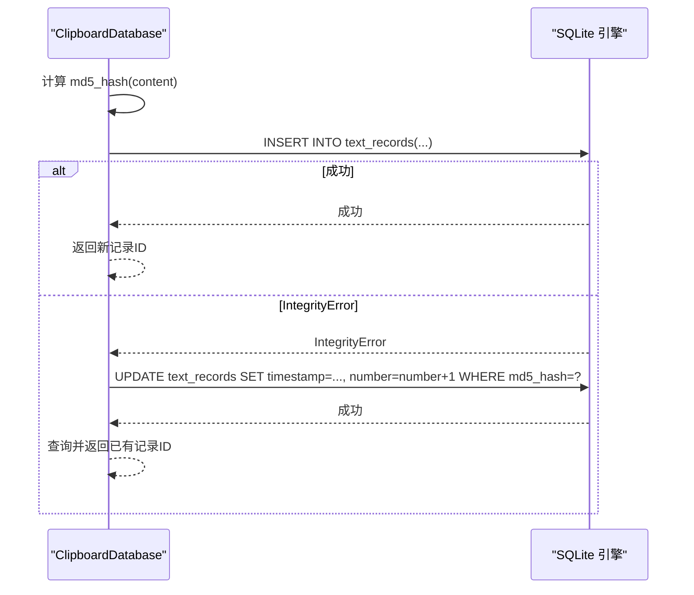
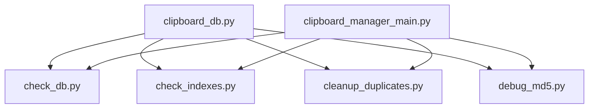
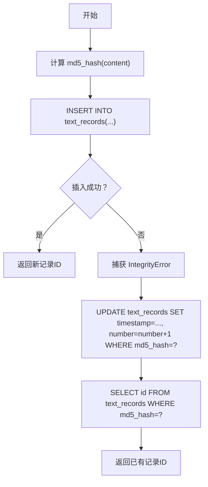

# 数据库去重约束设计

<cite>
**本文引用的文件**
- [clipboard_db.py](file://clipboard_db.py)
- [clipboard_manager_main.py](file://clipboard_manager_main.py)
- [check_db.py](file://check_db.py)
- [check_indexes.py](file://check_indexes.py)
- [cleanup_duplicates.py](file://cleanup_duplicates.py)
- [debug_md5.py](file://debug_md5.py)
</cite>

## 目录
1. [简介](#简介)
2. [项目结构](#项目结构)
3. [核心组件](#核心组件)
4. [架构总览](#架构总览)
5. [详细组件分析](#详细组件分析)
6. [依赖关系分析](#依赖关系分析)
7. [性能考量](#性能考量)
8. [故障排查指南](#故障排查指南)
9. [结论](#结论)
10. [附录](#附录)

## 简介
本文件系统性地文档化数据库去重约束的设计与实现，重点覆盖以下方面：
- text_records 和 file_records 表中 md5_hash 字段的唯一性约束实现方式
- 通过 CREATE UNIQUE INDEX 语句创建唯一索引以确保数据完整性
- 在 init_database 方法中使用 ALTER TABLE 动态向现有表添加 md5_hash 字段的兼容性处理机制，包含对 sqlite3.OperationalError 的异常捕获策略
- 该设计如何在不影响现有数据的前提下实现数据库模式的平滑升级
- 数据库模式变更的完整历史记录，包括字段添加顺序与索引创建时机

## 项目结构
本仓库围绕“剪贴板历史记录”功能展开，数据库相关逻辑主要集中在两个模块中：
- clipboard_db.py：提供独立的数据库管理类，负责数据库初始化、表结构维护、记录保存与查询等
- clipboard_manager_main.py：提供 GUI 应用与剪贴板监控，内部也包含一个 ClipboardDatabase 类，负责数据库初始化与记录操作

图表来源
- [clipboard_db.py](file://clipboard_db.py#L1-L115)
- [clipboard_manager_main.py](file://clipboard_manager_main.py#L56-L111)
- [check_db.py](file://check_db.py#L1-L31)
- [check_indexes.py](file://check_indexes.py#L1-L27)
- [cleanup_duplicates.py](file://cleanup_duplicates.py#L1-L67)
- [debug_md5.py](file://debug_md5.py#L1-L56)

章节来源
- [clipboard_db.py](file://clipboard_db.py#L1-L115)
- [clipboard_manager_main.py](file://clipboard_manager_main.py#L56-L111)

## 核心组件
- ClipboardDatabase（clipboard_db.py）：负责数据库初始化、表结构维护、记录保存与查询。其中：
  - init_database：创建/升级表结构，添加 md5_hash 字段与唯一索引，并维护 number 字段
  - save_text_record/save_file_record：插入或更新去重后的记录
- ClipboardDatabase（clipboard_manager_main.py）：提供 GUI/监控版本的数据库初始化与记录操作，表结构定义更早引入 md5_hash 字段与 UNIQUE 约束

章节来源
- [clipboard_db.py](file://clipboard_db.py#L18-L115)
- [clipboard_manager_main.py](file://clipboard_manager_main.py#L56-L111)

## 架构总览
下图展示数据库去重约束的整体工作流：应用层调用数据库接口，数据库层负责计算 md5_hash 并执行插入或更新，唯一性约束保证重复内容不被重复存储。

图表来源
- [clipboard_db.py](file://clipboard_db.py#L116-L151)
- [clipboard_manager_main.py](file://clipboard_manager_main.py#L112-L179)

## 详细组件分析

### 1) 唯一性约束与索引设计
- text_records 表
  - 字段 md5_hash 的唯一性通过“部分唯一索引”实现：CREATE UNIQUE INDEX idx_text_records_md5_hash ON text_records(md5_hash) WHERE md5_hash IS NOT NULL
  - 该设计允许 md5_hash 为空（例如旧数据迁移期间），同时对非空值强制唯一
- file_records 表
  - 字段 md5_hash 的唯一性通过列级 UNIQUE 约束实现：md5_hash TEXT UNIQUE
  - 新建表即具备唯一性约束，无需额外索引

章节来源
- [clipboard_db.py](file://clipboard_db.py#L33-L45)
- [clipboard_db.py](file://clipboard_db.py#L54-L67)
- [clipboard_manager_main.py](file://clipboard_manager_main.py#L66-L91)

### 2) 动态字段添加与兼容性处理（ALTER TABLE）
- 在 init_database 中，使用 ALTER TABLE 为现有表添加 md5_hash 字段与 number 字段
- 对 sqlite3.OperationalError 进行捕获，若字段已存在则忽略错误，从而实现幂等式升级
- number 字段用于记录重复次数，避免重复内容多次入库

图表来源
- [clipboard_db.py](file://clipboard_db.py#L18-L115)

章节来源
- [clipboard_db.py](file://clipboard_db.py#L18-L115)

### 3) 插入与更新的去重逻辑
- 计算 content 的 md5_hash
- 尝试插入；若 IntegrityError（唯一性冲突），则更新已有记录的时间戳与计数字段 number
- 通过 number 字段实现“去重计数”，避免重复内容多次入库

图表来源
- [clipboard_db.py](file://clipboard_db.py#L116-L151)
- [clipboard_manager_main.py](file://clipboard_manager_main.py#L112-L179)

章节来源
- [clipboard_db.py](file://clipboard_db.py#L116-L151)
- [clipboard_manager_main.py](file://clipboard_manager_main.py#L112-L179)

### 4) 数据库模式变更历史与时机
- 初始版本（GUI/监控内置数据库类）：在 init_database 中直接定义 text_records 与 file_records 的列，包含 md5_hash 与 number，并在列上声明 UNIQUE
- 独立数据库模块（clipboard_db.py）：先创建基础表结构，再通过 ALTER TABLE 动态添加 md5_hash 与 number 字段；随后为 text_records 创建部分唯一索引；file_records 在创建时即具备 UNIQUE 约束
- 该差异体现了两种演进路径：直接在建表时声明约束 vs. 通过 ALTER TABLE 逐步增强

章节来源
- [clipboard_manager_main.py](file://clipboard_manager_main.py#L66-L91)
- [clipboard_db.py](file://clipboard_db.py#L18-L67)

### 5) 工具脚本与验证
- check_db.py：查询最近带 MD5 的记录与重复 MD5 分组，用于快速验证去重效果
- check_indexes.py：列出 text_records 与 file_records 的索引，确认唯一索引是否存在
- cleanup_duplicates.py：扫描重复 MD5 并合并计数、删除冗余记录，用于修复历史数据
- debug_md5.py：演示相同文本多次保存时的行为，验证 number 字段递增与唯一性约束

章节来源
- [check_db.py](file://check_db.py#L1-L31)
- [check_indexes.py](file://check_indexes.py#L1-L27)
- [cleanup_duplicates.py](file://cleanup_duplicates.py#L1-L67)
- [debug_md5.py](file://debug_md5.py#L1-L56)

## 依赖关系分析
- clipboard_db.py 作为独立模块，被多个工具脚本直接导入使用，形成“数据库管理 + 辅助工具”的组合
- clipboard_manager_main.py 内部同样提供 ClipboardDatabase 类，但其初始化逻辑与 clipboard_db.py 存在差异，体现了两种不同的演进策略

图表来源
- [clipboard_db.py](file://clipboard_db.py#L1-L115)
- [clipboard_manager_main.py](file://clipboard_manager_main.py#L56-L111)
- [check_db.py](file://check_db.py#L1-L31)
- [check_indexes.py](file://check_indexes.py#L1-L27)
- [cleanup_duplicates.py](file://cleanup_duplicates.py#L1-L67)
- [debug_md5.py](file://debug_md5.py#L1-L56)

## 性能考量
- 唯一性约束与索引
  - text_records 使用部分唯一索引，可有效避免重复内容入库，且对 NULL 值不参与唯一性判断，利于历史数据迁移
  - file_records 使用列级 UNIQUE，建表即具备约束，查询与写入性能稳定
- 写入路径优化
  - 采用 INSERT/ON CONFLICT 或 IntegrityError 回退的更新策略，减少不必要的写放大
  - number 字段的计数更新避免了重复内容的物理存储，降低存储与索引维护成本
- 查询路径
  - 通过 WHERE md5_hash=? 的条件查询，结合唯一索引，可快速定位重复记录并执行计数更新

[本节为通用性能讨论，不直接分析具体文件]

## 故障排查指南
- 唯一性冲突（IntegrityError）
  - 现象：插入失败并抛出 IntegrityError
  - 处理：回退到更新已有记录的时间戳与计数字段 number
  - 参考路径：[clipboard_db.py](file://clipboard_db.py#L137-L150)、[clipboard_manager_main.py](file://clipboard_manager_main.py#L133-L179)
- 字段已存在导致的 OperationalError
  - 现象：ALTER TABLE 时字段已存在触发 OperationalError
  - 处理：捕获异常并忽略，保证幂等式升级
  - 参考路径：[clipboard_db.py](file://clipboard_db.py#L33-L45)、[clipboard_db.py](file://clipboard_db.py#L47-L74)
- 索引已存在导致的 OperationalError
  - 现象：CREATE UNIQUE INDEX 时索引已存在触发 OperationalError
  - 处理：捕获异常并忽略，保证幂等式升级
  - 参考路径：[clipboard_db.py](file://clipboard_db.py#L41-L45)
- 历史数据重复
  - 现象：旧数据中存在重复 MD5
  - 处理：使用 cleanup_duplicates.py 合并计数并删除冗余记录
  - 参考路径：[cleanup_duplicates.py](file://cleanup_duplicates.py#L1-L67)
- 验证唯一性
  - 使用 check_db.py 检查重复 MD5 分组
  - 使用 check_indexes.py 检查唯一索引是否存在
  - 参考路径：[check_db.py](file://check_db.py#L1-L31)、[check_indexes.py](file://check_indexes.py#L1-L27)

章节来源
- [clipboard_db.py](file://clipboard_db.py#L33-L45)
- [clipboard_db.py](file://clipboard_db.py#L116-L151)
- [clipboard_manager_main.py](file://clipboard_manager_main.py#L112-L179)
- [cleanup_duplicates.py](file://cleanup_duplicates.py#L1-L67)
- [check_db.py](file://check_db.py#L1-L31)
- [check_indexes.py](file://check_indexes.py#L1-L27)

## 结论
本设计通过“部分唯一索引 + 动态 ALTER TABLE + IntegrityError 回退”的组合，实现了对 text_records 与 file_records 表中 md5_hash 字段的去重约束：
- 通过 CREATE UNIQUE INDEX 与列级 UNIQUE 约束确保数据完整性
- 通过 ALTER TABLE 与异常捕获实现对既有表的平滑升级，兼容历史数据
- 通过 number 字段实现“去重计数”，避免重复内容的物理存储
- 工具脚本提供了完善的验证与修复能力，保障系统长期稳定运行

[本节为总结性内容，不直接分析具体文件]

## 附录

### A. 数据库模式变更历史（对比）
- GUI/监控内置数据库类（clipboard_manager_main.py）
  - 初始化阶段直接在建表语句中声明 md5_hash 与 number，并在列上声明 UNIQUE
  - 优点：一次性到位，约束明确
  - 缺点：无法对既有表进行增量升级
- 独立数据库模块（clipboard_db.py）
  - 先创建基础表结构，再通过 ALTER TABLE 动态添加 md5_hash 与 number 字段
  - 为 text_records 创建部分唯一索引，file_records 在创建时即具备 UNIQUE 约束
  - 优点：兼容历史数据，支持平滑升级
  - 缺点：需要多步迁移与幂等处理

章节来源
- [clipboard_manager_main.py](file://clipboard_manager_main.py#L66-L91)
- [clipboard_db.py](file://clipboard_db.py#L18-L67)

### B. 关键流程图（算法实现）
- 去重插入流程（文本记录）

图表来源
- [clipboard_db.py](file://clipboard_db.py#L116-L151)

章节来源
- [clipboard_db.py](file://clipboard_db.py#L116-L151)