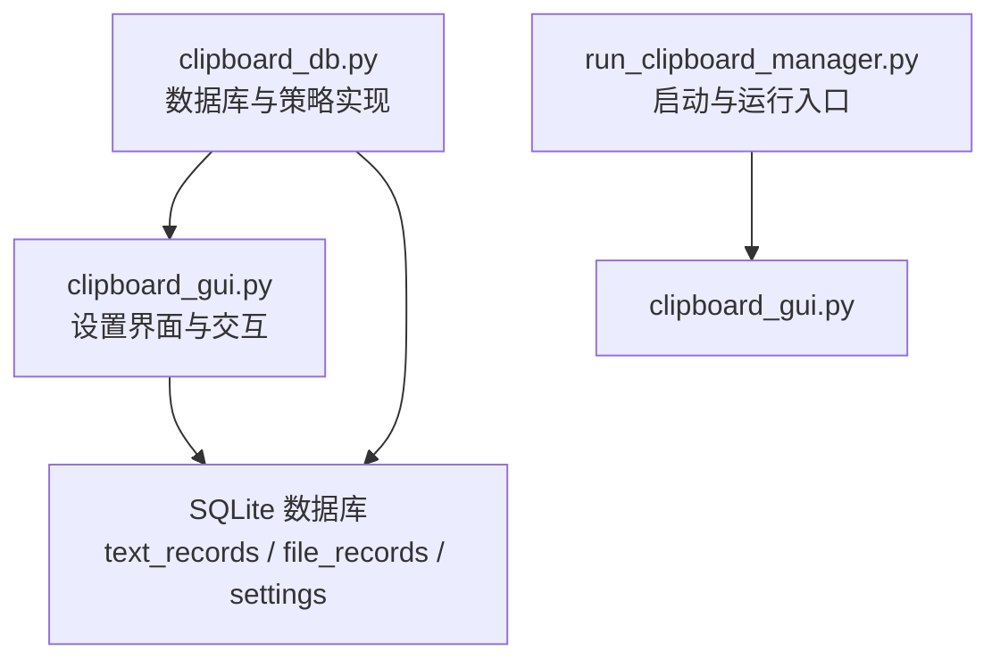
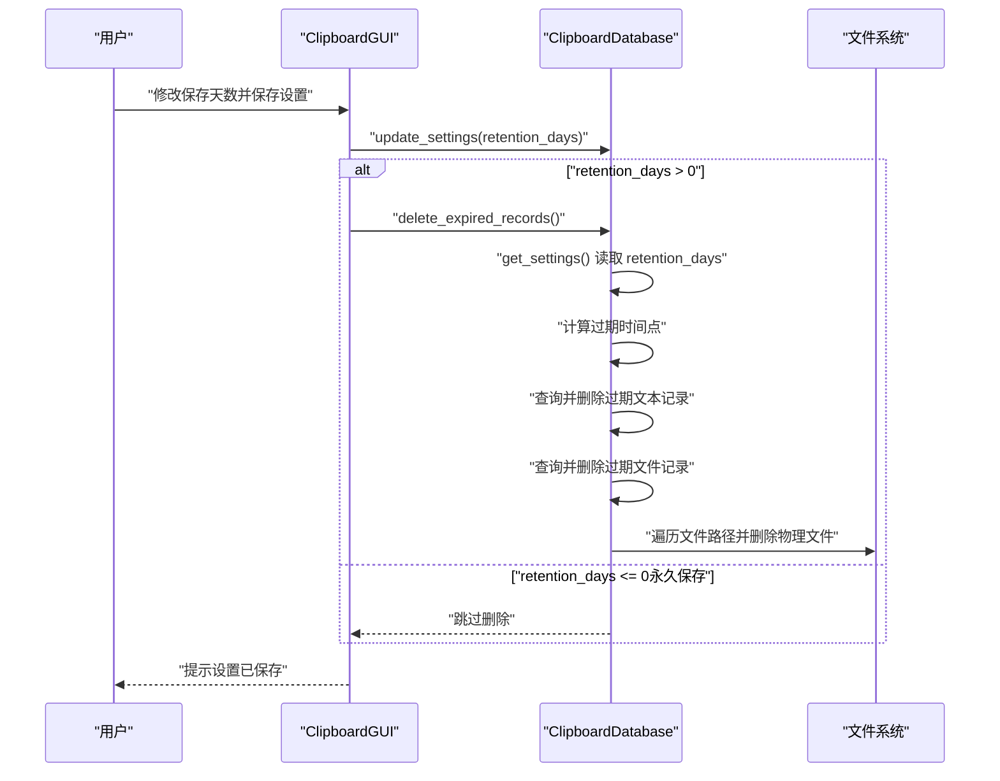
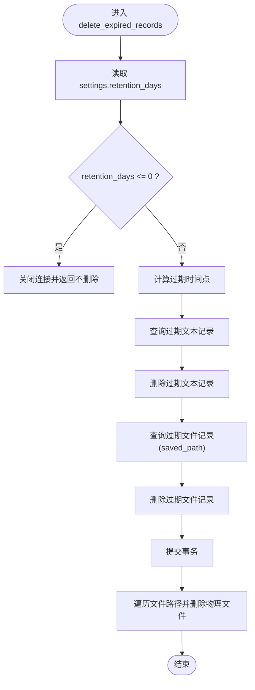
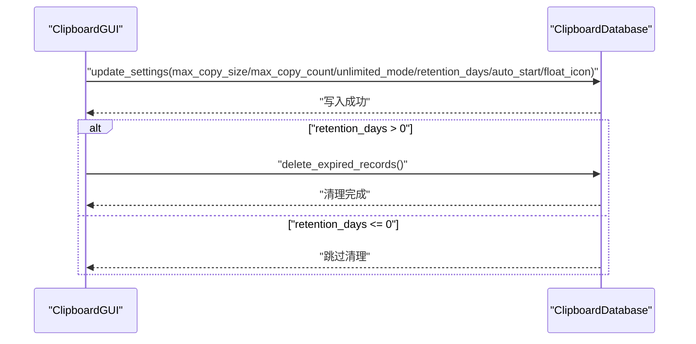
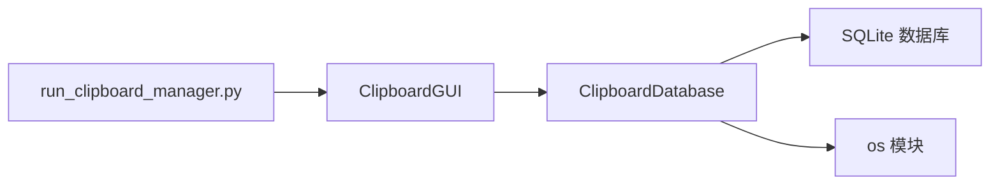

# 数据保留策略

<cite>
**本文引用的文件**
- [clipboard_db.py](file://clipboard_db.py)
- [clipboard_gui.py](file://clipboard_gui.py)
- [run_clipboard_manager.py](file://run_clipboard_manager.py)
</cite>

## 目录
1. [简介](#简介)
2. [项目结构](#项目结构)
3. [核心组件](#核心组件)
4. [架构总览](#架构总览)
5. [详细组件分析](#详细组件分析)
6. [依赖关系分析](#依赖关系分析)
7. [性能考量](#性能考量)
8. [故障排查指南](#故障排查指南)
9. [结论](#结论)
10. [附录](#附录)

## 简介
本文件聚焦于数据保留策略的实现与使用，围绕 delete_expired_records 方法展开，详细说明其如何通过 get_settings 获取 retention_days 设置值，并据此计算过期时间点，随后删除过期的文本与文件记录。特别强调文件记录删除时，不仅要从数据库中移除条目，还需调用操作系统接口删除对应物理文件，确保磁盘空间被正确释放。同时，文档解释了 retention_days 为 0（永久保存）时的特殊处理逻辑，以及该功能与系统设置的集成方式，包括通过 update_settings 修改保留策略。最后，提供不同配置下的行为示例，帮助读者理解在各种场景下的预期表现。

## 项目结构
本仓库与“数据保留策略”直接相关的文件主要集中在以下两个模块：
- 数据库与策略实现：clipboard_db.py
- 用户界面与设置交互：clipboard_gui.py
- 启动与运行入口：run_clipboard_manager.py

图表来源
- [clipboard_db.py](file://clipboard_db.py#L77-L112)
- [clipboard_gui.py](file://clipboard_gui.py#L367-L520)
- [run_clipboard_manager.py](file://run_clipboard_manager.py#L32-L66)

章节来源
- [clipboard_db.py](file://clipboard_db.py#L77-L112)
- [clipboard_gui.py](file://clipboard_gui.py#L367-L520)
- [run_clipboard_manager.py](file://run_clipboard_manager.py#L32-L66)

## 核心组件
- 数据库层（ClipboardDatabase）
  - 提供 get_settings、update_settings、delete_expired_records 等方法，负责与 SQLite 数据库交互。
  - settings 表包含 retention_days 字段，用于控制数据保留天数。
- GUI 层（ClipboardGUI）
  - 提供设置界面，允许用户选择“永久保存”或“自定义天数”，并在保存设置后调用 update_settings 更新数据库，并在必要时触发 delete_expired_records。
- 启动入口（run_clipboard_manager.py）
  - 启动 GUI 并在后台运行剪贴板监控线程，为保留策略的触发提供运行环境。

章节来源
- [clipboard_db.py](file://clipboard_db.py#L359-L412)
- [clipboard_gui.py](file://clipboard_gui.py#L367-L520)
- [run_clipboard_manager.py](file://run_clipboard_manager.py#L32-L66)

## 架构总览
下图展示了“数据保留策略”的端到端流程：用户在界面设置保留天数，保存后调用数据库更新方法，若启用非永久保存，则立即执行删除过期记录；该过程涉及数据库查询、删除与文件系统操作。

图表来源
- [clipboard_gui.py](file://clipboard_gui.py#L485-L520)
- [clipboard_db.py](file://clipboard_db.py#L359-L412)
- [clipboard_db.py](file://clipboard_db.py#L413-L455)

## 详细组件分析

### delete_expired_records 实现机制
- 获取设置
  - 通过 get_settings 读取 settings 表中的 retention_days。
- 过期时间计算
  - 基于当前时间减去 retention_days 天，得到过期时间点。
- 删除过期记录
  - 先查询并删除过期的文本记录（text_records），再查询并删除过期的文件记录（file_records）。
- 物理文件清理
  - 对于文件记录，除了删除数据库条目外，还遍历文件路径并调用操作系统接口删除对应物理文件，确保磁盘空间释放。
- 特殊情况处理
  - 当 retention_days <= 0 时，不执行任何删除操作，表示永久保存。

图表来源
- [clipboard_db.py](file://clipboard_db.py#L413-L455)

章节来源
- [clipboard_db.py](file://clipboard_db.py#L413-L455)

### get_settings 与 update_settings 的集成
- get_settings
  - 从 settings 表读取 max_copy_size、max_copy_count、unlimited_mode、retention_days、auto_start、float_icon 等字段，作为系统运行与保留策略的依据。
- update_settings
  - 支持批量更新上述字段，其中 retention_days 控制保留策略生效与否及过期时间计算。
- GUI 集成
  - 界面提供“永久保存”和“自定义天数”两种模式，保存时将用户选择转换为 retention_days 并调用 update_settings。
  - 若用户选择了自定义天数且大于 0，则在保存设置后立即调用 delete_expired_records，确保即时清理。

图表来源
- [clipboard_gui.py](file://clipboard_gui.py#L485-L520)
- [clipboard_db.py](file://clipboard_db.py#L359-L412)

章节来源
- [clipboard_gui.py](file://clipboard_gui.py#L485-L520)
- [clipboard_db.py](file://clipboard_db.py#L359-L412)

### 文件记录删除的双重保障
- 数据库层面
  - 删除 file_records 中 timestamp 早于过期时间的记录。
- 文件系统层面
  - 从数据库查询 saved_path 列表，逐个判断文件是否存在并删除，避免残留占用磁盘空间。
- 异常处理
  - 删除物理文件时捕获异常并打印错误信息，不影响整体流程继续执行。

章节来源
- [clipboard_db.py](file://clipboard_db.py#L438-L455)

### 与系统设置的集成方式
- settings 表结构演进
  - 初始包含 max_copy_size、max_copy_count、unlimited_mode 字段；
  - 后续通过迁移逻辑新增 retention_days、auto_start、float_icon 字段，兼容旧版本数据。
- 默认值
  - retention_days 默认为 0，表示永久保存；
  - auto_start、float_icon 默认为 1（开启）或 False（未开启），具体取决于字段类型与默认值设计。
- 运行入口
  - run_clipboard_manager.py 启动 GUI 并在后台运行剪贴板监控线程，为保留策略的触发提供运行环境。

章节来源
- [clipboard_db.py](file://clipboard_db.py#L77-L112)
- [run_clipboard_manager.py](file://run_clipboard_manager.py#L32-L66)

## 依赖关系分析
- 组件耦合
  - ClipboardGUI 依赖 ClipboardDatabase 的 update_settings 与 delete_expired_records；
  - ClipboardDatabase 依赖 SQLite 存储与 Python 标准库 os 模块进行文件删除。
- 外部依赖
  - Windows 平台注册表（开机自启）与系统托盘（GUI 显示）由 run_clipboard_manager.py 与 clipboard_gui.py 协作实现。

图表来源
- [clipboard_gui.py](file://clipboard_gui.py#L485-L520)
- [clipboard_db.py](file://clipboard_db.py#L359-L455)
- [run_clipboard_manager.py](file://run_clipboard_manager.py#L32-L66)

章节来源
- [clipboard_gui.py](file://clipboard_gui.py#L485-L520)
- [clipboard_db.py](file://clipboard_db.py#L359-L455)
- [run_clipboard_manager.py](file://run_clipboard_manager.py#L32-L66)

## 性能考量
- 查询与删除
  - 过期记录删除涉及两次查询（文本与文件）与两次删除（文本与文件），建议在数据量较大时分批处理或在低峰时段执行，避免对前台 GUI 造成卡顿。
- 文件系统操作
  - 删除大量文件时，I/O 成本较高，应尽量避免频繁触发清理；可通过合理设置 retention_days 减少清理频率。
- 索引与字段
  - settings 表的 id 字段为主键，查询效率高；若后续扩展更多筛选条件，可考虑为 timestamp 字段建立索引以优化过期查询。

## 故障排查指南
- 无法删除文件
  - 现象：数据库记录已删除但磁盘仍有文件残留。
  - 排查：确认 delete_expired_records 是否被调用（retention_days > 0 时会自动调用）；检查 saved_path 是否有效且文件存在；查看删除过程中是否抛出异常。
- 设置未生效
  - 现象：修改保存天数后未触发清理。
  - 排查：确认 update_settings 是否被调用；确认 GUI 在保存设置后是否调用了 delete_expired_records；检查 retention_days 是否为 0（永久保存）。
- 数据库迁移问题
  - 现象：旧版本数据库缺少 retention_days 字段导致读取失败。
  - 排查：确认 init_database 中的 ALTER TABLE 逻辑是否执行；若手动迁移，请确保字段存在且默认值为 0。

章节来源
- [clipboard_db.py](file://clipboard_db.py#L413-L455)
- [clipboard_gui.py](file://clipboard_gui.py#L485-L520)

## 结论
数据保留策略通过 settings 表中的 retention_days 字段与 delete_expired_records 方法协同工作，实现了基于时间的自动化清理。其设计兼顾了数据库与文件系统的完整性：既保证数据库记录的清理，也确保物理文件被彻底删除，从而有效释放磁盘空间。通过 GUI 的直观设置与即时清理机制，用户可以灵活地控制数据保留周期，满足不同场景下的存储需求。

## 附录

### 不同配置下的行为示例
- 配置：retention_days = 0（永久保存）
  - 行为：不执行任何删除操作，数据库与文件系统均保持不变。
- 配置：retention_days = N（N > 0）
  - 行为：计算过期时间点，删除早于该时间的文本与文件记录；对文件记录，同步删除对应的物理文件。
- 配置：用户在界面选择“永久保存”
  - 行为：update_settings 写入 retention_days = 0；不触发 delete_expired_records。
- 配置：用户在界面选择“自定义天数 = M（M > 0）”
  - 行为：update_settings 写入 retention_days = M；随后立即调用 delete_expired_records 执行清理。

章节来源
- [clipboard_gui.py](file://clipboard_gui.py#L485-L520)
- [clipboard_db.py](file://clipboard_db.py#L359-L455)