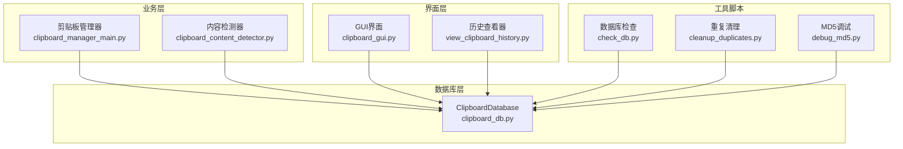
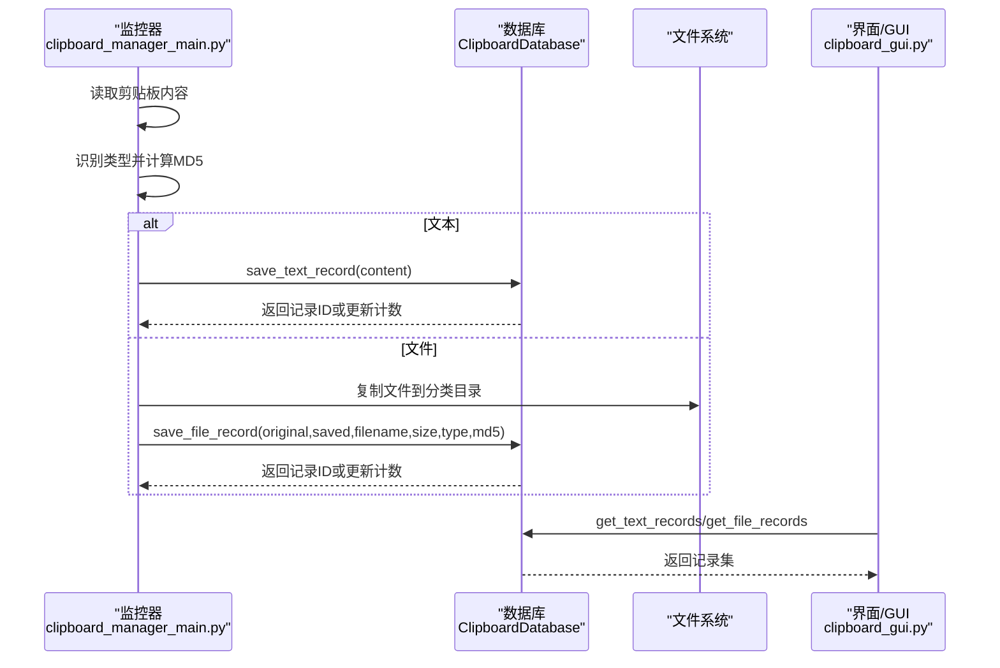
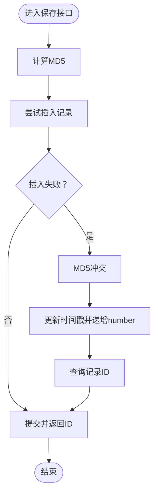
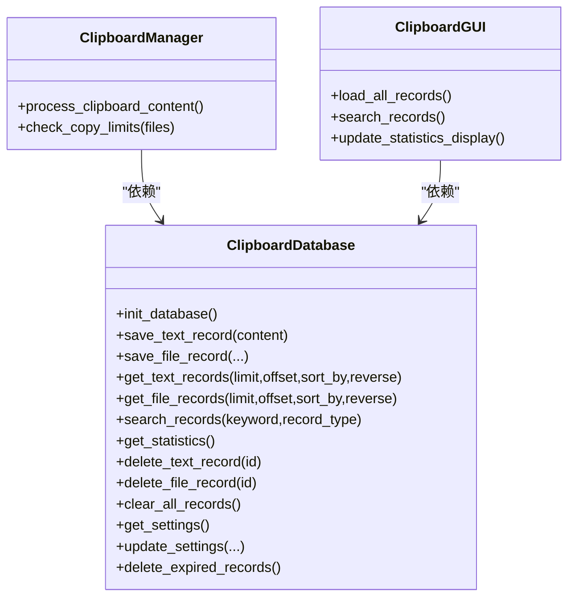

# 数据存储

<cite>
**本文引用的文件**
- [clipboard_db.py](file://clipboard_db.py)
- [clipboard_manager_main.py](file://clipboard_manager_main.py)
- [clipboard_gui.py](file://clipboard_gui.py)
- [view_clipboard_history.py](file://view_clipboard_history.py)
- [clipboard_content_detector.py](file://clipboard_content_detector.py)
- [check_db.py](file://check_db.py)
- [cleanup_duplicates.py](file://cleanup_duplicates.py)
- [debug_md5.py](file://debug_md5.py)
</cite>

## 目录
1. [简介](#简介)
2. [项目结构](#项目结构)
3. [核心组件](#核心组件)
4. [架构总览](#架构总览)
5. [详细组件分析](#详细组件分析)
6. [依赖关系分析](#依赖关系分析)
7. [性能考量](#性能考量)
8. [故障排查指南](#故障排查指南)
9. [结论](#结论)
10. [附录](#附录)

## 简介
本文件面向“剪贴板数据存储机制”的全面文档化，重点围绕 clipboard_db.py 中的 ClipboardDatabase 类展开，覆盖以下主题：
- text_records 与 file_records 两张核心表的结构设计与字段语义
- 数据库初始化流程 init_database 的建表与索引策略
- 保存接口 save_text_record 与 save_file_record 的事务与去重机制（基于 MD5）
- 查询接口 get_text_records 与 get_file_records 的分页与排序实现
- 元信息采集策略（时间戳、字符数、文件大小等）
- 实际代码示例（以路径形式给出，避免直接粘贴代码）
- 数据库连接管理最佳实践与并发访问注意事项

## 项目结构
该项目采用“模块化+入口脚本”的组织方式：
- 数据库层：clipboard_db.py 提供 SQLite 数据库封装与 CRUD 接口
- 业务层：clipboard_manager_main.py 负责剪贴板监控、内容识别与入库
- GUI 层：clipboard_gui.py 提供图形界面与交互
- 辅助工具：view_clipboard_history.py、check_db.py、cleanup_duplicates.py、debug_md5.py 等用于查看、调试与维护

图表来源
- [clipboard_db.py](file://clipboard_db.py#L1-L455)
- [clipboard_manager_main.py](file://clipboard_manager_main.py#L1-L761)
- [clipboard_gui.py](file://clipboard_gui.py#L1-L800)
- [view_clipboard_history.py](file://view_clipboard_history.py#L1-L75)
- [clipboard_content_detector.py](file://clipboard_content_detector.py#L1-L274)
- [check_db.py](file://check_db.py#L1-L31)
- [cleanup_duplicates.py](file://cleanup_duplicates.py#L1-L67)
- [debug_md5.py](file://debug_md5.py#L1-L56)

章节来源
- [clipboard_db.py](file://clipboard_db.py#L1-L115)
- [clipboard_manager_main.py](file://clipboard_manager_main.py#L1-L120)
- [clipboard_gui.py](file://clipboard_gui.py#L1-L120)
- [view_clipboard_history.py](file://view_clipboard_history.py#L1-L30)

## 核心组件
- ClipboardDatabase：封装 SQLite 数据库的初始化、增删改查、统计与过期清理等能力
- 剪贴板管理器 ClipboardManager：负责监控剪贴板变化、识别内容类型、计算 MD5、落库与文件复制
- GUI 界面 ClipboardGUI：提供记录浏览、搜索、统计与设置管理
- 历史查看器 view_clipboard_history.py：命令行查看最近记录与统计
- 调试与维护脚本：check_db.py、cleanup_duplicates.py、debug_md5.py

章节来源
- [clipboard_db.py](file://clipboard_db.py#L1-L455)
- [clipboard_manager_main.py](file://clipboard_manager_main.py#L355-L761)
- [clipboard_gui.py](file://clipboard_gui.py#L1-L200)
- [view_clipboard_history.py](file://view_clipboard_history.py#L1-L75)

## 架构总览
整体数据流如下：
- 剪贴板监控器读取剪贴板内容（文本或文件列表）
- 识别内容类型并计算 MD5（文本/文件）
- 将内容写入数据库（text_records 或 file_records），若 MD5 已存在则更新计数
- GUI/命令行工具读取数据库并展示记录，支持搜索、排序与统计

图表来源
- [clipboard_manager_main.py](file://clipboard_manager_main.py#L395-L496)
- [clipboard_db.py](file://clipboard_db.py#L116-L184)
- [clipboard_gui.py](file://clipboard_gui.py#L581-L626)

## 详细组件分析

### ClipboardDatabase 类与表结构设计
- text_records 表
  - 字段：id（主键）、content（文本内容）、timestamp（时间戳，默认当前时间）、char_count（字符数）、md5_hash（文本MD5，唯一性约束）、number（出现次数，默认1）
  - 设计要点：通过 md5_hash 去重，number 字段用于统计重复次数；char_count 便于排序与统计
- file_records 表
  - 字段：id（主键）、original_path（原始路径）、saved_path（保存路径）、filename（文件名）、file_size（文件大小）、file_type（类型）、md5_hash（文件MD5，唯一性约束）、timestamp（时间戳，默认当前时间）、number（出现次数，默认1）
  - 设计要点：md5_hash 唯一约束保证文件去重；number 字段用于统计重复次数
- settings 表
  - 字段：id（主键且校验为1）、max_copy_size（最大复制大小，字节）、max_copy_count（最大复制文件数）、unlimited_mode（无限模式）、retention_days（保留天数）、auto_start（开机自启）、float_icon（悬浮图标）
  - 设计要点：统一配置项集中管理，支持运行时动态调整

章节来源
- [clipboard_db.py](file://clipboard_db.py#L23-L115)

### 数据库初始化流程 init_database
- 功能：创建 text_records、file_records、settings 三张表
- 索引与约束：
  - text_records：新增 md5_hash 列并建立唯一索引（WHERE md5_hash IS NOT NULL），避免重复文本
  - file_records：md5_hash 建立唯一约束
  - settings：id 唯一且固定为 1
- 升级兼容：通过 ALTER TABLE 为既有表添加 number、retention_days、auto_start、float_icon 等字段，捕获异常避免重复执行报错

章节来源
- [clipboard_db.py](file://clipboard_db.py#L18-L115)

### 保存接口：save_text_record 与 save_file_record 的事务与去重
- 事务模型：每个保存操作在独立连接上执行，先插入后提交，失败则回滚
- 去重策略：
  - 文本：计算 content 的 MD5，若冲突则更新 timestamp 并递增 number
  - 文件：使用文件 MD5 唯一性约束，冲突则更新 original_path 与 timestamp 并递增 number
- 时间戳：均使用本地时间字符串（YYYY-MM-DD HH:MM:SS）

图表来源
- [clipboard_db.py](file://clipboard_db.py#L116-L184)

章节来源
- [clipboard_db.py](file://clipboard_db.py#L116-L184)

### 查询接口：get_text_records 与 get_file_records 的分页与排序
- 分页：支持 limit 与 offset 参数，未传入 limit 时返回全量记录
- 排序：支持按 content、char_count、number、timestamp（默认）等字段排序；支持正序/倒序
- 文件记录：支持按 filename、file_size、file_type、number、timestamp 排序

章节来源
- [clipboard_db.py](file://clipboard_db.py#L185-L261)

### 元信息采集策略
- 文本记录
  - char_count：基于 content 的字符数（UTF-8 编码长度）
  - timestamp：本地时间字符串
  - md5_hash：content 的 MD5
  - number：重复次数
- 文件记录
  - file_size：通过 os.path.getsize 获取
  - file_type：基于扩展名分类（如 images、videos、pdf 等）
  - md5_hash：文件内容的 MD5
  - timestamp：本地时间字符串
  - number：重复次数

章节来源
- [clipboard_manager_main.py](file://clipboard_manager_main.py#L24-L55)
- [clipboard_manager_main.py](file://clipboard_manager_main.py#L395-L496)
- [clipboard_db.py](file://clipboard_db.py#L116-L184)

### 实际代码示例（以路径形式）
- 插入文本记录
  - [save_text_record 调用示例](file://clipboard_manager_main.py#L470-L482)
  - [save_text_record 方法实现](file://clipboard_db.py#L116-L151)
- 插入文件记录
  - [save_file_record 调用示例](file://clipboard_manager_main.py#L446-L454)
  - [save_file_record 方法实现](file://clipboard_db.py#L152-L184)
- 查询文本记录（含分页与排序）
  - [get_text_records 调用示例](file://clipboard_gui.py#L595-L596)
  - [get_text_records 方法实现](file://clipboard_db.py#L185-L221)
- 查询文件记录（含分页与排序）
  - [get_file_records 调用示例](file://clipboard_gui.py#L596-L596)
  - [get_file_records 方法实现](file://clipboard_db.py#L223-L261)
- 删除记录
  - [delete_text_record 方法实现](file://clipboard_db.py#L334-L341)
  - [delete_file_record 方法实现](file://clipboard_db.py#L342-L349)
- 清空所有记录
  - [clear_all_records 方法实现](file://clipboard_db.py#L350-L358)
- 搜索记录
  - [search_records 方法实现](file://clipboard_db.py#L281-L315)
- 统计信息
  - [get_statistics 方法实现](file://clipboard_db.py#L316-L333)
- 过期清理
  - [delete_expired_records 方法实现](file://clipboard_db.py#L413-L455)

章节来源
- [clipboard_manager_main.py](file://clipboard_manager_main.py#L446-L482)
- [clipboard_db.py](file://clipboard_db.py#L116-L184)
- [clipboard_gui.py](file://clipboard_gui.py#L581-L626)

### 数据库连接管理最佳实践与并发访问
- 连接策略
  - 每次操作使用独立连接，避免跨线程共享连接导致的竞态
  - 操作完成后及时关闭连接，减少句柄占用
- 事务与一致性
  - 插入失败（MD5 冲突）时回滚并走更新分支，确保原子性
  - 批量操作建议使用事务包裹（当前实现为单条操作，可在批量场景中扩展）
- 并发访问
  - SQLite 在写入时会加锁，多线程高并发写入可能产生阻塞
  - 建议：
    - 控制写入频率（监控器默认 1 秒检查一次）
    - 使用唯一性约束（md5_hash）避免重复写入
    - 对高频读取场景可考虑只读连接或缓存热点数据
- 错误处理
  - 捕获 IntegrityError（唯一约束冲突）与 OperationalError（DDL 变更兼容性）
  - 文件删除异常（过期清理）需捕获并记录，不影响主流程

章节来源
- [clipboard_db.py](file://clipboard_db.py#L18-L115)
- [clipboard_db.py](file://clipboard_db.py#L116-L184)
- [clipboard_db.py](file://clipboard_db.py#L413-L455)

## 依赖关系分析

图表来源
- [clipboard_db.py](file://clipboard_db.py#L1-L455)
- [clipboard_manager_main.py](file://clipboard_manager_main.py#L355-L761)
- [clipboard_gui.py](file://clipboard_gui.py#L581-L748)

章节来源
- [clipboard_db.py](file://clipboard_db.py#L1-L455)
- [clipboard_manager_main.py](file://clipboard_manager_main.py#L355-L761)
- [clipboard_gui.py](file://clipboard_gui.py#L581-L748)

## 性能考量
- 唯一性约束与索引
  - text_records 的 md5_hash 唯一索引与 file_records 的 md5_hash 唯一约束有效降低重复写入成本
- 排序与分页
  - 当前实现为内存内排序（GUI 搜索结果），建议在大数据量时考虑数据库侧排序与 LIMIT/OFFSET
- IO 优化
  - 文件复制与 MD5 计算为 CPU 密集型，建议在批量场景中合并处理
- 连接池
  - SQLite 不适合高并发连接池，建议保持“短连接”策略并控制写入频率

[本节为通用指导，不直接分析具体文件]

## 故障排查指南
- MD5 去重无效
  - 检查 md5_hash 是否正确计算与入库
  - 参考：[debug_md5.py](file://debug_md5.py#L1-L56)
- 重复记录未合并
  - 检查 number 字段是否递增
  - 参考：[cleanup_duplicates.py](file://cleanup_duplicates.py#L1-L67)
- 数据库损坏或字段缺失
  - 使用初始化流程自动修复（ALTER TABLE 添加缺失字段）
  - 参考：[init_database](file://clipboard_db.py#L18-L115)
- 过期清理未生效
  - 检查 retention_days 设置与过期日期计算
  - 参考：[delete_expired_records](file://clipboard_db.py#L413-L455)
- 数据库内容核对
  - 使用检查脚本查看最近带 MD5 的记录
  - 参考：[check_db.py](file://check_db.py#L1-L31)

章节来源
- [debug_md5.py](file://debug_md5.py#L1-L56)
- [cleanup_duplicates.py](file://cleanup_duplicates.py#L1-L67)
- [clipboard_db.py](file://clipboard_db.py#L18-L115)
- [clipboard_db.py](file://clipboard_db.py#L413-L455)
- [check_db.py](file://check_db.py#L1-L31)

## 结论
ClipboardDatabase 通过 md5_hash 唯一性约束实现了高效的去重与计数统计，结合 settings 表提供了灵活的配置能力。文本与文件两类记录分别承载不同元信息，满足日常剪贴板历史管理需求。建议在高并发场景下控制写入频率、使用唯一约束避免重复、并对大数据量的排序与分页进行数据库侧优化。

[本节为总结性内容，不直接分析具体文件]

## 附录

### 关键接口一览（路径）
- 初始化与建表：[init_database](file://clipboard_db.py#L18-L115)
- 文本保存与去重：[save_text_record](file://clipboard_db.py#L116-L151)
- 文件保存与去重：[save_file_record](file://clipboard_db.py#L152-L184)
- 文本查询（分页/排序）：[get_text_records](file://clipboard_db.py#L185-L221)
- 文件查询（分页/排序）：[get_file_records](file://clipboard_db.py#L223-L261)
- 搜索与统计：[search_records](file://clipboard_db.py#L281-L315)、[get_statistics](file://clipboard_db.py#L316-L333)
- 删除与清空：[delete_text_record](file://clipboard_db.py#L334-L341)、[delete_file_record](file://clipboard_db.py#L342-L349)、[clear_all_records](file://clipboard_db.py#L350-L358)
- 设置读取与更新：[get_settings](file://clipboard_db.py#L359-L386)、[update_settings](file://clipboard_db.py#L387-L412)
- 过期清理：[delete_expired_records](file://clipboard_db.py#L413-L455)

[本节为索引性内容，不直接分析具体文件]