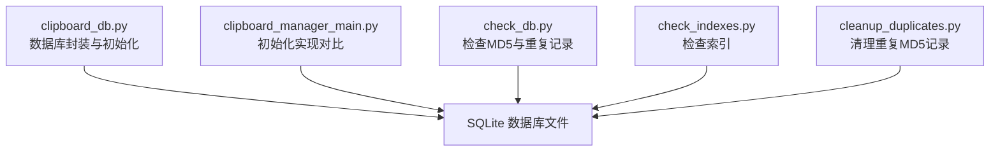
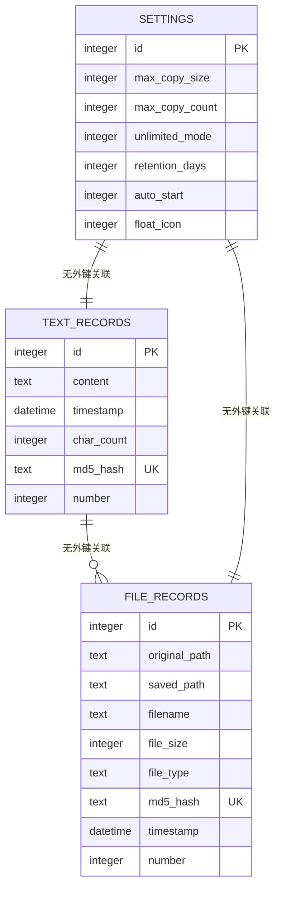
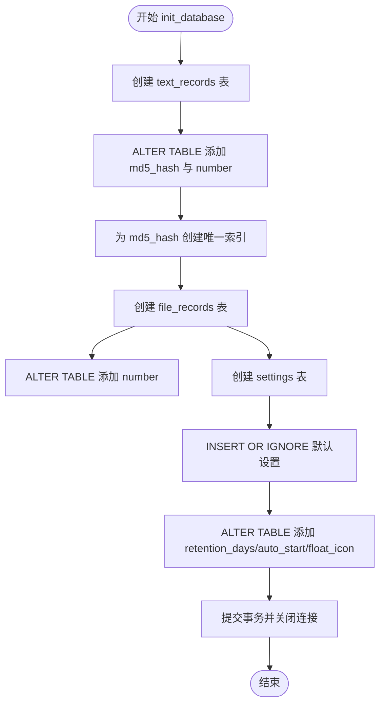
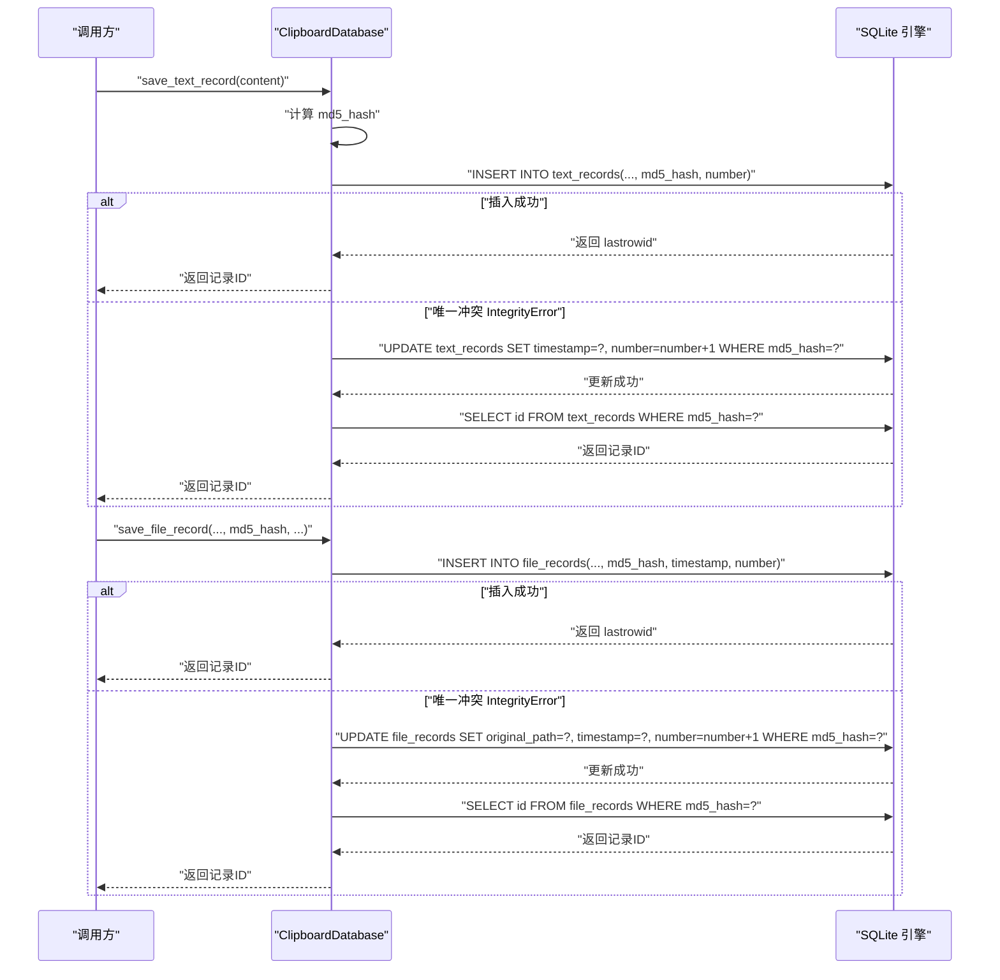
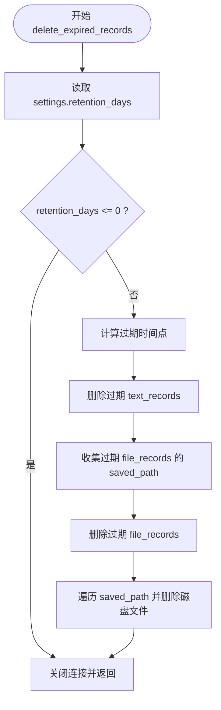
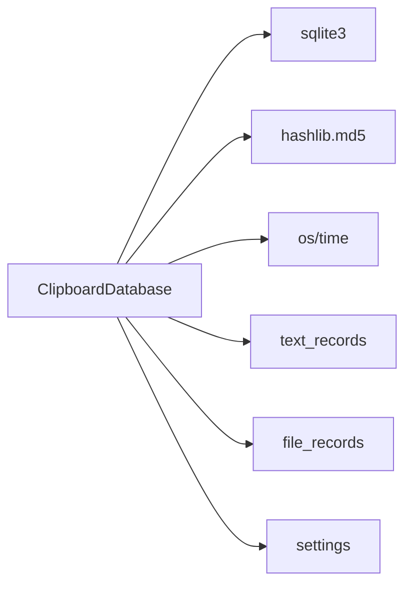

# 数据库模式

<cite>
**本文引用的文件**
- [clipboard_db.py](file://clipboard_db.py)
- [clipboard_manager_main.py](file://clipboard_manager_main.py)
- [check_db.py](file://check_db.py)
- [check_indexes.py](file://check_indexes.py)
- [cleanup_duplicates.py](file://cleanup_duplicates.py)
</cite>

## 目录
1. [简介](#简介)
2. [项目结构](#项目结构)
3. [核心组件](#核心组件)
4. [架构总览](#架构总览)
5. [详细组件分析](#详细组件分析)
6. [依赖分析](#依赖分析)
7. [性能考虑](#性能考虑)
8. [故障排查指南](#故障排查指南)
9. [结论](#结论)

## 简介
本文件系统性梳理剪贴板历史管理系统的数据库模式，聚焦于 ClipboardDatabase 类所维护的三张核心表：text_records、file_records 和 settings。文档详细说明每张表的字段结构、业务含义与约束，解释 md5_hash 字段在去重与引用计数中的作用，并给出数据库初始化流程中表创建与字段迁移的实现细节，以及各表之间的关系与索引策略。

## 项目结构
数据库相关的核心逻辑集中在两个模块：
- clipboard_db.py：提供 SQLite 数据库封装与 CRUD 能力，负责表初始化、字段迁移、数据写入与查询等。
- clipboard_manager_main.py：提供另一个数据库初始化实现（用于对比与兼容），并在其中定义了基础字段结构与默认值。

此外，仓库还提供了若干辅助脚本用于检查数据库状态与索引情况：
- check_db.py：检查 text_records 表中带 MD5 的记录与重复 MD5。
- check_indexes.py：列出 text_records 与 file_records 的索引。
- cleanup_duplicates.py：清理 text_records 中重复 MD5 的冗余记录。

图表来源
- [clipboard_db.py](file://clipboard_db.py#L18-L115)
- [clipboard_manager_main.py](file://clipboard_manager_main.py#L61-L110)
- [check_db.py](file://check_db.py#L1-L31)
- [check_indexes.py](file://check_indexes.py#L1-L27)
- [cleanup_duplicates.py](file://cleanup_duplicates.py#L1-L67)

章节来源
- [clipboard_db.py](file://clipboard_db.py#L18-L115)
- [clipboard_manager_main.py](file://clipboard_manager_main.py#L61-L110)
- [check_db.py](file://check_db.py#L1-L31)
- [check_indexes.py](file://check_indexes.py#L1-L27)
- [cleanup_duplicates.py](file://cleanup_duplicates.py#L1-L67)

## 核心组件
- ClipboardDatabase：封装数据库连接、表初始化、字段迁移、插入/更新/查询、统计与过期清理等能力。
- 辅助脚本：check_db.py、check_indexes.py、cleanup_duplicates.py 用于诊断与维护数据库状态。

章节来源
- [clipboard_db.py](file://clipboard_db.py#L13-L115)
- [clipboard_manager_main.py](file://clipboard_manager_main.py#L56-L110)
- [check_db.py](file://check_db.py#L1-L31)
- [check_indexes.py](file://check_indexes.py#L1-L27)
- [cleanup_duplicates.py](file://cleanup_duplicates.py#L1-L67)

## 架构总览
下图展示三张核心表的结构与关系，以及关键字段的作用与约束。

图表来源
- [clipboard_db.py](file://clipboard_db.py#L23-L67)
- [clipboard_db.py](file://clipboard_db.py#L76-L111)
- [clipboard_manager_main.py](file://clipboard_manager_main.py#L66-L91)

## 详细组件分析

### 表：text_records（文本记录）
- 字段定义与用途
  - id：主键，自增，唯一标识每条文本记录。
  - content：文本内容，非空。
  - timestamp：时间戳，默认当前时间；用于排序与过期清理。
  - char_count：字符数，用于统计与排序。
  - md5_hash：文本内容的 MD5 哈希，唯一索引（见后文），用于去重与快速匹配。
  - number：引用计数，默认 1，当检测到相同 MD5 的内容时递增，避免重复存储。

- 唯一性与索引
  - md5_hash 字段在初始化时创建唯一索引（仅对非空值生效），确保相同内容不会重复入库。
  - 另有基于 WHERE 条件的唯一索引策略，避免 NULL 值干扰唯一性约束。

- 写入与更新逻辑
  - 插入失败（唯一冲突）时，按 MD5 定位记录并更新 timestamp 与 number，实现“去重+计数”。
  - 采用本地时间字符串而非 UTC，便于用户侧直观查看。

- 查询与排序
  - 支持按 content、char_count、number 或 timestamp 排序，可限制返回条数与偏移量。

- 初始化与字段迁移
  - 初始表结构包含 id、content、timestamp、char_count。
  - 通过 ALTER TABLE 动态添加 md5_hash 与 number 字段，并创建唯一索引，保证向后兼容与平滑升级。

章节来源
- [clipboard_db.py](file://clipboard_db.py#L23-L67)
- [clipboard_db.py](file://clipboard_db.py#L116-L151)
- [clipboard_db.py](file://clipboard_db.py#L185-L221)
- [check_db.py](file://check_db.py#L1-L31)
- [check_indexes.py](file://check_indexes.py#L1-L27)
- [cleanup_duplicates.py](file://cleanup_duplicates.py#L1-L67)

### 表：file_records（文件记录）
- 字段定义与用途
  - id：主键，自增，唯一标识每条文件记录。
  - original_path：原始路径，记录剪贴板中文件的原始来源路径。
  - saved_path：保存路径，实际落盘后的文件路径（含唯一文件名）。
  - filename：文件名，便于检索与展示。
  - file_size：文件大小（字节），用于统计与限制校验。
  - file_type：文件类型分类，便于筛选与归档。
  - md5_hash：文件内容的 MD5 哈希，唯一约束，用于去重与快速匹配。
  - timestamp：时间戳，默认当前时间；用于排序与过期清理。
  - number：引用计数，默认 1，当检测到相同 MD5 的文件时递增。

- 唯一性与索引
  - md5_hash 字段具备唯一约束，确保相同内容的文件不会重复入库。
  - 未显式创建额外索引，但可通过 filename、file_type、timestamp 等字段在查询时建立合适索引以优化性能。

- 写入与更新逻辑
  - 插入失败（唯一冲突）时，按 MD5 定位记录并更新 original_path、timestamp 与 number，实现“去重+计数”。

- 查询与排序
  - 支持按 filename、file_size、file_type、number 或 timestamp 排序，可限制返回条数与偏移量。

- 初始化与字段迁移
  - 初始表结构包含 id、original_path、saved_path、filename、file_size、file_type、md5_hash、timestamp。
  - 通过 ALTER TABLE 动态添加 number 字段，保证向后兼容与平滑升级。

章节来源
- [clipboard_db.py](file://clipboard_db.py#L54-L67)
- [clipboard_db.py](file://clipboard_db.py#L152-L184)
- [clipboard_db.py](file://clipboard_db.py#L223-L261)

### 表：settings（系统设置）
- 字段定义与业务含义
  - id：主键，固定为 1 的约束，确保整库仅有一组设置。
  - max_copy_size：最大复制大小（字节），默认 300MB；用于限制单次复制的总大小与单个文件大小。
  - max_copy_count：最大复制数量，默认 100；用于限制一次复制的文件数量。
  - unlimited_mode：无限制模式，0 表示受限，1 表示不限制；影响复制行为与限制检查。
  - retention_days：保留天数，默认 0（永久保存）；用于过期清理策略。
  - auto_start：开机自启，默认 1；用于 GUI 应用的启动策略。
  - float_icon：悬浮图标，默认 1；用于 GUI 图标的可见性控制。

- 初始化与默认值
  - 初始化时插入 id=1 的默认设置，后续通过 UPDATE 逐项修改。

- 过期清理
  - 当 retention_days > 0 时，按设定天数删除过期记录，并同步删除磁盘上的对应文件。

章节来源
- [clipboard_db.py](file://clipboard_db.py#L76-L111)
- [clipboard_db.py](file://clipboard_db.py#L359-L412)
- [clipboard_db.py](file://clipboard_db.py#L413-L455)

### 关系与约束
- 主键
  - text_records.id、file_records.id、settings.id 均为主键。
- 外键
  - 三张表之间无外键关联，彼此独立。
- 唯一性
  - text_records.md5_hash 与 file_records.md5_hash 均具唯一约束或唯一索引，用于去重。
- 约束条件
  - settings.id 固定为 1 的 CHECK 约束，保证设置表的唯一性。

章节来源
- [clipboard_db.py](file://clipboard_db.py#L23-L67)
- [clipboard_db.py](file://clipboard_db.py#L76-L111)

### 数据库初始化流程（init_database）
- 流程概览
  - 连接数据库，依次创建三张表。
  - 对已有表通过 ALTER TABLE 动态添加新字段，以支持版本升级。
  - 为 text_records 的 md5_hash 字段创建唯一索引，确保去重。
  - settings 表插入默认值，若已存在则忽略（INSERT OR IGNORE）。

- 关键步骤
  - 创建 text_records：初始包含 id、content、timestamp、char_count；随后添加 md5_hash 与 number。
  - 创建 file_records：初始包含 id、original_path、saved_path、filename、file_size、file_type、md5_hash、timestamp；随后添加 number。
  - 创建 settings：包含 id、max_copy_size、max_copy_count、unlimited_mode；随后添加 retention_days、auto_start、float_icon。
  - 为 text_records.md5_hash 创建唯一索引（WHERE md5_hash IS NOT NULL）。

- 版本升级策略
  - 使用 try-except 包裹 ALTER TABLE 语句，捕获“字段已存在”的异常并忽略，确保多次初始化的安全性。
  - 通过 INSERT OR IGNORE 保证默认设置的幂等性。

图表来源
- [clipboard_db.py](file://clipboard_db.py#L18-L115)

章节来源
- [clipboard_db.py](file://clipboard_db.py#L18-L115)

### 写入与去重流程（序列图）
以下序列图展示文本记录与文件记录的写入与去重逻辑，体现 md5_hash 的作用与 number 的递增机制。

图表来源
- [clipboard_db.py](file://clipboard_db.py#L116-L184)

章节来源
- [clipboard_db.py](file://clipboard_db.py#L116-L184)

### 过期清理流程（流程图）

图表来源
- [clipboard_db.py](file://clipboard_db.py#L413-L455)

章节来源
- [clipboard_db.py](file://clipboard_db.py#L413-L455)

## 依赖分析
- 组件耦合
  - ClipboardDatabase 与 SQLite 引擎强耦合，负责所有 DDL/DML 操作。
  - 三个表之间无外键依赖，逻辑上相互独立，降低耦合度。
- 外部依赖
  - Python sqlite3 标准库。
  - hashlib 用于 MD5 计算。
  - os 与 time 用于文件与时间处理。
- 潜在风险
  - ALTER TABLE 的幂等性通过异常捕获保障，但仍需注意不同版本初始化顺序差异。
  - md5_hash 唯一性依赖于正确计算与存储，需确保编码一致（UTF-8）。

图表来源
- [clipboard_db.py](file://clipboard_db.py#L1-L115)

章节来源
- [clipboard_db.py](file://clipboard_db.py#L1-L115)

## 性能考虑
- 唯一性索引
  - text_records.md5_hash 的唯一索引显著提升去重效率，建议保持该索引。
- 查询优化
  - 常用查询字段（如 filename、file_type、timestamp）可考虑建立索引以加速搜索与排序。
- IO 与磁盘
  - file_records 保存路径与文件大小用于过期清理与统计，建议定期维护索引与目录结构。
- 写入吞吐
  - number 字段的递增更新为 O(1) 操作，整体写入路径简单高效。

[本节为通用性能建议，无需特定文件来源]

## 故障排查指南
- 检查重复 MD5
  - 使用 check_db.py 查询最近带 MD5 的记录与重复 MD5 分组，定位去重问题。
- 检查索引
  - 使用 check_indexes.py 列出 text_records 与 file_records 的索引，确认 md5_hash 索引是否存在。
- 清理重复记录
  - 使用 cleanup_duplicates.py 对 text_records 的重复 MD5 进行合并与计数重算，避免冗余。
- 初始化异常
  - 若 ALTER TABLE 报错，确认字段是否已存在；代码已通过异常捕获保证幂等。

章节来源
- [check_db.py](file://check_db.py#L1-L31)
- [check_indexes.py](file://check_indexes.py#L1-L27)
- [cleanup_duplicates.py](file://cleanup_duplicates.py#L1-L67)
- [clipboard_db.py](file://clipboard_db.py#L33-L111)

## 结论
本数据库模式围绕去重与引用计数设计，通过 md5_hash 字段实现文本与文件内容的唯一性约束，并以 number 字段记录重复次数，兼顾存储效率与查询便捷性。初始化流程采用幂等的 ALTER TABLE 与唯一索引策略，确保版本演进的稳定性。配合 settings 表的配置项，系统实现了灵活的复制限制与过期清理策略。建议在高频查询字段上补充索引，并定期执行重复清理脚本以维持数据库健康状态。