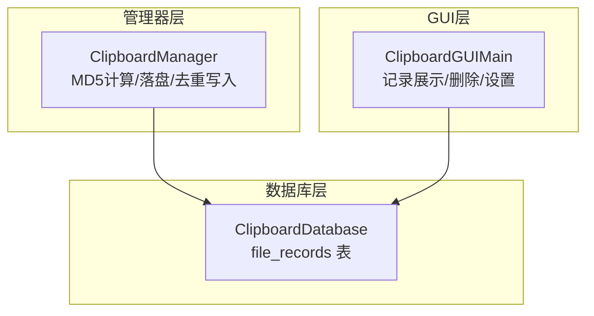
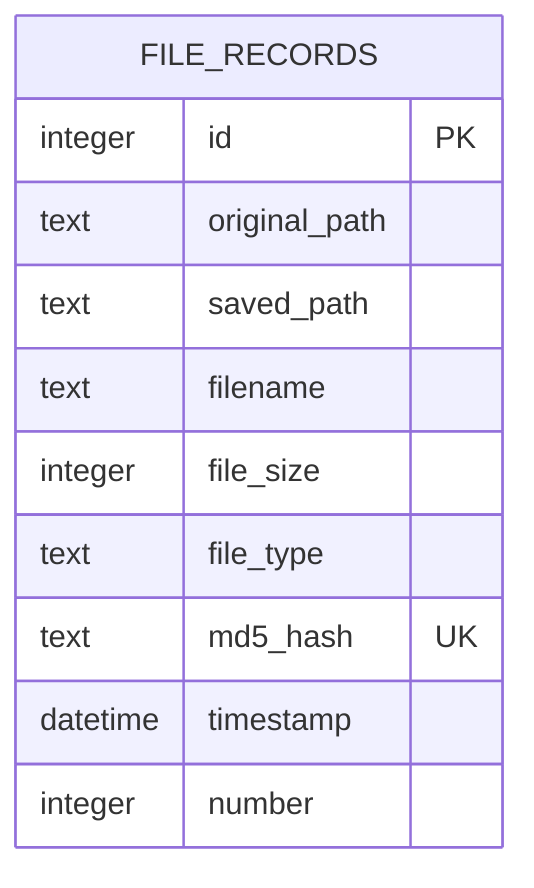
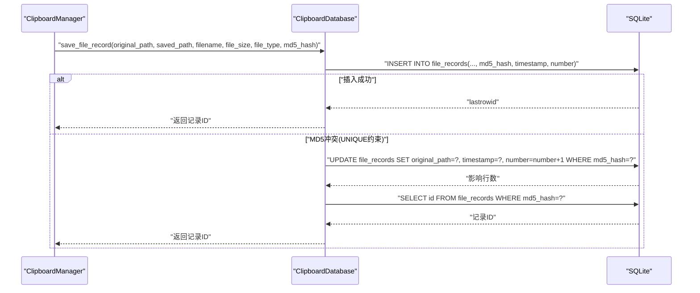
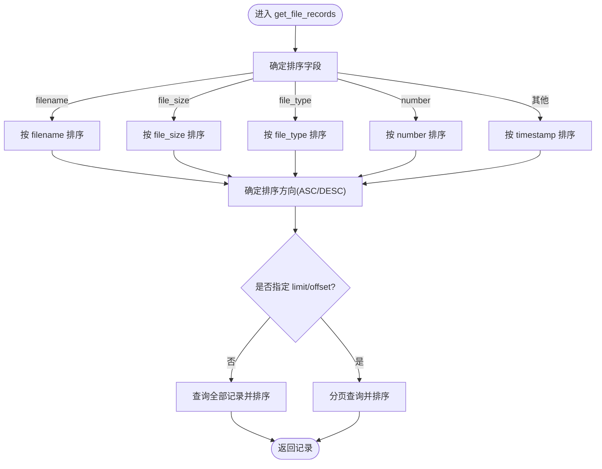
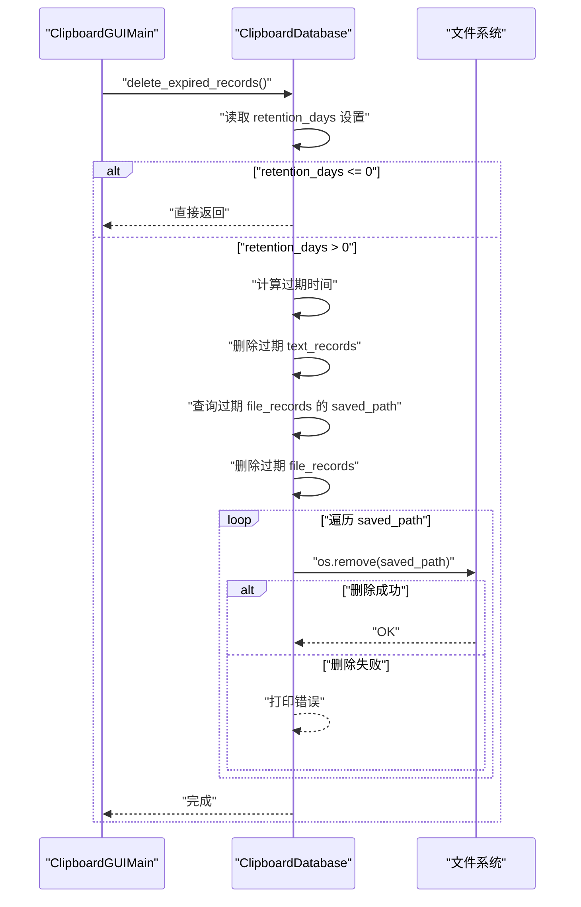
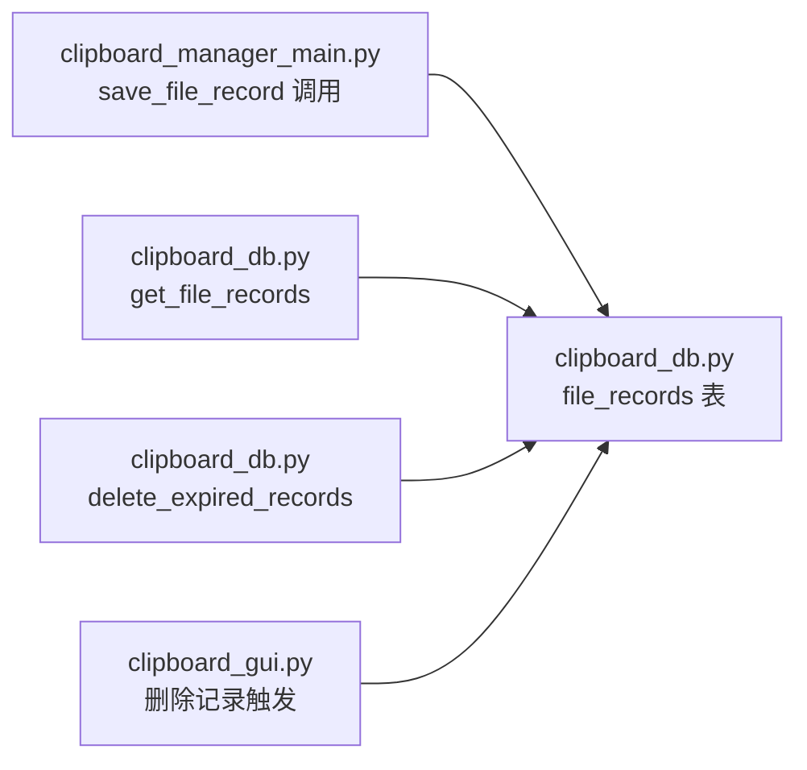

# 文件记录表

<cite>
**本文引用的文件**
- [clipboard_db.py](file://clipboard_db.py)
- [clipboard_manager_main.py](file://clipboard_manager_main.py)
- [clipboard_gui.py](file://clipboard_gui.py)
</cite>

## 目录
1. [简介](#简介)
2. [项目结构](#项目结构)
3. [核心组件](#核心组件)
4. [架构总览](#架构总览)
5. [详细组件分析](#详细组件分析)
6. [依赖关系分析](#依赖关系分析)
7. [性能考量](#性能考量)
8. [故障排查指南](#故障排查指南)
9. [结论](#结论)

## 简介
本文件聚焦于数据库中 file_records 表的设计与实现，系统性阐述其字段语义、建表流程、迁移策略、插入去重逻辑、排序查询能力、删除行为以及过期清理时的物理文件回收机制。目标是帮助读者快速理解该表如何支撑“避免重复保存相同内容文件”的核心需求，并掌握其在系统中的关键作用。

## 项目结构
- 数据库层：负责数据库初始化、表结构维护、CRUD 操作、统计与清理。
- 管理器层：负责剪贴板内容检测、文件 MD5 计算、文件落盘与去重写入。
- GUI 层：提供用户交互，展示文件记录并支持删除等操作。

图表来源
- [clipboard_db.py](file://clipboard_db.py#L54-L91)
- [clipboard_manager_main.py](file://clipboard_manager_main.py#L395-L454)
- [clipboard_gui.py](file://clipboard_gui.py#L665-L716)

章节来源
- [clipboard_db.py](file://clipboard_db.py#L54-L91)
- [clipboard_manager_main.py](file://clipboard_manager_main.py#L395-L454)
- [clipboard_gui.py](file://clipboard_gui.py#L665-L716)

## 核心组件
- file_records 表：用于持久化文件记录，核心字段包括 id、original_path、saved_path、filename、file_size、file_type、md5_hash、timestamp、number。
- 初始化与迁移：init_database 中创建表并确保 number 字段存在，保证旧版本数据库平滑升级。
- 插入与去重：save_file_record 在 md5_hash 唯一约束冲突时执行更新并递增引用计数。
- 查询与排序：get_file_records 支持多字段排序，满足不同业务场景下的展示需求。
- 删除与清理：delete_file_record 删除记录；delete_expired_records 删除过期记录并同步删除物理文件。

章节来源
- [clipboard_db.py](file://clipboard_db.py#L54-L91)
- [clipboard_db.py](file://clipboard_db.py#L152-L183)
- [clipboard_db.py](file://clipboard_db.py#L223-L261)
- [clipboard_db.py](file://clipboard_db.py#L342-L348)
- [clipboard_db.py](file://clipboard_db.py#L413-L454)

## 架构总览
file_records 表在数据库层承担“文件级去重”的关键角色。管理器层负责计算 MD5 并决定是否复制文件；数据库层负责唯一约束与引用计数维护；GUI 层负责展示与交互。

图表来源
- [clipboard_db.py](file://clipboard_db.py#L54-L91)

章节来源
- [clipboard_db.py](file://clipboard_db.py#L54-L91)

## 详细组件分析

### 表结构与字段语义
- id：主键，自增，唯一标识每条记录。
- original_path：原始文件路径，便于定位来源。
- saved_path：本地保存路径，指向实际物理文件。
- filename：文件名，便于展示与检索。
- file_size：文件大小（字节），用于统计与展示。
- file_type：文件类型扩展名，便于分类与筛选。
- md5_hash：文件内容哈希，唯一约束，实现“文件级去重”。
- timestamp：记录时间，用于排序与过期清理。
- number：引用计数，同一内容文件多次出现时递增，避免重复存储。

章节来源
- [clipboard_db.py](file://clipboard_db.py#L54-L91)

### 初始化与迁移策略
- 创建表：init_database 中通过 CREATE TABLE IF NOT EXISTS 定义 file_records 的完整结构。
- 兼容性迁移：
  - 通过 ALTER TABLE 为已存在的表添加 number 字段，若字段已存在则忽略 OperationalError。
  - 为 text_records 和 file_records 分别添加 number 字段，确保旧版本数据库平滑升级。
- 约束与索引：
  - md5_hash 字段具备 UNIQUE 约束，保证内容去重。
  - text_records 上有基于 md5_hash 的唯一索引（条件索引），提升去重效率。

章节来源
- [clipboard_db.py](file://clipboard_db.py#L54-L91)
- [clipboard_db.py](file://clipboard_db.py#L33-L53)

### 插入逻辑与去重机制（save_file_record）
- 插入流程：
  - 使用本地时间填充 timestamp。
  - 首次插入时 number 默认为 1。
- 冲突处理：
  - 当 md5_hash 唯一约束冲突时捕获 IntegrityError，转而执行 UPDATE：
    - 更新 original_path 为最新来源路径；
    - 更新 timestamp 为当前时间；
    - 递增 number 引用计数。
- 结果返回：
  - 返回受影响记录的 id，用于后续展示与日志输出。

图表来源
- [clipboard_manager_main.py](file://clipboard_manager_main.py#L446-L448)
- [clipboard_db.py](file://clipboard_db.py#L152-L183)

章节来源
- [clipboard_manager_main.py](file://clipboard_manager_main.py#L446-L448)
- [clipboard_db.py](file://clipboard_db.py#L152-L183)

### 排序查询（get_file_records）
- 支持的排序字段：
  - filename：按文件名排序。
  - file_size：按文件大小排序。
  - file_type：按文件类型排序。
  - number：按引用计数排序。
  - timestamp：按时间排序（默认）。
- 排序方向：
  - reverse=True 时降序（最新在前），否则升序。
- 分页支持：
  - 可传入 limit 与 offset 控制返回数量与偏移。

图表来源
- [clipboard_db.py](file://clipboard_db.py#L223-L261)

章节来源
- [clipboard_db.py](file://clipboard_db.py#L223-L261)

### 删除与清理
- 单条删除：
  - delete_file_record：删除指定 id 的文件记录。
- 全量清理：
  - clear_all_records：清空 text_records 与 file_records。
- 过期清理与物理文件回收：
  - delete_expired_records：
    - 读取设置 retention_days，若为 0 则不删除。
    - 计算过期时间并删除过期的 text_records 与 file_records。
    - 事先查询 file_records 的 saved_path，随后删除记录。
    - 遍历 saved_path，对存在的物理文件执行 os.remove 回收磁盘空间。
    - 发生异常时打印错误但不中断流程。

图表来源
- [clipboard_db.py](file://clipboard_db.py#L413-L454)

章节来源
- [clipboard_db.py](file://clipboard_db.py#L342-L348)
- [clipboard_db.py](file://clipboard_db.py#L350-L358)
- [clipboard_db.py](file://clipboard_db.py#L413-L454)

### GUI 侧删除与文件回收
- GUI 删除文件记录时：
  - 先查询 saved_path，再调用 delete_file_record 删除记录。
  - 触发 check_and_delete_file（在 GUI 中调用）尝试删除物理文件（若不再被引用）。
- 注意：本仓库中未发现该方法的具体实现，但调用链明确。

章节来源
- [clipboard_gui.py](file://clipboard_gui.py#L859-L887)

## 依赖关系分析
- file_records 与 md5_hash 的唯一约束形成“文件级去重”的强依赖。
- save_file_record 依赖 md5_hash 的唯一性，冲突时通过 UPDATE 递增 number。
- get_file_records 依赖多字段排序逻辑，服务于 GUI 展示。
- delete_expired_records 依赖 settings.retention_days，且依赖 saved_path 进行物理文件回收。

图表来源
- [clipboard_manager_main.py](file://clipboard_manager_main.py#L446-L448)
- [clipboard_db.py](file://clipboard_db.py#L152-L183)
- [clipboard_db.py](file://clipboard_db.py#L223-L261)
- [clipboard_db.py](file://clipboard_db.py#L413-L454)
- [clipboard_gui.py](file://clipboard_gui.py#L859-L887)

章节来源
- [clipboard_manager_main.py](file://clipboard_manager_main.py#L446-L448)
- [clipboard_db.py](file://clipboard_db.py#L152-L183)
- [clipboard_db.py](file://clipboard_db.py#L223-L261)
- [clipboard_db.py](file://clipboard_db.py#L413-L454)
- [clipboard_gui.py](file://clipboard_gui.py#L859-L887)

## 性能考量
- 唯一约束与索引：
  - md5_hash 唯一约束可有效避免重复存储，但 INSERT/UPDATE 仍需进行冲突检测。
  - text_records 的 md5_hash 唯一索引可显著降低去重成本。
- 排序查询：
  - get_file_records 通过动态拼接 SQL 实现多字段排序，建议在大数据量场景下配合合适的索引或分页策略。
- 过期清理：
  - delete_expired_records 会先查询 saved_path 再删除记录，最后批量删除物理文件，整体流程可控。

章节来源
- [clipboard_db.py](file://clipboard_db.py#L33-L53)
- [clipboard_db.py](file://clipboard_db.py#L223-L261)
- [clipboard_db.py](file://clipboard_db.py#L413-L454)

## 故障排查指南
- 插入冲突（MD5 已存在）：
  - 现象：save_file_record 抛出 IntegrityError。
  - 处理：系统自动执行 UPDATE，更新 original_path、timestamp 并递增 number。
- 删除失败（文件不存在）：
  - 现象：delete_expired_records 在 os.remove 时可能抛出异常。
  - 处理：捕获异常并打印错误，不影响其余记录的删除。
- GUI 删除文件后物理文件未删除：
  - 现象：调用了 delete_file_record，但未见 check_and_delete_file 的实现。
  - 处理：确认 GUI 是否正确实现了该方法；若缺失，可补充以实现“仅在不再被引用时删除物理文件”。

章节来源
- [clipboard_db.py](file://clipboard_db.py#L152-L183)
- [clipboard_db.py](file://clipboard_db.py#L413-L454)
- [clipboard_gui.py](file://clipboard_gui.py#L859-L887)

## 结论
file_records 表通过 md5_hash 唯一约束与 number 引用计数，实现了“文件级去重”的核心能力；init_database 的迁移策略保障了旧版本数据库的平滑升级；get_file_records 的多字段排序满足多样化的展示需求；delete_expired_records 在清理过期记录的同时回收物理文件，形成“逻辑+物理”的双重清理闭环。结合管理器层的 MD5 计算与落盘策略，系统在保证一致性的同时兼顾了性能与用户体验。