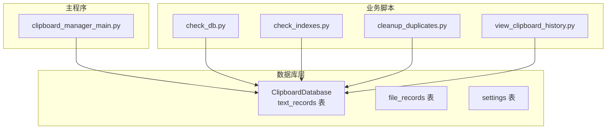
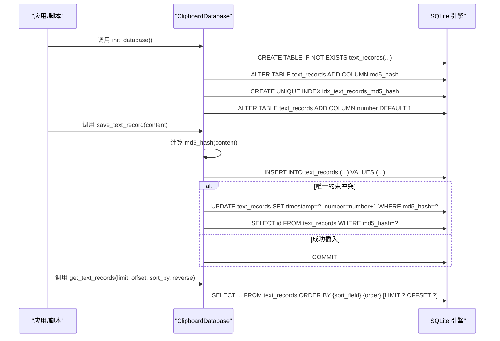
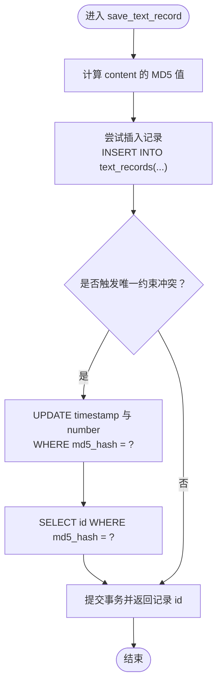
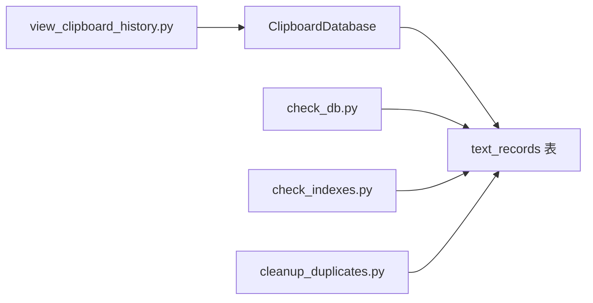

# 文本记录表

<cite>
**本文引用的文件**
- [clipboard_db.py](file://clipboard_db.py)
- [clipboard_manager_main.py](file://clipboard_manager_main.py)
- [check_db.py](file://check_db.py)
- [check_indexes.py](file://check_indexes.py)
- [cleanup_duplicates.py](file://cleanup_duplicates.py)
- [view_clipboard_history.py](file://view_clipboard_history.py)
</cite>

## 目录
1. [简介](#简介)
2. [项目结构](#项目结构)
3. [核心组件](#核心组件)
4. [架构总览](#架构总览)
5. [详细组件分析](#详细组件分析)
6. [依赖关系分析](#依赖关系分析)
7. [性能考量](#性能考量)
8. [故障排查指南](#故障排查指南)
9. [结论](#结论)

## 简介
本文件聚焦于 text_records 表的结构与实现机制，围绕以下目标展开：
- 字段定义与用途：id（主键自增）、content（文本内容，非空）、timestamp（时间戳，默认当前时间）、char_count（字符数）、md5_hash（MD5哈希值，用于去重）、number（引用计数）。
- 初始化与版本兼容：init_database 中通过 CREATE TABLE IF NOT EXISTS 初始化；随后通过 ALTER TABLE 动态添加 md5_hash 与 number 字段，配合唯一性索引 idx_text_records_md5_hash 实现去重与计数。
- 数据写入流程：save_text_record 的插入与冲突处理逻辑，包括 MD5 计算、唯一性检测、成功插入或触发 UPDATE 更新时间戳与计数器。
- 查询与排序：get_text_records 支持按时间、内容、字符数、引用次数排序。
- 删除与统计：delete_text_record 与 clear_all_records 的影响；统计功能中 COUNT(*) 的使用场景。

## 项目结构
本仓库围绕剪贴板历史记录管理，数据库层由 ClipboardDatabase 负责，text_records 为其核心表之一。其他脚本用于检查数据库状态、索引与重复数据清理等辅助功能。

图表来源
- [clipboard_db.py](file://clipboard_db.py#L18-L115)
- [clipboard_manager_main.py](file://clipboard_manager_main.py#L56-L111)
- [check_db.py](file://check_db.py#L9-L31)
- [check_indexes.py](file://check_indexes.py#L9-L27)
- [cleanup_duplicates.py](file://cleanup_duplicates.py#L9-L67)
- [view_clipboard_history.py](file://view_clipboard_history.py#L21-L75)

章节来源
- [clipboard_db.py](file://clipboard_db.py#L18-L115)
- [clipboard_manager_main.py](file://clipboard_manager_main.py#L56-L111)

## 核心组件
- ClipboardDatabase：封装数据库初始化、文本记录的保存、查询、统计、删除等操作。
- text_records 表：存储剪贴板文本历史，具备去重与计数能力。
- 辅助脚本：检查数据库内容、索引与重复数据，便于诊断与维护。

章节来源
- [clipboard_db.py](file://clipboard_db.py#L18-L115)
- [clipboard_manager_main.py](file://clipboard_manager_main.py#L56-L111)
- [check_db.py](file://check_db.py#L9-L31)
- [check_indexes.py](file://check_indexes.py#L9-L27)
- [cleanup_duplicates.py](file://cleanup_duplicates.py#L9-L67)
- [view_clipboard_history.py](file://view_clipboard_history.py#L21-L75)

## 架构总览
下图展示 text_records 表在数据库初始化、字段与索引演进、写入与查询的关键交互。

图表来源
- [clipboard_db.py](file://clipboard_db.py#L18-L115)
- [clipboard_db.py](file://clipboard_db.py#L116-L151)
- [clipboard_db.py](file://clipboard_db.py#L185-L221)

## 详细组件分析

### 表结构与字段定义
- id：整型主键，自动递增，唯一标识每条记录。
- content：文本内容，非空，存储剪贴板文本。
- timestamp：时间戳，默认当前时间，记录首次保存或最近更新时间。
- char_count：整型，记录 content 的字符数，便于排序与统计。
- md5_hash：文本哈希，用于去重；配合唯一性索引保证同一内容仅存一条记录。
- number：整型，默认 1，记录该内容出现的次数（去重后的引用计数）。

章节来源
- [clipboard_db.py](file://clipboard_db.py#L23-L31)
- [clipboard_db.py](file://clipboard_db.py#L116-L151)
- [clipboard_db.py](file://clipboard_db.py#L185-L221)

### 初始化与版本兼容机制
- 初始创建：通过 CREATE TABLE IF NOT EXISTS 创建 text_records，包含 id、content、timestamp、char_count 字段。
- 动态演进：
  - 添加 md5_hash 字段：若不存在则通过 ALTER TABLE 添加；若已存在则捕获异常并忽略。
  - 创建唯一性索引 idx_text_records_md5_hash：基于 md5_hash 字段，WHERE 条件排除 NULL 值，避免未填充哈希的记录参与唯一性约束。
  - 添加 number 字段：默认 1，用于计数；同样采用“存在则忽略”的兼容策略。
- 作用：上述步骤确保旧版本数据库可平滑升级至新功能，无需手动迁移。

章节来源
- [clipboard_db.py](file://clipboard_db.py#L23-L31)
- [clipboard_db.py](file://clipboard_db.py#L33-L52)
- [clipboard_db.py](file://clipboard_db.py#L40-L45)

### 唯一性索引与去重策略
- 索引定义：idx_text_records_md5_hash 为 text_records 上的唯一索引，仅对 md5_hash 非 NULL 的行生效。
- 去重原理：
  - 插入前计算 content 的 MD5 值；
  - 若插入触发唯一约束冲突，则转而执行 UPDATE，将 timestamp 更新为最新时间，并将 number 自增 1；
  - 最终返回该记录的 id，保证同一内容在数据库中仅保留一条，同时累计出现次数。

章节来源
- [clipboard_db.py](file://clipboard_db.py#L40-L45)
- [clipboard_db.py](file://clipboard_db.py#L116-L151)

### 插入新记录的逻辑流程（save_text_record）

图表来源
- [clipboard_db.py](file://clipboard_db.py#L116-L151)

章节来源
- [clipboard_db.py](file://clipboard_db.py#L116-L151)

### 查询与排序机制（get_text_records）
- 排序字段支持：
  - content：按文本内容排序；
  - char_count：按字符数排序；
  - number：按引用计数排序；
  - timestamp：默认按时间排序（默认降序）。
- 分页与限制：支持 limit 与 offset 参数，未指定 limit 时返回全部记录。
- 返回字段：包含 id、content、timestamp、char_count、md5_hash、number，便于前端展示与统计。

章节来源
- [clipboard_db.py](file://clipboard_db.py#L185-L221)

### 删除与清空（delete_text_record、clear_all_records）
- delete_text_record：按 id 删除单条文本记录，影响该记录的计数与去重状态。
- clear_all_records：清空 text_records 与 file_records 表，影响整体历史数据规模与占用空间。

章节来源
- [clipboard_db.py](file://clipboard_db.py#L334-L358)

### 统计功能与 COUNT(*) 使用
- get_statistics：统计 text_records 数量与 file_records 数量及文件总大小，其中 text_count 使用 COUNT(*) 计算。
- COUNT(*) 场景：用于快速获取文本记录总数，便于 UI 展示与容量评估。

章节来源
- [clipboard_db.py](file://clipboard_db.py#L316-L333)

### 版本演进对比（主程序与数据库模块）
- 主程序 clipboard_manager_main.py 中的 init_database 早期版本直接在 CREATE TABLE 中声明 md5_hash 与 number 字段，且 text_records 的 timestamp 默认 CURRENT_TIMESTAMP。
- 数据库模块 clipboard_db.py 的 init_database 采用“先创建基础表，再通过 ALTER TABLE 逐步添加字段并创建索引”的兼容策略，避免破坏既有数据。

章节来源
- [clipboard_manager_main.py](file://clipboard_manager_main.py#L56-L111)
- [clipboard_db.py](file://clipboard_db.py#L18-L115)

## 依赖关系分析
- ClipboardDatabase 是 text_records 表的主要操作入口，负责初始化、写入、查询、统计与删除。
- 辅助脚本通过直接连接数据库，验证索引是否存在、检查重复 MD5、清理重复记录等，形成闭环维护链路。

图表来源
- [clipboard_db.py](file://clipboard_db.py#L18-L115)
- [check_db.py](file://check_db.py#L9-L31)
- [check_indexes.py](file://check_indexes.py#L9-L27)
- [cleanup_duplicates.py](file://cleanup_duplicates.py#L9-L67)
- [view_clipboard_history.py](file://view_clipboard_history.py#L21-L75)

章节来源
- [clipboard_db.py](file://clipboard_db.py#L18-L115)
- [check_db.py](file://check_db.py#L9-L31)
- [check_indexes.py](file://check_indexes.py#L9-L27)
- [cleanup_duplicates.py](file://cleanup_duplicates.py#L9-L67)
- [view_clipboard_history.py](file://view_clipboard_history.py#L21-L75)

## 性能考量
- 唯一性索引：idx_text_records_md5_hash 有效降低重复插入成本，避免全表扫描比较内容。
- 排序性能：按 timestamp、content、char_count、number 排序均依赖索引或可利用现有索引，建议在大数据量时优先使用这些字段排序。
- 写入路径：INSERT 为主路径，冲突时 UPDATE number 与 timestamp，整体写入开销可控。
- 统计查询：COUNT(*) 与 SUM() 在中等规模数据下响应迅速，但需注意在极高并发写入时的锁竞争。

## 故障排查指南
- 检查索引是否存在：使用 check_indexes.py 输出 text_records 与 file_records 的索引名称，确认 md5_hash 唯一索引是否创建成功。
- 检查重复 MD5：使用 check_db.py 查询最近带 MD5 的记录与重复 MD5 组，定位重复问题。
- 清理重复记录：使用 cleanup_duplicates.py 聚合重复 MD5 的计数并删除多余记录，保留计数累加的主记录。
- 查看历史记录：使用 view_clipboard_history.py 快速浏览文本与文件记录，核对字段完整性与排序效果。

章节来源
- [check_indexes.py](file://check_indexes.py#L9-L27)
- [check_db.py](file://check_db.py#L9-L31)
- [cleanup_duplicates.py](file://cleanup_duplicates.py#L9-L67)
- [view_clipboard_history.py](file://view_clipboard_history.py#L21-L75)

## 结论
text_records 表通过“基础表 + 动态演进 + 唯一索引 + 计数字段”的设计，在保证兼容性的前提下实现了高效的去重与计数。写入路径以 INSERT 为主，冲突时 UPDATE，既满足业务需求又兼顾性能。查询接口支持多字段排序与分页，统计功能通过 COUNT(*) 快速获取总量。配合辅助脚本，可实现索引校验、重复检测与清理，形成完善的维护闭环。