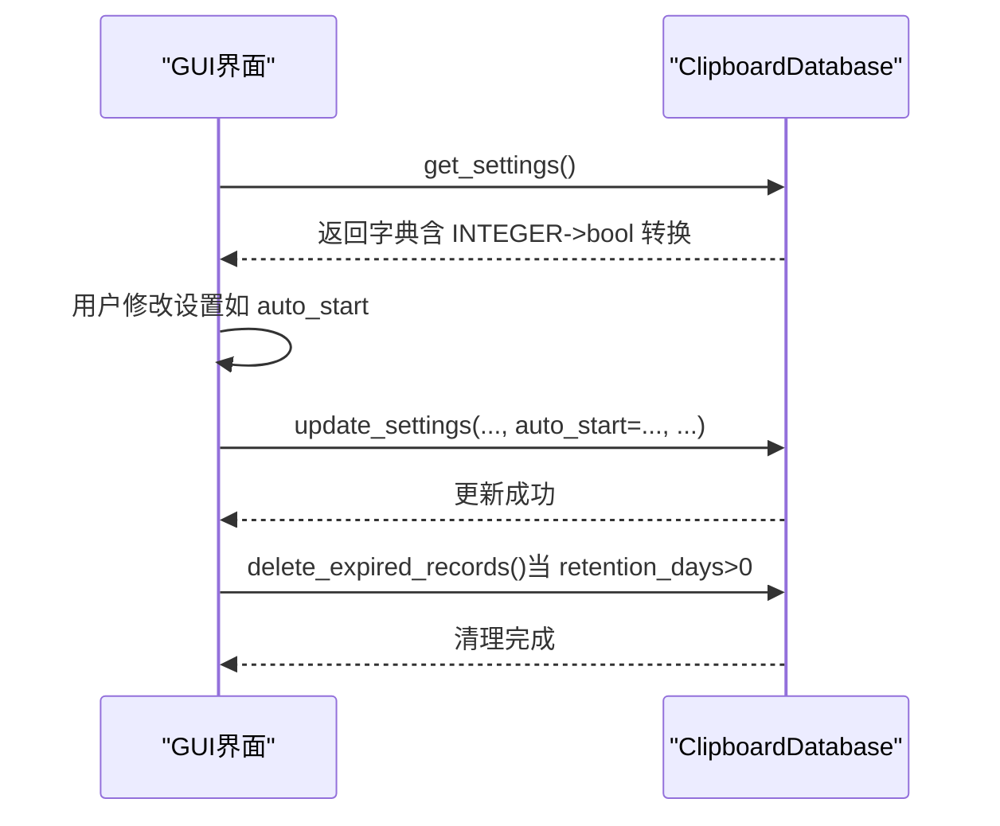
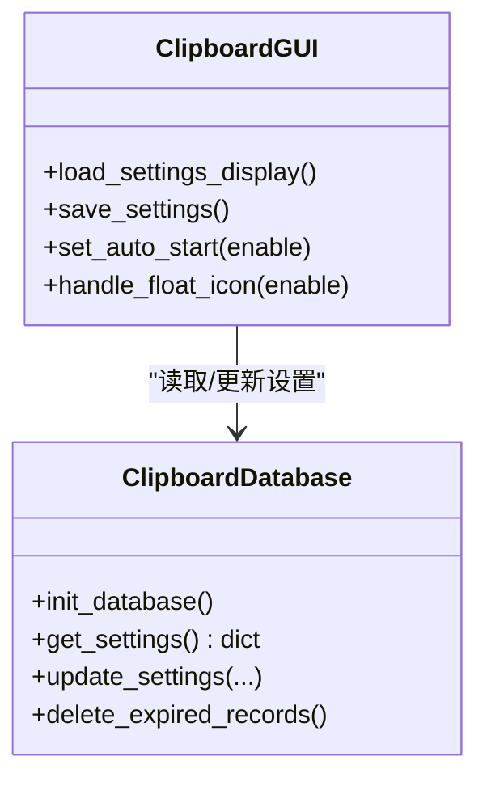

# 设置表

<cite>
**本文引用的文件**
- [clipboard_db.py](file://clipboard_db.py)
- [clipboard_gui.py](file://clipboard_gui.py)
- [clipboard_manager_main.py](file://clipboard_manager_main.py)
</cite>

## 目录
1. [简介](#简介)
2. [项目结构](#项目结构)
3. [核心组件](#核心组件)
4. [架构总览](#架构总览)
5. [详细组件分析](#详细组件分析)
6. [依赖关系分析](#依赖关系分析)
7. [性能考量](#性能考量)
8. [故障排查指南](#故障排查指南)
9. [结论](#结论)

## 简介
本文件聚焦于 settings 表的配置管理机制，系统性阐述其单行主键设计（id=1）及业务含义、字段语义与默认值、初始化流程、读取与更新策略、过期清理逻辑，以及与 GUI 设置界面的联动关系。特别地，本文将结合 get_settings 的数据类型转换逻辑与 update_settings 的按需更新策略，说明如何通过 update_settings 修改 auto_start 状态，并解释该状态如何影响开机自启行为。

## 项目结构
settings 表位于数据库层，由数据库模块负责创建、初始化与维护；GUI 层负责读取与写入设置，并将部分设置映射为系统行为（如开机自启、悬浮图标）。

```mermaid
graph TB
subgraph "数据库层"
DB["ClipboardDatabase<br/>init_database/get_settings/update_settings/delete_expired_records"]
end
subgraph "GUI层"
GUI["ClipboardGUI<br/>load_settings_display/save_settings/set_auto_start/handle_float_icon"]
end
DB <- --> GUI
```

图表来源
- [clipboard_db.py](file://clipboard_db.py#L77-L114)
- [clipboard_gui.py](file://clipboard_gui.py#L420-L533)

章节来源
- [clipboard_db.py](file://clipboard_db.py#L77-L114)
- [clipboard_gui.py](file://clipboard_gui.py#L420-L533)

## 核心组件
- settings 表：全局唯一配置容器，单行主键 id=1，承载复制限制、保留策略、系统行为等配置。
- 数据库模块 ClipboardDatabase：负责表结构初始化、默认值注入、配置读取与更新、过期记录清理。
- GUI 模块 ClipboardGUI：负责设置界面渲染、用户输入校验、调用数据库更新、驱动系统行为（开机自启、悬浮图标）。

章节来源
- [clipboard_db.py](file://clipboard_db.py#L77-L114)
- [clipboard_gui.py](file://clipboard_gui.py#L420-L533)

## 架构总览
settings 表在首次初始化时创建，并通过 INSERT OR IGNORE 确保默认值仅注入一次。GUI 读取设置后进行类型转换（如 INTEGER 转布尔），随后通过 update_settings 按需更新字段。delete_expired_records 依据 retention_days 判断是否执行清理。



图表来源
- [clipboard_db.py](file://clipboard_db.py#L359-L412)
- [clipboard_gui.py](file://clipboard_gui.py#L477-L533)

章节来源
- [clipboard_db.py](file://clipboard_db.py#L359-L412)
- [clipboard_gui.py](file://clipboard_gui.py#L477-L533)

## 详细组件分析

### settings 表结构与初始化
- 主键约束：id INTEGER PRIMARY KEY CHECK (id = 1)，保证全局唯一且仅有一行有效配置。
- 字段与默认值：
  - max_copy_size：最大复制内容大小（字节），默认 314572800（即 300MB）。
  - max_copy_count：最大历史记录数量，默认 100。
  - unlimited_mode：无限制模式开关，0 为限制，1 为不限制。
  - retention_days：数据保留天数，0 表示永久保存。
  - auto_start：开机自启功能启用状态。
  - float_icon：悬浮图标显示开关。
- 初始化策略：
  - CREATE TABLE IF NOT EXISTS settings …
  - INSERT OR IGNORE INTO settings (...) VALUES (1, ...) 确保默认值仅注入一次，避免覆盖用户已有设置。
  - ALTER TABLE settings ADD COLUMN ... DEFAULT ... 逐步兼容新增字段，保证向后兼容。

章节来源
- [clipboard_db.py](file://clipboard_db.py#L77-L114)

### 配置读取：get_settings 的数据类型转换
- 查询：SELECT max_copy_size, max_copy_count, unlimited_mode, retention_days, auto_start, float_icon FROM settings WHERE id = 1。
- 类型转换：unlimited_mode、auto_start、float_icon 从 INTEGER 转为 Python bool；其余字段保持整型。
- 默认回退：若查询不到记录，返回一组默认值（max_copy_size=314572800，max_copy_count=100，unlimited_mode=False，retention_days=0，auto_start=False，float_icon=False）。

章节来源
- [clipboard_db.py](file://clipboard_db.py#L359-L385)

### 配置更新：update_settings 的按需更新策略
- 仅对非 None 的参数生成对应 UPDATE 语句，避免全量覆盖。
- 对布尔类参数（unlimited_mode、auto_start、float_icon）在写入前转换为整型（0/1）。
- 事务：每个更新在连接内提交，确保原子性。

章节来源
- [clipboard_db.py](file://clipboard_db.py#L387-L412)

### 过期清理：delete_expired_records 的执行条件
- 读取 settings 中的 retention_days。
- 若 retention_days <= 0，则不删除任何记录（永久保存）。
- 否则计算过期时间（当前时间减去 retention_days 天），删除 text_records 与 file_records 中早于过期时间的记录，并尝试删除对应的本地文件。

章节来源
- [clipboard_db.py](file://clipboard_db.py#L413-L455)

### GUI 设置界面联动
- 加载显示：load_settings_display 从数据库读取设置并填充界面控件，同时处理 float_icon 的默认值兼容。
- 保存设置：save_settings 收集用户输入，转换单位（MB->bytes），调用 update_settings 更新配置；当 retention_days>0 时触发 delete_expired_records；随后调用 set_auto_start 与 handle_float_icon 应用系统行为。
- 默认重置：reset_to_default_settings 将关键设置重置为默认值，并更新界面显示。

章节来源
- [clipboard_gui.py](file://clipboard_gui.py#L439-L553)

### 开机自启与悬浮图标的行为落地
- 开机自启：GUI 侧 set_auto_start 通过注册表操作实现（写入/删除 HKEY_CURRENT_USER\Software\Microsoft\Windows\CurrentVersion\Run 下的值）。
- 悬浮图标：GUI 侧 handle_float_icon 控制悬浮图标的创建/销毁；create_float_icon 创建 50x50 像素、15% 透明度、可拖动的悬浮窗口，并绑定交互事件。

章节来源
- [clipboard_gui.py](file://clipboard_gui.py#L1130-L1200)
- [clipboard_gui.py](file://clipboard_gui.py#L1163-L1200)

## 依赖关系分析



图表来源
- [clipboard_db.py](file://clipboard_db.py#L77-L114)
- [clipboard_gui.py](file://clipboard_gui.py#L420-L533)

章节来源
- [clipboard_db.py](file://clipboard_db.py#L77-L114)
- [clipboard_gui.py](file://clipboard_gui.py#L420-L533)

## 性能考量
- 单行主键 id=1 的设计避免了复杂索引开销，读取与更新均只需常量级扫描。
- update_settings 采用按需更新策略，减少不必要的写放大。
- delete_expired_records 仅在 retention_days>0 时执行，避免无谓的全表扫描与删除。
- GUI 层在保存设置时才触发 delete_expired_records，降低后台任务频率。

[本节为通用建议，无需具体文件分析]

## 故障排查指南
- 无法读取设置：确认 settings 表是否存在且 id=1 的记录是否被正确初始化；检查 get_settings 是否返回默认值。
- 更新无效：确认 update_settings 是否传入了非 None 的目标字段；检查布尔参数是否被转换为整型。
- 过期清理未生效：确认 retention_days 是否大于 0；检查 delete_expired_records 的执行路径是否被调用。
- 开机自启未生效：检查 set_auto_start 是否成功写入/删除注册表项；确认权限与路径正确。
- 悬浮图标异常：检查 handle_float_icon 与 create_float_icon 的调用链；确认资源文件可用。

章节来源
- [clipboard_db.py](file://clipboard_db.py#L359-L412)
- [clipboard_gui.py](file://clipboard_gui.py#L1130-L1200)

## 结论
settings 表通过单行主键 id=1 实现“全局唯一配置项”的业务语义，配合 INSERT OR IGNORE 的初始化策略，确保默认值仅注入一次。get_settings 将 INTEGER 转换为布尔，update_settings 以按需更新策略保障灵活性与性能，delete_expired_records 严格依赖 retention_days 决策清理行为。GUI 层将设置映射为系统行为（开机自启、悬浮图标），形成“配置—行为”的闭环控制。整体设计简洁可靠，易于扩展与维护。