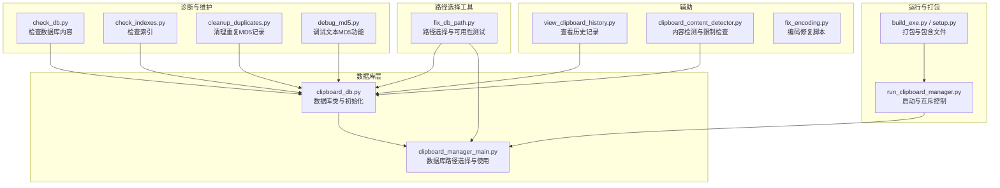
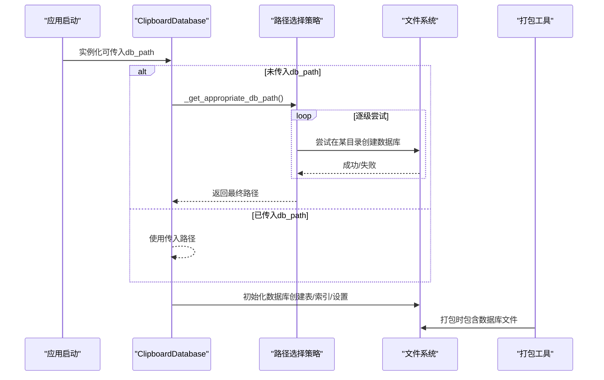
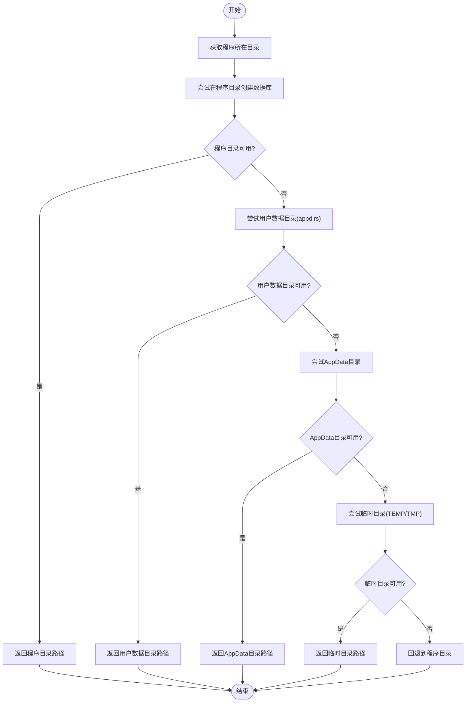
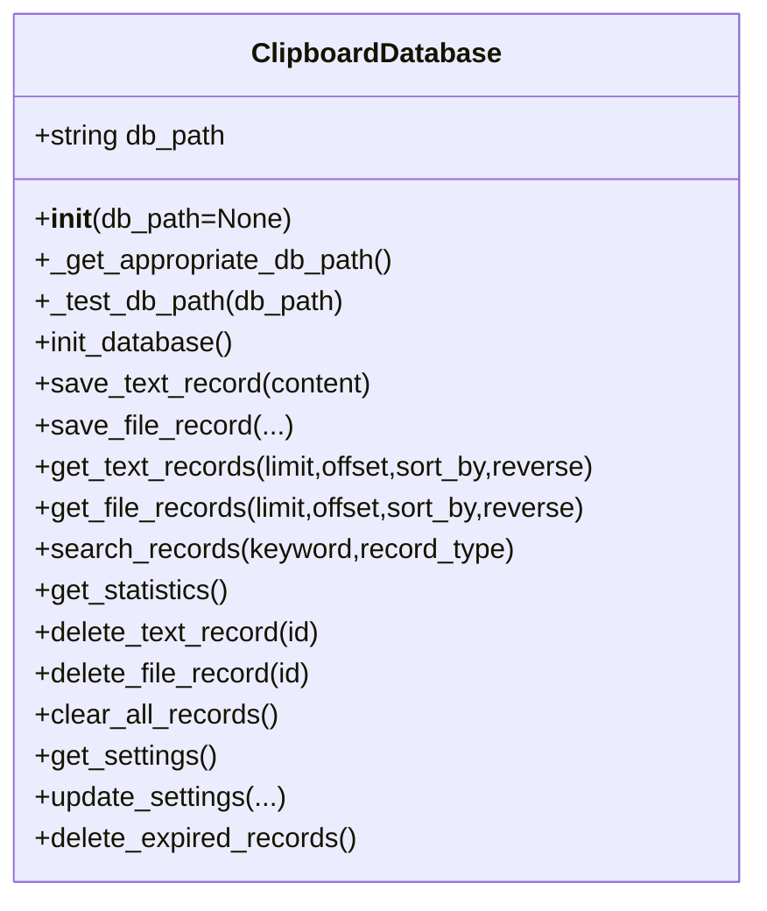
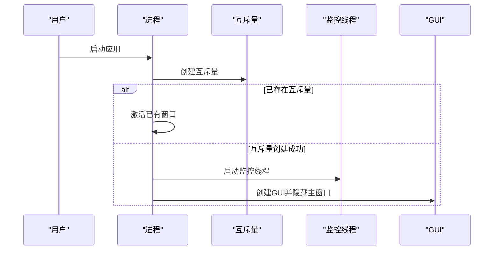
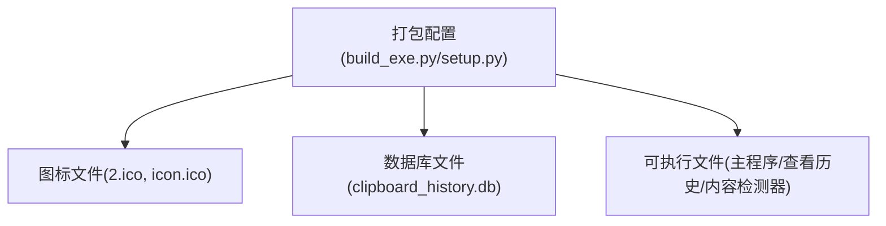
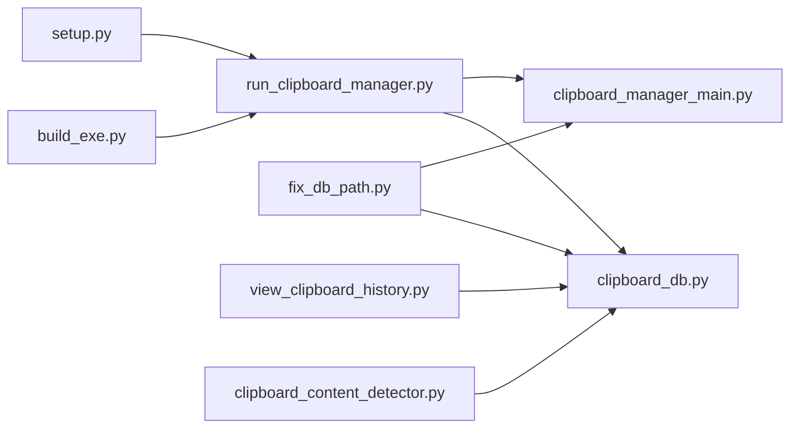

# 数据库路径选择

<cite>
**本文引用的文件**
- [clipboard_manager_main.py](file://clipboard_manager_main.py)
- [clipboard_db.py](file://clipboard_db.py)
- [fix_db_path.py](file://fix_db_path.py)
- [check_db.py](file://check_db.py)
- [check_indexes.py](file://check_indexes.py)
- [cleanup_duplicates.py](file://cleanup_duplicates.py)
- [debug_md5.py](file://debug_md5.py)
- [fix_encoding.py](file://fix_encoding.py)
- [run_clipboard_manager.py](file://run_clipboard_manager.py)
- [view_clipboard_history.py](file://view_clipboard_history.py)
- [clipboard_content_detector.py](file://clipboard_content_detector.py)
- [build_exe.py](file://build_exe.py)
- [setup.py](file://setup.py)
</cite>

## 目录
1. [简介](#简介)
2. [项目结构](#项目结构)
3. [核心组件](#核心组件)
4. [架构总览](#架构总览)
5. [详细组件分析](#详细组件分析)
6. [依赖关系分析](#依赖关系分析)
7. [性能考量](#性能考量)
8. [故障排查指南](#故障排查指南)
9. [结论](#结论)
10. [附录](#附录)

## 简介
本文件聚焦于“数据库路径选择”的主题，系统梳理本仓库中与数据库文件位置相关的策略、实现与配套工具。目标读者既包括需要快速上手的使用者，也包括希望深入理解路径选择算法与容错机制的技术人员。本文将从整体架构入手，逐步拆解数据库路径选择的决策流程、关键实现点、以及与打包、监控、GUI等模块的交互关系，并提供可视化图表帮助理解。

## 项目结构
围绕数据库路径选择的相关文件主要分布在以下模块：
- 数据库核心：clipboard_db.py、clipboard_manager_main.py
- 路径选择工具：fix_db_path.py
- 调试与诊断：check_db.py、check_indexes.py、cleanup_duplicates.py、debug_md5.py
- 启动与打包：run_clipboard_manager.py、build_exe.py、setup.py
- 辅助脚本：view_clipboard_history.py、clipboard_content_detector.py、fix_encoding.py

图表来源
- [clipboard_db.py](file://clipboard_db.py#L1-L214)
- [clipboard_manager_main.py](file://clipboard_manager_main.py#L56-L124)
- [fix_db_path.py](file://fix_db_path.py#L12-L82)
- [check_db.py](file://check_db.py#L1-L31)
- [check_indexes.py](file://check_indexes.py#L1-L27)
- [cleanup_duplicates.py](file://cleanup_duplicates.py#L1-L67)
- [debug_md5.py](file://debug_md5.py#L1-L56)
- [run_clipboard_manager.py](file://run_clipboard_manager.py#L1-L72)
- [build_exe.py](file://build_exe.py#L1-L81)
- [setup.py](file://setup.py#L1-L84)
- [view_clipboard_history.py](file://view_clipboard_history.py#L1-L75)
- [clipboard_content_detector.py](file://clipboard_content_detector.py#L1-L274)
- [fix_encoding.py](file://fix_encoding.py#L1-L107)

章节来源
- [clipboard_db.py](file://clipboard_db.py#L1-L214)
- [clipboard_manager_main.py](file://clipboard_manager_main.py#L56-L124)
- [fix_db_path.py](file://fix_db_path.py#L12-L82)
- [run_clipboard_manager.py](file://run_clipboard_manager.py#L1-L72)
- [build_exe.py](file://build_exe.py#L1-L81)
- [setup.py](file://setup.py#L1-L84)

## 核心组件
- 数据库类（ClipboardDatabase）
  - 负责数据库初始化、表结构管理、记录增删改查、设置读写、过期清理等。
  - 关键点：构造函数中支持传入自定义路径；若未传入则通过内部路径选择策略确定路径；初始化时会创建/迁移表结构并添加必要字段与索引。
- 路径选择策略（_get_appropriate_db_path）
  - 优先级：程序所在目录 → 用户数据目录（appdirs）→ AppData → 临时目录 → 回退到程序所在目录。
  - 可用性测试（_test_db_path）：尝试连接数据库以判断路径是否可用，若存在同名文件则删除测试文件。
- 启动与互斥（run_clipboard_manager.py）
  - 通过互斥量避免重复运行；在后台启动剪贴板监控线程；默认隐藏主窗口，显示系统托盘图标。
- 打包与包含（build_exe.py、setup.py）
  - 打包时包含图标与数据库文件；可执行文件包含多个入口（主程序、查看历史、内容检测器）。

章节来源
- [clipboard_db.py](file://clipboard_db.py#L13-L214)
- [clipboard_manager_main.py](file://clipboard_manager_main.py#L56-L124)
- [fix_db_path.py](file://fix_db_path.py#L12-L82)
- [run_clipboard_manager.py](file://run_clipboard_manager.py#L1-L72)
- [build_exe.py](file://build_exe.py#L1-L81)
- [setup.py](file://setup.py#L1-L84)

## 架构总览
数据库路径选择贯穿于应用生命周期：启动阶段由数据库类决定路径，运行阶段由各模块共享该路径，打包阶段将数据库文件一并包含，诊断阶段通过脚本验证路径与内容。

图表来源
- [clipboard_db.py](file://clipboard_db.py#L13-L110)
- [clipboard_manager_main.py](file://clipboard_manager_main.py#L56-L124)
- [fix_db_path.py](file://fix_db_path.py#L12-L82)
- [build_exe.py](file://build_exe.py#L14-L20)
- [setup.py](file://setup.py#L14-L20)

## 详细组件分析

### 数据库路径选择策略
- 优先级链路
  - 程序所在目录：优先尝试在程序目录创建数据库文件。
  - 用户数据目录：使用 appdirs 的 user_data_dir 生成稳定路径，便于跨用户持久化。
  - AppData 目录：兼容 Windows 下的 AppData 路径。
  - 临时目录：在 TEMP/TMP 下创建子目录，适合临时环境或便携场景。
  - 回退策略：若上述均不可用，最终回退到程序所在目录。
- 可用性测试
  - 通过 sqlite3.connect 尝试连接，若成功则关闭并删除测试文件，表示路径可用。
  - 若异常则记录失败原因并继续尝试下一个候选路径。
- 与数据库初始化的关系
  - 数据库类在拿到路径后，会确保目录存在并初始化表结构、索引与默认设置。

图表来源
- [clipboard_manager_main.py](file://clipboard_manager_main.py#L71-L123)
- [clipboard_db.py](file://clipboard_db.py#L28-L80)
- [fix_db_path.py](file://fix_db_path.py#L12-L62)

章节来源
- [clipboard_manager_main.py](file://clipboard_manager_main.py#L71-L124)
- [clipboard_db.py](file://clipboard_db.py#L28-L80)
- [fix_db_path.py](file://fix_db_path.py#L12-L82)

### 数据库初始化与表结构
- 初始化流程
  - 连接数据库（若失败则回退到程序目录）。
  - 创建 text_records、file_records、settings 表。
  - 为 text_records 添加 md5_hash 唯一索引与 number 字段；为 file_records 添加 number 字段。
  - 插入默认设置（最大复制大小、最大复制数量、无限模式等）。
- 设置项与功能
  - 支持复制限制（数量/大小）、无限模式、记录保留天数、开机自启、悬浮图标、透明度、剪贴板记录类型等。
  - 提供过期记录清理功能，按保留天数删除旧记录并同步删除对应文件。

图表来源
- [clipboard_db.py](file://clipboard_db.py#L13-L214)

章节来源
- [clipboard_db.py](file://clipboard_db.py#L98-L214)

### 启动与互斥控制
- 互斥控制
  - 通过 Windows 原生互斥量确保同一时刻只有一个实例运行。
  - 若已运行，尝试激活已有窗口句柄。
- 后台监控
  - 在独立线程中运行剪贴板监控循环，避免阻塞GUI主线程。
- GUI默认隐藏
  - 默认隐藏主窗口，仅显示系统托盘图标，支持Alt+C快捷键显示。

图表来源
- [run_clipboard_manager.py](file://run_clipboard_manager.py#L18-L67)

章节来源
- [run_clipboard_manager.py](file://run_clipboard_manager.py#L18-L67)

### 打包与包含
- 打包配置
  - 包含图标与数据库文件（clipboard_history.db）。
  - 指定包含的包与模块，构建多个可执行文件（主程序、查看历史、内容检测器）。
- 作用
  - 保证发布版本在不同环境下能正确找到数据库文件，减少部署复杂度。

图表来源
- [build_exe.py](file://build_exe.py#L14-L20)
- [setup.py](file://setup.py#L14-L20)

章节来源
- [build_exe.py](file://build_exe.py#L14-L20)
- [setup.py](file://setup.py#L14-L20)

### 诊断与维护脚本
- 检查数据库内容
  - 查询最近带MD5的文本记录，统计重复MD5情况。
- 检查索引
  - 查询 text_records 与 file_records 的索引是否存在。
- 清理重复MD5记录
  - 聚合相同MD5的记录，保留一条并合并计数，删除其余重复记录。
- 调试文本MD5功能
  - 通过两次保存相同文本，观察数据库中记录的ID与计数变化，验证去重逻辑。
- 编码修复脚本
  - 将文件中的全角字符替换为半角字符，便于统一显示与检索。

章节来源
- [check_db.py](file://check_db.py#L1-L31)
- [check_indexes.py](file://check_indexes.py#L1-L27)
- [cleanup_duplicates.py](file://cleanup_duplicates.py#L1-L67)
- [debug_md5.py](file://debug_md5.py#L1-L56)
- [fix_encoding.py](file://fix_encoding.py#L1-L107)

## 依赖关系分析
- 组件耦合
  - 数据库类与路径选择策略紧密耦合，路径选择结果直接影响数据库初始化与后续操作。
  - 启动脚本与数据库类解耦，通过互斥控制与线程管理实现低耦合运行。
  - 打包脚本与数据库文件强耦合，确保发布产物包含数据库文件。
- 外部依赖
  - appdirs（用户数据目录）、win32clipboard/win32con（剪贴板访问）、sqlite3（数据库）、PIL/pystray（GUI托盘图标）。
- 循环依赖
  - 未发现循环依赖；各模块职责清晰，接口边界明确。

图表来源
- [run_clipboard_manager.py](file://run_clipboard_manager.py#L1-L72)
- [clipboard_db.py](file://clipboard_db.py#L1-L214)
- [clipboard_manager_main.py](file://clipboard_manager_main.py#L56-L124)
- [fix_db_path.py](file://fix_db_path.py#L12-L82)
- [view_clipboard_history.py](file://view_clipboard_history.py#L1-L75)
- [clipboard_content_detector.py](file://clipboard_content_detector.py#L1-L274)
- [build_exe.py](file://build_exe.py#L1-L81)
- [setup.py](file://setup.py#L1-L84)

章节来源
- [run_clipboard_manager.py](file://run_clipboard_manager.py#L1-L72)
- [clipboard_db.py](file://clipboard_db.py#L1-L214)
- [clipboard_manager_main.py](file://clipboard_manager_main.py#L56-L124)
- [fix_db_path.py](file://fix_db_path.py#L12-L82)
- [view_clipboard_history.py](file://view_clipboard_history.py#L1-L75)
- [clipboard_content_detector.py](file://clipboard_content_detector.py#L1-L274)
- [build_exe.py](file://build_exe.py#L1-L81)
- [setup.py](file://setup.py#L1-L84)

## 性能考量
- 路径选择的性能
  - 路径选择采用顺序尝试策略，最多四次尝试（程序目录、用户数据目录、AppData、临时目录），开销极低。
  - 可用性测试仅进行一次连接与关闭，且会删除测试文件，避免磁盘占用。
- 数据库初始化
  - 初始化过程包含表创建、索引创建与默认设置插入，通常在首次运行时发生，后续运行成本较低。
- 查询与排序
  - 文本记录与文件记录支持按多种字段排序，建议在大数据量场景下合理使用索引与LIMIT，避免全表扫描。
- 打包体积
  - 包含数据库文件可简化部署，但会增加可执行文件体积；可根据需要调整包含策略。

[本节为通用指导，无需特定文件来源]

## 故障排查指南
- 数据库无法创建或连接
  - 检查路径选择策略是否成功定位可用目录；可通过路径选择工具脚本验证。
  - 使用诊断脚本检查数据库内容与索引是否存在。
- 重复MD5记录过多
  - 使用清理重复脚本聚合重复记录，减少冗余。
- MD5功能异常
  - 使用调试脚本验证相同文本多次保存的行为，确认去重逻辑正常。
- 编码显示问题
  - 使用编码修复脚本将全角字符替换为半角字符，改善显示一致性。
- 打包后数据库文件缺失
  - 检查打包配置是否包含数据库文件；必要时手动放置数据库文件到目标目录。

章节来源
- [fix_db_path.py](file://fix_db_path.py#L12-L82)
- [check_db.py](file://check_db.py#L1-L31)
- [check_indexes.py](file://check_indexes.py#L1-L27)
- [cleanup_duplicates.py](file://cleanup_duplicates.py#L1-L67)
- [debug_md5.py](file://debug_md5.py#L1-L56)
- [fix_encoding.py](file://fix_encoding.py#L1-L107)
- [build_exe.py](file://build_exe.py#L14-L20)
- [setup.py](file://setup.py#L14-L20)

## 结论
本仓库在数据库路径选择方面实现了稳健的多级回退策略与完善的可用性测试，确保在不同运行环境下都能找到合适的数据库位置。数据库类负责初始化与维护，启动脚本保障单实例运行与后台监控，打包脚本确保发布产物包含数据库文件。配合诊断与维护脚本，能够有效支撑日常运维与问题排查。对于需要定制数据库位置的高级用户，可在构造数据库类时显式传入路径，从而覆盖默认策略。

[本节为总结性内容，无需特定文件来源]

## 附录
- 快速参考
  - 路径选择优先级：程序目录 → 用户数据目录 → AppData → 临时目录 → 回退程序目录。
  - 初始化内容：表结构、索引、默认设置、可选字段与索引。
  - 启动行为：互斥控制、后台监控、默认隐藏主窗口。
  - 打包要点：包含图标与数据库文件，构建多个可执行文件。

[本节为概览性内容，无需特定文件来源]