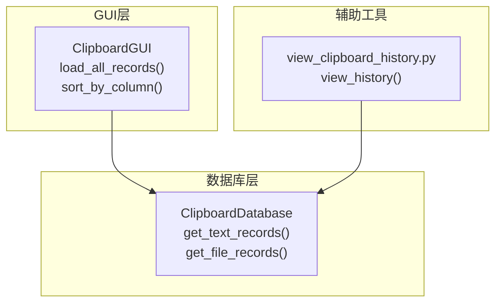
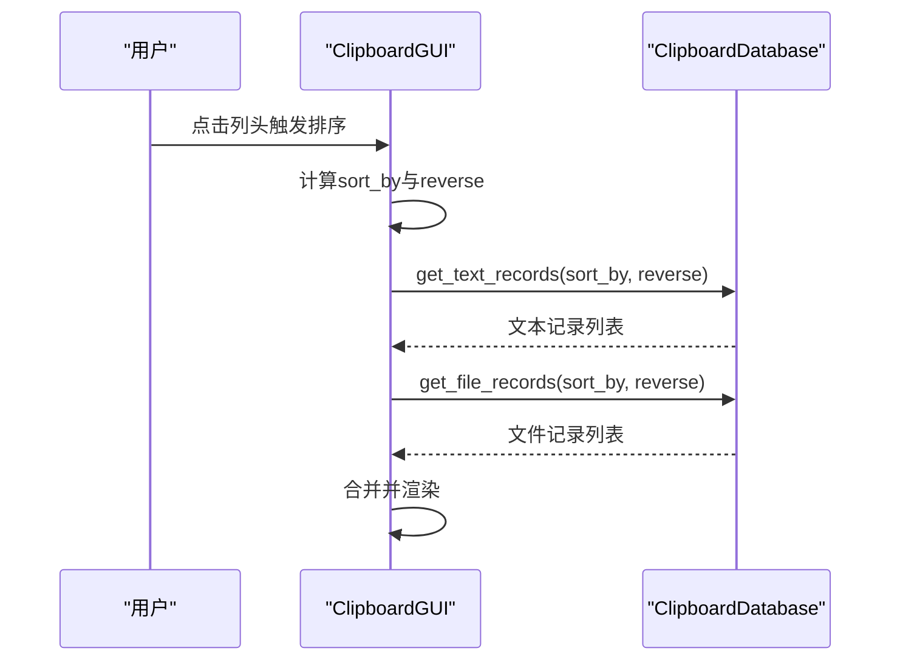
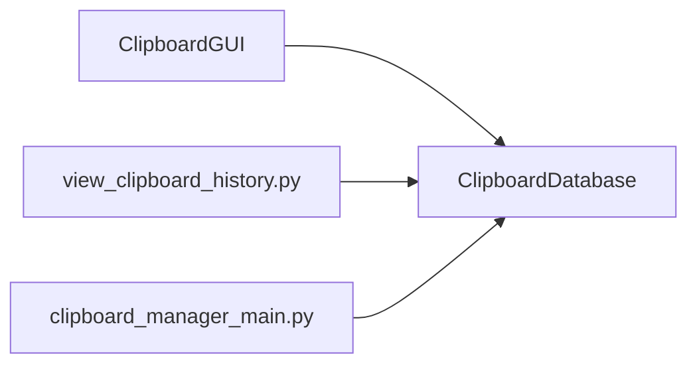
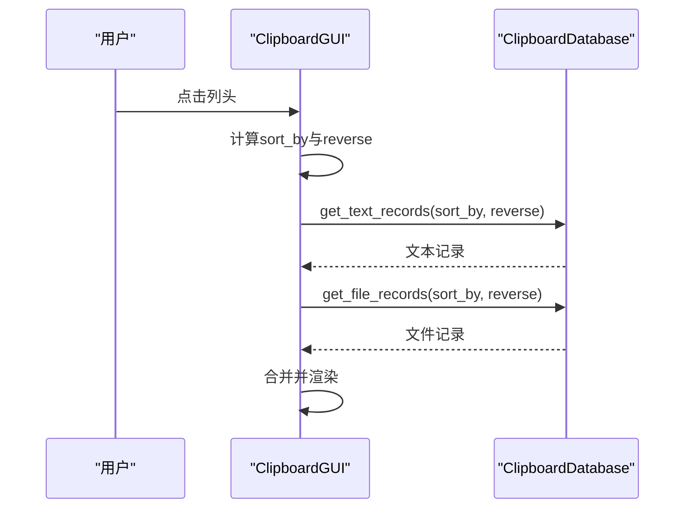

# 基础查询

<cite>
**本文引用的文件**
- [clipboard_db.py](file://clipboard_db.py)
- [clipboard_gui.py](file://clipboard_gui.py)
- [view_clipboard_history.py](file://view_clipboard_history.py)
- [clipboard_manager_main.py](file://clipboard_manager_main.py)
</cite>

## 目录
1. [简介](#简介)
2. [项目结构](#项目结构)
3. [核心组件](#核心组件)
4. [架构总览](#架构总览)
5. [详细组件分析](#详细组件分析)
6. [依赖关系分析](#依赖关系分析)
7. [性能考量](#性能考量)
8. [故障排查指南](#故障排查指南)
9. [结论](#结论)
10. [附录](#附录)

## 简介
本文件聚焦于“基础数据查询”能力，围绕两个核心方法：
- get_text_records：获取文本记录，支持按 timestamp、content、char_count、number 排序，支持 limit/offset 分页。
- get_file_records：获取文件记录，支持按 timestamp、filename、file_size、file_type、number 排序，支持 limit/offset 分页。

文档将从实现机制、SQL 查询语义、GUI 调用方式、异常处理与性能优化等方面进行深入解析，并提供不同排序参数下的查询示意，帮助读者快速理解与使用。

## 项目结构
该项目采用“模块化职责分离”的组织方式：
- 数据库层：负责 SQLite 表结构、增删改查、统计与清理等。
- GUI 层：负责用户交互、排序控制、分页触发与展示。
- 辅助工具：提供命令行查看器，便于离线调试与演示。

图表来源
- [clipboard_db.py](file://clipboard_db.py#L185-L261)
- [clipboard_gui.py](file://clipboard_gui.py#L581-L626)
- [view_clipboard_history.py](file://view_clipboard_history.py#L21-L53)

章节来源
- [clipboard_db.py](file://clipboard_db.py#L185-L261)
- [clipboard_gui.py](file://clipboard_gui.py#L581-L626)
- [view_clipboard_history.py](file://view_clipboard_history.py#L21-L53)

## 核心组件
- ClipboardDatabase：封装数据库连接、表结构、查询与统计。
- ClipboardGUI：提供 GUI 排序与分页控制，调用数据库查询并渲染。
- view_clipboard_history：命令行查看器，直接调用 get_text_records/get_file_records。

章节来源
- [clipboard_db.py](file://clipboard_db.py#L185-L261)
- [clipboard_gui.py](file://clipboard_gui.py#L581-L626)
- [view_clipboard_history.py](file://view_clipboard_history.py#L21-L53)

## 架构总览
GUI 与 CLI 通过统一的数据库接口访问数据，排序与分页由数据库层实现，GUI 层负责将用户选择映射为数据库字段与方向。

图表来源
- [clipboard_gui.py](file://clipboard_gui.py#L581-L626)
- [clipboard_db.py](file://clipboard_db.py#L185-L261)

## 详细组件分析

### get_text_records 实现机制
- 参数与默认值
  - limit：可选，None 表示不分页；传入整数表示每页条数。
  - offset：默认 0，配合 limit 实现分页。
  - sort_by：支持 "timestamp"、"content"、"char_count"、"number"。
  - reverse：布尔值，True 为降序，False 为升序。
- 排序逻辑
  - 根据 reverse 动态生成 "DESC" 或 "ASC"。
  - 根据 sort_by 映射到具体字段。
- 分页逻辑
  - 当 limit 为 None 时，执行全量查询。
  - 当 limit 为整数时，附加 LIMIT ? OFFSET ? 子句。
- 返回值
  - 返回包含 id、content、timestamp、char_count、md5_hash、number 的记录元组列表。

SQL 查询要点（示意）
- 全量查询（无 limit）
  - SELECT id, content, timestamp, char_count, md5_hash, number FROM text_records ORDER BY {sort_field} {order}
- 分页查询（有 limit/offset）
  - SELECT id, content, timestamp, char_count, md5_hash, number FROM text_records ORDER BY {sort_field} {order} LIMIT ? OFFSET ?

章节来源
- [clipboard_db.py](file://clipboard_db.py#L185-L221)

### get_file_records 实现机制
- 参数与默认值
  - limit：可选，None 表示不分页；传入整数表示每页条数。
  - offset：默认 0，配合 limit 实现分页。
  - sort_by：支持 "timestamp"、"filename"、"file_size"、"file_type"、"number"。
  - reverse：布尔值，True 为降序，False 为升序。
- 排序逻辑
  - 根据 reverse 动态生成 "DESC" 或 "ASC"。
  - 根据 sort_by 映射到具体字段。
- 分页逻辑
  - 当 limit 为 None 时，执行全量查询。
  - 当 limit 为整数时，附加 LIMIT ? OFFSET ? 子句。
- 返回值
  - 返回包含 id、original_path、saved_path、filename、file_size、file_type、md5_hash、timestamp、number 的记录元组列表。

SQL 查询要点（示意）
- 全量查询（无 limit）
  - SELECT id, original_path, saved_path, filename, file_size, file_type, md5_hash, timestamp, number FROM file_records ORDER BY {sort_field} {order}
- 分页查询（有 limit/offset）
  - SELECT id, original_path, saved_path, filename, file_size, file_type, md5_hash, timestamp, number FROM file_records ORDER BY {sort_field} {order} LIMIT ? OFFSET ?

章节来源
- [clipboard_db.py](file://clipboard_db.py#L223-L261)

### GUI 中的调用方式与排序映射
- 列头点击排序
  - GUI 通过 sort_by_column() 记录当前列与排序方向，并调用 load_all_records()。
- 字段映射
  - GUI 将界面列名映射为数据库字段名：
    - 名称或内容 -> content
    - 类型 -> file_type
    - 大小 -> file_size
    - 时间 -> timestamp
    - 次数 -> number
- 分页策略
  - 当前 GUI 的 load_all_records() 直接调用 get_text_records/get_file_records 并一次性加载所有记录，未显式传入 limit/offset。
  - 若需分页，可在 GUI 层维护 page_num 与 page_size，并将 limit/page_size 传入 get_text_records/get_file_records，offset = (page_num-1)*page_size。

章节来源
- [clipboard_gui.py](file://clipboard_gui.py#L581-L626)
- [clipboard_gui.py](file://clipboard_gui.py#L627-L637)

### 命令行查看器中的调用方式
- view_history() 直接调用 get_text_records(20) 与 get_file_records(20)，展示最近 20 条记录。
- 适合快速验证排序与分页效果。

章节来源
- [view_clipboard_history.py](file://view_clipboard_history.py#L21-L53)

### SQL 查询语句示例（基于实现）
以下为不同排序参数下的查询示意（非代码片段，仅示意）：
- 按时间降序（默认）
  - SELECT ... FROM text_records ORDER BY timestamp DESC
  - SELECT ... FROM file_records ORDER BY timestamp DESC
- 按内容排序
  - SELECT ... FROM text_records ORDER BY content [ASC|DESC]
- 按字符数排序
  - SELECT ... FROM text_records ORDER BY char_count [ASC|DESC]
- 按文件名排序
  - SELECT ... FROM file_records ORDER BY filename [ASC|DESC]
- 按文件大小排序
  - SELECT ... FROM file_records ORDER BY file_size [ASC|DESC]
- 按文件类型排序
  - SELECT ... FROM file_records ORDER BY file_type [ASC|DESC]
- 按使用次数排序
  - SELECT ... FROM text_records ORDER BY number [ASC|DESC]
  - SELECT ... FROM file_records ORDER BY number [ASC|DESC]
- 分页（limit/offset）
  - SELECT ... FROM text_records ORDER BY timestamp DESC LIMIT ? OFFSET ?
  - SELECT ... FROM file_records ORDER BY timestamp DESC LIMIT ? OFFSET ?

章节来源
- [clipboard_db.py](file://clipboard_db.py#L185-L261)

### 错误处理与健壮性
- 数据库连接管理
  - 方法内部每次查询均新建连接并及时 close，避免连接泄漏。
- 异常处理
  - 未见显式 try/except 包裹查询逻辑；若外部调用出现异常，建议在 GUI/CLI 层捕获并提示。
- 数据完整性
  - 通过 UNIQUE 约束与 number 字段实现去重与计数累加，减少重复数据。

章节来源
- [clipboard_db.py](file://clipboard_db.py#L185-L261)

## 依赖关系分析
- GUI 依赖数据库接口：ClipboardGUI 调用 ClipboardDatabase 的查询方法。
- CLI 依赖数据库接口：view_clipboard_history 直接调用 ClipboardDatabase 的查询方法。
- 主程序（clipboard_manager_main.py）提供另一套查询实现（默认 limit=30），与 clipboard_db.py 的实现形成互补。

图表来源
- [clipboard_gui.py](file://clipboard_gui.py#L581-L626)
- [view_clipboard_history.py](file://view_clipboard_history.py#L21-L53)
- [clipboard_manager_main.py](file://clipboard_manager_main.py#L181-L211)

章节来源
- [clipboard_gui.py](file://clipboard_gui.py#L581-L626)
- [view_clipboard_history.py](file://view_clipboard_history.py#L21-L53)
- [clipboard_manager_main.py](file://clipboard_manager_main.py#L181-L211)

## 性能考量
- 分页与 LIMIT/OFFSET
  - 当数据量较大时，建议传入 limit 与 offset，避免一次性加载过多记录。
  - offset 增大时，SQLite 扫描成本上升；如需深度分页，可考虑基于游标（基于上次记录的 timestamp）的增量拉取策略。
- 排序字段
  - 对高频排序字段建立索引可显著提升排序性能（例如 timestamp、content、filename、file_size、file_type、number）。
- 连接管理
  - 方法内即时连接/关闭，避免长连接占用；如频繁查询，可考虑连接池（当前项目规模较小，暂不必要）。
- GUI 渲染
  - GUI 一次性加载所有记录，排序在内存中完成；当记录数较多时，建议改为分页加载并延迟渲染。

章节来源
- [clipboard_db.py](file://clipboard_db.py#L185-L261)
- [clipboard_gui.py](file://clipboard_gui.py#L581-L626)

## 故障排查指南
- 查询无结果
  - 检查数据库文件是否存在与可访问。
  - 确认表结构是否初始化成功（字段与索引）。
- 排序方向异常
  - 确认 reverse 参数传入是否正确。
  - 确认 sort_by 是否为受支持的字段。
- 分页无效
  - 确认 GUI 是否向 get_text_records/get_file_records 传入了 limit/offset。
- 性能问题
  - 大数据量下开启分页。
  - 为常用排序字段建立索引。
- GUI 排序异常
  - 检查列名映射是否正确（get_db_sort_field）。
  - 检查排序方向切换逻辑（sort_by_column）。

章节来源
- [clipboard_db.py](file://clipboard_db.py#L185-L261)
- [clipboard_gui.py](file://clipboard_gui.py#L581-L637)

## 结论
- get_text_records 与 get_file_records 提供了灵活的排序与分页能力，满足 GUI 与 CLI 的多样化需求。
- GUI 层负责用户交互与排序映射，数据库层负责高效的数据检索。
- 建议在大数据场景下启用分页与索引优化，并在 GUI 层引入分页加载以改善用户体验。

## 附录

### 方法签名与行为摘要
- get_text_records(limit=None, offset=0, sort_by="timestamp", reverse=True)
  - 支持排序字段：timestamp、content、char_count、number
  - 支持分页：limit/offset
- get_file_records(limit=None, offset=0, sort_by="timestamp", reverse=True)
  - 支持排序字段：timestamp、filename、file_size、file_type、number
  - 支持分页：limit/offset

章节来源
- [clipboard_db.py](file://clipboard_db.py#L185-L261)

### GUI 调用流程（序列图）

图表来源
- [clipboard_gui.py](file://clipboard_gui.py#L581-L626)
- [clipboard_db.py](file://clipboard_db.py#L185-L261)