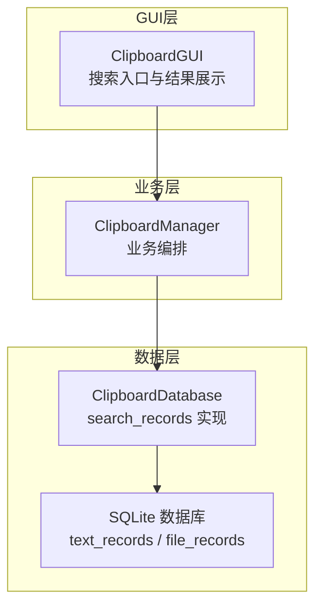
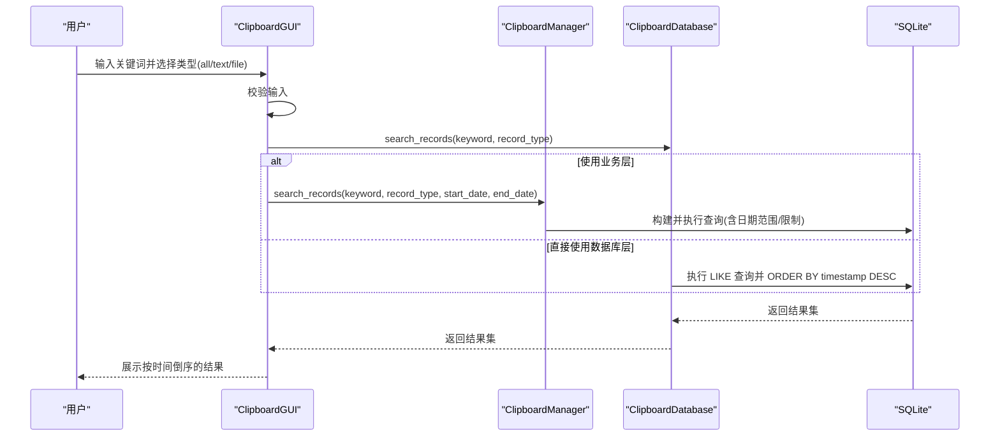
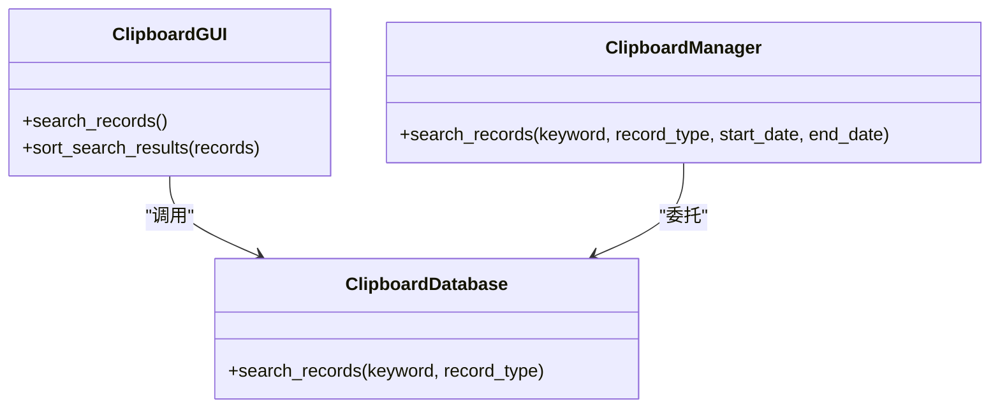
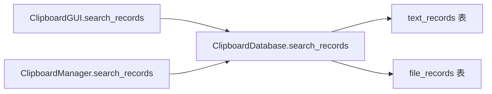

# 搜索机制

<cite>
**本文引用的文件**
- [clipboard_db.py](file://clipboard_db.py)
- [clipboard_manager_main.py](file://clipboard_manager_main.py)
- [clipboard_gui.py](file://clipboard_gui.py)
- [check_indexes.py](file://check_indexes.py)
</cite>

## 目录
1. [简介](#简介)
2. [项目结构](#项目结构)
3. [核心组件](#核心组件)
4. [架构总览](#架构总览)
5. [详细组件分析](#详细组件分析)
6. [依赖关系分析](#依赖关系分析)
7. [性能考量](#性能考量)
8. [故障排查指南](#故障排查指南)
9. [结论](#结论)

## 简介
本文围绕项目中的 search_records 方法展开，系统性解析其实现机制与设计要点，重点覆盖以下方面：
- 三种搜索模式：文本、文件与全局（all）
- 关键词通配符处理（%keyword%）
- 时间倒序排列逻辑
- UNION ALL 合并查询的实现与注意事项
- 不同搜索场景下的 SQL 执行示例
- LIKE 查询的性能影响与优化建议（如全文索引）

## 项目结构
该项目采用“数据库层 + GUI/管理器层”的分层设计。搜索功能主要由数据库层的 search_records 实现，GUI 层负责调用与展示。

图表来源
- [clipboard_gui.py](file://clipboard_gui.py#L652-L716)
- [clipboard_manager_main.py](file://clipboard_manager_main.py#L213-L260)
- [clipboard_db.py](file://clipboard_db.py#L281-L314)

章节来源
- [clipboard_gui.py](file://clipboard_gui.py#L652-L716)
- [clipboard_manager_main.py](file://clipboard_manager_main.py#L213-L260)
- [clipboard_db.py](file://clipboard_db.py#L281-L314)

## 核心组件
- ClipboardDatabase.search_records：统一的搜索入口，支持 text、file、all 三种模式，内置时间倒序与可选日期范围过滤。
- ClipboardManager.search_records：在 GUI 主程序中提供带日期范围与结果上限的搜索实现。
- ClipboardGUI.search_records：GUI 搜索入口，负责触发数据库层搜索并将结果渲染到界面。

章节来源
- [clipboard_db.py](file://clipboard_db.py#L281-L314)
- [clipboard_manager_main.py](file://clipboard_manager_main.py#L213-L260)
- [clipboard_gui.py](file://clipboard_gui.py#L652-L716)

## 架构总览
搜索流程从 GUI 触发，经业务层（可选）再到数据库层，最终返回按时间倒序的结果集。

图表来源
- [clipboard_gui.py](file://clipboard_gui.py#L652-L716)
- [clipboard_manager_main.py](file://clipboard_manager_main.py#L213-L260)
- [clipboard_db.py](file://clipboard_db.py#L281-L314)

## 详细组件分析

### 1) search_records 的三种模式与实现细节
- 文本模式（record_type = "text"）
  - 对 text_records.content 字段执行 LIKE 模糊匹配，通配符位于两端（%keyword%），保证前缀、中间、后缀匹配均生效。
  - 结果按 timestamp 降序排列。
- 文件模式（record_type = "file"）
  - 对 file_records.filename 字段执行 LIKE 模糊匹配，同样使用 %keyword%。
  - 结果按 timestamp 降序排列。
- 全局模式（record_type = "all"）
  - 使用 UNION ALL 合并两个查询：
    - 文本查询：SELECT 'text' as type, id, content as info, timestamp, char_count as size_md5 FROM text_records WHERE content LIKE ?
    - 文件查询：SELECT 'file' as type, id, filename as info, timestamp, md5_hash as size_md5 FROM file_records WHERE filename LIKE ?
  - 两个分支均使用 %keyword% 通配符，最终整体结果按 timestamp 降序排列。

章节来源
- [clipboard_db.py](file://clipboard_db.py#L281-L314)
- [clipboard_manager_main.py](file://clipboard_manager_main.py#L213-L260)

### 2) 参数与通配符处理
- keyword：作为 LIKE 的参数传入，两端自动拼接百分号，形成 %keyword%。
- start_date/end_date（业务层可用）：通过附加 AND 条件限制时间范围，最终仍按 timestamp DESC 排序。
- 结果上限（业务层）：在业务层查询中显式添加 LIMIT 30，避免一次性返回过多数据。

章节来源
- [clipboard_manager_main.py](file://clipboard_manager_main.py#L213-L260)
- [clipboard_db.py](file://clipboard_db.py#L281-L314)

### 3) 时间倒序排列逻辑
- 数据库层：在每种模式下均显式 ORDER BY timestamp DESC。
- 业务层：在 all 模式下，先分别对文本与文件查询进行 LIKE 匹配，再通过 UNION ALL 合并，最后整体 ORDER BY timestamp DESC。
- GUI 层：GUI 的 search_records 会调用数据库层 search_records 并进行二次排序（按界面列进行排序），但数据库层已保证时间倒序的基础顺序。

章节来源
- [clipboard_db.py](file://clipboard_db.py#L281-L314)
- [clipboard_manager_main.py](file://clipboard_manager_main.py#L213-L260)
- [clipboard_gui.py](file://clipboard_gui.py#L652-L716)

### 4) UNION ALL 合并与字段一致性
- 文本分支：返回 type、id、content、timestamp、char_count。
- 文件分支：返回 type、id、filename、timestamp、md5_hash。
- 合并后统一 ORDER BY timestamp DESC，便于前端按时间顺序展示混合结果。

章节来源
- [clipboard_manager_main.py](file://clipboard_manager_main.py#L213-L260)
- [clipboard_db.py](file://clipboard_db.py#L281-L314)

### 5) 不同搜索场景下的 SQL 执行示例
以下为基于源码的 SQL 执行示例（不含具体代码内容，仅描述语义）：
- 文本搜索（keyword="示例"）
  - SQL：SELECT 'text' as type, id, content as info, timestamp FROM text_records WHERE content LIKE ? ORDER BY timestamp DESC
  - 参数：'%示例%'
- 文件搜索（keyword="文档"）
  - SQL：SELECT 'file' as type, id, filename as info, timestamp FROM file_records WHERE filename LIKE ? ORDER BY timestamp DESC
  - 参数：'%文档%'
- 全局搜索（keyword="测试"）
  - SQL：SELECT 'text' as type, id, content as info, timestamp FROM text_records WHERE content LIKE ? UNION ALL SELECT 'file' as type, id, filename as info, timestamp FROM file_records WHERE filename LIKE ? ORDER BY timestamp DESC
  - 参数：('%测试%', '%测试%')
- 带日期范围（业务层）
  - 在上述 SQL 基础上追加 AND timestamp >= ? AND timestamp <= ?，并在末尾添加 ORDER BY timestamp DESC LIMIT 30。

章节来源
- [clipboard_db.py](file://clipboard_db.py#L281-L314)
- [clipboard_manager_main.py](file://clipboard_manager_main.py#L213-L260)

### 6) 类关系与调用链

图表来源
- [clipboard_gui.py](file://clipboard_gui.py#L652-L716)
- [clipboard_manager_main.py](file://clipboard_manager_main.py#L213-L260)
- [clipboard_db.py](file://clipboard_db.py#L281-L314)

## 依赖关系分析
- GUI 层依赖数据库层的 search_records，负责将用户输入转换为数据库查询。
- 业务层提供更丰富的查询能力（日期范围、结果上限），适合在主程序中使用。
- 数据库层提供最基础的 LIKE 查询与时间倒序，确保查询结果的一致性与可预期性。

图表来源
- [clipboard_gui.py](file://clipboard_gui.py#L652-L716)
- [clipboard_manager_main.py](file://clipboard_manager_main.py#L213-L260)
- [clipboard_db.py](file://clipboard_db.py#L281-L314)

章节来源
- [clipboard_gui.py](file://clipboard_gui.py#L652-L716)
- [clipboard_manager_main.py](file://clipboard_manager_main.py#L213-L260)
- [clipboard_db.py](file://clipboard_db.py#L281-L314)

## 性能考量
- LIKE 通配符导致的性能问题
  - 两端通配符（%keyword%）会使 SQLite 无法有效利用索引，通常触发全表扫描，查询成本随数据量增长而显著上升。
- 现状与建议
  - 当前未见全文索引或 FTS5 配置，建议在高频查询字段上考虑：
    - 为 text_records.content 建立全文索引（FTS5），以支持高效的前缀/中缀检索。
    - 为 file_records.filename 建立全文索引（FTS5），提升文件名检索效率。
  - 若无法引入 FTS，可考虑：
    - 为 content/ filename 增加前缀索引（如仅索引前 N 个字符），以支持前缀匹配。
    - 引入二级索引字段（如 content_prefix），在写入时维护，查询时使用前缀匹配。
  - 分页与限制：
    - 业务层已通过 LIMIT 控制返回数量，建议在 GUI 层也保持限制，避免一次性加载过多数据。
  - 时间范围过滤：
    - 通过 start_date/end_date 缩小扫描范围，减少 LIKE 匹配的数据量。
  - 字段选择：
    - 返回字段尽量精简，避免 SELECT *，减少网络与序列化开销。

章节来源
- [clipboard_manager_main.py](file://clipboard_manager_main.py#L213-L260)
- [clipboard_db.py](file://clipboard_db.py#L281-L314)
- [check_indexes.py](file://check_indexes.py#L1-L27)

## 故障排查指南
- 搜索无结果
  - 检查 keyword 是否为空或仅包含空白字符。
  - 确认 record_type 是否正确传入（all/text/file）。
  - 若使用业务层，确认 start_date/end_date 是否合理。
- 性能缓慢
  - 数据量较大时，LIKE 两端通配符会导致全表扫描。建议参考“性能考量”部分进行索引优化。
- 结果顺序异常
  - 数据库层已按 timestamp DESC 排序；若 GUI 层二次排序，需确认排序列映射是否正确。
- 索引缺失
  - 可使用检查脚本查看当前索引情况，评估是否需要新增全文索引或前缀索引。

章节来源
- [clipboard_gui.py](file://clipboard_gui.py#L652-L716)
- [clipboard_manager_main.py](file://clipboard_manager_main.py#L213-L260)
- [clipboard_db.py](file://clipboard_db.py#L281-L314)
- [check_indexes.py](file://check_indexes.py#L1-L27)

## 结论
search_records 方法通过简洁的三模式设计与统一的时间倒序输出，实现了对文本与文件两类历史记录的高效检索。当前实现以 LIKE 通配符为核心，具备良好的易用性与兼容性，但在大数据量场景下存在明显的性能瓶颈。建议优先引入全文索引（FTS5）以提升模糊匹配效率，并结合时间范围过滤与结果上限控制，进一步优化用户体验与系统性能。