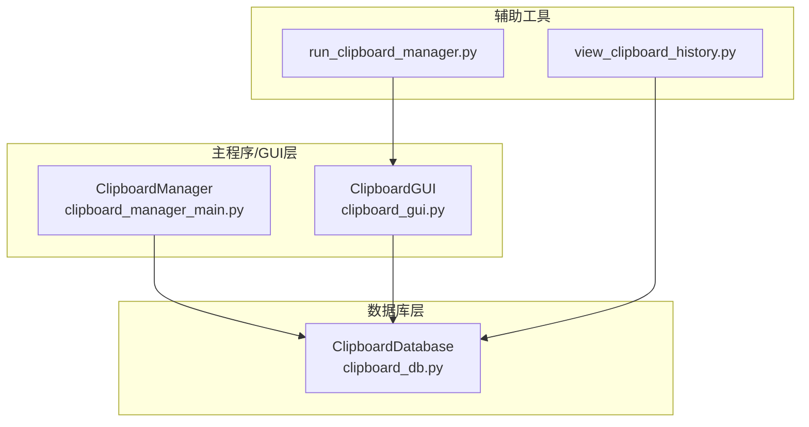
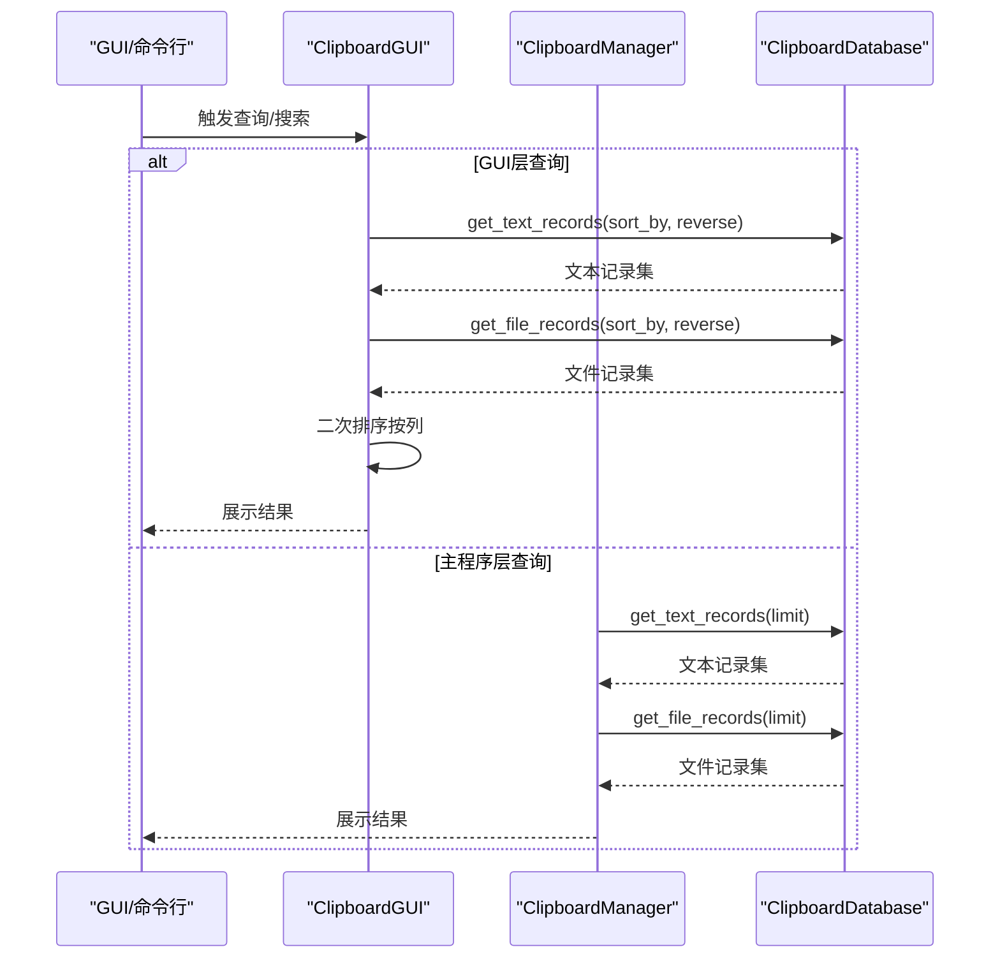
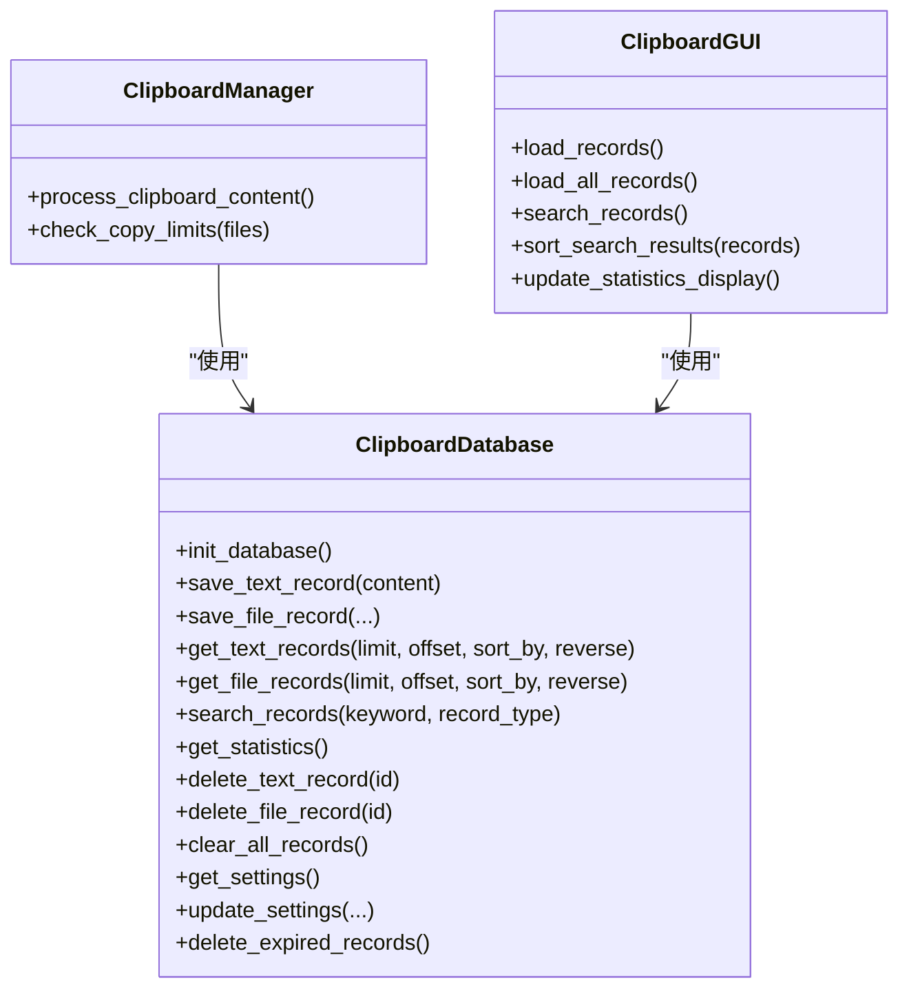
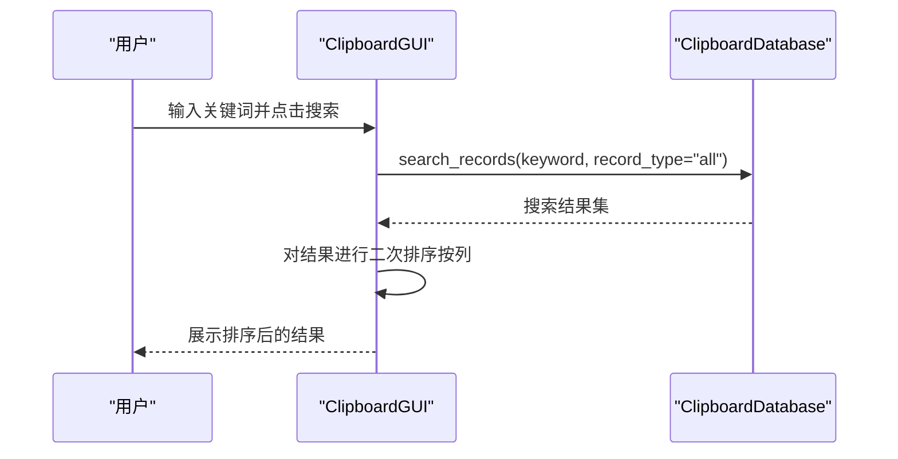

# 数据查询

<cite>
**本文引用的文件**
- [clipboard_db.py](file://clipboard_db.py)
- [clipboard_manager_main.py](file://clipboard_manager_main.py)
- [clipboard_gui.py](file://clipboard_gui.py)
- [view_clipboard_history.py](file://view_clipboard_history.py)
- [run_clipboard_manager.py](file://run_clipboard_manager.py)
</cite>

## 目录
1. [简介](#简介)
2. [项目结构](#项目结构)
3. [核心组件](#核心组件)
4. [架构总览](#架构总览)
5. [详细组件分析](#详细组件分析)
6. [依赖关系分析](#依赖关系分析)
7. [性能考量](#性能考量)
8. [故障排查指南](#故障排查指南)
9. [结论](#结论)
10. [附录](#附录)

## 简介
本文件聚焦于数据查询功能，围绕以下三个方法展开：
- get_text_records：支持分页（limit、offset）与多字段排序（timestamp、content、char_count、number），并根据sort_by与reverse参数动态构建ORDER BY子句。
- get_file_records：支持分页与多字段排序（timestamp、filename、file_size、file_type、number），同样根据sort_by与reverse参数动态构建ORDER BY子句。
- search_records：根据record_type参数执行不同类型的模糊搜索（LIKE查询），并使用UNION ALL同时搜索文本与文件记录。
- get_statistics：通过SQL聚合函数（COUNT与SUM）计算文本记录数量、文件记录数量与总大小。

此外，文档还提供实际查询示例与性能考虑建议，并给出与GUI层交互的序列图，帮助读者理解从界面到数据库的调用链路。

## 项目结构
该项目采用“模块化+分层”的组织方式：
- 数据库访问层：clipboard_db.py 提供SQLite数据库封装与查询接口。
- 主程序与GUI：clipboard_manager_main.py 提供基础查询与GUI集成；clipboard_gui.py 提供增强的GUI查询体验与二次排序。
- 辅助工具：view_clipboard_history.py 提供命令行查看历史记录；run_clipboard_manager.py 提供系统托盘入口与并发监控。

图表来源
- [clipboard_db.py](file://clipboard_db.py#L1-L120)
- [clipboard_manager_main.py](file://clipboard_manager_main.py#L1-L120)
- [clipboard_gui.py](file://clipboard_gui.py#L1-L120)
- [view_clipboard_history.py](file://view_clipboard_history.py#L1-L40)
- [run_clipboard_manager.py](file://run_clipboard_manager.py#L1-L40)

章节来源
- [clipboard_db.py](file://clipboard_db.py#L1-L120)
- [clipboard_manager_main.py](file://clipboard_manager_main.py#L1-L120)
- [clipboard_gui.py](file://clipboard_gui.py#L1-L120)
- [view_clipboard_history.py](file://view_clipboard_history.py#L1-L40)
- [run_clipboard_manager.py](file://run_clipboard_manager.py#L1-L40)

## 核心组件
- ClipboardDatabase：封装数据库初始化、文本/文件记录的增删改查、统计查询与过期清理等。
- ClipboardManager：负责剪贴板监控与内容入库，提供基础查询接口（默认LIMIT）。
- ClipboardGUI：提供GUI界面，支持二次排序与搜索结果排序。

章节来源
- [clipboard_db.py](file://clipboard_db.py#L1-L120)
- [clipboard_manager_main.py](file://clipboard_manager_main.py#L1-L120)
- [clipboard_gui.py](file://clipboard_gui.py#L1-L120)

## 架构总览
查询流程从GUI或命令行触发，最终落到ClipboardDatabase的查询方法上。GUI层可对搜索结果进行二次排序，主程序层提供默认分页策略。

图表来源
- [clipboard_gui.py](file://clipboard_gui.py#L581-L640)
- [clipboard_manager_main.py](file://clipboard_manager_main.py#L181-L211)
- [clipboard_db.py](file://clipboard_db.py#L185-L261)

## 详细组件分析

### get_text_records 方法
- 功能概述
  - 支持分页：当limit为None时返回全部记录；否则返回指定数量记录并支持offset偏移。
  - 支持排序：通过sort_by参数选择排序字段（timestamp、content、char_count、number），reverse控制升序/降序。
  - 动态ORDER BY：根据sort_by与reverse动态拼接ORDER BY子句。
- 参数与行为
  - limit：整数或None。None表示不分页；否则返回LIMIT ? OFFSET ?。
  - offset：整数，默认0。
  - sort_by：字符串，支持"timestamp"、"content"、"char_count"、"number"。
  - reverse：布尔值，True为降序，False为升序。
- 查询逻辑要点
  - 排序方向：reverse决定ORDER BY的ASC/DESC。
  - 排序字段：若sort_by不在白名单，则默认按timestamp排序。
  - 分页：当limit为None时省略LIMIT/OFFSET。
- 性能与索引建议
  - 建议在常用排序字段（如timestamp、content、char_count、number）建立索引以提升排序与过滤性能。
  - 对大数据量场景，优先使用索引覆盖的WHERE条件与ORDER BY字段组合，避免全表扫描。
- 实际查询示例（路径引用）
  - 分页与排序：[clipboard_db.py](file://clipboard_db.py#L185-L218)
  - 默认LIMIT（主程序层）：[clipboard_manager_main.py](file://clipboard_manager_main.py#L181-L195)

章节来源
- [clipboard_db.py](file://clipboard_db.py#L185-L218)
- [clipboard_manager_main.py](file://clipboard_manager_main.py#L181-L195)

### get_file_records 方法
- 功能概述
  - 支持分页与排序：与get_text_records类似，但排序字段包含timestamp、filename、file_size、file_type、number。
  - 动态ORDER BY：根据sort_by与reverse动态拼接ORDER BY子句。
- 参数与行为
  - limit：整数或None。None表示不分页；否则返回LIMIT ? OFFSET ?。
  - offset：整数，默认0。
  - sort_by：字符串，支持"timestamp"、"filename"、"file_size"、"file_type"、"number"。
  - reverse：布尔值，True为降序，False为升序。
- 查询逻辑要点
  - 排序方向：reverse决定ORDER BY的ASC/DESC。
  - 排序字段：若sort_by不在白名单，则默认按timestamp排序。
  - 分页：当limit为None时省略LIMIT/OFFSET。
- 性能与索引建议
  - 建议在file_size、file_type、filename、timestamp等字段建立索引，优化排序与过滤。
- 实际查询示例（路径引用）
  - 分页与排序：[clipboard_db.py](file://clipboard_db.py#L223-L261)
  - 默认LIMIT（主程序层）：[clipboard_manager_main.py](file://clipboard_manager_main.py#L197-L211)

章节来源
- [clipboard_db.py](file://clipboard_db.py#L223-L261)
- [clipboard_manager_main.py](file://clipboard_manager_main.py#L197-L211)

### search_records 方法
- 功能概述
  - 根据record_type参数执行不同类型的模糊搜索（LIKE查询）：
    - text：在text_records.content中搜索。
    - file：在file_records.filename中搜索。
    - all：使用UNION ALL同时搜索文本与文件记录。
  - 返回统一结构：type、id、info（文本记录为content，文件记录为filename）、timestamp。
- 参数与行为
  - keyword：字符串，用于模糊匹配。
  - record_type：字符串，取值为"text"、"file"、"all"。
- 查询逻辑要点
  - text：WHERE content LIKE '%keyword%'，ORDER BY timestamp DESC。
  - file：WHERE filename LIKE '%keyword%'，ORDER BY timestamp DESC。
  - all：两个子查询通过UNION ALL合并，ORDER BY timestamp DESC。
- 性能与索引建议
  - LIKE通配符前缀可能导致索引失效，建议在高频搜索字段上建立全文索引或使用更高效的检索方案（如FTS5）。
  - 若需范围搜索，可在主程序层追加时间范围过滤（主程序层search_records支持start_date/end_date）。
- 实际查询示例（路径引用）
  - 基础版本（仅text/file/all）：[clipboard_db.py](file://clipboard_db.py#L281-L314)
  - 主程序层增强版本（支持日期范围与LIMIT）：[clipboard_manager_main.py](file://clipboard_manager_main.py#L213-L260)

章节来源
- [clipboard_db.py](file://clipboard_db.py#L281-L314)
- [clipboard_manager_main.py](file://clipboard_manager_main.py#L213-L260)

### get_statistics 方法
- 功能概述
  - 通过SQL聚合函数计算：
    - 文本记录数量：COUNT(*)。
    - 文件记录数量与总大小：COUNT(*)与SUM(file_size)。
- 返回值
  - text_count：整数。
  - file_count：整数。
  - total_size：整数（字节），未命中时为0。
- 实际查询示例（路径引用）
  - 基础版本：[clipboard_db.py](file://clipboard_db.py#L316-L332)
  - 主程序层：[clipboard_manager_main.py](file://clipboard_manager_main.py#L262-L278)

章节来源
- [clipboard_db.py](file://clipboard_db.py#L316-L332)
- [clipboard_manager_main.py](file://clipboard_manager_main.py#L262-L278)

## 依赖关系分析
- GUI层与数据库层
  - GUI层通过ClipboardDatabase的查询方法获取数据，并在GUI内进行二次排序与展示。
  - 主程序层通过ClipboardDatabase的查询方法获取数据，并提供默认LIMIT策略。
- 查询方法之间的耦合
  - get_text_records/get_file_records在GUI层被调用，用于按列排序展示。
  - search_records在GUI层被调用，用于关键词搜索，随后GUI层对结果进行二次排序。
- 外部依赖
  - SQLite：作为本地存储引擎。
  - GUI框架：tkinter用于界面展示与交互。
  - Windows剪贴板：win32clipboard用于监控剪贴板内容。

图表来源
- [clipboard_db.py](file://clipboard_db.py#L1-L120)
- [clipboard_manager_main.py](file://clipboard_manager_main.py#L1-L120)
- [clipboard_gui.py](file://clipboard_gui.py#L1-L120)

章节来源
- [clipboard_db.py](file://clipboard_db.py#L1-L120)
- [clipboard_manager_main.py](file://clipboard_manager_main.py#L1-L120)
- [clipboard_gui.py](file://clipboard_gui.py#L1-L120)

## 性能考量
- 索引建议
  - 文本记录：timestamp、content、char_count、number。
  - 文件记录：timestamp、filename、file_size、file_type、md5_hash。
- 查询优化
  - 使用LIMIT/OFFSET时，尽量配合WHERE条件与ORDER BY字段建立索引，避免全表扫描。
  - LIKE通配符前缀可能导致索引失效，建议评估全文检索或前缀索引策略。
  - 聚合查询（COUNT/SUM）在大数据量时应结合WHERE条件缩小范围。
- GUI层二次排序
  - GUI层对搜索结果进行二次排序时，会额外访问数据库获取number等字段，注意网络/IO开销。
- 并发与事务
  - 批量查询时建议使用连接池或减少事务提交频率，避免频繁I/O。

[本节为通用指导，不直接分析具体文件]

## 故障排查指南
- 查询无结果
  - 检查keyword是否为空或过于宽泛；确认record_type与字段匹配。
  - 确认数据库文件路径正确且有读权限。
- 排序异常
  - 确认sort_by参数是否在支持范围内；reverse参数是否符合预期。
  - GUI层二次排序时，数值型字段（大小、次数）可能因格式解析失败导致回退到按时间排序。
- 性能缓慢
  - 为常用排序与过滤字段建立索引。
  - 减少一次性返回大量数据，使用LIMIT分页。
- 统计异常
  - 确认数据库中file_size字段是否为空；SUM对NULL值返回NULL，需做空值处理。

章节来源
- [clipboard_gui.py](file://clipboard_gui.py#L668-L748)
- [clipboard_db.py](file://clipboard_db.py#L316-L332)

## 结论
- get_text_records与get_file_records提供了灵活的分页与多字段排序能力，适合在GUI层按列进行二次排序展示。
- search_records支持按类型与关键词的模糊搜索，并通过UNION ALL整合文本与文件记录，便于统一检索。
- get_statistics通过COUNT与SUM快速汇总文本与文件数据，为界面统计展示提供支撑。
- 建议在高频字段上建立索引，并结合WHERE条件与LIMIT优化查询性能。

[本节为总结，不直接分析具体文件]

## 附录

### 实际查询示例（路径引用）
- 文本记录分页与排序
  - [clipboard_db.py](file://clipboard_db.py#L185-L218)
- 文件记录分页与排序
  - [clipboard_db.py](file://clipboard_db.py#L223-L261)
- 搜索记录（text/file/all）
  - [clipboard_db.py](file://clipboard_db.py#L281-L314)
- 统计信息（COUNT/SUM）
  - [clipboard_db.py](file://clipboard_db.py#L316-L332)

### GUI层查询流程（序列图）

图表来源
- [clipboard_gui.py](file://clipboard_gui.py#L652-L748)
- [clipboard_db.py](file://clipboard_db.py#L281-L314)