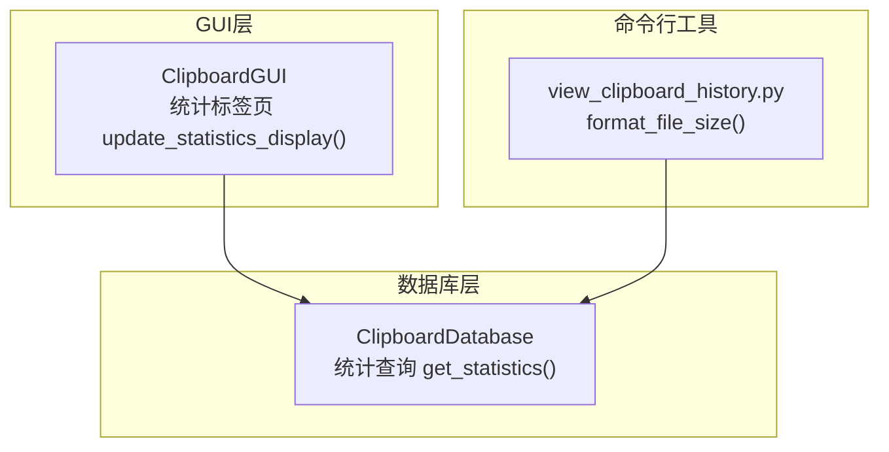
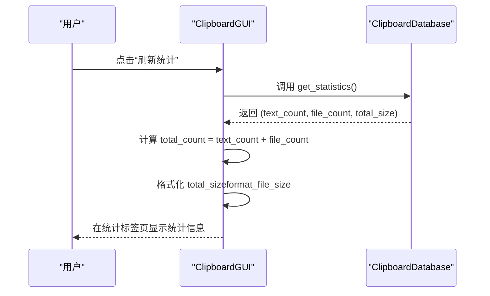
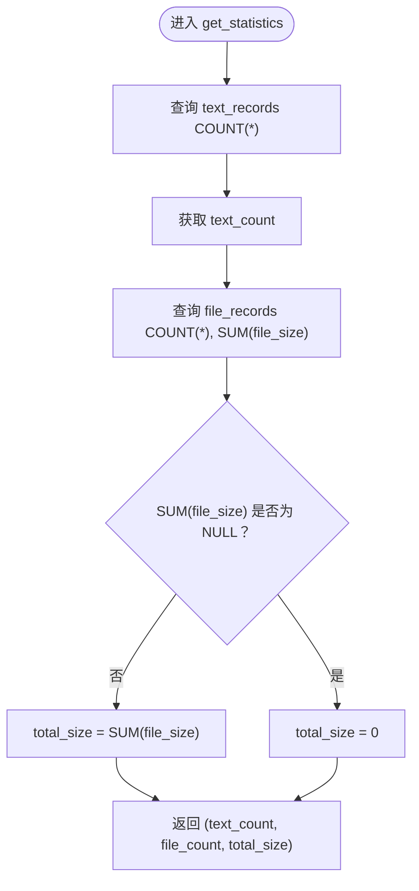
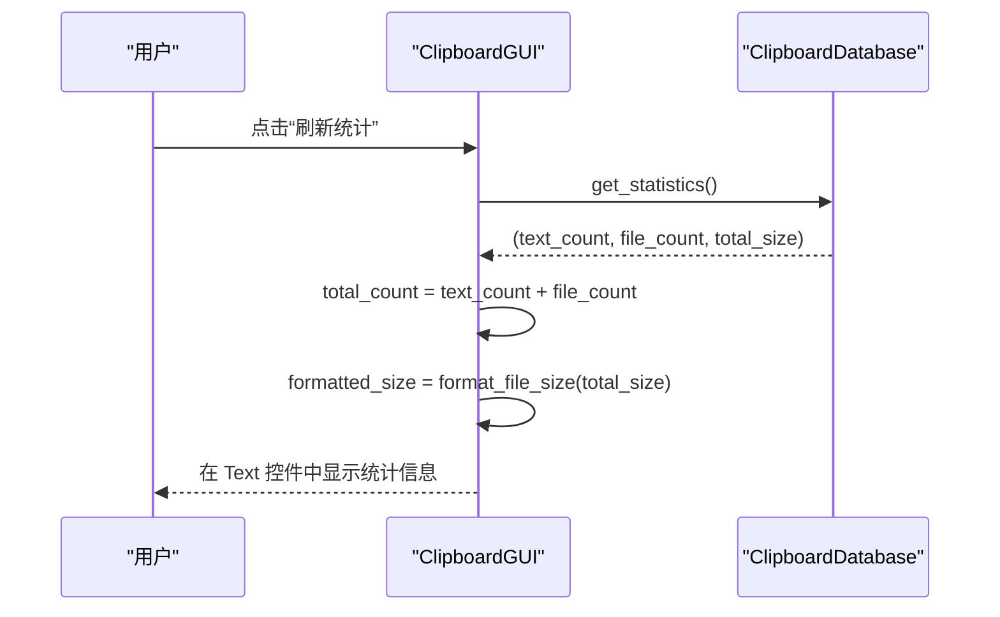
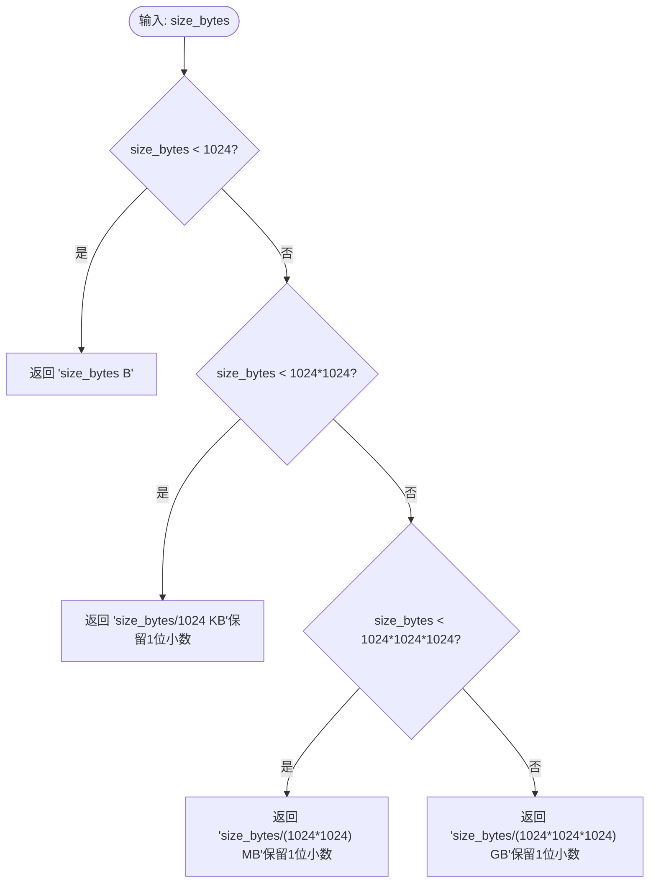
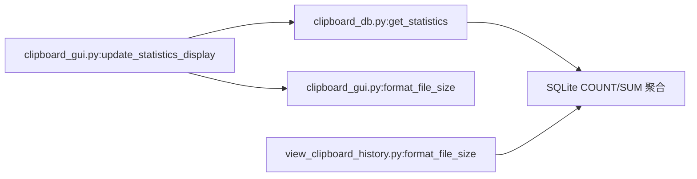

# 统计查询

<cite>
**本文引用的文件**
- [clipboard_db.py](file://clipboard_db.py)
- [clipboard_gui.py](file://clipboard_gui.py)
- [view_clipboard_history.py](file://view_clipboard_history.py)
- [clipboard_manager_main.py](file://clipboard_manager_main.py)
</cite>

## 目录
1. [简介](#简介)
2. [项目结构](#项目结构)
3. [核心组件](#核心组件)
4. [架构概览](#架构概览)
5. [详细组件分析](#详细组件分析)
6. [依赖分析](#依赖分析)
7. [性能考虑](#性能考虑)
8. [故障排查指南](#故障排查指南)
9. [结论](#结论)
10. [附录](#附录)

## 简介
本章节聚焦于统计查询实现，详细说明 get_statistics 方法如何通过 COUNT(*) 聚合函数统计文本记录与文件记录数量，并使用 SUM(file_size) 计算文件总存储大小；解释其在返回结果中处理空值（如无文件记录时 total_size 为 0）的逻辑；分析该方法在统计标签页中的使用场景；给出性能评估与优化建议；并展示返回数据结构及 GUI 界面中的展示方式（数值格式化与单位转换）。

## 项目结构
- 数据库层：负责数据库初始化、记录增删改查、统计查询等。
- GUI 层：提供统计标签页，调用数据库层统计接口并格式化展示。
- 命令行工具：提供独立的查看脚本，演示统计信息的输出与格式化。

图表来源
- [clipboard_db.py](file://clipboard_db.py#L316-L332)
- [clipboard_gui.py](file://clipboard_gui.py#L555-L580)
- [view_clipboard_history.py](file://view_clipboard_history.py#L1-L20)

章节来源
- [clipboard_db.py](file://clipboard_db.py#L1-L120)
- [clipboard_gui.py](file://clipboard_gui.py#L170-L220)
- [view_clipboard_history.py](file://view_clipboard_history.py#L1-L20)

## 核心组件
- 统计查询方法：在数据库层提供 get_statistics，分别对 text_records 表执行 COUNT(*)，对 file_records 表执行 COUNT(*) 与 SUM(file_size)，并处理空值返回。
- GUI 统计标签页：在统计标签页中调用 get_statistics，汇总文本记录数、文件记录数与累计大小，并格式化显示。
- 文件大小格式化：提供统一的 format_file_size 函数，将字节转换为 B/KB/MB/GB 的人类可读格式。

章节来源
- [clipboard_db.py](file://clipboard_db.py#L316-L332)
- [clipboard_gui.py](file://clipboard_gui.py#L555-L580)
- [view_clipboard_history.py](file://view_clipboard_history.py#L10-L20)

## 架构概览
统计查询在 GUI 中的典型调用流程如下：

图表来源
- [clipboard_gui.py](file://clipboard_gui.py#L555-L580)
- [clipboard_db.py](file://clipboard_db.py#L316-L332)

## 详细组件分析

### 统计查询实现（get_statistics）
- 功能概述
  - 统计文本记录数量：对 text_records 表执行 COUNT(*)。
  - 统计文件记录数量与总大小：对 file_records 表执行 COUNT(*) 与 SUM(file_size)。
  - 空值处理：当 SUM(file_size) 为 NULL（无文件记录）时，返回 0。
- 返回值
  - 返回三元组：(text_count, file_count, total_size)。
- 查询复杂度
  - COUNT(*) 与 SUM(file_size) 均为聚合函数，通常会进行全表扫描；但由于数据量有限，查询效率可接受。

图表来源
- [clipboard_db.py](file://clipboard_db.py#L316-L332)

章节来源
- [clipboard_db.py](file://clipboard_db.py#L316-L332)

### GUI 统计标签页使用
- 触发时机
  - 用户点击“刷新统计”按钮时触发 update_statistics_display。
- 数据处理
  - 调用 get_statistics 获取统计结果。
  - 计算 total_count = text_count + file_count。
  - 使用 format_file_size 将 total_size 转换为 B/KB/MB/GB。
- 展示内容
  - 文本记录数、文件记录数、总计数、累计大小、数据库文件路径等。

图表来源
- [clipboard_gui.py](file://clipboard_gui.py#L555-L580)
- [clipboard_db.py](file://clipboard_db.py#L316-L332)

章节来源
- [clipboard_gui.py](file://clipboard_gui.py#L309-L327)
- [clipboard_gui.py](file://clipboard_gui.py#L555-L580)

### 文件大小格式化（B/KB/MB/GB）
- 实现位置
  - GUI 层：ClipboardGUI.format_file_size。
  - 命令行工具：view_clipboard_history.format_file_size。
- 单位转换规则
  - 小于 1024 字节：显示为 B。
  - 小于 1024^2 字节：显示为 KB（保留一位小数）。
  - 小于 1024^3 字节：显示为 MB（保留一位小数）。
  - 否则：显示为 GB（保留一位小数）。
- 使用场景
  - 统计标签页展示累计大小。
  - 记录列表中文件大小显示。
  - 命令行输出统计信息。

图表来源
- [clipboard_gui.py](file://clipboard_gui.py#L878-L889)
- [view_clipboard_history.py](file://view_clipboard_history.py#L10-L20)

章节来源
- [clipboard_gui.py](file://clipboard_gui.py#L878-L889)
- [view_clipboard_history.py](file://view_clipboard_history.py#L10-L20)

### 数据结构与展示
- 返回数据结构
  - 元组：(text_count, file_count, total_size)
  - 字段含义：
    - text_count：文本记录数量。
    - file_count：文件记录数量。
    - total_size：文件总大小（字节），无文件记录时为 0。
- GUI 展示
  - 统计标签页使用 Text 控件展示统计信息，包含：
    - 文本记录数、文件记录数、总计数、累计大小、数据库文件路径。
  - 记录列表中文件大小使用 format_file_size 进行单位转换。

章节来源
- [clipboard_db.py](file://clipboard_db.py#L316-L332)
- [clipboard_gui.py](file://clipboard_gui.py#L555-L580)
- [clipboard_gui.py](file://clipboard_gui.py#L609-L616)
- [clipboard_gui.py](file://clipboard_gui.py#L689-L699)

## 依赖分析
- 统计查询依赖
  - ClipboardDatabase.get_statistics 依赖 SQLite 的 COUNT(*) 与 SUM 聚合函数。
  - 依赖 file_records 表的 file_size 字段。
- GUI 依赖
  - ClipboardGUI.update_statistics_display 依赖 ClipboardDatabase.get_statistics。
  - ClipboardGUI.format_file_size 用于格式化显示。
- 命令行工具依赖
  - view_clipboard_history.format_file_size 用于命令行输出。

图表来源
- [clipboard_db.py](file://clipboard_db.py#L316-L332)
- [clipboard_gui.py](file://clipboard_gui.py#L555-L580)
- [clipboard_gui.py](file://clipboard_gui.py#L878-L889)
- [view_clipboard_history.py](file://view_clipboard_history.py#L10-L20)

章节来源
- [clipboard_db.py](file://clipboard_db.py#L316-L332)
- [clipboard_gui.py](file://clipboard_gui.py#L555-L580)
- [clipboard_gui.py](file://clipboard_gui.py#L878-L889)
- [view_clipboard_history.py](file://view_clipboard_history.py#L10-L20)

## 性能考虑
- 查询特征
  - COUNT(*) 与 SUM(file_size) 通常会进行全表扫描。
- 数据规模
  - 项目为本地剪贴板历史记录管理，数据量有限，全表扫描带来的性能影响可接受。
- 优化建议
  - 若未来数据量增长显著，可在 file_records 上建立 file_size 字段的索引以加速 SUM 聚合（需权衡写入成本与查询收益）。
  - 将统计结果缓存至内存，在短时间内多次刷新统计时避免重复查询。
  - 将 COUNT 与 SUM 合并为单次查询（当前已合并），减少往返开销。

[本节为通用性能讨论，不直接分析具体文件，故无章节来源]

## 故障排查指南
- 无文件记录导致 total_size 为 0
  - 现象：SUM(file_size) 为 NULL，get_statistics 返回 total_size 为 0。
  - 处理：代码中已显式判断并赋值为 0，属预期行为。
- 统计标签页未显示累计大小
  - 检查是否点击了“刷新统计”按钮。
  - 检查 GUI 是否正确调用 get_statistics 并使用 format_file_size。
- 文件大小显示异常
  - 检查 format_file_size 的输入是否为字节数。
  - 检查 GUI 中是否正确调用 format_file_size。

章节来源
- [clipboard_db.py](file://clipboard_db.py#L316-L332)
- [clipboard_gui.py](file://clipboard_gui.py#L555-L580)
- [clipboard_gui.py](file://clipboard_gui.py#L878-L889)

## 结论
- get_statistics 通过 COUNT(*) 与 SUM(file_size) 实现文本与文件记录数量及总大小的统计，并在无文件记录时正确处理空值。
- GUI 统计标签页负责调用统计接口并格式化展示，提供直观的统计信息。
- 当前实现针对本地小规模数据具备良好性能；若数据量增长，可考虑索引与缓存策略提升效率。

[本节为总结性内容，不直接分析具体文件，故无章节来源]

## 附录
- 关键实现位置参考
  - 统计查询：[clipboard_db.py](file://clipboard_db.py#L316-L332)
  - GUI 刷新统计：[clipboard_gui.py](file://clipboard_gui.py#L555-L580)
  - 文件大小格式化（GUI）：[clipboard_gui.py](file://clipboard_gui.py#L878-L889)
  - 文件大小格式化（CLI）：[view_clipboard_history.py](file://view_clipboard_history.py#L10-L20)
  - 文件大小格式化（主程序）：[clipboard_manager_main.py](file://clipboard_manager_main.py#L343-L354)