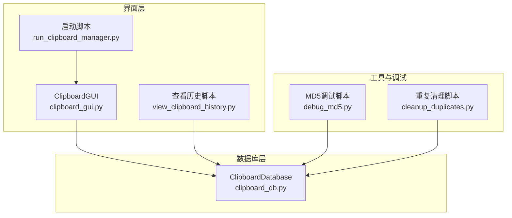
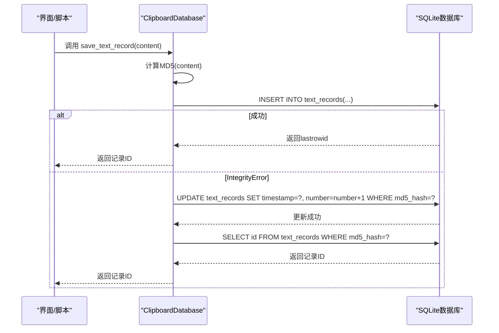
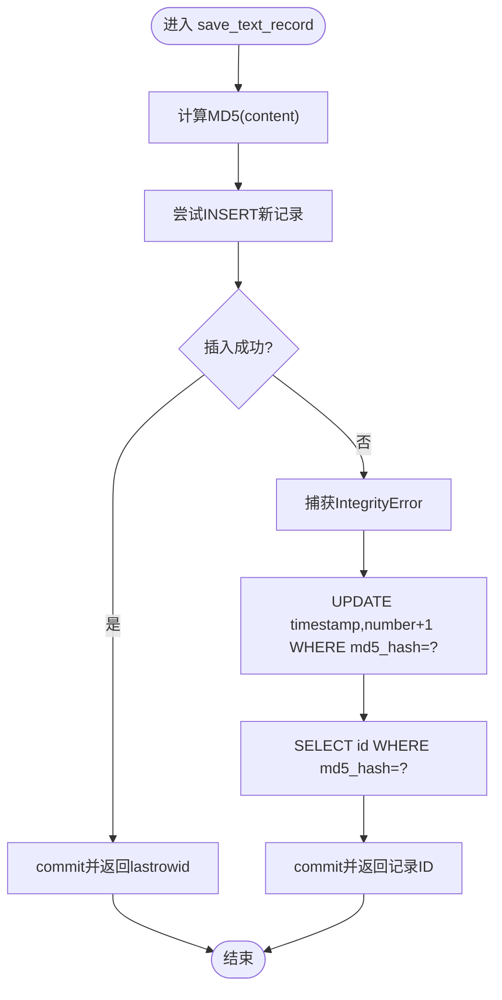
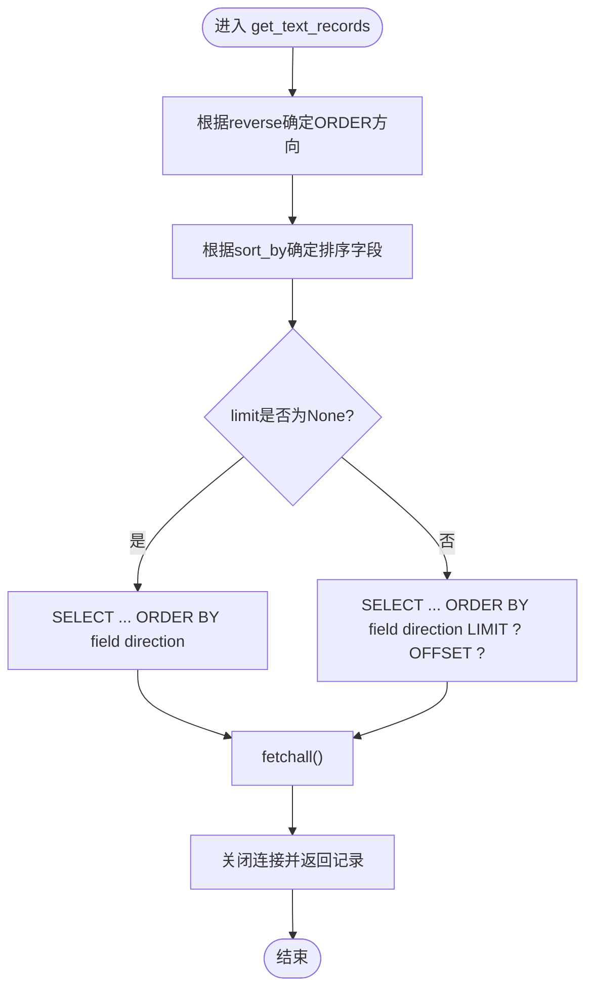
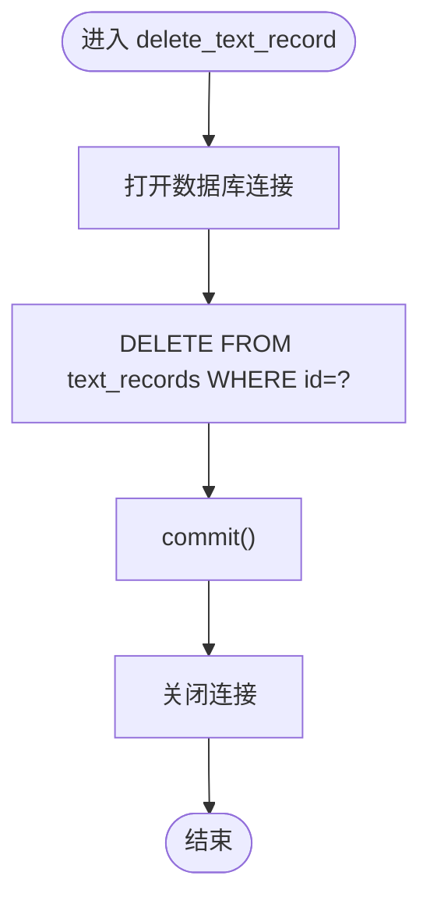
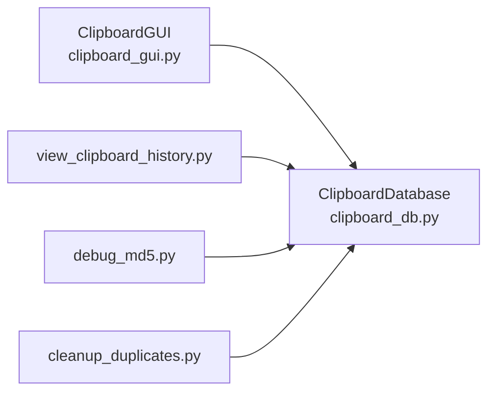

# 文本记录管理

<cite>
**本文引用的文件**
- [clipboard_db.py](file://clipboard_db.py)
- [clipboard_manager_main.py](file://clipboard_manager_main.py)
- [clipboard_gui.py](file://clipboard_gui.py)
- [view_clipboard_history.py](file://view_clipboard_history.py)
- [debug_md5.py](file://debug_md5.py)
- [cleanup_duplicates.py](file://cleanup_duplicates.py)
- [run_clipboard_manager.py](file://run_clipboard_manager.py)
</cite>

## 目录
1. [简介](#简介)
2. [项目结构](#项目结构)
3. [核心组件](#核心组件)
4. [架构总览](#架构总览)
5. [详细组件分析](#详细组件分析)
6. [依赖关系分析](#依赖关系分析)
7. [性能考量](#性能考量)
8. [故障排查指南](#故障排查指南)
9. [结论](#结论)
10. [附录：实际代码示例路径](#附录实际代码示例路径)

## 简介
本文件围绕“文本记录管理”功能展开，重点说明以下方面：
- save_text_record 方法的事务处理机制：如何计算文本内容的MD5哈希值，并尝试插入新记录；当遇到 sqlite3.IntegrityError 异常时，如何执行 UPDATE 操作来更新时间戳并增加引用计数 number。
- get_text_records 方法的分页与排序实现：如何根据 sort_by 参数动态构建 SQL 查询语句，并通过 reverse 参数控制排序方向。
- delete_text_record 方法的实现细节：强调数据完整性维护。
- 提供实际代码示例的路径，帮助读者快速定位到相应实现。

## 项目结构
该项目采用模块化设计，数据库访问集中在 clipboard_db.py 中，GUI 交互在 clipboard_gui.py 中，命令行工具在 view_clipboard_history.py 中，另有调试与清理脚本辅助验证功能。

图表来源
- [clipboard_db.py](file://clipboard_db.py#L1-L115)
- [clipboard_gui.py](file://clipboard_gui.py#L1-L120)
- [view_clipboard_history.py](file://view_clipboard_history.py#L1-L75)
- [run_clipboard_manager.py](file://run_clipboard_manager.py#L1-L71)
- [debug_md5.py](file://debug_md5.py#L1-L56)
- [cleanup_duplicates.py](file://cleanup_duplicates.py#L1-L67)

章节来源
- [clipboard_db.py](file://clipboard_db.py#L1-L115)
- [clipboard_gui.py](file://clipboard_gui.py#L1-L120)
- [view_clipboard_history.py](file://view_clipboard_history.py#L1-L75)
- [run_clipboard_manager.py](file://run_clipboard_manager.py#L1-L71)
- [debug_md5.py](file://debug_md5.py#L1-L56)
- [cleanup_duplicates.py](file://cleanup_duplicates.py#L1-L67)

## 核心组件
- 数据库访问类 ClipboardDatabase：封装数据库初始化、文本记录的保存、查询、删除等操作。
- GUI 界面 ClipboardGUI：负责记录的展示、排序、搜索、删除等交互。
- 命令行查看器 view_clipboard_history.py：提供简洁的历史记录查看与统计。
- 调试与清理脚本：debug_md5.py 用于验证 MD5 去重与计数逻辑；cleanup_duplicates.py 用于修复历史重复记录。

章节来源
- [clipboard_db.py](file://clipboard_db.py#L1-L115)
- [clipboard_gui.py](file://clipboard_gui.py#L580-L680)
- [view_clipboard_history.py](file://view_clipboard_history.py#L1-L75)
- [debug_md5.py](file://debug_md5.py#L1-L56)
- [cleanup_duplicates.py](file://cleanup_duplicates.py#L1-L67)

## 架构总览
文本记录管理涉及三层交互：界面层触发操作，数据库层执行持久化，工具层辅助验证与维护。

图表来源
- [clipboard_db.py](file://clipboard_db.py#L116-L151)

章节来源
- [clipboard_db.py](file://clipboard_db.py#L116-L151)

## 详细组件分析

### save_text_record 方法：事务处理与去重计数
- 功能概述
  - 计算传入文本内容的 MD5 哈希值。
  - 使用本地时间而非 UTC 时间。
  - 尝试插入新记录；若因唯一约束冲突抛出 sqlite3.IntegrityError，则转而执行 UPDATE，更新时间戳并递增 number 字段。
  - 返回受影响记录的 ID。
- 关键点
  - 唯一性约束：数据库表 text_records 的 md5_hash 字段具备唯一性约束，用于去重。
  - 异常处理：捕获 IntegrityError 并回退到 UPDATE 流程。
  - 事务边界：每个调用在内部建立连接、提交/关闭，保证单次调用的原子性。
- 实现路径
  - [save_text_record](file://clipboard_db.py#L116-L151)

图表来源
- [clipboard_db.py](file://clipboard_db.py#L116-L151)

章节来源
- [clipboard_db.py](file://clipboard_db.py#L116-L151)

### get_text_records 方法：分页与排序
- 功能概述
  - 支持 limit、offset 控制分页。
  - 支持 sort_by 动态选择排序字段，reverse 控制升/降序。
  - 返回包含 id、content、timestamp、char_count、md5_hash、number 的记录集。
- 排序逻辑
  - sort_by 支持 content、char_count、number、timestamp；未匹配时默认按 timestamp 排序。
  - reverse 为 True 时降序（最新在前），False 时升序。
- 分页逻辑
  - 当 limit 为 None 时，查询全部记录；否则使用 LIMIT ? OFFSET ? 实现分页。
- 实现路径
  - [get_text_records](file://clipboard_db.py#L185-L221)

图表来源
- [clipboard_db.py](file://clipboard_db.py#L185-L221)

章节来源
- [clipboard_db.py](file://clipboard_db.py#L185-L221)

### delete_text_record 方法：数据完整性维护
- 功能概述
  - 根据记录 ID 删除 text_records 表中的对应记录。
  - 该方法不涉及外键级联删除，因此不会影响其他表。
- 数据完整性
  - 删除前可由上层逻辑决定是否需要同步删除外部文件（例如文件记录场景下的文件删除）。
  - 本方法仅负责数据库层面的删除。
- 实现路径
  - [delete_text_record](file://clipboard_db.py#L334-L341)

图表来源
- [clipboard_db.py](file://clipboard_db.py#L334-L341)

章节来源
- [clipboard_db.py](file://clipboard_db.py#L334-L341)

### GUI 层对 get_text_records 的使用与排序
- GUI 层在 ClipboardGUI 中调用 get_text_records，并将界面列名映射到数据库字段名，再结合 reverse 参数进行排序。
- 列名映射规则：
  - 名称或内容 -> content
  - 类型 -> file_type
  - 大小 -> file_size
  - 时间 -> timestamp
  - 次数 -> number
- 实现路径
  - [load_all_records](file://clipboard_gui.py#L581-L626)
  - [get_db_sort_field](file://clipboard_gui.py#L627-L637)

章节来源
- [clipboard_gui.py](file://clipboard_gui.py#L581-L637)

### 文件记录对比：save_file_record 的事务处理
- 为便于理解 save_text_record 的事务处理，可对照 save_file_record 的实现：
  - 同样会计算 md5_hash 并尝试 INSERT。
  - 若 IntegrityError，则 UPDATE timestamp、number 等字段。
- 实现路径
  - [save_file_record](file://clipboard_db.py#L152-L183)

章节来源
- [clipboard_db.py](file://clipboard_db.py#L152-L183)

## 依赖关系分析
- ClipboardDatabase 是核心依赖点，被 GUI、命令行脚本、调试脚本共同使用。
- GUI 通过 get_text_records、get_file_records、search_records 等方法获取数据；删除操作通过 delete_text_record、delete_file_record 触发。
- 调试与清理脚本独立于主流程，用于验证与修复数据一致性。

图表来源
- [clipboard_gui.py](file://clipboard_gui.py#L1-L120)
- [clipboard_db.py](file://clipboard_db.py#L1-L115)
- [view_clipboard_history.py](file://view_clipboard_history.py#L1-L75)
- [debug_md5.py](file://debug_md5.py#L1-L56)
- [cleanup_duplicates.py](file://cleanup_duplicates.py#L1-L67)

章节来源
- [clipboard_gui.py](file://clipboard_gui.py#L1-L120)
- [clipboard_db.py](file://clipboard_db.py#L1-L115)
- [view_clipboard_history.py](file://view_clipboard_history.py#L1-L75)
- [debug_md5.py](file://debug_md5.py#L1-L56)
- [cleanup_duplicates.py](file://cleanup_duplicates.py#L1-L67)

## 性能考量
- 哈希计算：MD5 计算为 O(n)，其中 n 为文本长度；建议避免对超长文本频繁重复计算，可在上层做缓存或去重判断。
- 唯一索引：text_records 的 md5_hash 字段具备唯一性约束，有助于快速去重；但 INSERT/UPDATE 的组合仍可能产生写放大，建议在高并发场景下评估锁竞争。
- 排序与分页：LIMIT/OFFSET 在大数据量下可能带来扫描成本；如需更高效分页，可考虑基于游标或基于主键范围的分页策略。
- IO 与连接：每次操作均新建连接并在结束后关闭，简单可靠；在高频调用场景下可考虑连接池优化。

## 故障排查指南
- MD5 去重无效
  - 现象：相同文本多次保存后 number 未增加。
  - 排查要点：
    - 确认数据库表结构中 md5_hash 字段具备唯一性约束。
    - 检查 save_text_record 是否正确捕获 IntegrityError 并执行 UPDATE。
  - 参考路径
    - [save_text_record](file://clipboard_db.py#L116-L151)
    - [debug_md5.py](file://debug_md5.py#L1-L56)
- 重复记录过多
  - 现象：相同 md5_hash 出现多条记录。
  - 排查要点：
    - 使用 cleanup_duplicates.py 修复历史重复记录。
  - 参考路径
    - [cleanup_duplicates.py](file://cleanup_duplicates.py#L1-L67)
- 排序不符合预期
  - 现象：界面排序与数据库排序不一致。
  - 排查要点：
    - 确认 GUI 的列名映射与 get_text_records 的 sort_by 逻辑一致。
  - 参考路径
    - [get_db_sort_field](file://clipboard_gui.py#L627-L637)
    - [get_text_records](file://clipboard_db.py#L185-L221)
- 删除后残留文件
  - 现象：删除文件记录后本地文件未被清理。
  - 排查要点：
    - delete_text_record 仅删除数据库记录，不负责删除文件；文件删除通常在文件记录场景下由上层逻辑处理。
  - 参考路径
    - [delete_text_record](file://clipboard_db.py#L334-L341)

章节来源
- [clipboard_db.py](file://clipboard_db.py#L116-L151)
- [debug_md5.py](file://debug_md5.py#L1-L56)
- [cleanup_duplicates.py](file://cleanup_duplicates.py#L1-L67)
- [clipboard_gui.py](file://clipboard_gui.py#L627-L637)
- [clipboard_db.py](file://clipboard_db.py#L334-L341)

## 结论
- save_text_record 通过 MD5 去重与 number 计数实现了高效的重复检测与引用计数，配合 IntegrityError 回退逻辑保证了数据一致性。
- get_text_records 提供灵活的排序与分页能力，满足不同场景下的查询需求。
- delete_text_record 简洁明确地执行数据库删除，不涉及外部文件清理，符合单一职责原则。
- 建议在高并发或大数据量场景下进一步优化索引与分页策略，并在上层做好缓存与批量处理。

## 附录：实际代码示例路径
- 保存文本记录（含 MD5 去重与计数）
  - [save_text_record](file://clipboard_db.py#L116-L151)
- 获取文本记录（分页与排序）
  - [get_text_records](file://clipboard_db.py#L185-L221)
- 删除文本记录（数据完整性维护）
  - [delete_text_record](file://clipboard_db.py#L334-L341)
- GUI 层排序与分页调用
  - [load_all_records](file://clipboard_gui.py#L581-L626)
  - [get_db_sort_field](file://clipboard_gui.py#L627-L637)
- 命令行查看历史
  - [view_history](file://view_clipboard_history.py#L21-L75)
- MD5 去重与计数调试
  - [debug_text_md5_feature](file://debug_md5.py#L11-L56)
- 重复记录清理
  - [cleanup_duplicates](file://cleanup_duplicates.py#L1-L67)