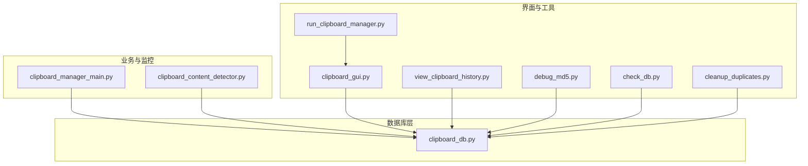
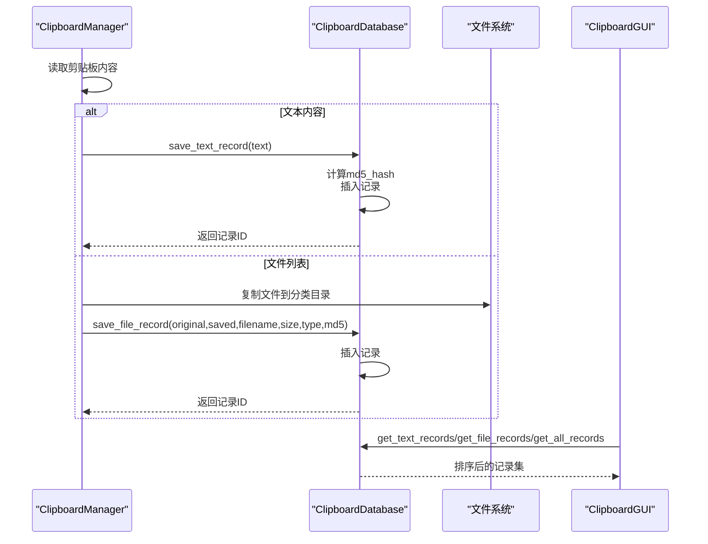
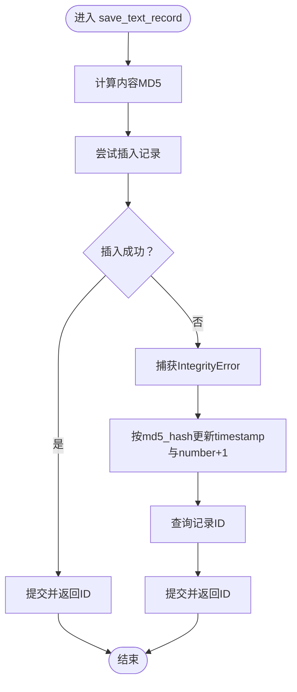
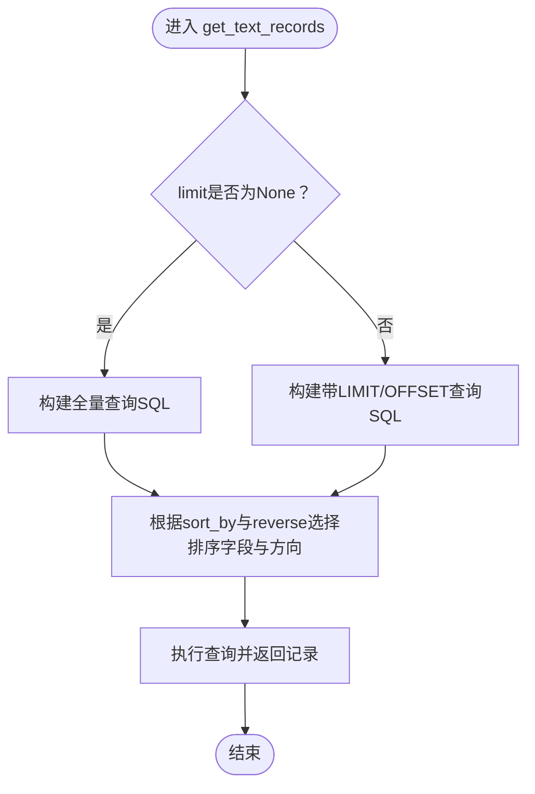
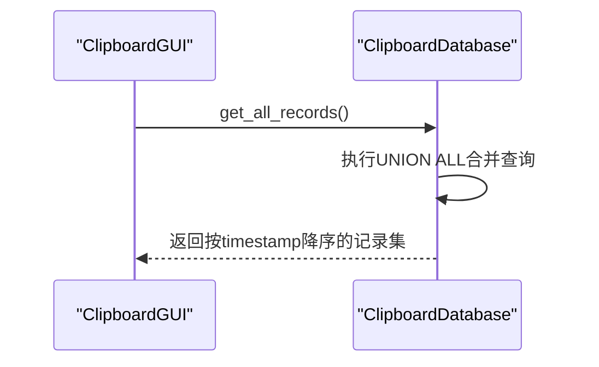
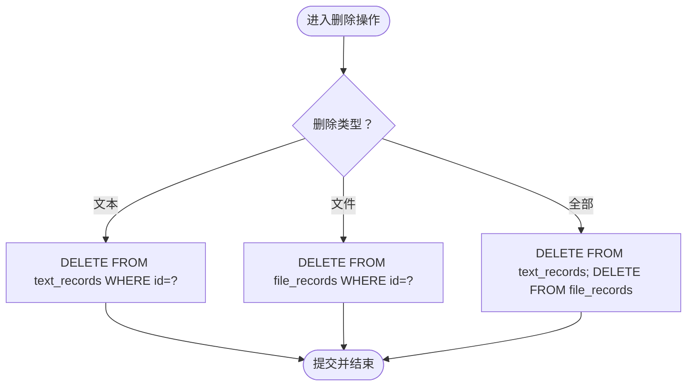
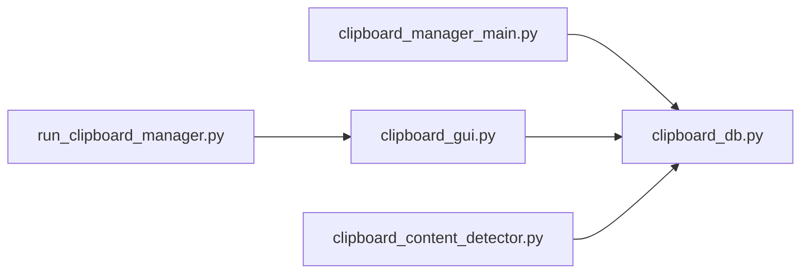

# 记录管理

<cite>
**本文引用的文件**
- [clipboard_db.py](file://clipboard_db.py)
- [clipboard_manager_main.py](file://clipboard_manager_main.py)
- [clipboard_gui.py](file://clipboard_gui.py)
- [view_clipboard_history.py](file://view_clipboard_history.py)
- [clipboard_content_detector.py](file://clipboard_content_detector.py)
- [debug_md5.py](file://debug_md5.py)
- [check_db.py](file://check_db.py)
- [cleanup_duplicates.py](file://cleanup_duplicates.py)
- [run_clipboard_manager.py](file://run_clipboard_manager.py)
</cite>

## 目录
1. [简介](#简介)
2. [项目结构](#项目结构)
3. [核心组件](#核心组件)
4. [架构总览](#架构总览)
5. [详细组件分析](#详细组件分析)
6. [依赖关系分析](#依赖关系分析)
7. [性能考量](#性能考量)
8. [故障排查指南](#故障排查指南)
9. [结论](#结论)
10. [附录](#附录)

## 简介
本文件聚焦“记录管理”功能，围绕以下目标展开：
- 详解 save_text_record 与 save_file_record 的事务处理机制与去重更新逻辑
- 说明 get_text_records 与 get_file_records 的分页与排序实现
- 解释 get_all_records 的合并查询与排序策略
- 描述 delete_text_record、delete_file_record、clear_all_records 的删除流程与数据完整性维护
- 提供实际代码示例路径，帮助快速定位实现细节

## 项目结构
该项目采用“模块化+多入口”的组织方式：
- 数据库层：clipboard_db.py 提供 SQLite 表结构、CRUD 与统计接口
- 主程序与监控：clipboard_manager_main.py 实现剪贴板监控、内容识别与保存
- GUI 界面：clipboard_gui.py 提供记录浏览、搜索、设置与统计
- 辅助工具：view_clipboard_history.py、debug_md5.py、check_db.py、cleanup_duplicates.py 等
- 启动入口：run_clipboard_manager.py 支持系统托盘与多线程运行

图表来源
- [clipboard_db.py](file://clipboard_db.py#L1-L200)
- [clipboard_manager_main.py](file://clipboard_manager_main.py#L1-L200)
- [clipboard_gui.py](file://clipboard_gui.py#L1-L200)
- [view_clipboard_history.py](file://view_clipboard_history.py#L1-L75)
- [clipboard_content_detector.py](file://clipboard_content_detector.py#L1-L120)
- [debug_md5.py](file://debug_md5.py#L1-L56)
- [check_db.py](file://check_db.py#L1-L31)
- [cleanup_duplicates.py](file://cleanup_duplicates.py#L1-L67)
- [run_clipboard_manager.py](file://run_clipboard_manager.py#L1-L71)

章节来源
- [clipboard_db.py](file://clipboard_db.py#L1-L120)
- [clipboard_manager_main.py](file://clipboard_manager_main.py#L1-L120)
- [clipboard_gui.py](file://clipboard_gui.py#L1-L120)
- [view_clipboard_history.py](file://view_clipboard_history.py#L1-L75)
- [clipboard_content_detector.py](file://clipboard_content_detector.py#L1-L120)
- [debug_md5.py](file://debug_md5.py#L1-L56)
- [check_db.py](file://check_db.py#L1-L31)
- [cleanup_duplicates.py](file://cleanup_duplicates.py#L1-L67)
- [run_clipboard_manager.py](file://run_clipboard_manager.py#L1-L71)

## 核心组件
- ClipboardDatabase：封装数据库初始化、文本/文件记录的保存、查询、统计、删除与过期清理
- ClipboardManager：负责剪贴板监控、内容识别、文件 MD5 计算与保存
- ClipboardGUI：提供记录浏览、搜索、排序、设置与统计展示
- 视图与工具脚本：辅助查看历史、调试 MD5、检查重复、清理重复

章节来源
- [clipboard_db.py](file://clipboard_db.py#L1-L120)
- [clipboard_manager_main.py](file://clipboard_manager_main.py#L1-L120)
- [clipboard_gui.py](file://clipboard_gui.py#L1-L120)

## 架构总览
记录管理贯穿“监控采集—去重更新—持久化—查询展示”的闭环流程。核心要点：
- 采集阶段：clipboard_manager_main.py 读取剪贴板，区分文本与文件，计算 MD5 并调用数据库保存
- 去重更新：clipboard_db.py 的 save_text_record/save_file_record 通过 md5_hash 唯一约束与 IntegrityError 异常处理实现“插入失败即更新”
- 查询展示：clipboard_gui.py 与 clipboard_db.py 的 get_text_records/get_file_records/get_all_records 提供排序与分页能力
- 删除与清理：delete_* 与 clear_all_records 维护数据完整性；delete_expired_records 结合设置表实现过期清理

图表来源
- [clipboard_manager_main.py](file://clipboard_manager_main.py#L395-L496)
- [clipboard_db.py](file://clipboard_db.py#L116-L183)
- [clipboard_gui.py](file://clipboard_gui.py#L581-L626)

## 详细组件分析

### 事务处理与去重更新：save_text_record 与 save_file_record
- 事务模型
  - 每次保存均在独立连接上执行，先插入，若因唯一约束冲突抛出 IntegrityError，则捕获并执行 UPDATE，最后查询返回记录 ID
  - 未显式使用 BEGIN/COMMIT，但每个操作在单连接内顺序执行，SQLite 在单连接内默认单事务，保证原子性
- 文本记录去重
  - 计算 content 的 md5_hash，插入时同时写入 timestamp、char_count、number=1
  - 发生 IntegrityError 时，按 md5_hash 更新 timestamp 与 number+1，并查询返回记录 ID
- 文件记录去重
  - 插入时写入 original_path/saved_path/filename/file_size/file_type/md5_hash/timestamp/number=1
  - IntegrityError 时，按 md5_hash 更新 original_path、timestamp 与 number+1，并查询返回记录 ID
- 文件路径更新策略
  - 文件记录的 UPDATE 包含 original_path 字段，避免路径变更导致的重复插入误判
- 事务建议
  - 若需跨多条 UPDATE/INSERT 的强一致性，可在方法内部显式 BEGIN/COMMIT，或使用 sqlite3.Row/隔离级别控制

图表来源
- [clipboard_db.py](file://clipboard_db.py#L116-L151)

章节来源
- [clipboard_db.py](file://clipboard_db.py#L116-L151)
- [clipboard_db.py](file://clipboard_db.py#L152-L183)

### 文本与文件记录的分页与排序：get_text_records 与 get_file_records
- 分页
  - 两方法均支持 limit 与 offset 参数；未传入 limit 则查询全量
- 排序
  - 通过 sort_by 动态选择排序字段，reverse 控制方向（True 降序，False 升序）
  - 文本记录：支持 content、char_count、number、timestamp
  - 文件记录：支持 filename、file_size、file_type、number、timestamp
- SQL 构建
  - 使用 f-string 拼接排序字段与方向，注意仅拼接字段名与方向，不拼接用户输入值，避免注入风险
- 性能建议
  - 对排序字段建立索引可显著提升排序性能（当前 text_records 已有 md5_hash 唯一索引）

图表来源
- [clipboard_db.py](file://clipboard_db.py#L185-L221)
- [clipboard_db.py](file://clipboard_db.py#L223-L261)

章节来源
- [clipboard_db.py](file://clipboard_db.py#L185-L221)
- [clipboard_db.py](file://clipboard_db.py#L223-L261)

### 全部记录合并与排序：get_all_records
- 合并策略
  - 使用 UNION ALL 将 text_records 的 content 与 file_records 的 filename 合并为统一结构
- 排序
  - 按 timestamp 降序排列，便于展示最新记录
- 用途
  - GUI 中“记录”标签页聚合展示文本与文件记录，统一排序与显示

图表来源
- [clipboard_db.py](file://clipboard_db.py#L263-L279)
- [clipboard_gui.py](file://clipboard_gui.py#L581-L626)

章节来源
- [clipboard_db.py](file://clipboard_db.py#L263-L279)
- [clipboard_gui.py](file://clipboard_gui.py#L581-L626)

### 删除操作：delete_text_record、delete_file_record、clear_all_records
- delete_text_record
  - 直接按 id 删除 text_records
- delete_file_record
  - 直接按 id 删除 file_records
- clear_all_records
  - 清空 text_records 与 file_records
- 数据完整性
  - 删除文件记录时，GUI 层会先查询 saved_path 并尝试删除对应文件（非数据库层逻辑）
  - 数据库层通过主键删除，无外键约束，删除安全可控

图表来源
- [clipboard_db.py](file://clipboard_db.py#L334-L358)

章节来源
- [clipboard_db.py](file://clipboard_db.py#L334-L358)

### 过期记录清理：delete_expired_records
- 依据 settings 表的 retention_days 设置判断是否删除
- 删除前先查询待删记录，再执行删除，并尝试删除磁盘上的文件（若存在）
- 注意：该方法位于数据库类中，属于数据层清理逻辑

章节来源
- [clipboard_db.py](file://clipboard_db.py#L413-L455)

### 事务处理与异常处理要点
- IntegrityError 捕获
  - 用于处理 md5_hash 唯一约束冲突，触发 UPDATE 与 number+1
- 连接管理
  - 每个方法内新建连接并 close，避免连接泄漏
- 日期与时区
  - 方法内使用本地时间字符串，而非 UTC，保持与界面显示一致

章节来源
- [clipboard_db.py](file://clipboard_db.py#L116-L183)
- [clipboard_db.py](file://clipboard_db.py#L334-L358)

## 依赖关系分析
- 模块间耦合
  - clipboard_manager_main.py 与 clipboard_db.py 双向协作：前者负责采集与保存，后者负责持久化
  - clipboard_gui.py 依赖 clipboard_db.py 进行查询与统计
  - clipboard_content_detector.py 也依赖 ClipboardDatabase 进行限制检查与显示
- 外部依赖
  - Windows 剪贴板 API（win32clipboard/win32con）、文件系统操作、SQLite

图表来源
- [clipboard_manager_main.py](file://clipboard_manager_main.py#L1-L120)
- [clipboard_gui.py](file://clipboard_gui.py#L1-L120)
- [clipboard_content_detector.py](file://clipboard_content_detector.py#L1-L120)
- [run_clipboard_manager.py](file://run_clipboard_manager.py#L1-L71)

章节来源
- [clipboard_manager_main.py](file://clipboard_manager_main.py#L1-L120)
- [clipboard_gui.py](file://clipboard_gui.py#L1-L120)
- [clipboard_content_detector.py](file://clipboard_content_detector.py#L1-L120)
- [run_clipboard_manager.py](file://run_clipboard_manager.py#L1-L71)

## 性能考量
- 唯一索引
  - text_records 的 md5_hash 已建立唯一索引，有效降低重复插入成本
- 排序性能
  - 建议为排序字段（如 timestamp、char_count、file_size、number）建立索引，减少 ORDER BY 的开销
- 分页
  - 使用 LIMIT/OFFSET 可控内存占用；大数据量场景建议服务端分页或游标式加载
- IO 优化
  - 文件保存采用复制策略，建议在高并发场景下考虑异步或队列化

## 故障排查指南
- 重复记录未合并
  - 使用 debug_md5.py 或 check_db.py 验证 md5_hash 是否正确写入，以及 number 是否递增
- 删除文件未同步
  - GUI 层删除文件记录时会尝试删除 saved_path 对应文件，若失败请检查路径权限与文件是否存在
- 过期清理无效
  - 检查 settings 表 retention_days 设置；为 0 表示永久保存，不会删除
- MD5 计算差异
  - 确认编码一致（UTF-8），避免不同平台或编辑器导致的微小差异

章节来源
- [debug_md5.py](file://debug_md5.py#L1-L56)
- [check_db.py](file://check_db.py#L1-L31)
- [clipboard_gui.py](file://clipboard_gui.py#L780-L795)
- [clipboard_db.py](file://clipboard_db.py#L413-L455)

## 结论
本项目通过 md5_hash 唯一约束与 IntegrityError 异常处理实现了高效的去重更新；结合分页与排序查询满足了日常检索需求；删除与清理流程清晰，保障了数据完整性与磁盘空间健康。建议后续引入索引优化与显式事务控制，进一步提升稳定性与性能。

## 附录

### 实际代码示例路径（不含具体代码内容）
- 保存文本记录（去重更新）
  - [save_text_record](file://clipboard_db.py#L116-L151)
- 保存文件记录（去重更新）
  - [save_file_record](file://clipboard_db.py#L152-L183)
- 获取文本记录（分页与排序）
  - [get_text_records](file://clipboard_db.py#L185-L221)
- 获取文件记录（分页与排序）
  - [get_file_records](file://clipboard_db.py#L223-L261)
- 合并全部记录（按时间排序）
  - [get_all_records](file://clipboard_db.py#L263-L279)
- 删除文本记录
  - [delete_text_record](file://clipboard_db.py#L334-L341)
- 删除文件记录
  - [delete_file_record](file://clipboard_db.py#L342-L349)
- 清空所有记录
  - [clear_all_records](file://clipboard_db.py#L350-L358)
- 删除过期记录
  - [delete_expired_records](file://clipboard_db.py#L413-L455)
- 剪贴板监控与保存（文本/文件）
  - [process_clipboard_content](file://clipboard_manager_main.py#L395-L496)
- GUI 加载记录（排序与显示）
  - [load_all_records](file://clipboard_gui.py#L581-L626)
- 调试文本 MD5 功能
  - [debug_text_md5_feature](file://debug_md5.py#L1-L56)
- 检查数据库重复 MD5
  - [check_database](file://check_db.py#L1-L31)
- 清理重复 MD5 记录
  - [cleanup_duplicates](file://cleanup_duplicates.py#L1-L67)