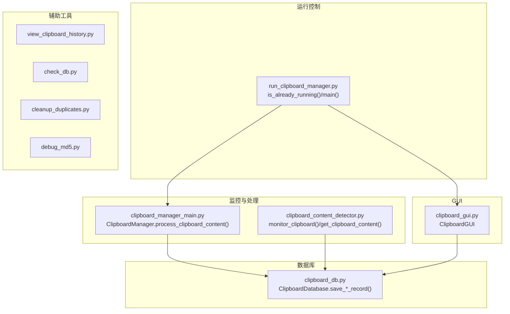
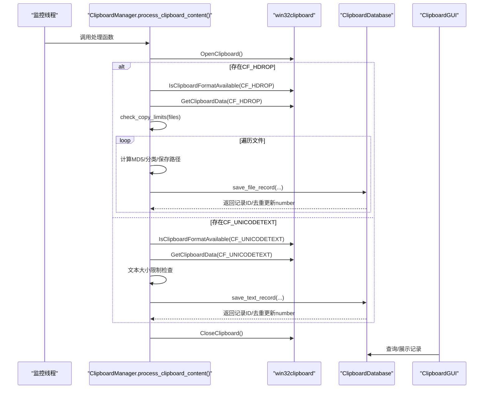
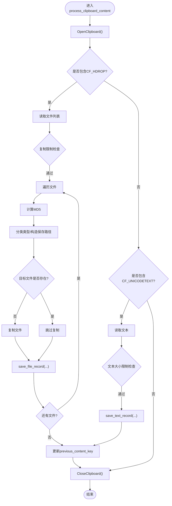
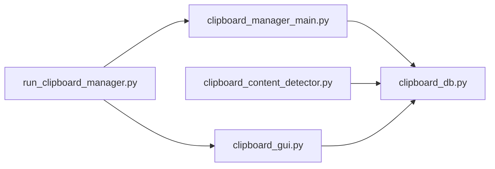
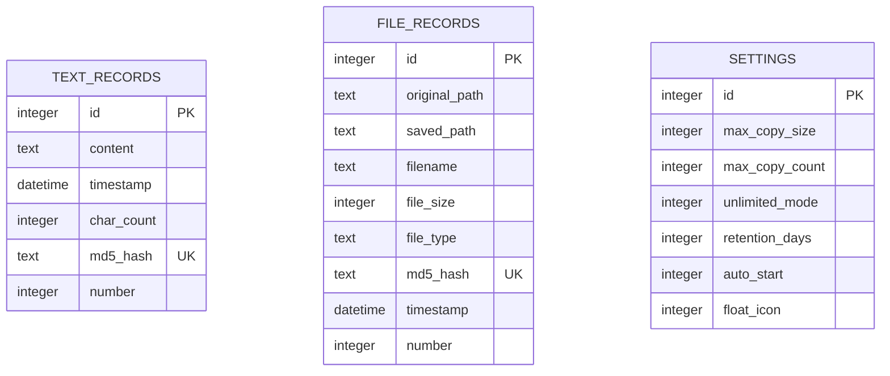

# 核心功能

<cite>
**本文档引用的文件**
- [clipboard_manager_main.py](file://clipboard_manager_main.py)
- [clipboard_content_detector.py](file://clipboard_content_detector.py)
- [clipboard_db.py](file://clipboard_db.py)
- [clipboard_gui.py](file://clipboard_gui.py)
- [run_clipboard_manager.py](file://run_clipboard_manager.py)
- [view_clipboard_history.py](file://view_clipboard_history.py)
- [check_db.py](file://check_db.py)
- [cleanup_duplicates.py](file://cleanup_duplicates.py)
- [debug_md5.py](file://debug_md5.py)
</cite>

## 目录
1. [简介](#简介)
2. [项目结构](#项目结构)
3. [核心组件](#核心组件)
4. [架构总览](#架构总览)
5. [详细组件分析](#详细组件分析)
6. [依赖关系分析](#依赖关系分析)
7. [性能考量](#性能考量)
8. [故障排查指南](#故障排查指南)
9. [结论](#结论)
10. [附录](#附录)

## 简介
本文件面向“剪贴板管理器”的核心功能实现进行全面文档化，重点覆盖：
- 剪贴板监控机制：通过 win32clipboard 获取剪贴板数据，区分文本与文件类型，处理 CF_HDROP 格式的文件列表
- 内容检测流程在 clipboard_content_detector.py 中的实现细节，包括 MD5 哈希计算用于去重
- 数据库插入前的重复检查逻辑，避免冗余存储
- 文本和文件记录的数据结构设计，包括时间戳、字符数、文件大小等元数据采集
- 自动编号机制（number 字段）如何维持用户感知的顺序
- 监控循环的性能优化策略，如延迟检测间隔、异常捕获机制
- 实际代码片段路径展示关键功能的实现，例如 _get_clipboard_data() 函数的调用流程
- 大文件剪贴时的内存管理策略

## 项目结构
该项目采用模块化组织，围绕“监控-检测-存储-展示”四层职责划分：
- 监控与处理层：clipboard_manager_main.py、clipboard_content_detector.py
- 数据库层：clipboard_db.py
- GUI 展示层：clipboard_gui.py
- 启动与运行控制：run_clipboard_manager.py
- 辅助工具：view_clipboard_history.py、check_db.py、cleanup_duplicates.py、debug_md5.py

图表来源
- [clipboard_manager_main.py](file://clipboard_manager_main.py#L355-L761)
- [clipboard_content_detector.py](file://clipboard_content_detector.py#L1-L274)
- [clipboard_db.py](file://clipboard_db.py#L1-L455)
- [clipboard_gui.py](file://clipboard_gui.py#L1-L800)
- [run_clipboard_manager.py](file://run_clipboard_manager.py#L1-L71)
- [view_clipboard_history.py](file://view_clipboard_history.py#L1-L75)
- [check_db.py](file://check_db.py#L1-L31)
- [cleanup_duplicates.py](file://cleanup_duplicates.py#L1-L67)
- [debug_md5.py](file://debug_md5.py#L1-L56)

章节来源
- [clipboard_manager_main.py](file://clipboard_manager_main.py#L1-L120)
- [clipboard_content_detector.py](file://clipboard_content_detector.py#L1-L120)
- [clipboard_db.py](file://clipboard_db.py#L1-L120)
- [clipboard_gui.py](file://clipboard_gui.py#L1-L120)
- [run_clipboard_manager.py](file://run_clipboard_manager.py#L1-L71)

## 核心组件
- 剪贴板监控与处理
  - 通过 win32clipboard 打开剪贴板，检测 CF_UNICODETEXT 或 CF_HDROP 格式，分别处理文本与文件
  - 对文件列表进行复制限制检查（数量与总大小/单文件大小）
  - 计算文件 MD5，构建保存路径，避免重复文件写入
  - 文本记录与文件记录分别入库，并通过 MD5 去重，number 字段递增
- 数据库层
  - 文本记录表：content、timestamp、char_count、md5_hash、number
  - 文件记录表：original_path、saved_path、filename、file_size、file_type、md5_hash、timestamp、number
  - 设置表：max_copy_size、max_copy_count、unlimited_mode、retention_days、auto_start、float_icon
- GUI 展示
  - 支持文本/文件记录浏览、搜索、统计、设置管理
  - 支持系统托盘与悬浮图标
- 运行控制
  - 单实例互斥、托盘图标、后台监控线程

章节来源
- [clipboard_manager_main.py](file://clipboard_manager_main.py#L355-L761)
- [clipboard_db.py](file://clipboard_db.py#L1-L200)
- [clipboard_gui.py](file://clipboard_gui.py#L1-L200)
- [run_clipboard_manager.py](file://run_clipboard_manager.py#L1-L71)

## 架构总览
整体工作流：监控线程周期性调用处理函数，识别文本或文件，执行限制检查与去重，最终入库并更新 number；GUI 侧负责展示与交互。

图表来源
- [clipboard_manager_main.py](file://clipboard_manager_main.py#L395-L496)
- [clipboard_db.py](file://clipboard_db.py#L116-L183)
- [clipboard_gui.py](file://clipboard_gui.py#L581-L626)

## 详细组件分析

### 剪贴板监控与内容检测（clipboard_manager_main.py）
- 监控循环
  - 通过 monitor_clipboard_loop(manager, interval) 控制检测频率，默认1秒
  - 捕获 KeyboardInterrupt 平滑退出
- 内容处理
  - 打开剪贴板后优先检测 CF_HDROP（文件列表），再检测 CF_UNICODETEXT（文本）
  - 文件列表处理：逐个校验是否存在、计算 MD5、分类类型、生成保存路径、复制文件、入库
  - 文本处理：计算文本大小，若未开启无限模式且超限则拒绝；入库并更新 number
- 去重与编号
  - 文本：以 md5_hash 唯一约束，冲突时更新 timestamp 并 number+1
  - 文件：以 md5_hash 唯一约束，冲突时更新 original_path 与 timestamp 并 number+1
- 复制限制
  - unlimited_mode 开启时跳过限制
  - 否则检查文件数量、单文件大小、总大小三者阈值

图表来源
- [clipboard_manager_main.py](file://clipboard_manager_main.py#L395-L496)

章节来源
- [clipboard_manager_main.py](file://clipboard_manager_main.py#L395-L496)

### 内容检测器（clipboard_content_detector.py）
- 功能定位
  - 提供独立的剪贴板内容检测与展示能力，便于调试与演示
  - 支持枚举剪贴板格式、识别文本与文件、计算文本 MD5、格式化显示
- 关键点
  - get_clipboard_content() 读取 CF_UNICODETEXT/CF_TEXT 与 CF_HDROP
  - monitor_clipboard() 以 content_key 去重（文本使用MD5或hash，文件使用排序后的路径拼接）
  - check_copy_limits() 与数据库设置联动，支持无限模式

章节来源
- [clipboard_content_detector.py](file://clipboard_content_detector.py#L1-L274)

### 数据库层（clipboard_db.py）
- 表结构与字段
  - 文本记录：content、timestamp、char_count、md5_hash（UNIQUE）、number（DEFAULT 1）
  - 文件记录：original_path、saved_path、filename、file_size、file_type、md5_hash（UNIQUE）、timestamp、number（DEFAULT 1）
  - 设置表：max_copy_size、max_copy_count、unlimited_mode、retention_days、auto_start、float_icon
- 去重与编号
  - save_text_record/save_file_record 在 IntegrityError 时更新 timestamp 与 number
  - 通过 md5_hash 唯一性约束避免重复存储
- 其他能力
  - 搜索、统计、清空、删除过期记录（按设置的 retention_days）

章节来源
- [clipboard_db.py](file://clipboard_db.py#L1-L200)
- [clipboard_db.py](file://clipboard_db.py#L200-L455)

### GUI 展示（clipboard_gui.py）
- 记录浏览与搜索
  - 支持文本/文件记录的统一浏览，按列排序（名称/类型/大小/时间/次数）
  - 双击查看完整文本或打开文件所在位置
- 统计与设置
  - 统计文本/文件数量与累计大小
  - 设置复制限制、保存天数、开机自启、悬浮图标等
- 运行特性
  - 默认隐藏主窗口，显示系统托盘图标
  - 支持 Alt+C 快捷键显示界面

章节来源
- [clipboard_gui.py](file://clipboard_gui.py#L1-L200)
- [clipboard_gui.py](file://clipboard_gui.py#L581-L795)

### 运行控制（run_clipboard_manager.py）
- 单实例互斥：通过 Windows Mutex 防止重复启动
- 后台监控：在独立线程中运行 monitor_clipboard_loop
- 托盘集成：隐藏主窗口，创建托盘图标，支持显示界面与退出

章节来源
- [run_clipboard_manager.py](file://run_clipboard_manager.py#L1-L71)

## 依赖关系分析
- 模块间耦合
  - clipboard_manager_main.py 与 clipboard_db.py 直接交互，负责业务处理与持久化
  - clipboard_content_detector.py 与 clipboard_db.py 独立使用，侧重检测与展示
  - clipboard_gui.py 仅依赖数据库接口，不直接访问剪贴板
  - run_clipboard_manager.py 启动 GUI 与监控线程，协调运行环境
- 外部依赖
  - win32clipboard/win32con：Windows 剪贴板 API
  - sqlite3：本地数据库
  - tkinter/pystray/Pillow：GUI 与托盘图标

图表来源
- [clipboard_manager_main.py](file://clipboard_manager_main.py#L1-L120)
- [clipboard_content_detector.py](file://clipboard_content_detector.py#L1-L60)
- [clipboard_db.py](file://clipboard_db.py#L1-L60)
- [clipboard_gui.py](file://clipboard_gui.py#L1-L60)
- [run_clipboard_manager.py](file://run_clipboard_manager.py#L1-L40)

章节来源
- [clipboard_manager_main.py](file://clipboard_manager_main.py#L1-L120)
- [clipboard_content_detector.py](file://clipboard_content_detector.py#L1-L60)
- [clipboard_db.py](file://clipboard_db.py#L1-L60)
- [clipboard_gui.py](file://clipboard_gui.py#L1-L60)
- [run_clipboard_manager.py](file://run_clipboard_manager.py#L1-L40)

## 性能考量
- 监控频率
  - 默认 1 秒检测一次，可通过命令行参数调整，降低 CPU 占用
- 异常捕获
  - OpenClipboard/CloseClipboard 包裹在 try/finally 中，避免异常导致资源泄漏
  - 文件读取与 MD5 计算采用分块读取（4096 字节），减少内存峰值
- 去重与索引
  - 文本记录 md5_hash 唯一索引，文件记录 md5_hash 唯一约束，显著提升去重效率
- I/O 优化
  - 文件复制仅在目标不存在时进行，避免重复 IO
  - GUI 分页逻辑已移除，改为一次性加载并排序，简化复杂度

章节来源
- [clipboard_manager_main.py](file://clipboard_manager_main.py#L24-L35)
- [clipboard_manager_main.py](file://clipboard_manager_main.py#L488-L496)
- [clipboard_db.py](file://clipboard_db.py#L23-L67)

## 故障排查指南
- 常见问题
  - 剪贴板访问失败：确认 OpenClipboard 是否被其他进程占用；监控函数已做异常捕获
  - 文件无法保存：检查保存目录权限、磁盘空间；确认文件路径存在
  - MD5 冲突但记录重复：使用 cleanup_duplicates.py 合并重复记录并累加 number
  - 数据库损坏：使用 check_db.py 检查 md5_hash 与重复情况
- 调试手段
  - debug_md5.py：验证文本 MD5 去重与 number 累加逻辑
  - view_clipboard_history.py：快速查看最近记录与统计信息
  - clipboard_content_detector.py 的 monitor_clipboard()：独立运行检测流程

章节来源
- [clipboard_manager_main.py](file://clipboard_manager_main.py#L488-L496)
- [cleanup_duplicates.py](file://cleanup_duplicates.py#L1-L67)
- [check_db.py](file://check_db.py#L1-L31)
- [debug_md5.py](file://debug_md5.py#L1-L56)
- [view_clipboard_history.py](file://view_clipboard_history.py#L1-L75)

## 结论
本项目通过清晰的模块分工与稳健的去重策略，实现了对剪贴板文本与文件的高效监控与持久化。监控循环以较低频率运行，结合 MD5 去重与 number 编号机制，既保证用户体验又兼顾性能与可靠性。GUI 提供直观的查询与设置入口，运行控制模块确保单实例与托盘集成体验。

## 附录

### 数据模型与字段说明

图表来源
- [clipboard_db.py](file://clipboard_db.py#L23-L67)
- [clipboard_db.py](file://clipboard_db.py#L76-L112)

### 关键实现路径参考
- 监控循环与处理
  - [monitor_clipboard_loop](file://clipboard_manager_main.py#L717-L730)
  - [process_clipboard_content](file://clipboard_manager_main.py#L395-L496)
- 剪贴板内容检测
  - [get_clipboard_content](file://clipboard_content_detector.py#L87-L138)
  - [monitor_clipboard](file://clipboard_content_detector.py#L218-L273)
- 数据库保存与去重
  - [save_text_record](file://clipboard_db.py#L116-L151)
  - [save_file_record](file://clipboard_db.py#L152-L183)
- MD5 计算与文件分类
  - [calculate_file_md5](file://clipboard_manager_main.py#L24-L35)
  - [get_file_type_category](file://clipboard_manager_main.py#L36-L55)
- GUI 与运行控制
  - [ClipboardGUI](file://clipboard_gui.py#L1-L120)
  - [main](file://run_clipboard_manager.py#L32-L69)