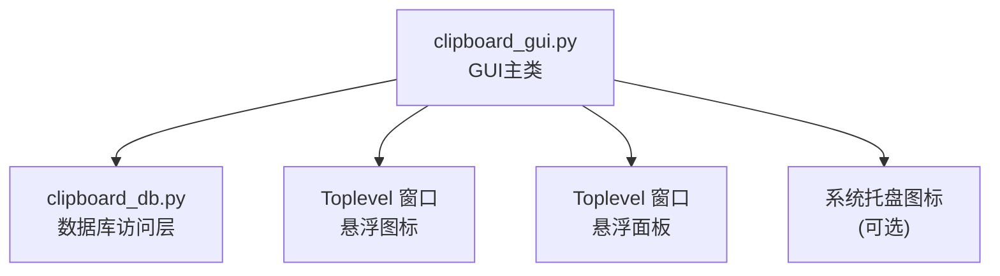
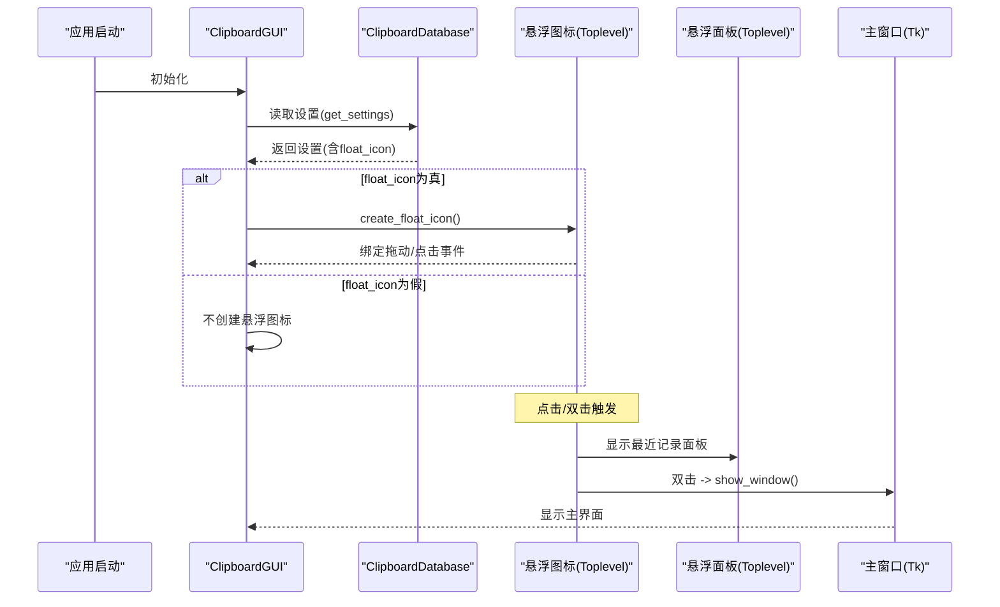
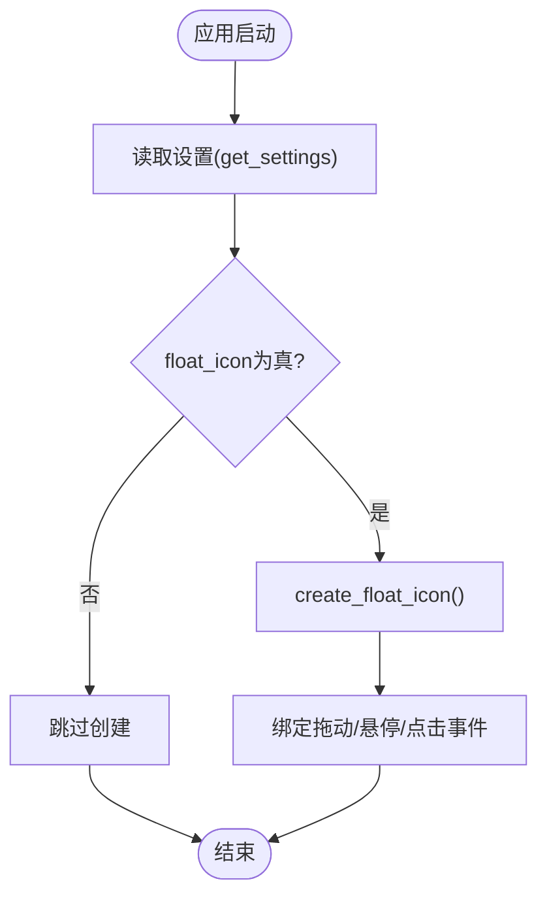
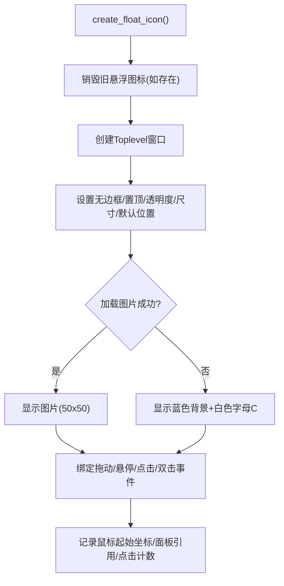
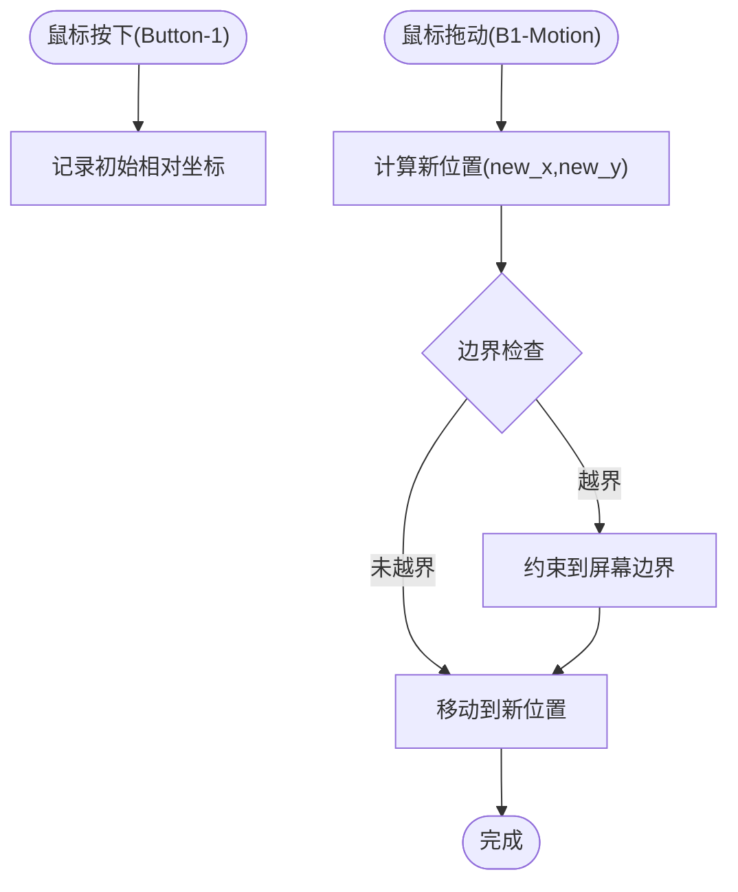
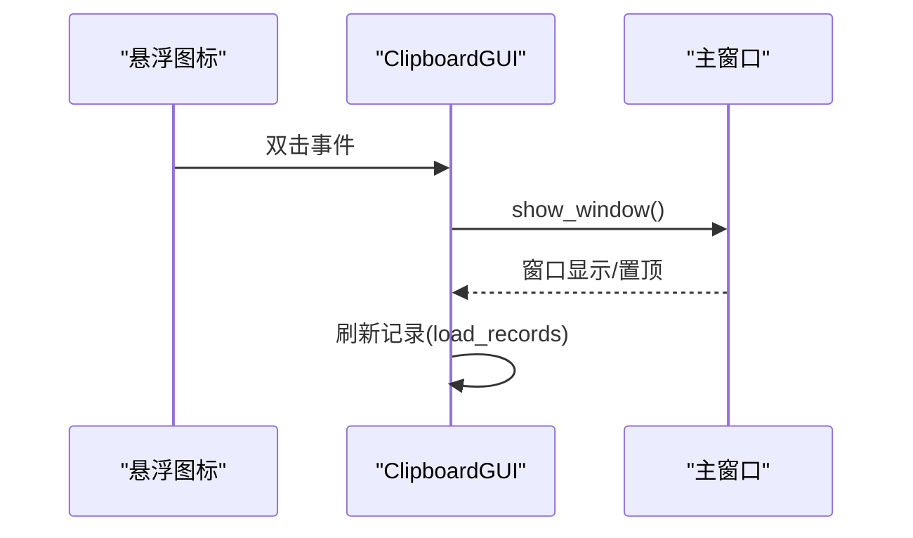
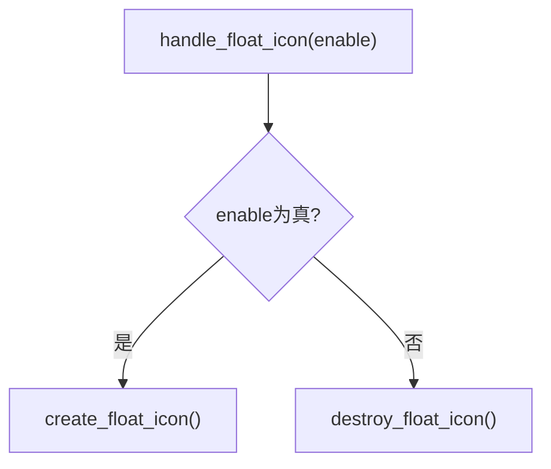
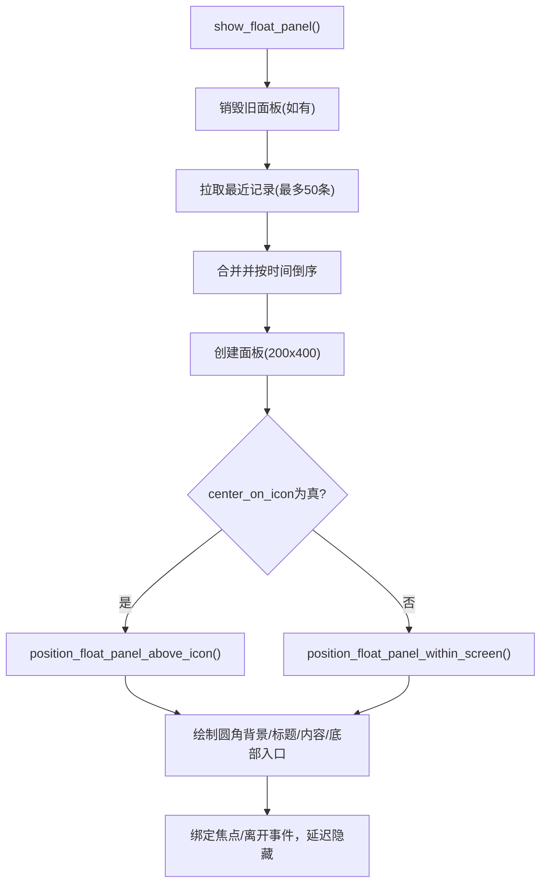
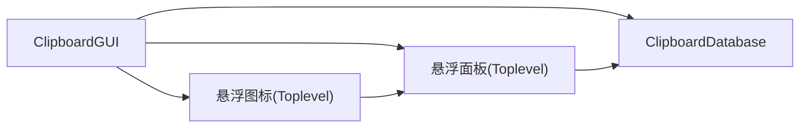

# 悬浮图标

<cite>
**本文引用的文件**
- [clipboard_gui.py](file://clipboard_gui.py)
- [clipboard_db.py](file://clipboard_db.py)
</cite>

## 目录
1. [简介](#简介)
2. [项目结构](#项目结构)
3. [核心组件](#核心组件)
4. [架构总览](#架构总览)
5. [详细组件分析](#详细组件分析)
6. [依赖关系分析](#依赖关系分析)
7. [性能考量](#性能考量)
8. [故障排查指南](#故障排查指南)
9. [结论](#结论)

## 简介
本章节围绕“悬浮图标”的实现原理展开，重点说明：
- 启动时如何通过 check_float_icon 方法检查数据库设置并决定是否创建悬浮窗口；
- create_float_icon 如何使用 Toplevel 创建无边框、透明度为 15% 的浮动窗口，并通过 WM_ATTRIBUTES 实现置顶显示；
- 悬浮图标 50x50 像素的设计与可自由拖动交互；
- 点击悬浮图标触发 show_window 显示主界面；
- handle_float_icon 如何根据设置启用或销毁悬浮窗口；
- 用户体验层面的透明度与可见性平衡。

## 项目结构
悬浮图标功能位于 GUI 层，依赖数据库层提供的设置项。关键文件与职责如下：
- clipboard_gui.py：GUI 主类，负责悬浮图标生命周期、事件绑定、面板展示、窗口显示/隐藏等；
- clipboard_db.py：数据库访问层，提供设置查询与更新，包含 float_icon 字段。

图表来源
- [clipboard_gui.py](file://clipboard_gui.py#L70-L90)
- [clipboard_db.py](file://clipboard_db.py#L360-L412)

章节来源
- [clipboard_gui.py](file://clipboard_gui.py#L70-L90)
- [clipboard_db.py](file://clipboard_db.py#L360-L412)

## 核心组件
- check_float_icon：启动时读取设置，若启用则创建悬浮图标。
- create_float_icon：创建悬浮窗口，设置无边框、置顶、透明度、尺寸与默认位置，绑定拖动与点击事件。
- handle_float_icon：根据布尔开关启用/销毁悬浮图标。
- show_window：显示主窗口并提升置顶。
- show_float_panel：显示最近记录悬浮面板，支持居中或上方显示策略。
- destroy_float_icon：销毁悬浮图标及其面板。

章节来源
- [clipboard_gui.py](file://clipboard_gui.py#L80-L90)
- [clipboard_gui.py](file://clipboard_gui.py#L1165-L1172)
- [clipboard_gui.py](file://clipboard_gui.py#L1173-L1234)
- [clipboard_gui.py](file://clipboard_gui.py#L1254-L1379)
- [clipboard_gui.py](file://clipboard_gui.py#L1633-L1638)
- [clipboard_gui.py](file://clipboard_gui.py#L1702-L1708)

## 架构总览
悬浮图标与主界面的交互流程如下：

图表来源
- [clipboard_gui.py](file://clipboard_gui.py#L80-L90)
- [clipboard_gui.py](file://clipboard_gui.py#L1165-L1172)
- [clipboard_gui.py](file://clipboard_gui.py#L1173-L1234)
- [clipboard_gui.py](file://clipboard_gui.py#L1254-L1379)
- [clipboard_gui.py](file://clipboard_gui.py#L1702-L1708)
- [clipboard_db.py](file://clipboard_db.py#L360-L385)

## 详细组件分析

### 启动时检查与创建悬浮图标
- check_float_icon 从数据库读取设置，若 float_icon 为真则调用 create_float_icon 创建悬浮图标。
- 若读取设置出现异常，会捕获并打印错误，不影响主流程。

图表来源
- [clipboard_gui.py](file://clipboard_gui.py#L80-L90)
- [clipboard_gui.py](file://clipboard_gui.py#L1173-L1234)
- [clipboard_db.py](file://clipboard_db.py#L360-L385)

章节来源
- [clipboard_gui.py](file://clipboard_gui.py#L80-L90)
- [clipboard_db.py](file://clipboard_db.py#L360-L385)

### 创建悬浮图标：Toplevel、无边框、置顶与透明度
- 使用 Toplevel 创建悬浮窗口，设置：
  - 无边框：overrideredirect(True)
  - 置顶：attributes("-topmost", True)
  - 透明度：attributes("-alpha", 0.15)
  - 尺寸：50x50 像素
  - 默认位置：右下角偏移（距离右侧 60 像素、底部 120 像素）
- 图像优先使用 2.jpg，若失败则使用蓝色背景与白色字母“C”作为占位。
- 绑定鼠标事件：
  - 拖动：按下记录初始坐标，拖动时计算新位置并做边界检查；
  - 悬停：显示悬浮面板；
  - 单击：显示悬浮面板；
  - 双击：显示主窗口。

图表来源
- [clipboard_gui.py](file://clipboard_gui.py#L1173-L1234)

章节来源
- [clipboard_gui.py](file://clipboard_gui.py#L1173-L1234)

### 悬浮图标尺寸与可拖动交互
- 尺寸：50x50 像素，保证轻量不遮挡；
- 拖动：记录鼠标按下时的相对坐标，拖动时计算新位置并进行屏幕边界检查，确保图标始终在屏幕内；
- 悬停/点击：显示最近记录悬浮面板；
- 双击：显示主窗口。

图表来源
- [clipboard_gui.py](file://clipboard_gui.py#L1639-L1669)

章节来源
- [clipboard_gui.py](file://clipboard_gui.py#L1639-L1669)

### 点击悬浮图标触发显示主界面
- 单击事件：若非拖动（坐标差小于阈值），显示悬浮面板；
- 双击事件：直接显示主窗口；
- show_window：显示主窗口并提升置顶，同时刷新记录。

图表来源
- [clipboard_gui.py](file://clipboard_gui.py#L1226-L1228)
- [clipboard_gui.py](file://clipboard_gui.py#L1250-L1253)
- [clipboard_gui.py](file://clipboard_gui.py#L1702-L1708)

章节来源
- [clipboard_gui.py](file://clipboard_gui.py#L1226-L1228)
- [clipboard_gui.py](file://clipboard_gui.py#L1250-L1253)
- [clipboard_gui.py](file://clipboard_gui.py#L1702-L1708)

### handle_float_icon：启用/销毁悬浮窗口
- enable 为真：调用 create_float_icon；
- enable 为假：调用 destroy_float_icon 销毁悬浮图标及面板。

图表来源
- [clipboard_gui.py](file://clipboard_gui.py#L1165-L1172)
- [clipboard_gui.py](file://clipboard_gui.py#L1633-L1638)

章节来源
- [clipboard_gui.py](file://clipboard_gui.py#L1165-L1172)
- [clipboard_gui.py](file://clipboard_gui.py#L1633-L1638)

### 悬浮面板：最近记录展示与定位策略
- 数据来源：从数据库获取最近记录（文本/文件），合并并按时间倒序，最多 50 条；
- 面板尺寸：200x400 像素；
- 定位策略：
  - 上方显示：面板位于图标正上方，若上方空间不足则显示在图标下方；
  - 居中显示：面板完全覆盖图标并居中；
  - 屏幕范围：确保面板在屏幕内，必要时调整 x/y；
- 交互：面板获得焦点，鼠标移出或焦点丢失时延迟隐藏。

图表来源
- [clipboard_gui.py](file://clipboard_gui.py#L1254-L1379)
- [clipboard_gui.py](file://clipboard_gui.py#L1522-L1558)
- [clipboard_gui.py](file://clipboard_gui.py#L1453-L1489)

章节来源
- [clipboard_gui.py](file://clipboard_gui.py#L1254-L1379)
- [clipboard_gui.py](file://clipboard_gui.py#L1522-L1558)
- [clipboard_gui.py](file://clipboard_gui.py#L1453-L1489)

## 依赖关系分析
- GUI 层依赖数据库层提供设置项（含 float_icon）；
- 悬浮图标与面板均为 Toplevel 窗口，彼此通过父子关系管理；
- 悬浮面板依赖数据库层的最近记录查询；
- 悬浮图标与面板均使用 WM_ATTRIBUTES 控制置顶与透明度。

图表来源
- [clipboard_gui.py](file://clipboard_gui.py#L1173-L1234)
- [clipboard_gui.py](file://clipboard_gui.py#L1254-L1379)
- [clipboard_db.py](file://clipboard_db.py#L360-L412)

章节来源
- [clipboard_gui.py](file://clipboard_gui.py#L1173-L1234)
- [clipboard_gui.py](file://clipboard_gui.py#L1254-L1379)
- [clipboard_db.py](file://clipboard_db.py#L360-L412)

## 性能考量
- 悬浮图标与面板均为轻量级窗口，透明度与无边框减少渲染开销；
- 拖动时仅更新几何位置，避免频繁重绘；
- 悬浮面板延迟隐藏，降低频繁焦点切换带来的抖动；
- 自动更新在主窗口隐藏或有用户操作时暂停，避免无谓刷新。

## 故障排查指南
- 悬浮图标未显示
  - 检查设置项 float_icon 是否为真；
  - 检查图片资源 2.jpg 是否存在，若不存在将回退到占位文本；
  - 确认窗口置顶与透明度属性是否被其他程序覆盖。
- 拖动异常或越界
  - 检查屏幕分辨率变化导致的位置计算；
  - 确认边界检查逻辑是否正常执行。
- 点击无效
  - 检查是否误判为拖动（坐标差小于阈值才会触发点击逻辑）；
  - 确认事件绑定是否正确。
- 面板不显示或闪烁
  - 检查最近记录查询是否返回数据；
  - 确认面板定位策略是否因屏幕空间不足而切换到下方显示。

章节来源
- [clipboard_gui.py](file://clipboard_gui.py#L1173-L1234)
- [clipboard_gui.py](file://clipboard_gui.py#L1254-L1379)
- [clipboard_gui.py](file://clipboard_gui.py#L1639-L1669)

## 结论
悬浮图标通过简洁的 Toplevel 窗口实现，结合数据库设置驱动其生命周期，具备良好的用户体验：低遮挡（15% 透明度）、可自由拖动、轻量不打扰。点击与双击分别用于面板展示与主界面显示，配合延迟隐藏与边界检查，保证交互流畅与稳定。整体设计在可用性与性能之间取得平衡，适合在桌面环境中长期驻留。