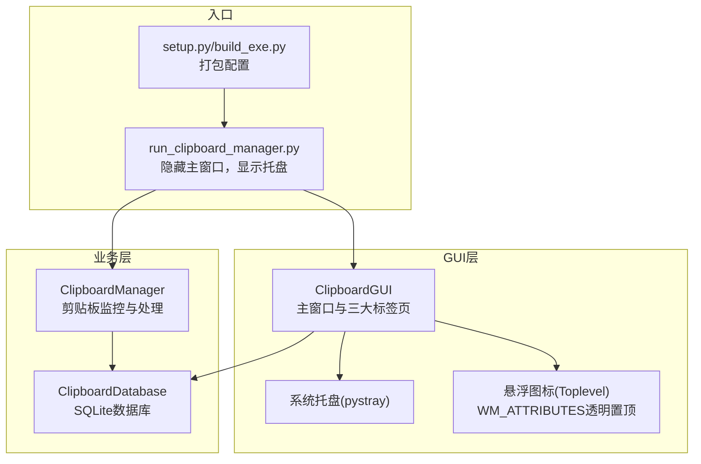
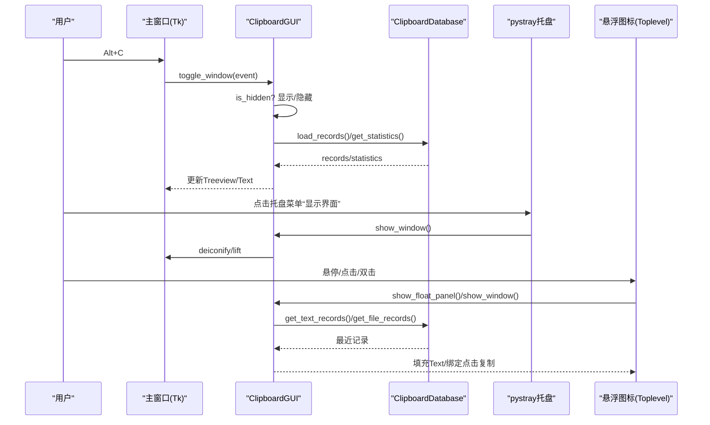
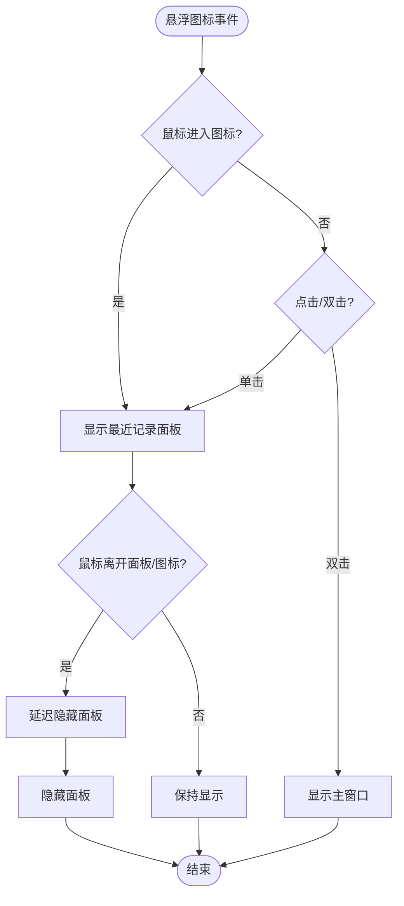
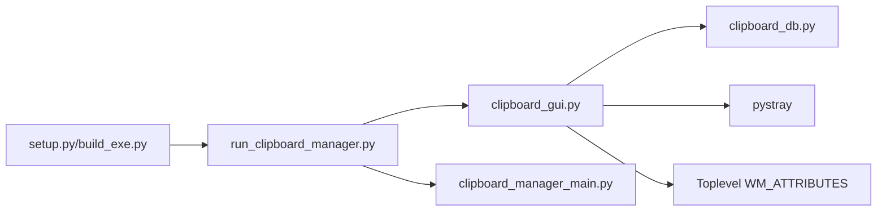

# 用户界面

<cite>
**本文引用的文件**
- [clipboard_gui.py](file://clipboard_gui.py)
- [run_clipboard_manager.py](file://run_clipboard_manager.py)
- [clipboard_db.py](file://clipboard_db.py)
- [clipboard_manager_main.py](file://clipboard_manager_main.py)
- [setup.py](file://setup.py)
- [build_exe.py](file://build_exe.py)
</cite>

## 目录
1. [简介](#简介)
2. [项目结构](#项目结构)
3. [核心组件](#核心组件)
4. [架构总览](#架构总览)
5. [详细组件分析](#详细组件分析)
6. [依赖关系分析](#依赖关系分析)
7. [性能考虑](#性能考虑)
8. [故障排查指南](#故障排查指南)
9. [结论](#结论)
10. [附录](#附录)

## 简介
本文件面向“剪贴板历史记录”项目的GUI界面，系统性梳理主窗口布局、三大标签页的功能职责、数据展示与交互细节、系统托盘与悬浮图标的实现机制、以及界面响应性的保障策略。文档特别关注：
- 主窗口采用Notebook标签页结构，包含“记录”、“统计”、“设置”三块主要面板。
- “记录”标签页通过Treeview展示历史条目，支持双击恢复内容到剪贴板。
- “统计”标签页提供文本/文件数量与累计大小等统计信息展示。
- “设置”标签页提供复制限制、保存天数、开机自启、悬浮图标等可配置项，并映射到数据库字段。
- 系统托盘图标使用pystray创建上下文菜单并响应点击事件。
- 悬浮图标基于Toplevel窗口与WM_ATTRIBUTES实现透明置顶，支持拖动、悬停显示最近记录面板、双击显示主窗口。
- Alt+C 快捷键用于唤醒/隐藏主窗口；界面具备焦点与用户操作状态管理，避免阻塞主线程。

## 项目结构
GUI相关代码集中在 clipboard_gui.py 中，配合数据库模块 clipboard_db.py 与运行入口 run_clipboard_manager.py。打包配置位于 setup.py 与 build_exe.py。

图表来源
- [clipboard_gui.py](file://clipboard_gui.py#L1-L1730)
- [run_clipboard_manager.py](file://run_clipboard_manager.py#L1-L71)
- [clipboard_db.py](file://clipboard_db.py#L1-L455)
- [clipboard_manager_main.py](file://clipboard_manager_main.py#L1-L761)
- [setup.py](file://setup.py#L1-L84)
- [build_exe.py](file://build_exe.py#L1-L59)

章节来源
- [clipboard_gui.py](file://clipboard_gui.py#L1-L1730)
- [run_clipboard_manager.py](file://run_clipboard_manager.py#L1-L71)
- [clipboard_db.py](file://clipboard_db.py#L1-L455)
- [setup.py](file://setup.py#L1-L84)
- [build_exe.py](file://build_exe.py#L1-L59)

## 核心组件
- 主窗口与三大标签页
  - Notebook结构，包含“记录”、“统计”、“设置”三页。
  - 记录页：Treeview展示历史条目，支持双击复制到剪贴板、删除、排序、搜索。
  - 统计页：文本/文件数量与累计大小等统计信息展示。
  - 设置页：复制限制、保存天数、开机自启、悬浮图标等配置项。
- 系统托盘
  - 使用pystray创建托盘图标，菜单包含“显示界面”和“退出”，线程安全运行。
- 悬浮图标
  - Toplevel窗口，WM_ATTRIBUTES设置透明度与置顶；支持拖动、悬停显示最近记录面板、双击显示主窗口。
- 快捷键与焦点管理
  - Alt+C 切换窗口显示；窗口焦点与用户操作状态标志避免阻塞主线程。

章节来源
- [clipboard_gui.py](file://clipboard_gui.py#L172-L226)
- [clipboard_gui.py](file://clipboard_gui.py#L227-L327)
- [clipboard_gui.py](file://clipboard_gui.py#L328-L535)
- [clipboard_gui.py](file://clipboard_gui.py#L144-L171)
- [clipboard_gui.py](file://clipboard_gui.py#L1173-L1234)
- [clipboard_gui.py](file://clipboard_gui.py#L1676-L1722)

## 架构总览
GUI与数据库、系统托盘、悬浮图标、快捷键与定时更新共同构成完整的桌面应用体系。

图表来源
- [clipboard_gui.py](file://clipboard_gui.py#L1698-L1722)
- [clipboard_gui.py](file://clipboard_gui.py#L144-L171)
- [clipboard_gui.py](file://clipboard_gui.py#L1173-L1234)
- [clipboard_gui.py](file://clipboard_gui.py#L1254-L1379)
- [clipboard_db.py](file://clipboard_db.py#L185-L261)

## 详细组件分析

### 主窗口与三大标签页
- Notebook布局与网格权重
  - 主框架、笔记本、各标签页均配置column/row权重，保证窗口缩放时内容自适应。
- 记录标签页
  - Treeview列：名称或内容、类型、大小、时间、次数；支持点击列头排序，双击显示完整内容或打开文件位置。
  - 操作按钮：复制选中内容、删除选中记录；支持搜索关键词并按当前排序规则排序。
  - 双击恢复内容到剪贴板：文本记录读取完整内容写入剪贴板；文件记录复制文件名。
- 统计标签页
  - Text控件展示文本/文件数量与累计大小；提供“刷新统计”按钮。
- 设置标签页
  - 复制限制：无限模式开关、最大复制大小(MB)、最大复制文件数量。
  - 保存设置：永久保存或自定义天数；自定义天数时删除过期记录。
  - 系统设置：开机自启开关；悬浮图标开关。
  - 数据管理：重置所有记录（含本地缓存文件）。
  - 所有设置均持久化到数据库settings表。

章节来源
- [clipboard_gui.py](file://clipboard_gui.py#L172-L226)
- [clipboard_gui.py](file://clipboard_gui.py#L227-L327)
- [clipboard_gui.py](file://clipboard_gui.py#L328-L535)
- [clipboard_db.py](file://clipboard_db.py#L359-L412)

### 数据库字段与设置映射
- settings表字段
  - max_copy_size：字节
  - max_copy_count：整数
  - unlimited_mode：布尔
  - retention_days：整数（0表示永久）
  - auto_start：布尔
  - float_icon：布尔
- 更新与读取
  - 保存设置时统一调用update_settings，读取时get_settings返回字典。
  - 自定义保存天数时，若大于0则删除过期记录。

章节来源
- [clipboard_db.py](file://clipboard_db.py#L359-L412)
- [clipboard_gui.py](file://clipboard_gui.py#L477-L531)
- [clipboard_gui.py](file://clipboard_gui.py#L534-L554)

### 系统托盘图标与上下文菜单
- 创建流程
  - 优先加载2.ico，不存在则生成简单图标；构建菜单项“显示界面”和“退出”。
  - 在独立线程中运行托盘图标，避免阻塞主线程。
- 事件响应
  - “显示界面”：调用show_window，恢复主窗口可见并置顶。
  - “退出”：停止自动更新、停止托盘、退出主循环。

章节来源
- [clipboard_gui.py](file://clipboard_gui.py#L144-L171)
- [run_clipboard_manager.py](file://run_clipboard_manager.py#L55-L66)
- [clipboard_gui.py](file://clipboard_gui.py#L1699-L1715)

### 悬浮图标实现机制
- Toplevel窗口与WM_ATTRIBUTES
  - 大小：50x50；置顶：-topmost；透明度：-alpha 0.15（15%）。
  - 支持拖动：记录鼠标按下位置，移动时边界检查确保在屏幕内。
- 悬停与点击交互
  - 悬停显示最近记录面板：最多取最近50条文本/文件记录，Text控件展示，禁用编辑。
  - 单击悬浮图标：直接显示面板；双击悬浮图标：显示主窗口。
  - 鼠标移出面板或图标：延迟隐藏面板，避免误触。
- 最近记录面板定位
  - 默认显示在悬浮图标正上方，若上方空间不足则显示在下方；超出屏幕范围自动调整。

图表来源
- [clipboard_gui.py](file://clipboard_gui.py#L1173-L1234)
- [clipboard_gui.py](file://clipboard_gui.py#L1242-L1253)
- [clipboard_gui.py](file://clipboard_gui.py#L1254-L1379)
- [clipboard_gui.py](file://clipboard_gui.py#L1380-L1401)
- [clipboard_gui.py](file://clipboard_gui.py#L1453-L1558)
- [clipboard_gui.py](file://clipboard_gui.py#L1560-L1626)
- [clipboard_gui.py](file://clipboard_gui.py#L1633-L1669)

章节来源
- [clipboard_gui.py](file://clipboard_gui.py#L1173-L1234)
- [clipboard_gui.py](file://clipboard_gui.py#L1254-L1379)
- [clipboard_gui.py](file://clipboard_gui.py#L1453-L1558)
- [clipboard_gui.py](file://clipboard_gui.py#L1560-L1669)

### 界面交互细节与状态管理
- Alt+C 快捷键
  - 绑定Alt+c与Alt+C，切换主窗口显示/隐藏。
- 焦点与用户操作状态
  - FocusIn/FocusOut标记窗口焦点；user_action_in_progress标记用户操作进行中；has_focus用于避免更新干扰。
- 自动更新与节流
  - 每2秒触发一次update_records，仅当窗口显示、无用户操作、无焦点时刷新，避免阻塞主线程。

章节来源
- [clipboard_gui.py](file://clipboard_gui.py#L220-L226)
- [clipboard_gui.py](file://clipboard_gui.py#L134-L143)
- [clipboard_gui.py](file://clipboard_gui.py#L1676-L1696)

### 统计标签页的数据展示
- 统计信息
  - 文本记录数、文件记录数、累计大小；数据库路径。
- 展示方式
  - Text控件只读显示，提供“刷新统计”按钮。

章节来源
- [clipboard_gui.py](file://clipboard_gui.py#L555-L580)
- [clipboard_db.py](file://clipboard_db.py#L316-L332)

### 记录标签页Treeview与双击复制
- Treeview列与排序
  - 列头点击切换排序方向；支持按内容、类型、大小、时间、次数排序。
- 双击行为
  - 文本记录：读取完整内容写入剪贴板。
  - 文件记录：复制文件名；若存在本地文件则打开所在位置。
- 搜索与排序
  - 搜索关键词后按当前排序列排序并显示。

章节来源
- [clipboard_gui.py](file://clipboard_gui.py#L227-L327)
- [clipboard_gui.py](file://clipboard_gui.py#L581-L626)
- [clipboard_gui.py](file://clipboard_gui.py#L652-L748)
- [clipboard_gui.py](file://clipboard_gui.py#L749-L795)
- [clipboard_gui.py](file://clipboard_gui.py#L800-L838)

### 设置标签页的可配置项与数据库字段
- 复制限制
  - 无限模式：关闭输入框；开启时允许无上限复制。
  - 最大复制大小：MB转字节写入数据库。
  - 最大复制文件数量：整数写入数据库。
- 保存设置
  - 永久保存或自定义天数；自定义天数时删除过期记录。
- 开机自启
  - 通过注册表HKCU\Software\Microsoft\Windows\CurrentVersion\Run设置/删除项。
- 悬浮图标
  - 开关悬浮图标，创建/销毁悬浮图标与面板。
- 重置所有记录
  - 删除数据库记录与本地缓存文件夹并重建。

章节来源
- [clipboard_gui.py](file://clipboard_gui.py#L328-L535)
- [clipboard_gui.py](file://clipboard_gui.py#L534-L554)
- [clipboard_gui.py](file://clipboard_gui.py#L1131-L1163)
- [clipboard_gui.py](file://clipboard_gui.py#L1164-L1172)
- [clipboard_gui.py](file://clipboard_gui.py#L890-L949)
- [clipboard_db.py](file://clipboard_db.py#L359-L412)

## 依赖关系分析
- GUI依赖数据库模块进行数据读写与统计。
- 运行入口默认隐藏主窗口，仅显示托盘图标，用户通过托盘或快捷键唤醒。
- 悬浮图标与托盘图标分别独立线程运行，互不影响。
- 打包配置包含图标与必要模块，确保exe可运行。

图表来源
- [clipboard_gui.py](file://clipboard_gui.py#L1-L1730)
- [clipboard_db.py](file://clipboard_db.py#L1-L455)
- [run_clipboard_manager.py](file://run_clipboard_manager.py#L1-L71)
- [clipboard_manager_main.py](file://clipboard_manager_main.py#L1-L761)
- [setup.py](file://setup.py#L1-L84)
- [build_exe.py](file://build_exe.py#L1-L59)

章节来源
- [clipboard_gui.py](file://clipboard_gui.py#L1-L1730)
- [clipboard_db.py](file://clipboard_db.py#L1-L455)
- [run_clipboard_manager.py](file://run_clipboard_manager.py#L1-L71)
- [setup.py](file://setup.py#L1-L84)
- [build_exe.py](file://build_exe.py#L1-L59)

## 性能考虑
- 避免阻塞主线程
  - 托盘与悬浮图标在独立线程运行；自动更新每2秒一次，且受用户操作与焦点状态节流。
- 数据库访问
  - Treeview加载与统计刷新均在主线程中进行，但通过合理的排序与限制（如最近记录取前50条）降低开销。
- 资源释放
  - 悬浮面板与悬浮图标销毁时释放窗口对象，避免内存泄漏。
- 打包与图标
  - 打包包含必要模块与图标，减少运行时缺失依赖导致的异常。

章节来源
- [clipboard_gui.py](file://clipboard_gui.py#L1676-L1696)
- [clipboard_gui.py](file://clipboard_gui.py#L1633-L1669)
- [setup.py](file://setup.py#L1-L84)
- [build_exe.py](file://build_exe.py#L1-L59)

## 故障排查指南
- 系统托盘不可用
  - 缺少pystray或Pillow：安装相应依赖；托盘图标创建失败会打印提示信息。
- 悬浮图标图片加载失败
  - 若2.jpg不存在，使用默认背景色与文本；检查资源路径与打包包含。
- 开机自启设置无效
  - 检查注册表项是否存在；权限问题可能导致设置失败。
- Alt+C 快捷键无效
  - 确认主窗口已获得焦点；快捷键绑定在root上，需确保事件未被其他控件拦截。
- 自动更新不生效
  - 确认update_job未被取消；窗口隐藏、用户操作进行中或有焦点时不会更新。

章节来源
- [clipboard_gui.py](file://clipboard_gui.py#L144-L171)
- [clipboard_gui.py](file://clipboard_gui.py#L1173-L1217)
- [clipboard_gui.py](file://clipboard_gui.py#L1131-L1163)
- [clipboard_gui.py](file://clipboard_gui.py#L220-L226)
- [clipboard_gui.py](file://clipboard_gui.py#L1676-L1696)

## 结论
本项目GUI以Notebook为核心组织三大功能面板，结合系统托盘与悬浮图标实现低侵入式桌面体验。通过数据库字段映射与状态管理，既满足用户配置需求，又兼顾界面响应性与稳定性。建议后续可引入更丰富的可视化（如按日统计的柱状图），以进一步提升统计信息的直观性。

## 附录
- 打包配置要点
  - 包含2.ico、icon.ico与clipboard_history.db等资源。
  - 包含tkinter、sqlite3、hashlib、win32clipboard、win32con、PIL、pystray等包。
  - 可执行文件目标名与图标设置见setup.py与build_exe.py。

章节来源
- [setup.py](file://setup.py#L1-L84)
- [build_exe.py](file://build_exe.py#L1-L59)