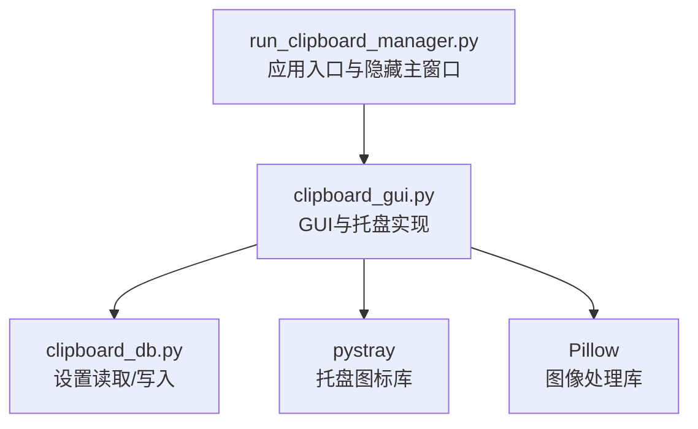
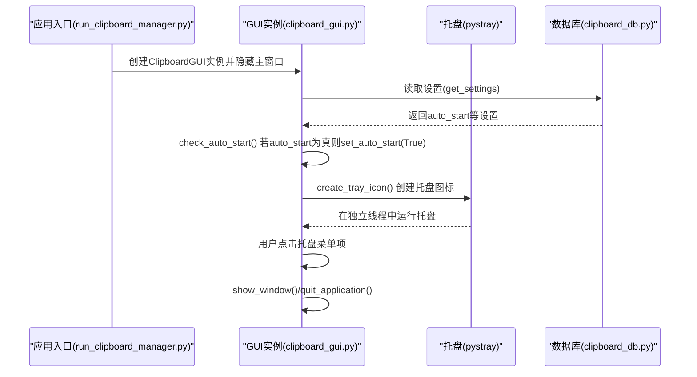
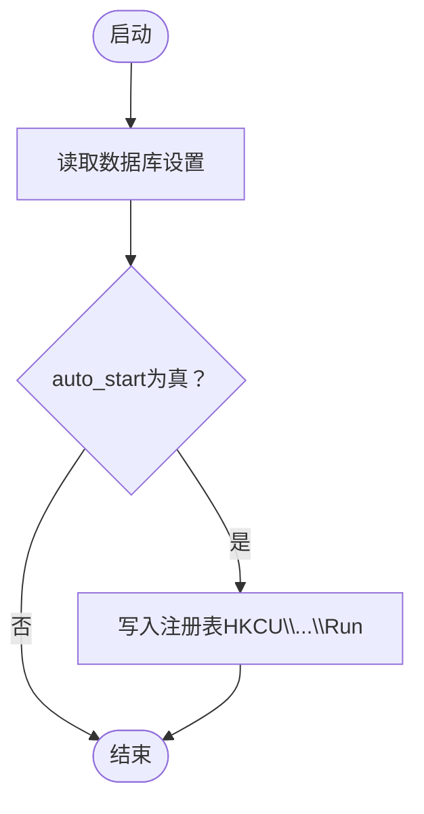
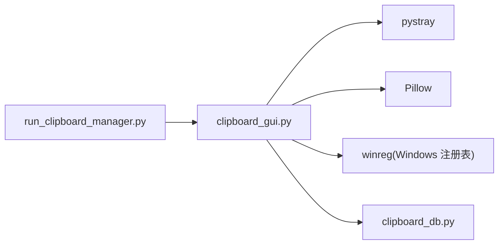

# 系统托盘

<cite>
**本文引用的文件**
- [clipboard_gui.py](file://clipboard_gui.py)
- [clipboard_db.py](file://clipboard_db.py)
- [run_clipboard_manager.py](file://run_clipboard_manager.py)
</cite>

## 目录
1. [简介](#简介)
2. [项目结构](#项目结构)
3. [核心组件](#核心组件)
4. [架构总览](#架构总览)
5. [组件详解](#组件详解)
6. [依赖关系分析](#依赖关系分析)
7. [性能考量](#性能考量)
8. [故障排查指南](#故障排查指南)
9. [结论](#结论)

## 简介
本文件围绕系统托盘图标的实现机制展开，重点说明以下内容：
- create_tray_icon 方法如何使用 pystray 库创建托盘图标，优先加载 2.ico 图标文件，若不存在则生成默认图标。
- 托盘菜单包含“显示界面”和“退出”两个选项，分别绑定 show_window 和 quit_application 方法。
- 托盘图标在独立线程中运行，避免阻塞主 GUI 线程。
- check_auto_start 方法在启动时根据数据库设置自动启用开机自启功能。
- TRAY_ICON_AVAILABLE 标志的用途，用于在 pystray 和 Pillow 缺失时进行优雅降级。
- 系统托盘作为后台运行程序的主要访问入口的重要性。

## 项目结构
与系统托盘相关的核心文件如下：
- clipboard_gui.py：负责 GUI 界面、托盘图标创建与菜单、开机自启设置等。
- clipboard_db.py：负责数据库设置项的读取与更新，包括 auto_start、float_icon 等。
- run_clipboard_manager.py：应用入口脚本，负责隐藏主窗口、启动监控线程，并进入主循环。



图表来源
- [clipboard_gui.py](file://clipboard_gui.py#L144-L171)
- [clipboard_db.py](file://clipboard_db.py#L77-L109)
- [run_clipboard_manager.py](file://run_clipboard_manager.py#L55-L66)

章节来源
- [clipboard_gui.py](file://clipboard_gui.py#L144-L171)
- [clipboard_db.py](file://clipboard_db.py#L77-L109)
- [run_clipboard_manager.py](file://run_clipboard_manager.py#L55-L66)

## 核心组件
- 托盘图标创建与菜单
  - create_tray_icon：创建托盘图标，加载 2.ico 或生成默认图标，构建“显示界面/退出”菜单，使用独立线程运行。
- 开机自启控制
  - check_auto_start：启动时读取数据库设置，如 auto_start 为真则调用 set_auto_start 启用开机自启。
  - set_auto_start：通过 Windows 注册表设置或取消开机自启。
- 程序入口与隐藏主窗口
  - run_clipboard_manager.py：隐藏主窗口，仅保留托盘图标，主线程进入 Tk 主循环。

章节来源
- [clipboard_gui.py](file://clipboard_gui.py#L144-L171)
- [clipboard_gui.py](file://clipboard_gui.py#L89-L97)
- [clipboard_gui.py](file://clipboard_gui.py#L1131-L1163)
- [run_clipboard_manager.py](file://run_clipboard_manager.py#L55-L66)

## 架构总览
系统托盘作为后台运行程序的主要入口，其工作流如下：
- 应用启动后，run_clipboard_manager 隐藏主窗口，创建 ClipboardGUI 实例。
- ClipboardGUI 初始化时检测 TRAY_ICON_AVAILABLE，若可用则调用 create_tray_icon 创建托盘图标。
- 托盘图标菜单绑定 show_window 与 quit_application，分别用于显示/隐藏主窗口与退出应用。
- check_auto_start 在初始化阶段读取数据库设置并按需启用开机自启。
- 托盘图标在独立线程中运行，避免阻塞主 GUI 线程。



图表来源
- [run_clipboard_manager.py](file://run_clipboard_manager.py#L55-L66)
- [clipboard_gui.py](file://clipboard_gui.py#L89-L97)
- [clipboard_gui.py](file://clipboard_gui.py#L144-L171)
- [clipboard_db.py](file://clipboard_db.py#L359-L385)

## 组件详解

### 托盘图标创建与菜单
- 图标来源
  - 优先使用资源路径下的 2.ico 文件；若不存在则生成一个默认图标（基于 Pillow 的 Image）。
- 菜单项
  - “显示界面”：绑定到 show_window，用于将主窗口从隐藏状态切换为显示。
  - “退出”：绑定到 quit_application，用于停止托盘、清理资源并退出主循环。
- 线程模型
  - 托盘图标在独立线程中运行，daemon=True，避免阻塞主 GUI 线程。

```mermaid
flowchart TD
Start(["开始"]) --> LoadIcon["加载2.ico或生成默认图标"]
LoadIcon --> BuildMenu["构建托盘菜单<br/>\"显示界面\" -> show_window<br/>\"退出\" -> quit_application"]
BuildMenu --> CreateIcon["创建pystray.Icon实例"]
CreateIcon --> RunInThread["在独立线程中运行托盘.run()"]
RunInThread --> End(["结束"])
```

图表来源
- [clipboard_gui.py](file://clipboard_gui.py#L144-L171)

章节来源
- [clipboard_gui.py](file://clipboard_gui.py#L144-L171)

### 开机自启设置流程
- 启动时检查
  - check_auto_start 读取数据库设置中的 auto_start 字段，若为真则调用 set_auto_start(True)。
- 注册表操作
  - set_auto_start 通过 Windows 注册表 HKCU\Software\Microsoft\Windows\CurrentVersion\Run 设置或删除程序项，实现开机自启。
- 数据库字段
  - settings 表新增 auto_start 字段，初始值为 1（启用），并在应用设置界面可修改。



图表来源
- [clipboard_gui.py](file://clipboard_gui.py#L89-L97)
- [clipboard_gui.py](file://clipboard_gui.py#L1131-L1163)
- [clipboard_db.py](file://clipboard_db.py#L77-L109)

章节来源
- [clipboard_gui.py](file://clipboard_gui.py#L89-L97)
- [clipboard_gui.py](file://clipboard_gui.py#L1131-L1163)
- [clipboard_db.py](file://clipboard_db.py#L77-L109)

### TRAY_ICON_AVAILABLE 标志与优雅降级
- 标志作用
  - 当导入 pystray 和 Pillow 成功时，TRAY_ICON_AVAILABLE 为 True；否则为 False。
  - GUI 初始化时仅在 TRAY_ICON_AVAILABLE 为真时创建托盘图标。
- 降级策略
  - 若缺少依赖，程序仍可正常运行，但不显示托盘图标；用户可通过菜单或快捷键 Alt+C 控制主窗口显示。

章节来源
- [clipboard_gui.py](file://clipboard_gui.py#L17-L26)
- [clipboard_gui.py](file://clipboard_gui.py#L76-L79)

### 系统托盘作为后台入口的重要性
- 降低资源占用：托盘图标常驻后台，避免长期占用主窗口空间。
- 快速访问：用户通过托盘即可快速显示界面或退出应用，提升交互效率。
- 与监控线程配合：主 GUI 线程专注界面交互，剪贴板监控在独立线程运行，保证响应性。

章节来源
- [run_clipboard_manager.py](file://run_clipboard_manager.py#L55-L66)
- [clipboard_gui.py](file://clipboard_gui.py#L144-L171)

## 依赖关系分析
- 外部库
  - pystray：创建系统托盘图标与菜单。
  - Pillow：生成默认图标与图像处理。
  - Windows 注册表：set_auto_start 通过 winreg 修改开机自启。
- 内部模块
  - clipboard_db：提供设置读取与更新接口，包括 auto_start、float_icon 等。
  - run_clipboard_manager：隐藏主窗口，进入主循环，便于托盘常驻。



图表来源
- [clipboard_gui.py](file://clipboard_gui.py#L144-L171)
- [clipboard_gui.py](file://clipboard_gui.py#L1131-L1163)
- [clipboard_db.py](file://clipboard_db.py#L359-L385)
- [run_clipboard_manager.py](file://run_clipboard_manager.py#L55-L66)

章节来源
- [clipboard_gui.py](file://clipboard_gui.py#L144-L171)
- [clipboard_gui.py](file://clipboard_gui.py#L1131-L1163)
- [clipboard_db.py](file://clipboard_db.py#L359-L385)
- [run_clipboard_manager.py](file://run_clipboard_manager.py#L55-L66)

## 性能考量
- 独立线程运行托盘：避免阻塞主 GUI 线程，保证界面流畅。
- 图标加载优化：优先使用 2.ico，减少图像生成开销；默认图标使用 Pillow 快速生成。
- 注册表操作：set_auto_start 仅在设置变更时执行，避免频繁写入。

章节来源
- [clipboard_gui.py](file://clipboard_gui.py#L144-L171)
- [clipboard_gui.py](file://clipboard_gui.py#L1131-L1163)

## 故障排查指南
- 托盘图标未显示
  - 检查是否安装 pystray 与 Pillow；若缺失，TRAY_ICON_AVAILABLE 为 False，程序将不创建托盘图标。
  - 确认资源路径 2.ico 是否存在；若不存在，将使用默认图标生成逻辑。
- 开机自启未生效
  - 检查数据库 settings.auto_start 是否为真；若为真，set_auto_start 会尝试写入注册表。
  - 确认运行权限与杀软拦截，必要时以管理员身份运行。
- 程序无法退出
  - 确认 quit_application 是否被调用；该方法会停止托盘并退出主循环。

章节来源
- [clipboard_gui.py](file://clipboard_gui.py#L17-L26)
- [clipboard_gui.py](file://clipboard_gui.py#L144-L171)
- [clipboard_gui.py](file://clipboard_gui.py#L1131-L1163)

## 结论
系统托盘通过 pystray 与 Pillow 实现图标与菜单，结合独立线程运行，有效避免阻塞主 GUI 线程。启动时依据数据库设置自动启用开机自启，TRAY_ICON_AVAILABLE 标志确保在依赖缺失时的优雅降级。托盘作为后台运行程序的主要入口，兼顾易用性与性能，是本项目用户体验的关键一环。