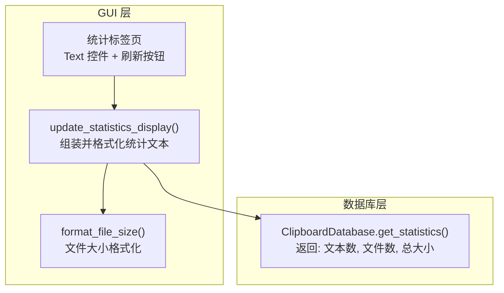
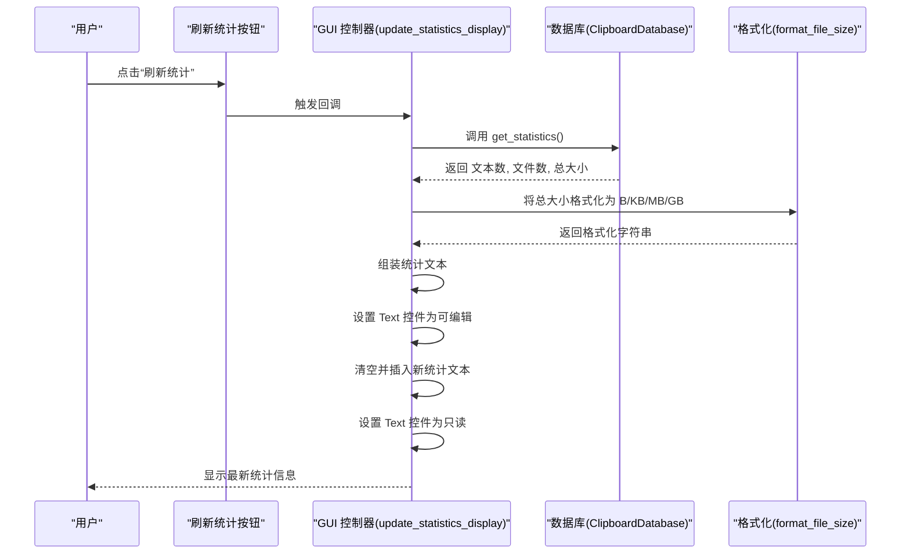
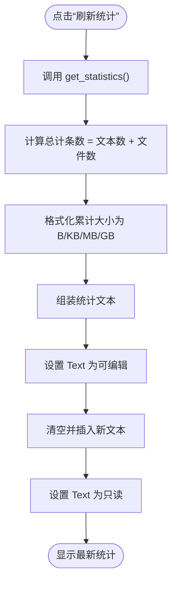
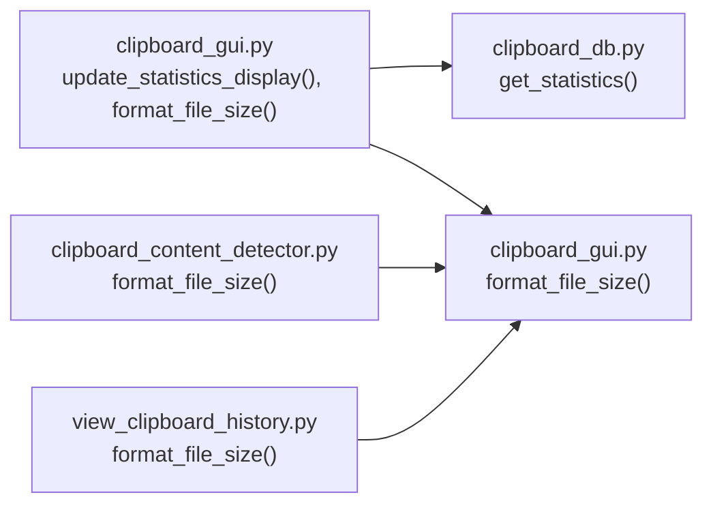

# 统计标签页

<cite>
**本文引用的文件**
- [clipboard_gui.py](file://clipboard_gui.py)
- [clipboard_db.py](file://clipboard_db.py)
- [clipboard_content_detector.py](file://clipboard_content_detector.py)
- [view_clipboard_history.py](file://view_clipboard_history.py)
</cite>

## 目录
1. [简介](#简介)
2. [项目结构](#项目结构)
3. [核心组件](#核心组件)
4. [架构总览](#架构总览)
5. [详细组件分析](#详细组件分析)
6. [依赖关系分析](#依赖关系分析)
7. [性能考量](#性能考量)
8. [故障排查指南](#故障排查指南)
9. [结论](#结论)

## 简介
本文件聚焦“统计标签页”的设计与实现，围绕以下目标展开：
- 使用文本控件展示关键统计指标：文本记录数、文件记录数、总计条数、累计大小等。
- 解释 update_statistics_display 方法如何调用数据库的 get_statistics 函数获取数据，并格式化为用户友好的文本显示。
- 说明刷新按钮的功能：点击后重新获取最新统计数据并更新显示。
- 说明文本控件设置为只读状态以防止用户编辑。
- 提供统计信息的计算逻辑，包括文件大小的格式化显示（B/KB/MB/GB）。
- 讨论该标签页作为系统使用情况概览的价值。

## 项目结构
统计标签页位于 GUI 主界面的笔记本控件中，独立于“记录”和“设置”标签页。其核心由两部分组成：
- 统计标签页界面：包含一个文本控件用于展示统计信息，右侧配有垂直滚动条；底部有一个“刷新统计”按钮。
- 数据来源：通过 GUI 控制器调用数据库层的 get_statistics 接口，返回文本记录数、文件记录数与累计大小（文件大小总和），随后在 GUI 中进行格式化与展示。

图表来源
- [clipboard_gui.py](file://clipboard_gui.py#L309-L327)
- [clipboard_gui.py](file://clipboard_gui.py#L555-L580)
- [clipboard_db.py](file://clipboard_db.py#L316-L332)

章节来源
- [clipboard_gui.py](file://clipboard_gui.py#L309-L327)
- [clipboard_gui.py](file://clipboard_gui.py#L555-L580)
- [clipboard_db.py](file://clipboard_db.py#L316-L332)

## 核心组件
- 统计标签页界面
  - 文本控件：用于展示统计信息，支持滚动查看。
  - 刷新按钮：触发统计信息的重新获取与更新。
- 数据访问层
  - get_statistics：查询文本记录数、文件记录数以及文件大小总和。
- 格式化工具
  - format_file_size：将字节数转换为 B/KB/MB/GB 的人类可读形式。

章节来源
- [clipboard_gui.py](file://clipboard_gui.py#L309-L327)
- [clipboard_gui.py](file://clipboard_gui.py#L555-L580)
- [clipboard_db.py](file://clipboard_db.py#L316-L332)
- [clipboard_gui.py](file://clipboard_gui.py#L880-L889)

## 架构总览
统计标签页遵循“界面-业务-数据”的分层设计：
- 界面层负责渲染与交互（创建 Text 控件、绑定刷新按钮）。
- 业务层负责数据组装与格式化（update_statistics_display、format_file_size）。
- 数据层负责统计查询（get_statistics）。

图表来源
- [clipboard_gui.py](file://clipboard_gui.py#L309-L327)
- [clipboard_gui.py](file://clipboard_gui.py#L555-L580)
- [clipboard_db.py](file://clipboard_db.py#L316-L332)
- [clipboard_gui.py](file://clipboard_gui.py#L880-L889)

## 详细组件分析

### 组件一：统计标签页界面与布局
- Text 控件：用于承载统计文本，支持自动换行与垂直滚动条联动。
- 刷新按钮：绑定到 update_statistics_display，点击后立即刷新统计信息。
- 只读状态：在更新前临时设为可编辑，写入完成后恢复为只读，避免用户误改。

章节来源
- [clipboard_gui.py](file://clipboard_gui.py#L309-L327)
- [clipboard_gui.py](file://clipboard_gui.py#L575-L580)

### 组件二：统计信息获取与组装
- 数据来源：调用数据库层的 get_statistics，返回三元组：文本记录数、文件记录数、文件大小总和。
- 计算逻辑：
  - 总计条数 = 文本记录数 + 文件记录数
  - 累计大小 = 文件大小总和（字节），经 format_file_size 格式化为 B/KB/MB/GB。
- 文本组织：构造标题、分隔线、各项指标与数据库路径等信息，形成统一的统计文本。

章节来源
- [clipboard_gui.py](file://clipboard_gui.py#L555-L580)
- [clipboard_db.py](file://clipboard_db.py#L316-L332)

### 组件三：文件大小格式化
- 格式化规则：
  - 小于 1024 字节：显示为 B
  - 小于 1024^2 字节：显示为 KB（保留一位小数）
  - 小于 1024^3 字节：显示为 MB（保留一位小数）
  - 否则：显示为 GB（保留一位小数）
- 该规则在多个模块中复用，确保统计与记录列表中的大小显示一致性。

章节来源
- [clipboard_gui.py](file://clipboard_gui.py#L880-L889)
- [clipboard_content_detector.py](file://clipboard_content_detector.py#L182-L191)
- [view_clipboard_history.py](file://view_clipboard_history.py#L10-L19)

### 组件四：刷新按钮与更新流程
- 触发时机：用户点击“刷新统计”按钮。
- 执行流程：
  1) 调用 get_statistics 获取最新数据；
  2) 计算总计条数与格式化累计大小；
  3) 组装统计文本；
  4) 临时开启 Text 控件可编辑，清空并插入新文本；
  5) 恢复 Text 控件为只读状态。

图表来源
- [clipboard_gui.py](file://clipboard_gui.py#L555-L580)
- [clipboard_db.py](file://clipboard_db.py#L316-L332)
- [clipboard_gui.py](file://clipboard_gui.py#L880-L889)

## 依赖关系分析
- GUI 控制器依赖数据库层：
  - update_statistics_display 依赖 get_statistics 返回的数据。
  - format_file_size 用于统一大小显示格式。
- 数据库层提供统计接口：
  - get_statistics 通过 SQL 聚合查询文本记录数与文件记录数及文件大小总和。
- 其他模块也使用相同的格式化逻辑，保证跨模块的一致性。

图表来源
- [clipboard_gui.py](file://clipboard_gui.py#L555-L580)
- [clipboard_gui.py](file://clipboard_gui.py#L880-L889)
- [clipboard_db.py](file://clipboard_db.py#L316-L332)
- [clipboard_content_detector.py](file://clipboard_content_detector.py#L182-L191)
- [view_clipboard_history.py](file://view_clipboard_history.py#L10-L19)

章节来源
- [clipboard_gui.py](file://clipboard_gui.py#L555-L580)
- [clipboard_db.py](file://clipboard_db.py#L316-L332)
- [clipboard_gui.py](file://clipboard_gui.py#L880-L889)
- [clipboard_content_detector.py](file://clipboard_content_detector.py#L182-L191)
- [view_clipboard_history.py](file://view_clipboard_history.py#L10-L19)

## 性能考量
- 统计查询复杂度：get_statistics 使用聚合查询 COUNT 与 SUM，通常具备良好性能；若记录量极大，建议在文件大小字段上建立索引以优化 SUM 查询。
- GUI 更新开销：Text 控件一次性插入大量文本，建议在数据量较大时考虑分页或延迟更新策略，避免阻塞 UI。
- 格式化成本：format_file_size 为纯计算函数，开销极低，可放心频繁调用。

## 故障排查指南
- 统计信息未更新
  - 确认点击了“刷新统计”按钮。
  - 检查数据库连接是否正常，确保 get_statistics 能返回有效数据。
- 文本控件可编辑导致异常
  - 确保 update_statistics_display 在写入前后正确设置了控件状态（先可编辑，后只读）。
- 大小显示异常
  - 检查 format_file_size 的输入单位是否为字节，避免误传 KB/MB 导致显示错误。
- 数据库路径显示为空
  - 确认 db_path 初始化正确，且 GUI 控制器持有正确的数据库实例引用。

章节来源
- [clipboard_gui.py](file://clipboard_gui.py#L555-L580)
- [clipboard_db.py](file://clipboard_db.py#L316-L332)
- [clipboard_gui.py](file://clipboard_gui.py#L880-L889)

## 结论
统计标签页通过简洁的界面与清晰的数据流，实现了对系统使用情况的快速概览。它以只读文本控件呈现关键指标，结合刷新按钮保障信息时效性，并通过统一的文件大小格式化逻辑提升可读性。该设计既满足日常运维观察需求，也为后续扩展（如导出统计、趋势分析）提供了良好的基础。