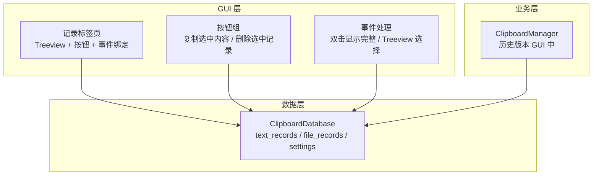
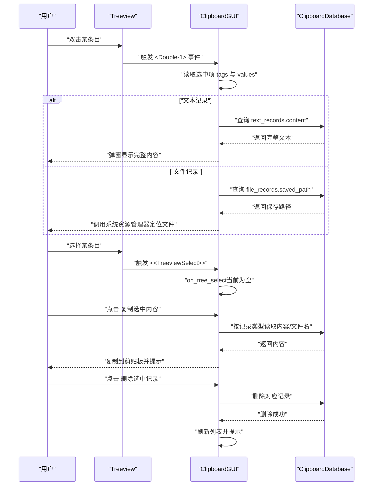
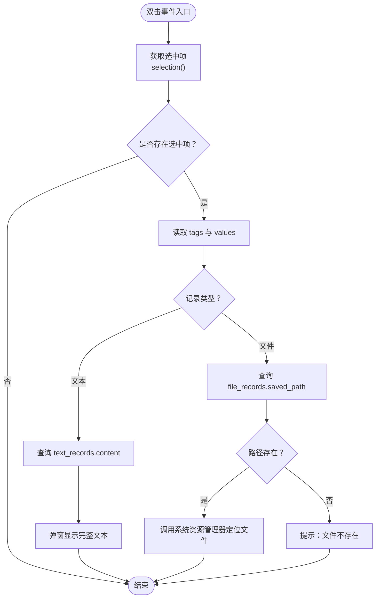
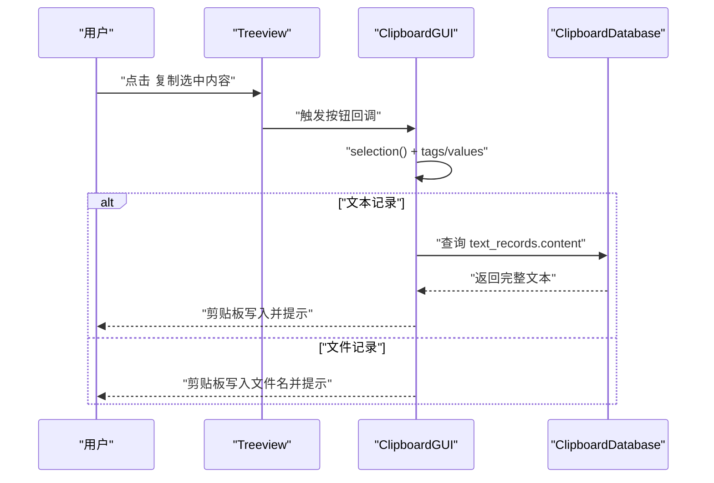
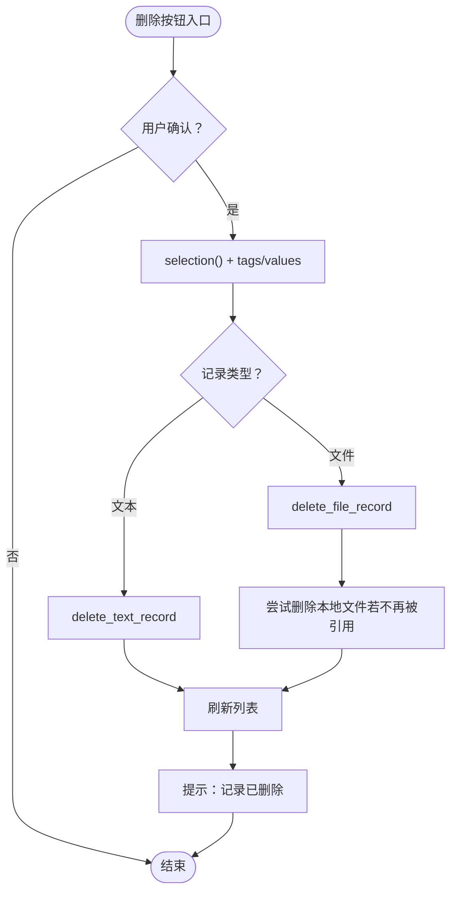
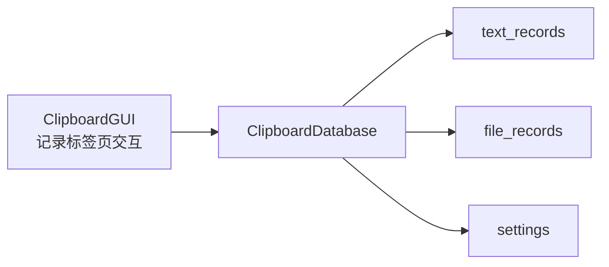

# 交互操作

<cite>
**本文档引用的文件**
- [clipboard_gui.py](file://clipboard_gui.py)
- [clipboard_manager_main.py](file://clipboard_manager_main.py)
- [clipboard_db.py](file://clipboard_db.py)
- [view_clipboard_history.py](file://view_clipboard_history.py)
</cite>

## 目录
1. [简介](#简介)
2. [项目结构](#项目结构)
3. [核心组件](#核心组件)
4. [架构总览](#架构总览)
5. [详细组件分析](#详细组件分析)
6. [依赖关系分析](#依赖关系分析)
7. [性能考量](#性能考量)
8. [故障排查指南](#故障排查指南)
9. [结论](#结论)

## 简介
本章节聚焦“记录标签页”的用户交互行为，围绕以下目标展开：
- 双击条目触发 show_full_record 的处理逻辑：区分文本记录与文件记录，文本记录弹出新窗口显示完整内容（从数据库加载避免截断），文件记录调用系统资源管理器定位文件路径。
- 复制选中内容（copy_selected_record）与删除选中记录（delete_selected_record）按钮的功能实现：包括 Treeview 选择状态获取、数据库同步删除及界面刷新。
- on_tree_select 事件如何响应选中变化，以及可能触发的后续操作（如按钮状态更新）。
- 交互反馈机制：选中高亮、删除成功提示等用户体验细节。

## 项目结构
记录标签页位于 GUI 主界面中，采用 Notebook 控件组织多个标签页，其中“记录”标签页承载 Treeview 列表、按钮与交互事件绑定。数据库层由 ClipboardDatabase 提供统一的数据访问接口，支持文本与文件两类记录的增删查改。

图表来源
- [clipboard_gui.py](file://clipboard_gui.py#L227-L279)
- [clipboard_manager_main.py](file://clipboard_manager_main.py#L56-L111)
- [clipboard_db.py](file://clipboard_db.py#L43-L110)

章节来源
- [clipboard_gui.py](file://clipboard_gui.py#L227-L279)
- [clipboard_manager_main.py](file://clipboard_manager_main.py#L56-L111)
- [clipboard_db.py](file://clipboard_db.py#L43-L110)

## 核心组件
- 记录标签页 UI：包含 Treeview 列表、按钮区、排序与滚动事件绑定。
- 事件处理：
  - 双击条目：show_full_record，区分文本/文件记录并执行不同动作。
  - Treeview 选择：on_tree_select（当前实现为空，但保留了事件绑定）。
  - 按钮点击：复制选中内容 copy_selected_record、删除选中记录 delete_selected_record。
- 数据访问：通过 ClipboardDatabase 统一访问 text_records 与 file_records 表，支持删除与统计等操作。

章节来源
- [clipboard_gui.py](file://clipboard_gui.py#L227-L279)
- [clipboard_gui.py](file://clipboard_gui.py#L646-L660)
- [clipboard_gui.py](file://clipboard_gui.py#L749-L795)
- [clipboard_gui.py](file://clipboard_gui.py#L796-L878)
- [clipboard_db.py](file://clipboard_db.py#L280-L304)

## 架构总览
记录标签页的交互流程由 GUI 层发起，经事件回调处理，最终通过数据库层完成数据变更与刷新。

图表来源
- [clipboard_gui.py](file://clipboard_gui.py#L261-L279)
- [clipboard_gui.py](file://clipboard_gui.py#L646-L660)
- [clipboard_gui.py](file://clipboard_gui.py#L749-L795)
- [clipboard_gui.py](file://clipboard_gui.py#L796-L878)
- [clipboard_db.py](file://clipboard_db.py#L280-L304)

## 详细组件分析

### 双击条目：show_full_record 的处理逻辑
- 选择状态获取：通过 Treeview.selection() 获取当前选中项，再读取 item 的 tags 与 values，其中 tags[0] 为记录类型（text 或 file），tags[1] 为记录 ID。
- 文本记录：
  - 从数据库查询完整内容，避免列表中预览截断导致的信息缺失。
  - 新建子窗口显示完整文本，使用可滚动文本区域，禁用编辑状态以保护内容。
- 文件记录：
  - 从数据库查询保存路径 saved_path，若路径存在则调用系统资源管理器定位该文件；若不存在则提示“文件不存在”。

图表来源
- [clipboard_gui.py](file://clipboard_gui.py#L749-L795)

章节来源
- [clipboard_gui.py](file://clipboard_gui.py#L749-L795)

### 复制选中内容：copy_selected_record
- 选择状态获取：同上，通过 Treeview.selection() 与 tags 获取记录类型与 ID。
- 文本记录：
  - 从数据库读取完整内容，清空剪贴板并追加文本，提示“文本已复制到剪贴板”。
- 文件记录：
  - 从 values 中读取“名称或内容”列（即文件名），清空剪贴板并追加文件名，提示“文件名已复制到剪贴板”。
- 未选中：提示“请先选择一条记录”。

图表来源
- [clipboard_gui.py](file://clipboard_gui.py#L796-L838)

章节来源
- [clipboard_gui.py](file://clipboard_gui.py#L796-L838)

### 删除选中记录：delete_selected_record
- 选择状态获取：同上。
- 删除流程：
  - 文本记录：直接调用 ClipboardDatabase.delete_text_record。
  - 文件记录：先查询 saved_path，删除 file_records 记录，随后尝试删除本地文件（若不再被引用）。
- 数据库同步与界面刷新：
  - 删除完成后调用 load_records 刷新列表。
  - 提示“记录已删除”，未选中时提示“请先选择一条记录”。

图表来源
- [clipboard_gui.py](file://clipboard_gui.py#L839-L878)
- [clipboard_db.py](file://clipboard_db.py#L280-L304)

章节来源
- [clipboard_gui.py](file://clipboard_gui.py#L839-L878)
- [clipboard_db.py](file://clipboard_db.py#L280-L304)

### on_tree_select 事件与按钮状态更新
- 当前实现：on_tree_select 事件处理器为空函数，表示不执行额外逻辑。
- 实践建议（概念性说明）：
  - 若需根据选中状态启用/禁用按钮，可在事件中读取 selection()，判断是否存在选中项，再动态设置按钮状态。
  - 若需实时高亮选中行，可利用 Treeview 的 tag 或样式配置实现视觉反馈。
- 本仓库中未见按钮状态更新的具体实现，因此不附带代码级图表。

章节来源
- [clipboard_gui.py](file://clipboard_gui.py#L646-L660)

### 交互反馈机制
- 选中高亮：Treeview 默认具备选中态高亮，结合 on_tree_select 事件可进一步增强视觉反馈。
- 成功提示：删除成功后弹出提示框；复制成功后弹出提示框。
- 未选中提示：复制/删除前若未选中，弹出警告提示。
- 文件不存在提示：双击文件记录时，若保存路径不存在，弹出警告。

章节来源
- [clipboard_gui.py](file://clipboard_gui.py#L796-L838)
- [clipboard_gui.py](file://clipboard_gui.py#L839-L878)
- [clipboard_gui.py](file://clipboard_gui.py#L749-L795)

## 依赖关系分析
- GUI 层依赖数据库层：
  - show_full_record、copy_selected_record、delete_selected_record 均通过 ClipboardDatabase 访问数据。
- 数据层包含三张核心表：
  - text_records：文本记录，含 content、timestamp、char_count、md5_hash、number。
  - file_records：文件记录，含 original_path、saved_path、filename、file_size、file_type、md5_hash、timestamp、number。
  - settings：应用设置，包含复制限制与保留策略等。
- 历史版本 GUI（clipboard_manager_main.py）展示了另一种 GUI 结构，但记录标签页的核心交互仍以 clipboard_gui.py 为准。

图表来源
- [clipboard_gui.py](file://clipboard_gui.py#L227-L279)
- [clipboard_db.py](file://clipboard_db.py#L43-L110)

章节来源
- [clipboard_gui.py](file://clipboard_gui.py#L227-L279)
- [clipboard_db.py](file://clipboard_db.py#L43-L110)

## 性能考量
- 列表加载：load_records 一次性加载所有记录并插入 Treeview，适合中小规模数据；若记录量较大，可考虑分页或虚拟化渲染。
- 查询优化：show_full_record、copy_selected_record、delete_selected_record 均为单条记录查询，开销较小。
- 数据库连接：各方法均在本地连接数据库，注意避免频繁并发连接；当前实现为短生命周期连接，无需过度担心。
- 自动刷新：GUI 层提供定时刷新机制，避免频繁刷新造成卡顿；在用户操作进行时会暂停刷新，提升交互流畅度。

章节来源
- [clipboard_gui.py](file://clipboard_gui.py#L581-L626)
- [clipboard_gui.py](file://clipboard_gui.py#L1676-L1696)

## 故障排查指南
- 双击文件记录无反应：
  - 检查 saved_path 是否存在；若不存在，系统将提示“文件不存在”。可手动核对数据库记录与实际文件路径。
- 复制失败或为空：
  - 文本记录需确保数据库中存在对应 content；文件记录复制的是文件名，确认 values 中文件名列非空。
- 删除后未刷新：
  - 确认 delete_selected_record 流程是否执行 load_records；若未刷新，可手动点击“刷新”按钮或等待自动刷新周期。
- 按钮状态不变：
  - on_tree_select 当前为空实现，按钮状态更新需自行扩展事件逻辑。

章节来源
- [clipboard_gui.py](file://clipboard_gui.py#L749-L795)
- [clipboard_gui.py](file://clipboard_gui.py#L796-L838)
- [clipboard_gui.py](file://clipboard_gui.py#L839-L878)
- [clipboard_gui.py](file://clipboard_gui.py#L646-L660)

## 结论
记录标签页的交互设计围绕 Treeview 列表与双击/复制/删除三大核心动作展开。通过清晰的事件分发与数据库访问，实现了文本与文件两类记录的差异化处理：文本记录从数据库加载完整内容展示，文件记录调用系统资源管理器定位文件；复制与删除分别针对不同类型采取相应策略，并在操作完成后刷新界面与给出明确提示。当前 on_tree_select 未做具体逻辑，按钮状态更新可按需扩展。整体交互直观、反馈及时，满足日常检索与管理场景。