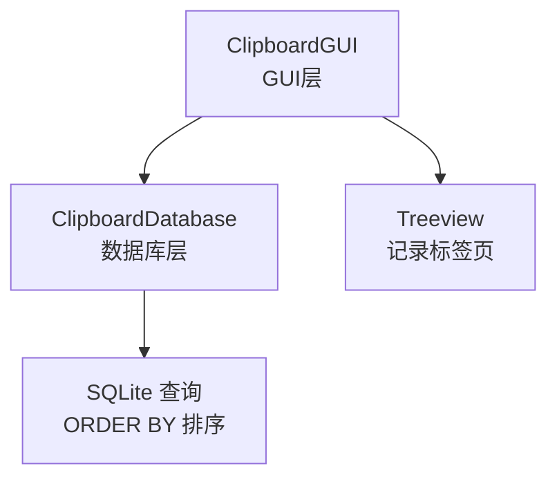
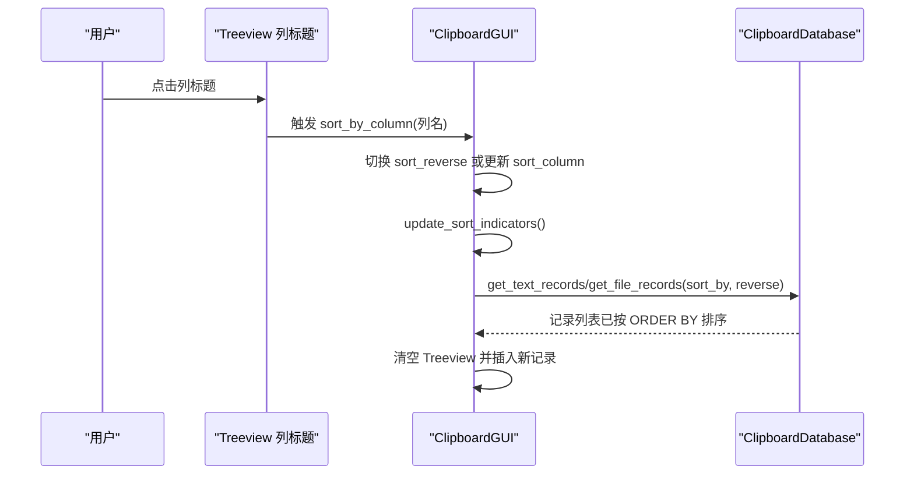
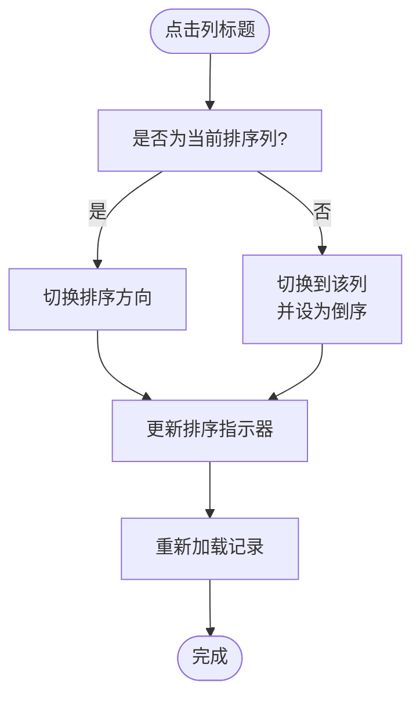
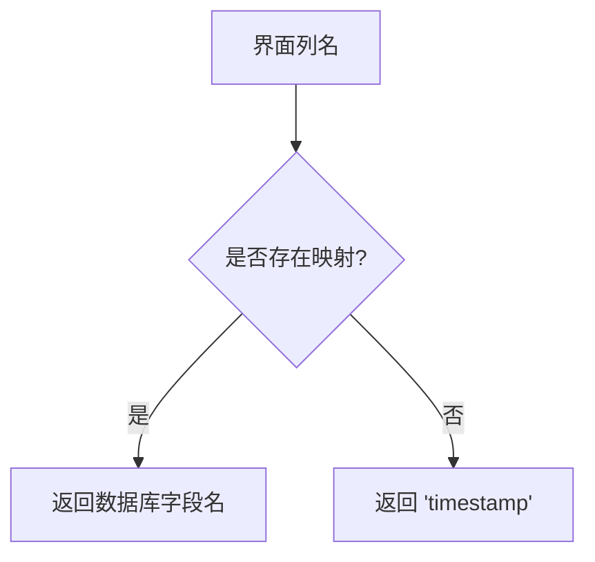
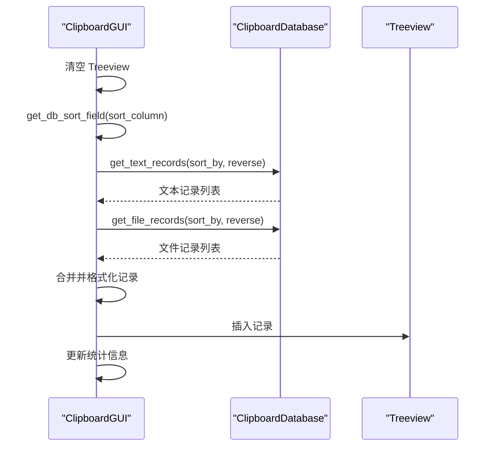
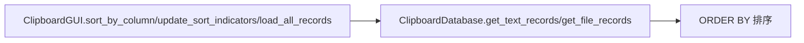

# 排序功能

<cite>
**本文引用的文件**
- [clipboard_gui.py](file://clipboard_gui.py)
- [clipboard_db.py](file://clipboard_db.py)
</cite>

## 目录
1. [简介](#简介)
2. [项目结构](#项目结构)
3. [核心组件](#核心组件)
4. [架构总览](#架构总览)
5. [详细组件分析](#详细组件分析)
6. [依赖关系分析](#依赖关系分析)
7. [性能考量](#性能考量)
8. [故障排查指南](#故障排查指南)
9. [结论](#结论)

## 简介
本章节聚焦“记录标签页”的列标题点击排序机制，围绕以下目标展开：
- 解释 sort_by_column 如何接收列名参数、切换排序方向（正序/倒序），并调用 update_sort_indicators 更新 UI 上的排序箭头指示器。
- 说明 get_db_sort_field 如何将界面列名（如“时间”）映射到数据库字段名（如“timestamp”），确保查询时使用正确的排序字段。
- 解释 load_all_records 如何根据当前排序配置从数据库获取有序数据并重新填充 Treeview。
- 总结排序状态管理细节，包括默认按时间倒序排列的设计意图，以及用户交互后的视觉反馈实现方式。

## 项目结构
- GUI 层负责界面交互、排序状态管理与 Treeview 的渲染。
- 数据库层负责实际的数据访问与排序执行。

图表来源
- [clipboard_gui.py](file://clipboard_gui.py#L238-L308)
- [clipboard_db.py](file://clipboard_db.py#L185-L261)

章节来源
- [clipboard_gui.py](file://clipboard_gui.py#L238-L308)
- [clipboard_db.py](file://clipboard_db.py#L185-L261)

## 核心组件
- 排序状态字段
  - sort_column：当前排序列（界面列名）
  - sort_reverse：当前排序方向（布尔值）
- 关键方法
  - sort_by_column：响应列标题点击，切换方向并触发重新加载
  - update_sort_indicators：更新列标题文本与箭头指示器
  - get_db_sort_field：界面列名到数据库字段名的映射
  - load_all_records：清空 Treeview，按当前排序配置从数据库取数并插入

章节来源
- [clipboard_gui.py](file://clipboard_gui.py#L238-L308)
- [clipboard_gui.py](file://clipboard_gui.py#L581-L637)

## 架构总览
排序流程从用户点击 Treeview 列标题开始，经过 GUI 层的状态切换与指示器更新，再到数据库层的排序查询，最终回到 GUI 层刷新 Treeview。

图表来源
- [clipboard_gui.py](file://clipboard_gui.py#L238-L308)
- [clipboard_gui.py](file://clipboard_gui.py#L581-L637)
- [clipboard_db.py](file://clipboard_db.py#L185-L261)

## 详细组件分析

### 排序状态管理与列标题点击
- 初始状态
  - 默认按“时间”列倒序排列，确保最新记录优先展示。
- 点击行为
  - 若点击的是当前列：切换排序方向（正序/倒序）。
  - 若点击的是其他列：切换到该列，并默认倒序。
- 视觉反馈
  - update_sort_indicators 会为当前排序列的标题追加箭头（↑/↓），并保持点击回调有效。

图表来源
- [clipboard_gui.py](file://clipboard_gui.py#L279-L308)
- [clipboard_gui.py](file://clipboard_gui.py#L581-L637)

章节来源
- [clipboard_gui.py](file://clipboard_gui.py#L238-L308)
- [clipboard_gui.py](file://clipboard_gui.py#L581-L637)

### 列名映射：界面列名到数据库字段名
- get_db_sort_field 将界面列名映射到数据库字段名，保证查询时使用正确的排序字段。
- 默认回退到“timestamp”，确保健壮性。

图表来源
- [clipboard_gui.py](file://clipboard_gui.py#L627-L637)
- [clipboard_db.py](file://clipboard_db.py#L185-L261)

章节来源
- [clipboard_gui.py](file://clipboard_gui.py#L627-L637)
- [clipboard_db.py](file://clipboard_db.py#L185-L261)

### 数据加载与排序：load_all_records
- 清空现有 Treeview。
- 通过 get_db_sort_field 获取数据库排序字段。
- 分别从文本记录与文件记录表中按相同排序字段与方向获取数据。
- 合并结果并插入 Treeview。
- 最后更新统计信息显示。

图表来源
- [clipboard_gui.py](file://clipboard_gui.py#L581-L637)
- [clipboard_db.py](file://clipboard_db.py#L185-L261)

章节来源
- [clipboard_gui.py](file://clipboard_gui.py#L581-L637)
- [clipboard_db.py](file://clipboard_db.py#L185-L261)

### 数据库层排序实现要点
- 文本记录与文件记录均支持按多个字段排序，并支持正序/倒序。
- 当未指定 limit 时，查询返回全部记录，并按 ORDER BY 排序。
- 默认情况下，数据库层也支持按“timestamp”排序，与 GUI 层默认一致。

章节来源
- [clipboard_db.py](file://clipboard_db.py#L185-L261)

## 依赖关系分析
- GUI 层依赖数据库层提供的排序接口，传入排序字段与方向。
- 数据库层依赖 SQLite 执行 ORDER BY，返回已排序的结果集。
- GUI 层通过 Treeview 的 heading 文本与命令回调实现列标题点击与指示器更新。

图表来源
- [clipboard_gui.py](file://clipboard_gui.py#L279-L308)
- [clipboard_gui.py](file://clipboard_gui.py#L581-L637)
- [clipboard_db.py](file://clipboard_db.py#L185-L261)

章节来源
- [clipboard_gui.py](file://clipboard_gui.py#L279-L308)
- [clipboard_gui.py](file://clipboard_gui.py#L581-L637)
- [clipboard_db.py](file://clipboard_db.py#L185-L261)

## 性能考量
- 单次全量加载：当前实现会在每次排序时清空并重新加载全部记录，适合中小规模数据；若数据量较大，可考虑分页或增量刷新策略。
- 排序字段映射：映射逻辑简单直接，开销极低。
- UI 更新：批量插入前先清空，避免重复渲染，提升刷新效率。

## 故障排查指南
- 现象：点击列标题无反应
  - 检查列标题绑定是否正确（functools.partial 闭包问题已通过工具修复）。
  - 确认 sort_by_column 是否被调用。
- 现象：排序方向未切换或指示器未更新
  - 检查 sort_reverse 切换逻辑与 update_sort_indicators 的调用顺序。
- 现象：排序字段异常或未生效
  - 检查 get_db_sort_field 的映射是否覆盖目标列。
  - 确认数据库层的 ORDER BY 是否按预期执行。
- 现象：数据未按期望排序
  - 检查数据库层 sort_by 参数与 reverse 参数传入是否正确。
  - 检查合并与插入逻辑是否正确。

章节来源
- [clipboard_gui.py](file://clipboard_gui.py#L279-L308)
- [clipboard_gui.py](file://clipboard_gui.py#L581-L637)
- [clipboard_gui.py](file://clipboard_gui.py#L627-L637)
- [clipboard_db.py](file://clipboard_db.py#L185-L261)

## 结论
- 默认按“时间”列倒序排列，符合用户直觉（最新优先）。
- 点击同一列切换方向，不同列切换到该列并默认倒序，交互简洁明确。
- get_db_sort_field 提供稳定的列名映射，load_all_records 将排序配置传递至数据库层，最终由 Treeview 展示。
- 建议在大规模数据场景下引入分页或缓存策略，以进一步优化性能与用户体验。