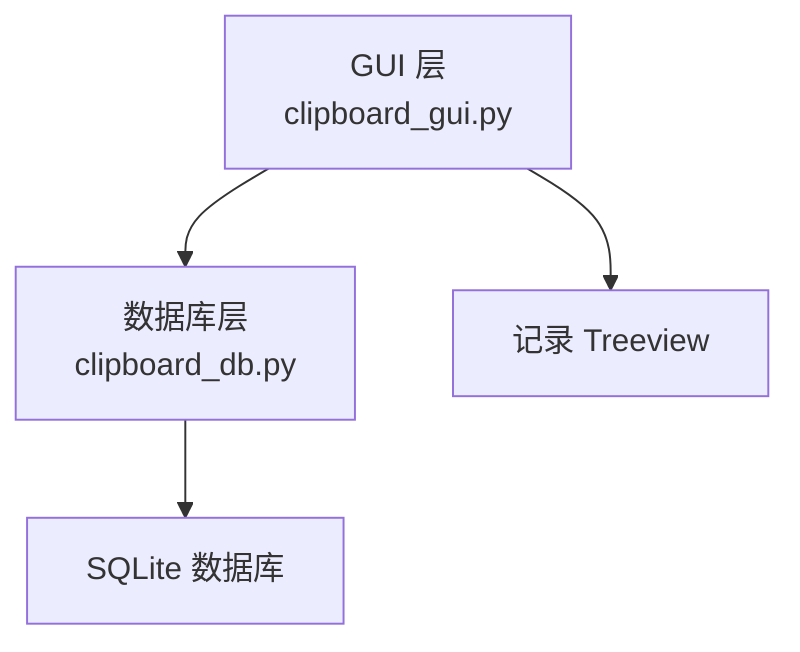
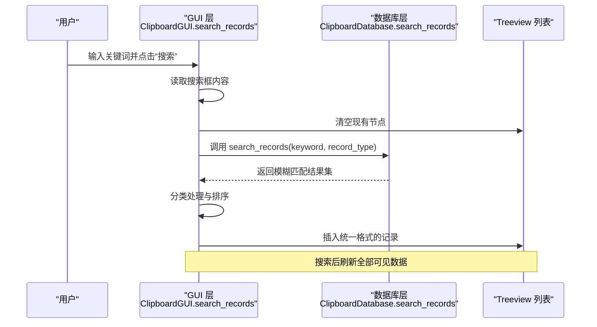
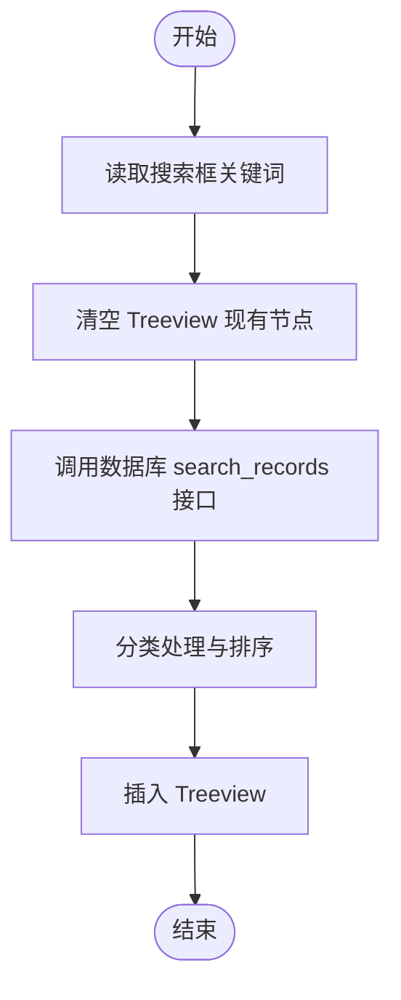
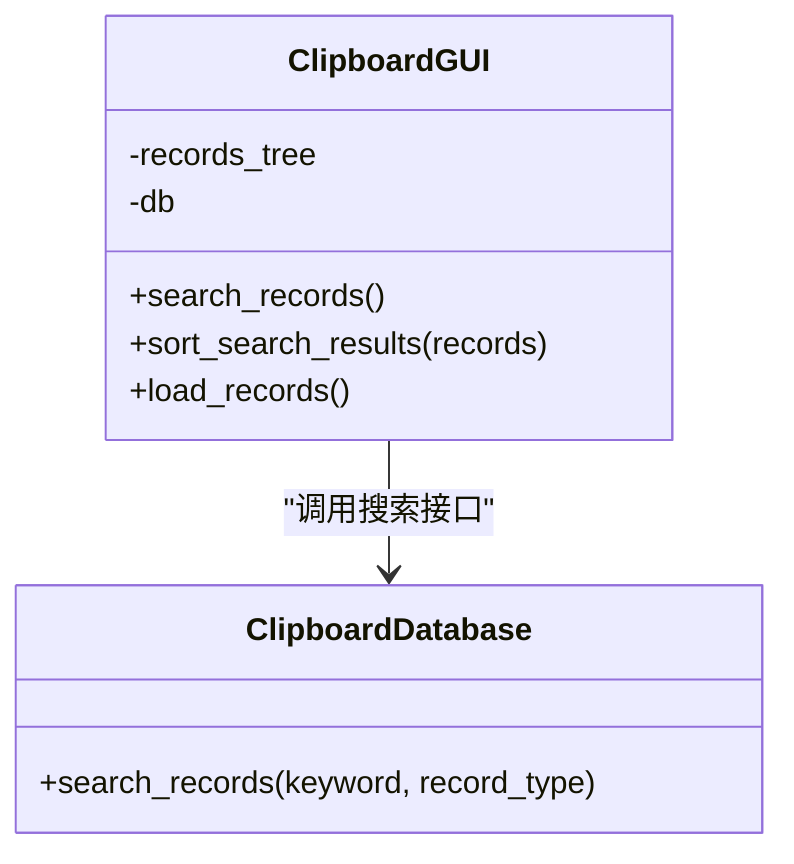

# 搜索功能

<cite>
**本文引用的文件**
- [clipboard_gui.py](file://clipboard_gui.py)
- [clipboard_db.py](file://clipboard_db.py)
</cite>

## 目录
1. [简介](#简介)
2. [项目结构](#项目结构)
3. [核心组件](#核心组件)
4. [架构总览](#架构总览)
5. [详细组件分析](#详细组件分析)
6. [依赖关系分析](#依赖关系分析)
7. [性能考量](#性能考量)
8. [故障排查指南](#故障排查指南)
9. [结论](#结论)

## 简介
本章节聚焦“记录标签页”的搜索功能实现流程，围绕 GUI 层的 search_records 方法展开，说明其如何从搜索框获取关键词、清空 Treeview 现有内容、调用数据库层的 search_records 接口执行模糊匹配查询，并将结果按文本与文件两类进行统一处理与排序，最终插入到统一的记录列表中。同时强调搜索操作会重置分页状态并刷新全部可见数据，提供用户界面交互细节（搜索框输入响应、刷新按钮的重载作用、搜索后无结果时的空状态表现）。

## 项目结构
- GUI 层负责用户交互与界面展示，记录标签页包含搜索框、搜索按钮、刷新按钮与 Treeview 列表。
- 数据库层提供搜索接口，支持按文本内容或文件名进行模糊匹配，并返回统一结构的结果集。

图表来源
- [clipboard_gui.py](file://clipboard_gui.py#L172-L218)
- [clipboard_db.py](file://clipboard_db.py#L281-L314)

章节来源
- [clipboard_gui.py](file://clipboard_gui.py#L172-L218)
- [clipboard_db.py](file://clipboard_db.py#L281-L314)

## 核心组件
- 搜索入口：GUI 中记录标签页的搜索按钮绑定到 search_records 方法。
- 关键词获取：从搜索框 Entry 控件读取用户输入。
- 结果清空：在执行搜索前清空 Treeview 的所有现有节点。
- 查询执行：调用数据库层的 search_records 接口，传入关键词与类型参数。
- 分类处理与排序：将返回的混合类型结果按文本与文件两类分别提取必要字段，统一组装后再按当前列排序策略进行排序。
- 刷新与空状态：搜索后插入新数据，若无结果则 Treeview 为空；刷新按钮会重新加载全部记录。

章节来源
- [clipboard_gui.py](file://clipboard_gui.py#L181-L187)
- [clipboard_gui.py](file://clipboard_gui.py#L652-L667)
- [clipboard_db.py](file://clipboard_db.py#L281-L314)

## 架构总览
搜索功能的调用链路如下：
- 用户在搜索框输入关键词并点击“搜索”。
- GUI 层 search_records 读取关键词，清空 Treeview，调用数据库层 search_records。
- 数据库层执行模糊匹配查询，返回统一结构的结果集。
- GUI 层对结果进行分类处理与排序，插入 Treeview。
- 刷新按钮触发 load_records，重新加载全部记录并刷新显示。

图表来源
- [clipboard_gui.py](file://clipboard_gui.py#L652-L667)
- [clipboard_db.py](file://clipboard_db.py#L281-L314)

## 详细组件分析

### 搜索入口与交互
- 搜索框与按钮位于记录标签页顶部的搜索框架中，分别对应 Entry 与两个按钮：“搜索”和“刷新”。
- “搜索”按钮绑定到 search_records 方法；“刷新”按钮绑定到 load_records 方法。
- 搜索框输入响应：用户输入关键词后，点击“搜索”即触发搜索流程。
- 刷新按钮作用：调用 load_records，重新加载全部记录，刷新 Treeview 显示。

章节来源
- [clipboard_gui.py](file://clipboard_gui.py#L181-L187)

### search_records 方法流程
- 获取关键词：从搜索框 Entry 控件读取用户输入。
- 清空 Treeview：遍历并删除现有节点，确保仅显示本次搜索结果。
- 调用数据库接口：调用 ClipboardDatabase.search_records，传入关键词与默认类型“全部”。
- 排序与显示：调用 sort_search_results 对结果进行统一处理与排序，然后插入 Treeview。

图表来源
- [clipboard_gui.py](file://clipboard_gui.py#L652-L667)

章节来源
- [clipboard_gui.py](file://clipboard_gui.py#L652-L667)

### 数据库层搜索接口
- 支持三种类型：文本、文件、全部。
- 文本类型：按文本内容进行模糊匹配。
- 文件类型：按文件名进行模糊匹配。
- 全部类型：合并文本与文件的模糊匹配结果，并按时间倒序排列。
- 返回结构：统一返回包含类型、ID、信息（文本或文件名）、时间等字段的结果集。

章节来源
- [clipboard_db.py](file://clipboard_db.py#L281-L314)

### 结果分类处理与排序
- 文本记录：提取内容预览、类型标记、时间、出现次数、记录ID等字段。
- 文件记录：通过查询获取文件大小与出现次数，构造统一字段列表。
- 排序策略：根据当前 Treeview 的排序列与方向，对统一字段列表进行排序；数值型字段（大小、次数）采用数值比较，其他字段采用文本比较；若排序异常则回退到按时间排序。

章节来源
- [clipboard_gui.py](file://clipboard_gui.py#L668-L748)

### 刷新按钮与分页状态重置
- 刷新按钮调用 load_records，会清空 Treeview 并重新加载全部记录（不分页），从而重置分页状态并刷新全部可见数据。
- 搜索后同样会清空 Treeview 并插入新的结果，达到“重载”的效果。

章节来源
- [clipboard_gui.py](file://clipboard_gui.py#L186-L187)
- [clipboard_gui.py](file://clipboard_gui.py#L580-L626)

### 空状态表现
- 当搜索无结果时，Treeview 将为空，不会显示任何记录。
- 刷新按钮重新加载全部记录后，Treeview 将显示当前排序条件下的全部记录。

章节来源
- [clipboard_gui.py](file://clipboard_gui.py#L658-L661)
- [clipboard_gui.py](file://clipboard_gui.py#L580-L626)

## 依赖关系分析
- GUI 层依赖数据库层提供的 search_records 接口，二者通过清晰的方法签名耦合。
- GUI 层内部维护排序状态（列与方向），并在搜索与刷新时共同影响最终显示顺序。
- 数据库层返回统一结构的结果集，便于 GUI 层进行分类与排序处理。

图表来源
- [clipboard_gui.py](file://clipboard_gui.py#L652-L667)
- [clipboard_gui.py](file://clipboard_gui.py#L668-L748)
- [clipboard_db.py](file://clipboard_db.py#L281-L314)

章节来源
- [clipboard_gui.py](file://clipboard_gui.py#L652-L748)
- [clipboard_db.py](file://clipboard_db.py#L281-L314)

## 性能考量
- 模糊匹配使用 SQL LIKE，建议在高频场景下考虑建立合适的索引以提升查询效率。
- 搜索结果排序在 GUI 层进行，当结果集较大时可能带来额外开销；可结合数据库层排序或前端虚拟滚动优化。
- 刷新与搜索均会清空并重建 Treeview，频繁操作可能造成 UI 抖动，可在批量插入后一次性刷新显示。

## 故障排查指南
- 搜索无结果：确认关键词是否正确输入；检查数据库中是否存在匹配的文本或文件名；确认 record_type 是否为“全部”。
- 排序异常：若数值型字段排序失败，GUI 层会回退到按时间排序；检查字段解析逻辑与数据格式。
- 刷新无效：确认“刷新”按钮绑定的 load_records 方法是否被调用；检查排序状态是否改变导致显示差异。

章节来源
- [clipboard_gui.py](file://clipboard_gui.py#L738-L744)
- [clipboard_gui.py](file://clipboard_gui.py#L186-L187)

## 结论
记录标签页的搜索功能通过 GUI 层的 search_records 方法串联起用户输入、数据库查询与 UI 刷新，实现了对文本与文件两类记录的统一模糊匹配与排序展示。搜索操作会清空现有 Treeview 并插入新结果，刷新按钮则重新加载全部记录，二者共同保证了界面显示的一致性与实时性。在实际使用中，建议关注数据库索引与排序性能，并在大规模数据场景下考虑进一步优化 UI 刷新策略。