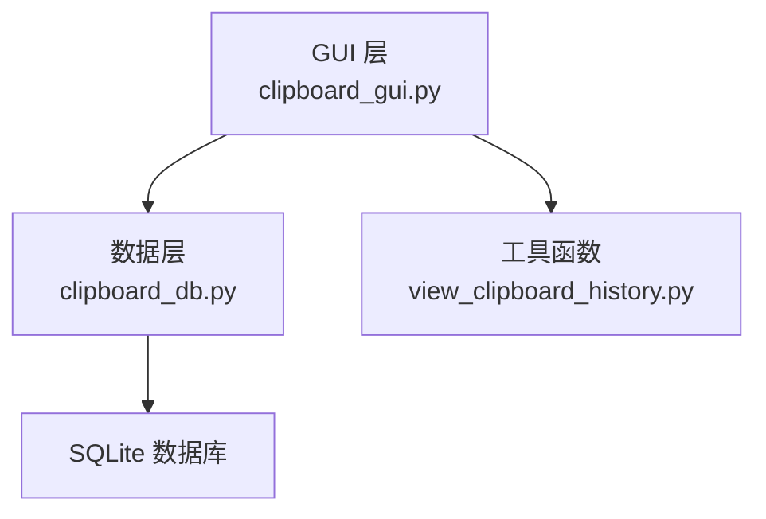
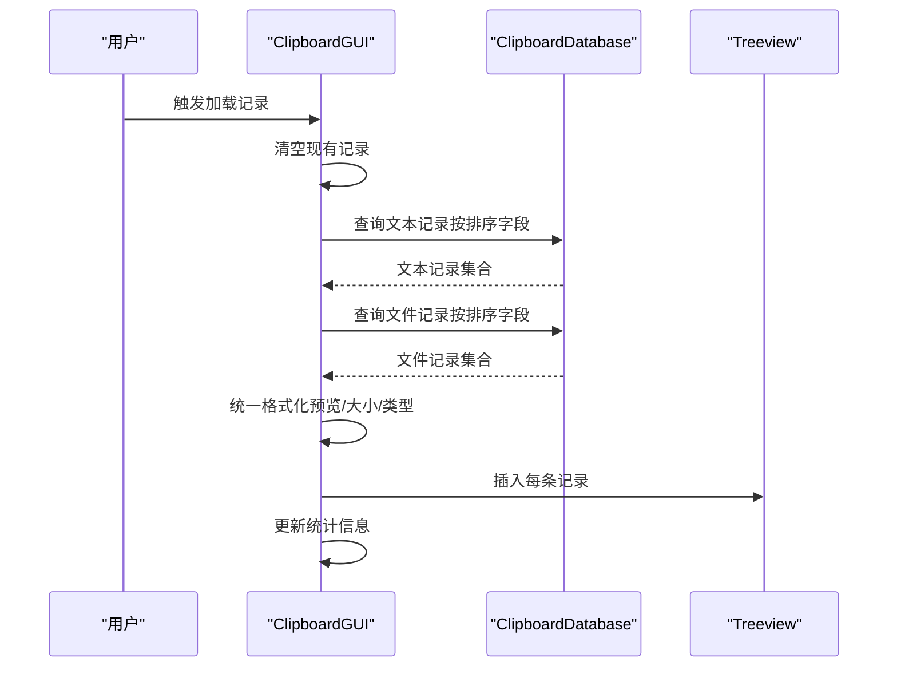
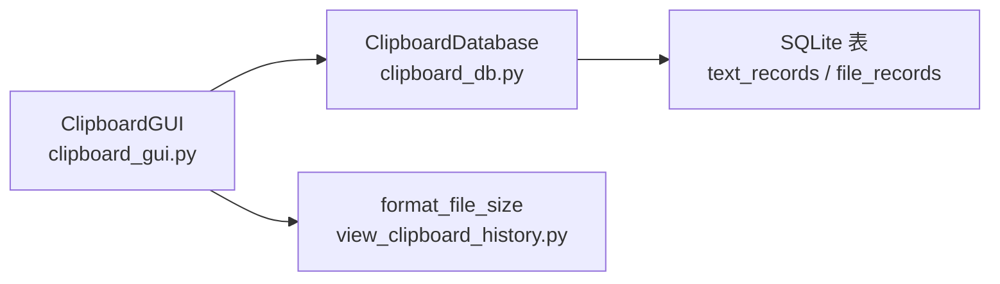

# 记录展示

<cite>
**本文引用的文件**
- [clipboard_gui.py](file://clipboard_gui.py)
- [clipboard_db.py](file://clipboard_db.py)
- [view_clipboard_history.py](file://view_clipboard_history.py)
</cite>

## 目录
1. [简介](#简介)
2. [项目结构](#项目结构)
3. [核心组件](#核心组件)
4. [架构总览](#架构总览)
5. [详细组件分析](#详细组件分析)
6. [依赖关系分析](#依赖关系分析)
7. [性能考量](#性能考量)
8. [故障排查指南](#故障排查指南)
9. [结论](#结论)

## 简介
本章节聚焦“记录”标签页中 Treeview 控件的初始化与数据加载机制，围绕以下目标展开：
- 通过 setup_records_tab 方法创建包含“名称或内容”、“类型”、“大小”、“时间”、“次数”五列的树形视图，并设置列宽、对齐方式与滚动条。
- 通过 load_all_records 方法从 ClipboardDatabase 实例获取文本与文件记录，统一格式化后插入到 Treeview 中：文本记录的内容截取前 50 字符作为预览，大小字段显示为“-”；文件记录显示文件名、类型（后缀）、格式化后的大小。
- 解释 sanitize_text_for_display 与 format_file_size 辅助函数在内容清洗与显示中的作用。
- 说明界面状态初始化细节，包括默认排序列与反向排序的设定。

## 项目结构
- GUI 层：负责界面构建、事件绑定与数据展示，位于 clipboard_gui.py。
- 数据层：负责数据库访问与查询，位于 clipboard_db.py。
- 辅助工具：提供文件大小格式化等通用函数，位于 view_clipboard_history.py。

图表来源
- [clipboard_gui.py](file://clipboard_gui.py#L172-L279)
- [clipboard_db.py](file://clipboard_db.py#L185-L261)
- [view_clipboard_history.py](file://view_clipboard_history.py#L1-L20)

章节来源
- [clipboard_gui.py](file://clipboard_gui.py#L172-L279)
- [clipboard_db.py](file://clipboard_db.py#L185-L261)
- [view_clipboard_history.py](file://view_clipboard_history.py#L1-L20)

## 核心组件
- Treeview 控件：承载记录列表，支持列标题点击排序、垂直滚动与双击查看详情。
- ClipboardDatabase：提供文本与文件记录的查询接口，支持按多种字段排序。
- 辅助函数：
  - sanitize_text_for_display：清理并截断文本，用于预览。
  - format_file_size：将字节数格式化为人类可读的单位字符串。

章节来源
- [clipboard_gui.py](file://clipboard_gui.py#L227-L279)
- [clipboard_db.py](file://clipboard_db.py#L185-L261)
- [view_clipboard_history.py](file://view_clipboard_history.py#L1-L20)

## 架构总览
记录标签页的数据流由 GUI 层发起，经由数据库层查询，再回到 GUI 层进行格式化与渲染。

图表来源
- [clipboard_gui.py](file://clipboard_gui.py#L581-L626)
- [clipboard_db.py](file://clipboard_db.py#L185-L261)

## 详细组件分析

### Treeview 初始化与布局（setup_records_tab）
- 列定义与标题：创建五列“名称或内容”、“类型”、“大小”、“时间”、“次数”，并为每列绑定点击排序回调。
- 排序状态初始化：默认按“时间”列降序（最新在前），并更新列标题的排序指示器。
- 列宽与对齐：分别为各列设置固定宽度与对齐方式（名称或内容左对齐，其余居中）。
- 滚动条：仅启用垂直滚动条，水平滚动条禁用。
- 交互绑定：双击事件用于显示完整内容；选择与滚轮事件用于后续交互（本节关注初始化）。
- 布局权重：父容器网格权重配置，保证 Treeview 与滚动条随窗口缩放。

章节来源
- [clipboard_gui.py](file://clipboard_gui.py#L227-L279)

### 数据加载与格式化（load_all_records）
- 清空旧数据：删除 Treeview 中所有子项，准备渲染新数据。
- 排序字段映射：将界面列名映射到数据库字段名，确保查询与排序一致性。
- 查询文本记录：调用 get_text_records，按映射字段与排序方向获取文本记录。
- 查询文件记录：调用 get_file_records，按映射字段与排序方向获取文件记录。
- 统一格式化：
  - 文本记录：对 content 进行内容清洗与长度截断（预览长度 50），大小字段显示“-”，次数字段取 number。
  - 文件记录：对文件大小调用 format_file_size，类型取 file_type（若为空则显示“未知”），次数字段取 number。
- 插入 Treeview：按记录类型分别插入，同时为每行设置标签（类型与记录 ID），便于后续复制、删除与查看详情。

章节来源
- [clipboard_gui.py](file://clipboard_gui.py#L581-L626)
- [clipboard_db.py](file://clipboard_db.py#L185-L261)

### 内容清洗与显示格式化（sanitize_text_for_display 与 format_file_size）
- sanitize_text_for_display：
  - 功能：移除换行符并截断过长内容，默认最大长度 100；用于预览文本内容。
  - 场景：文本记录预览截断至 50 字符，避免列宽拥挤。
- format_file_size：
  - 功能：将字节数转换为 B/KB/MB/GB 的可读字符串，保留一位小数。
  - 场景：文件记录大小字段显示，统一单位格式。

章节来源
- [clipboard_gui.py](file://clipboard_gui.py#L123-L133)
- [clipboard_gui.py](file://clipboard_gui.py#L878-L889)
- [view_clipboard_history.py](file://view_clipboard_history.py#L1-L20)

### 排序与界面状态初始化
- 默认排序列与方向：初始化时将 sort_column 设为“时间”，sort_reverse 设为 True（降序）。
- 列标题排序指示器：update_sort_indicators 会为当前排序列追加上下箭头，直观显示排序方向。
- 列点击排序：sort_by_column 在同一列重复点击时切换排序方向，否则切换到该列并默认降序。

章节来源
- [clipboard_gui.py](file://clipboard_gui.py#L231-L246)
- [clipboard_gui.py](file://clipboard_gui.py#L280-L308)

### 双击查看详情（show_full_record）
- 文本记录：从数据库读取完整内容，在新窗口中展示（只读）。
- 文件记录：定位文件所在路径并调用系统资源管理器进行选中。

章节来源
- [clipboard_gui.py](file://clipboard_gui.py#L749-L795)

### 复制与删除（copy_selected_record、delete_selected_record）
- 复制：根据记录类型复制文本内容或文件名到剪贴板。
- 删除：根据记录类型删除数据库记录，并尝试删除本地文件（若不再被引用），随后重新加载记录。

章节来源
- [clipboard_gui.py](file://clipboard_gui.py#L800-L878)

## 依赖关系分析
- GUI 依赖数据库层提供的查询接口，以获取文本与文件记录。
- GUI 依赖工具函数进行内容清洗与大小格式化。
- 数据库层内部维护 SQLite 表结构与索引，提供高效查询能力。

图表来源
- [clipboard_gui.py](file://clipboard_gui.py#L581-L626)
- [clipboard_db.py](file://clipboard_db.py#L185-L261)
- [view_clipboard_history.py](file://view_clipboard_history.py#L1-L20)

章节来源
- [clipboard_gui.py](file://clipboard_gui.py#L581-L626)
- [clipboard_db.py](file://clipboard_db.py#L185-L261)
- [view_clipboard_history.py](file://view_clipboard_history.py#L1-L20)

## 性能考量
- 查询范围：当前实现一次性加载所有记录（文本与文件），未采用分页或懒加载策略。对于大量记录场景，建议：
  - 在数据库层增加分页参数与游标控制。
  - 在 GUI 层实现虚拟化滚动（如 ttk.Treeview 的虚拟化扩展）。
- 排序与搜索：排序在 GUI 层进行，文本记录搜索也进行二次排序。建议：
  - 在数据库层完成排序与搜索，减少 GUI 层数据量与计算开销。
- 格式化成本：format_file_size 与 sanitize_text_for_display 为轻量级操作，影响较小；但在大数据量时仍应避免重复计算。

## 故障排查指南
- Treeview 无数据显示：
  - 检查数据库连接与表是否存在。
  - 确认 load_all_records 是否被正确调用（界面初始化后有延时触发）。
- 排序无效或方向异常：
  - 检查 sort_by_column 与 update_sort_indicators 的调用链。
  - 确认 get_db_sort_field 的列名映射是否正确。
- 大小显示异常：
  - 检查 format_file_size 的输入是否为合法字节数。
  - 文本记录大小显示“-”为预期行为。
- 双击查看详情失败：
  - 确认记录标签（类型与 ID）是否正确写入与读取。
  - 文件记录需确保 saved_path 存在且可访问。

章节来源
- [clipboard_gui.py](file://clipboard_gui.py#L581-L626)
- [clipboard_gui.py](file://clipboard_gui.py#L749-L795)
- [clipboard_db.py](file://clipboard_db.py#L185-L261)

## 结论
记录标签页的 Treeview 初始化与数据加载机制清晰地实现了“五列表格 + 排序 + 格式化 + 滚动”的基础展示需求。通过 sanitize_text_for_display 与 format_file_size 的配合，既保证了预览友好性，又统一了显示格式。建议在未来版本中引入分页与数据库侧排序，以提升大规模数据下的响应性能与用户体验。