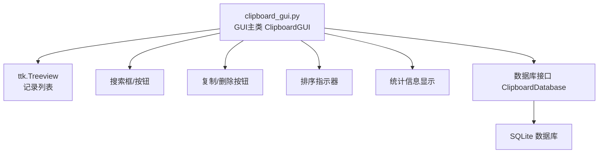
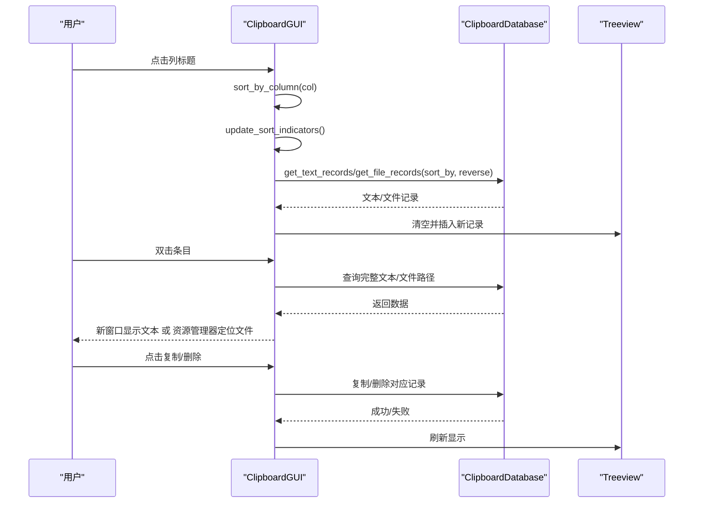
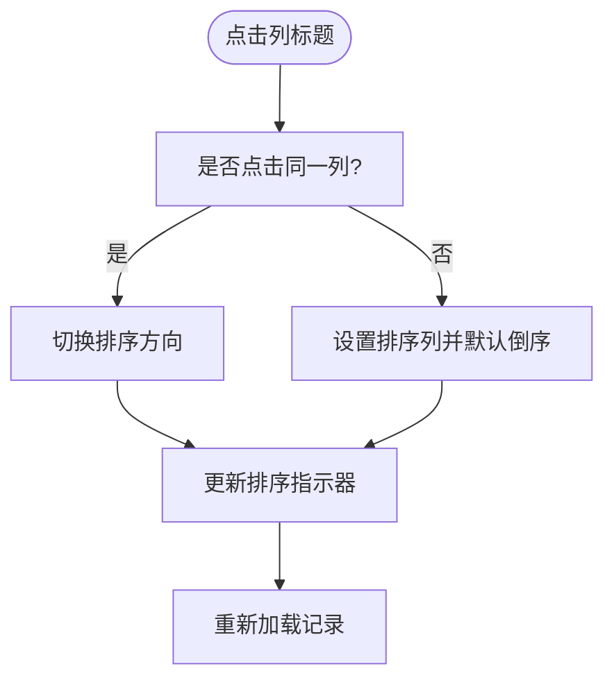
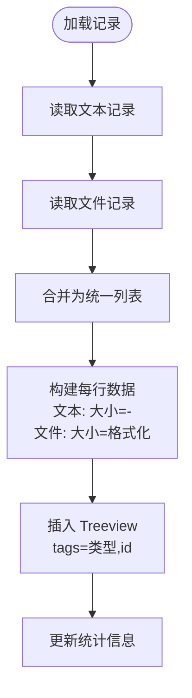
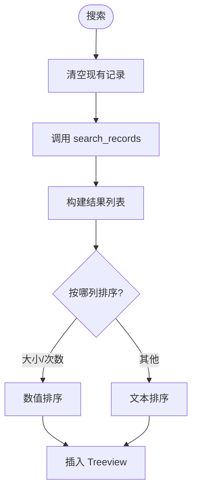
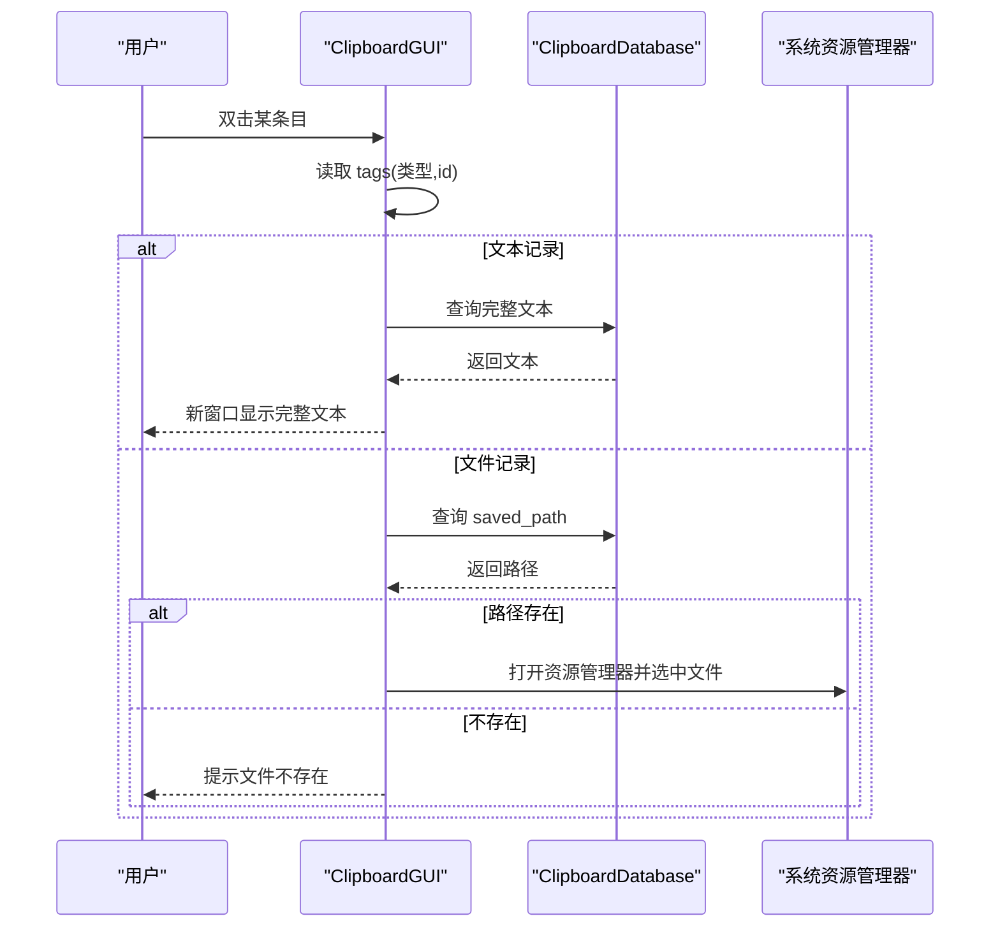
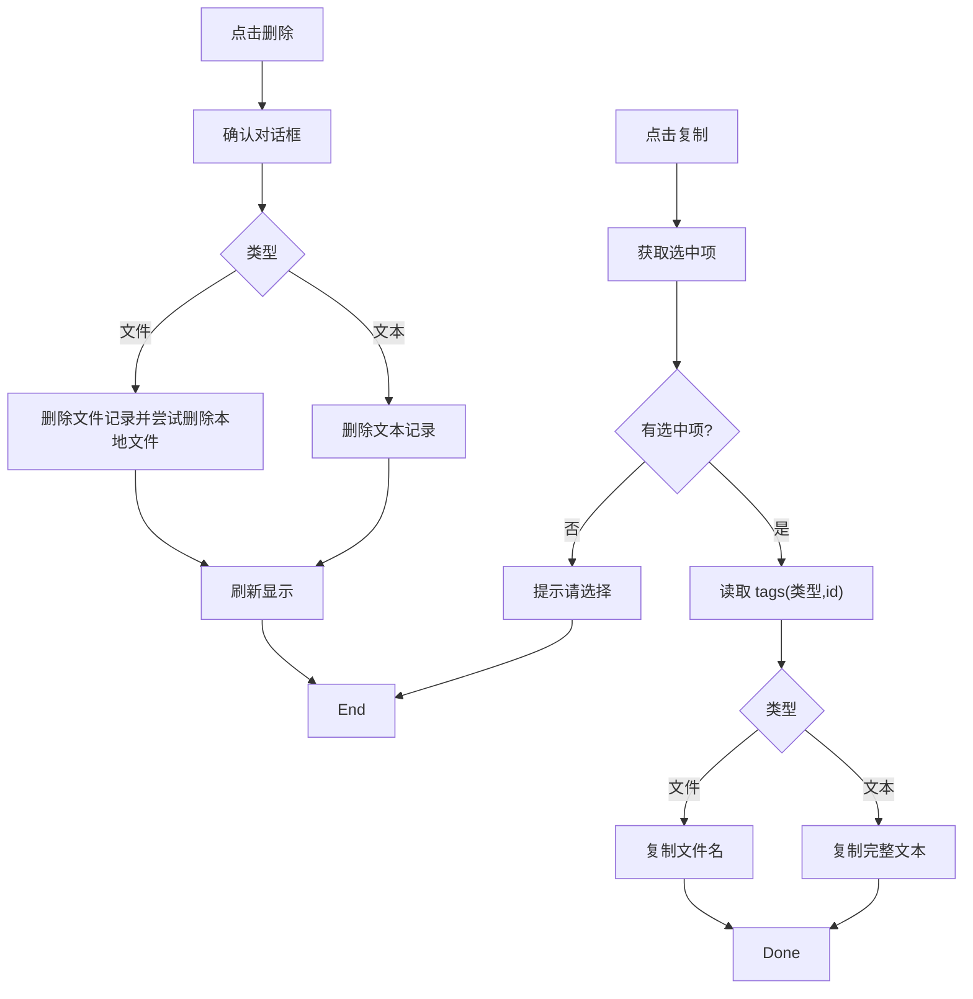
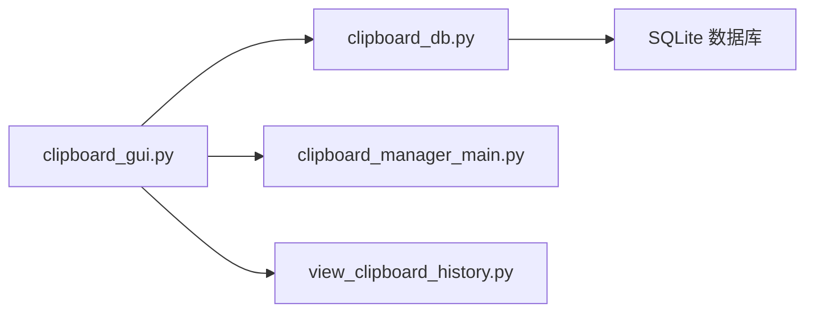

# 记录标签页

<cite>
**本文引用的文件**
- [clipboard_gui.py](file://clipboard_gui.py)
- [clipboard_manager_main.py](file://clipboard_manager_main.py)
- [clipboard_db.py](file://clipboard_db.py)
- [view_clipboard_history.py](file://view_clipboard_history.py)
</cite>

## 目录
1. [简介](#简介)
2. [项目结构](#项目结构)
3. [核心组件](#核心组件)
4. [架构总览](#架构总览)
5. [详细组件分析](#详细组件分析)
6. [依赖关系分析](#依赖关系分析)
7. [性能考量](#性能考量)
8. [故障排查指南](#故障排查指南)
9. [结论](#结论)

## 简介
本章节聚焦“记录标签页”的设计与实现，围绕 Treeview 控件如何统一展示文本与文件两类记录，解释列标题“名称或内容”“类型”“大小”“时间”“次数”的显示逻辑与排序策略，说明双击条目触发的 show_full_record 行为差异（文本显示完整内容，文件在系统资源管理器中定位），以及搜索、复制、删除等交互流程与界面状态管理细节。

## 项目结构
记录标签页位于 GUI 主模块中，采用 Tkinter 的 Notebook 控件组织多个标签页，记录标签页负责整合文本与文件两类记录，提供统一的列表视图、排序、搜索、复制与删除等功能。

图表来源
- [clipboard_gui.py](file://clipboard_gui.py#L227-L279)
- [clipboard_gui.py](file://clipboard_gui.py#L280-L308)
- [clipboard_gui.py](file://clipboard_gui.py#L581-L626)
- [clipboard_manager_main.py](file://clipboard_manager_main.py#L56-L111)
- [clipboard_db.py](file://clipboard_db.py#L43-L75)

章节来源
- [clipboard_gui.py](file://clipboard_gui.py#L172-L279)
- [clipboard_manager_main.py](file://clipboard_manager_main.py#L56-L111)

## 核心组件
- Treeview 列定义与绑定
  - 列标题：名称或内容、类型、大小、时间、次数
  - 列宽与对齐：名称或内容左对齐，其余居中
  - 排序：点击列标题触发 sort_by_column，update_sort_indicators 动态显示箭头
- 数据加载与显示
  - load_all_records：从数据库读取文本与文件记录，统一组装为列表，插入 Treeview
  - 文本记录“大小”列显示“-”，文件记录显示格式化大小
- 搜索与排序
  - search_records：清空现有记录，调用数据库搜索，再按当前排序列进行二次排序
  - sort_search_results：针对搜索结果按列进行文本或数值排序
- 双击行为
  - show_full_record：根据记录类型分别弹窗显示完整文本或在资源管理器中定位文件
- 复制与删除
  - copy_selected_record：复制文本内容或文件名至剪贴板
  - delete_selected_record：删除选中记录，文件记录尝试删除本地文件
- 界面状态管理
  - 用户操作标记 user_action_in_progress，窗口焦点 has_focus，自动更新 update_records

章节来源
- [clipboard_gui.py](file://clipboard_gui.py#L227-L279)
- [clipboard_gui.py](file://clipboard_gui.py#L280-L308)
- [clipboard_gui.py](file://clipboard_gui.py#L581-L626)
- [clipboard_gui.py](file://clipboard_gui.py#L652-L748)
- [clipboard_gui.py](file://clipboard_gui.py#L749-L795)
- [clipboard_gui.py](file://clipboard_gui.py#L796-L878)
- [clipboard_gui.py](file://clipboard_gui.py#L1676-L1708)

## 架构总览
记录标签页的数据流与控制流如下：

图表来源
- [clipboard_gui.py](file://clipboard_gui.py#L280-L308)
- [clipboard_gui.py](file://clipboard_gui.py#L581-L626)
- [clipboard_gui.py](file://clipboard_gui.py#L652-L748)
- [clipboard_gui.py](file://clipboard_gui.py#L749-L795)
- [clipboard_gui.py](file://clipboard_gui.py#L796-L878)
- [clipboard_manager_main.py](file://clipboard_manager_main.py#L181-L211)

## 详细组件分析

### Treeview 列与排序
- 列定义与绑定
  - columns = ("名称或内容","类型","大小","时间","次数")
  - 每列绑定点击事件，使用偏函数解决闭包捕获问题
- 排序状态
  - sort_column、sort_reverse 记录当前排序列与方向
  - update_sort_indicators 动态在列标题后追加箭头“↑/↓”
- 排序实现
  - sort_by_column：点击同一列切换方向，否则切换列并默认倒序
  - get_db_sort_field：将界面列名映射到数据库字段名
  - load_all_records：按数据库字段排序后统一插入

图表来源
- [clipboard_gui.py](file://clipboard_gui.py#L280-L308)
- [clipboard_gui.py](file://clipboard_gui.py#L627-L637)
- [clipboard_gui.py](file://clipboard_gui.py#L581-L626)

章节来源
- [clipboard_gui.py](file://clipboard_gui.py#L236-L253)
- [clipboard_gui.py](file://clipboard_gui.py#L280-L308)
- [clipboard_gui.py](file://clipboard_gui.py#L627-L637)

### 数据加载与显示逻辑
- 文本记录
  - “名称或内容”显示内容预览（截断与换行清理）
  - “类型”固定为“文本”
  - “大小”固定为“-”
  - “次数”来自 number 字段
- 文件记录
  - “名称或内容”显示文件名
  - “类型”显示文件类型（如 images/pdf 等）
  - “大小”格式化显示（B/KB/MB/GB）
  - “次数”来自 number 字段
- 插入 Treeview 时同时写入 tags 以携带记录类型与 id，便于后续复制/删除/定位

图表来源
- [clipboard_gui.py](file://clipboard_gui.py#L581-L626)
- [clipboard_gui.py](file://clipboard_gui.py#L879-L889)

章节来源
- [clipboard_gui.py](file://clipboard_gui.py#L581-L626)
- [clipboard_gui.py](file://clipboard_gui.py#L879-L889)

### 搜索功能
- 清空现有记录
- 调用数据库 search_records，返回文本/文件混合结果
- sort_search_results：
  - 文本记录：从数据库查询 number，构造预览
  - 文件记录：从数据库查询 file_size 与 number，格式化大小
  - 根据当前排序列进行排序：
    - 数值列（大小/次数）：解析大小单位或转为整数排序
    - 文本列：按文本排序
  - 将排序后的结果插入 Treeview

图表来源
- [clipboard_gui.py](file://clipboard_gui.py#L652-L748)

章节来源
- [clipboard_gui.py](file://clipboard_gui.py#L652-L748)

### 双击条目行为：show_full_record
- 读取选中项的 tags，获取记录类型与 id
- 文本记录：
  - 从数据库查询完整内容，弹出新窗口显示
- 文件记录：
  - 从数据库查询 saved_path，若存在则调用系统资源管理器定位文件，否则提示不存在

图表来源
- [clipboard_gui.py](file://clipboard_gui.py#L749-L795)

章节来源
- [clipboard_gui.py](file://clipboard_gui.py#L749-L795)

### 复制与删除按钮
- 复制选中内容
  - 文本记录：复制完整文本到剪贴板
  - 文件记录：复制文件名到剪贴板
- 删除选中记录
  - 文本记录：直接删除
  - 文件记录：删除数据库记录并尝试删除本地文件（若不再被引用）

图表来源
- [clipboard_gui.py](file://clipboard_gui.py#L796-L878)

章节来源
- [clipboard_gui.py](file://clipboard_gui.py#L796-L878)

### 界面状态管理
- 用户操作标记 user_action_in_progress：复制/删除等操作期间设为 True，避免自动更新干扰
- 焦点状态 has_focus：窗口获得/失去焦点时更新
- 自动更新 update_records：每 2 秒检查并刷新记录，避免在窗口隐藏、用户操作或窗口有焦点时更新
- 窗口显示/隐藏：toggle_window、hide_window、show_window

章节来源
- [clipboard_gui.py](file://clipboard_gui.py#L1676-L1708)

## 依赖关系分析
- GUI 层依赖数据库层提供的查询与更新接口
- 数据库层基于 SQLite，提供文本/文件记录的增删改查与统计
- 文件大小格式化在 GUI 与主程序中均有实现，保证显示一致性

图表来源
- [clipboard_gui.py](file://clipboard_gui.py#L40-L46)
- [clipboard_manager_main.py](file://clipboard_manager_main.py#L56-L111)
- [clipboard_db.py](file://clipboard_db.py#L43-L75)
- [view_clipboard_history.py](file://view_clipboard_history.py#L1-L20)

章节来源
- [clipboard_gui.py](file://clipboard_gui.py#L40-L46)
- [clipboard_manager_main.py](file://clipboard_manager_main.py#L56-L111)
- [clipboard_db.py](file://clipboard_db.py#L43-L75)
- [view_clipboard_history.py](file://view_clipboard_history.py#L1-L20)

## 性能考量
- 排序与搜索
  - 文本记录“大小”列固定为“-”，避免每次格式化开销
  - 搜索结果二次排序时，数值列解析采用简单字符串单位处理，避免复杂解析
- 自动更新
  - 2 秒周期更新，避免频繁刷新造成卡顿
  - 在用户操作或窗口有焦点时暂停更新，减少干扰
- 文件大小显示
  - format_file_size 仅在需要时调用，避免重复计算

[本节为通用建议，不涉及具体文件分析]

## 故障排查指南
- 双击文件未定位
  - 检查 saved_path 是否存在；若不存在，确认文件是否被外部删除
- 复制失败
  - 确认已选中条目；检查剪贴板可用性
- 删除后仍可见
  - 确认已刷新显示；检查数据库删除是否成功
- 排序异常
  - 检查当前排序列与方向；确认数值列排序逻辑（大小/次数）是否符合预期

章节来源
- [clipboard_gui.py](file://clipboard_gui.py#L749-L795)
- [clipboard_gui.py](file://clipboard_gui.py#L796-L878)
- [clipboard_gui.py](file://clipboard_gui.py#L652-L748)

## 结论
记录标签页通过 Treeview 实现了文本与文件两类记录的统一展示，结合清晰的列标题与排序指示器，提供了直观的浏览体验。搜索、复制、删除等交互均围绕 tags 与数据库接口展开，保证了操作的一致性与可维护性。界面状态管理有效避免了自动更新与用户操作的冲突，整体设计简洁可靠。