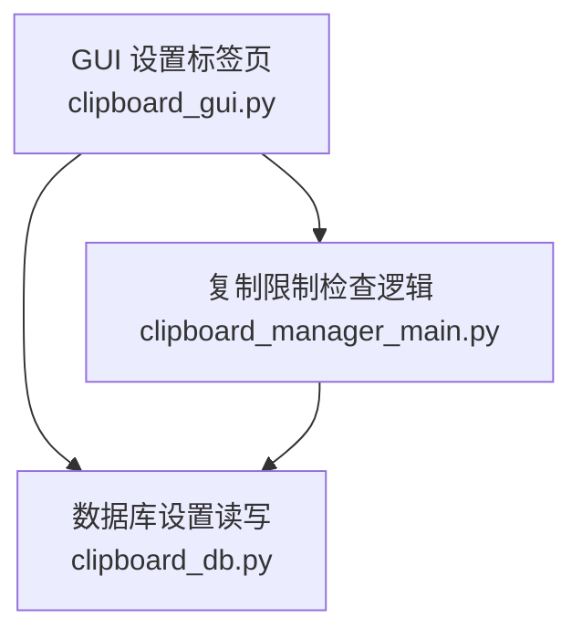
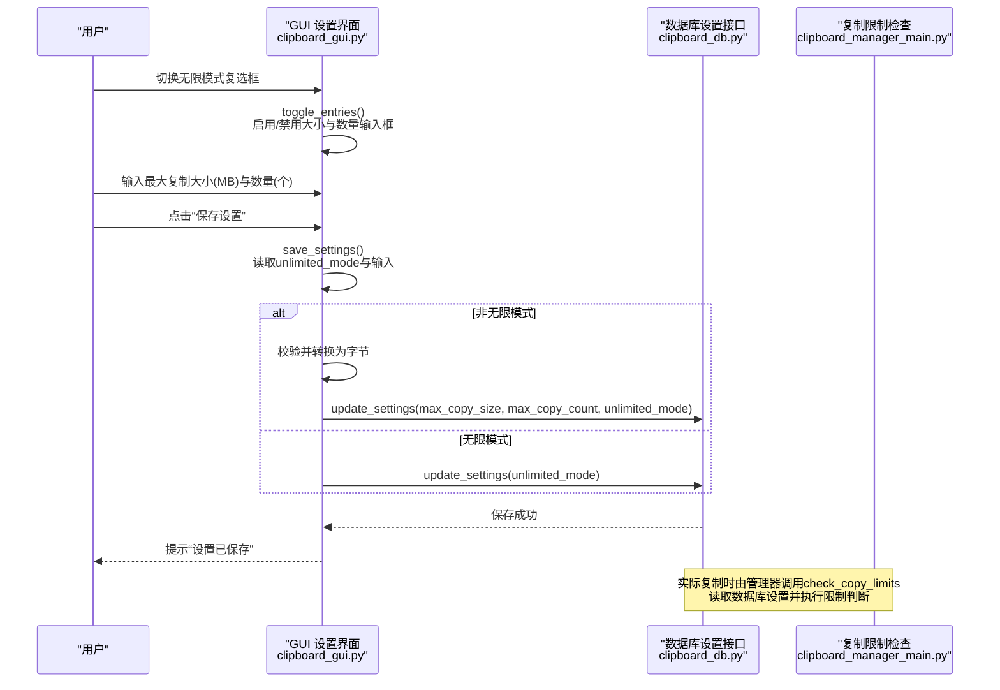
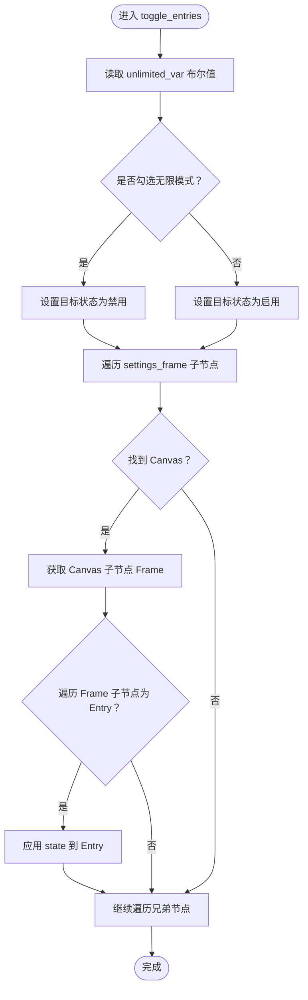
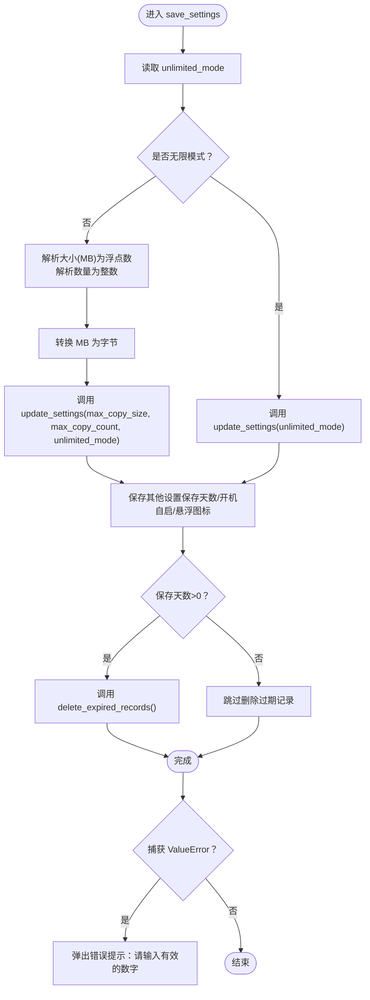
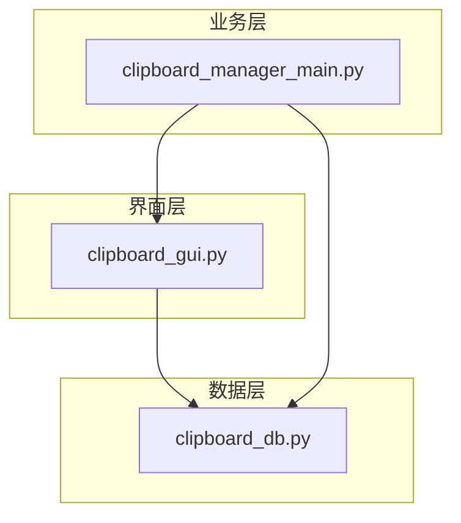

# 复制限制设置

<cite>
**本文引用的文件**
- [clipboard_gui.py](file://clipboard_gui.py)
- [clipboard_manager_main.py](file://clipboard_manager_main.py)
- [clipboard_db.py](file://clipboard_db.py)
</cite>

## 目录
1. [简介](#简介)
2. [项目结构](#项目结构)
3. [核心组件](#核心组件)
4. [架构总览](#架构总览)
5. [详细组件分析](#详细组件分析)
6. [依赖关系分析](#依赖关系分析)
7. [性能考量](#性能考量)
8. [故障排查指南](#故障排查指南)
9. [结论](#结论)

## 简介
本章节聚焦“复制限制设置”区域的设计与实现，涵盖以下要点：
- 界面元素：无限模式复选框、最大复制大小（MB）、最大复制文件数量（个）。
- 动态控制：通过无限模式复选框联动，使用 toggle_entries 方法动态启用/禁用大小与数量输入框。
- 数据存储：max_copy_size 与 max_copy_count 在数据库中以字节为单位存储；界面以 MB 显示与输入。
- 保存流程：save_settings 中对输入值进行校验，包含浮点数与整数转换的异常处理。
- 使用场景：当 unlimited_mode 为真时，跳过大小与数量限制的更新，直接保存无限模式状态。

## 项目结构
复制限制设置位于 GUI 界面层，涉及以下文件：
- clipboard_gui.py：负责设置标签页的界面构建、事件绑定与保存逻辑。
- clipboard_manager_main.py：包含数据库初始化与设置读写接口，以及复制限制检查逻辑。
- clipboard_db.py：提供通用数据库封装，包含设置表结构与读写方法。

图表来源
- [clipboard_gui.py](file://clipboard_gui.py#L328-L533)
- [clipboard_manager_main.py](file://clipboard_manager_main.py#L305-L343)
- [clipboard_db.py](file://clipboard_db.py#L77-L112)

章节来源
- [clipboard_gui.py](file://clipboard_gui.py#L328-L533)
- [clipboard_manager_main.py](file://clipboard_manager_main.py#L305-L343)
- [clipboard_db.py](file://clipboard_db.py#L77-L112)

## 核心组件
- 界面控件
  - 无限模式复选框：绑定 BooleanVar，用于开启/关闭复制限制。
  - 最大复制大小输入框：绑定 StringVar，单位为 MB，显示与输入均以 MB 为单位。
  - 最大复制文件数量输入框：绑定 StringVar，单位为个。
- 动态控制
  - toggle_entries：根据无限模式状态切换大小与数量输入框的可用性。
- 保存逻辑
  - save_settings：读取用户输入，进行数值校验与单位转换，调用数据库更新接口保存设置。

章节来源
- [clipboard_gui.py](file://clipboard_gui.py#L343-L438)
- [clipboard_gui.py](file://clipboard_gui.py#L463-L533)

## 架构总览
复制限制设置的交互流程如下：
- 用户勾选/取消无限模式复选框，触发 toggle_entries 将大小与数量输入框设为禁用/启用。
- 用户点击“保存设置”，save_settings 读取 unlimited_mode 与输入值，执行校验与转换，调用数据库更新接口。
- 管理器在实际复制时调用 check_copy_limits，依据数据库中的设置进行限制判断。

图表来源
- [clipboard_gui.py](file://clipboard_gui.py#L436-L533)
- [clipboard_manager_main.py](file://clipboard_manager_main.py#L362-L394)
- [clipboard_db.py](file://clipboard_db.py#L387-L412)

## 详细组件分析

### 界面构建与绑定
- 无限模式复选框
  - 绑定变量：BooleanVar，用于双向绑定界面状态。
  - 事件绑定：trace("w", ...) 监听状态变化，触发 toggle_entries。
- 最大复制大小与数量
  - 分别绑定 StringVar，界面以 MB 显示与输入。
  - toggle_entries 会遍历设置容器内的 Entry 控件，按状态启用/禁用。

章节来源
- [clipboard_gui.py](file://clipboard_gui.py#L343-L438)
- [clipboard_gui.py](file://clipboard_gui.py#L463-L476)

### 动态控制：toggle_entries
- 作用：根据无限模式状态动态启用/禁用大小与数量输入框。
- 实现要点：
  - 读取 unlimited_var 的布尔值，决定目标状态。
  - 遍历 settings_frame 子节点，定位 Canvas -> Frame -> Entry 并设置 state。
- 注意：该方法通过层级查找 Entry 控件，需保证界面结构稳定。

图表来源
- [clipboard_gui.py](file://clipboard_gui.py#L463-L476)

章节来源
- [clipboard_gui.py](file://clipboard_gui.py#L463-L476)

### 保存设置：save_settings
- 流程概览：
  - 读取 unlimited_mode。
  - 若非无限模式：读取大小（MB）与数量（个），进行浮点与整数转换，转换为字节后保存。
  - 若无限模式：仅保存 unlimited_mode。
  - 其他设置（如保存天数、开机自启、悬浮图标）按界面状态保存。
  - 异常处理：捕获 ValueError，提示“请输入有效的数字”。

图表来源
- [clipboard_gui.py](file://clipboard_gui.py#L477-L533)
- [clipboard_db.py](file://clipboard_db.py#L387-L412)

章节来源
- [clipboard_gui.py](file://clipboard_gui.py#L477-L533)
- [clipboard_db.py](file://clipboard_db.py#L387-L412)

### 数据存储与单位转换
- 数据库存储字段
  - max_copy_size：以字节为单位存储。
  - max_copy_count：以个为单位存储。
  - unlimited_mode：以整型 0/1 存储。
- 界面显示与输入
  - 界面以 MB 显示与输入最大复制大小。
  - 保存前将 MB 转换为字节（乘以 1024×1024 并取整）。
- 加载显示
  - 从数据库读取字节值后，转换为 MB 显示在界面上。

章节来源
- [clipboard_manager_main.py](file://clipboard_manager_main.py#L305-L343)
- [clipboard_db.py](file://clipboard_db.py#L77-L112)
- [clipboard_gui.py](file://clipboard_gui.py#L446-L448)

### 复制限制检查（运行时）
- 管理器在处理剪贴板内容时调用 check_copy_limits：
  - 读取数据库设置。
  - 若 unlimited_mode 为真，直接放行。
  - 否则分别检查文件数量、单个文件大小与总大小是否超过限制。
- 该逻辑与设置界面保持一致，确保用户体验一致性。

章节来源
- [clipboard_manager_main.py](file://clipboard_manager_main.py#L362-L394)

## 依赖关系分析
- GUI 依赖数据库接口进行设置读写。
- 管理器依赖数据库接口读取设置并执行限制判断。
- 数据库层提供统一的 settings 表，包含 max_copy_size、max_copy_count、unlimited_mode 等字段。

图表来源
- [clipboard_gui.py](file://clipboard_gui.py#L328-L533)
- [clipboard_manager_main.py](file://clipboard_manager_main.py#L305-L394)
- [clipboard_db.py](file://clipboard_db.py#L77-L112)

章节来源
- [clipboard_gui.py](file://clipboard_gui.py#L328-L533)
- [clipboard_manager_main.py](file://clipboard_manager_main.py#L305-L394)
- [clipboard_db.py](file://clipboard_db.py#L77-L112)

## 性能考量
- 单次保存设置的数据库操作为少量 UPDATE，开销极低。
- 界面切换输入框状态采用遍历控件树，通常控件数量有限，性能可接受。
- 运行时复制限制检查在每次处理剪贴板时执行，主要为文件大小与数量比较，复杂度较低。

## 故障排查指南
- 输入无效导致保存失败
  - 现象：点击“保存设置”后弹出“请输入有效的数字”。
  - 原因：非无限模式下，大小输入框未填入有效浮点数，或数量输入框未填入有效整数。
  - 处理：确保大小为正数（例如 300.0），数量为正整数（例如 100）。
- 无限模式下仍出现限制
  - 现象：勾选无限模式后仍被限制。
  - 原因：确认数据库中 unlimited_mode 已正确更新为 1。
  - 处理：重新保存设置并重启应用，确保设置生效。
- 大小显示与实际不符
  - 现象：界面显示 MB 与数据库字节值不一致。
  - 原因：界面以 MB 显示，保存前转换为字节；加载时从字节转换回 MB。
  - 处理：确认转换逻辑一致，避免手动修改数据库字段。

章节来源
- [clipboard_gui.py](file://clipboard_gui.py#L477-L533)
- [clipboard_manager_main.py](file://clipboard_manager_main.py#L362-L394)

## 结论
复制限制设置区域通过清晰的界面设计与完善的动态控制机制，实现了灵活的限制策略。界面以 MB 为单位便于用户理解，内部以字节存储确保精度；无限模式开关与输入框联动，简化了用户操作。保存流程包含严格的数值校验与异常处理，保障了设置的安全性与稳定性。运行时的限制检查与设置保持一致，确保整体行为的一致性与可预期性。