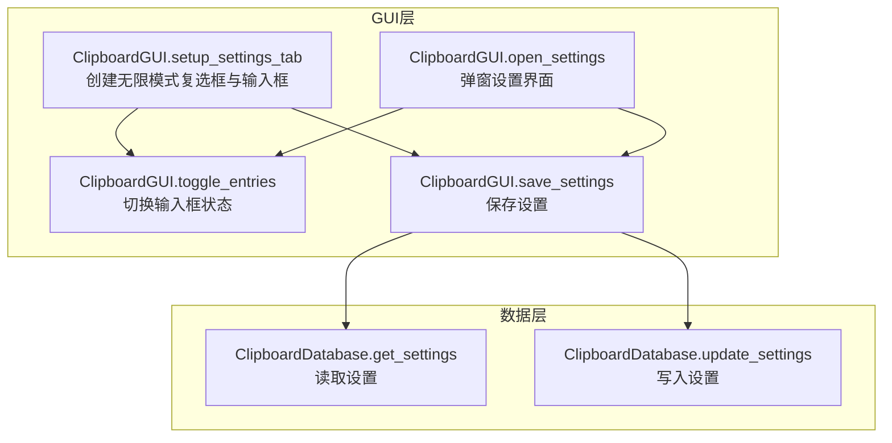
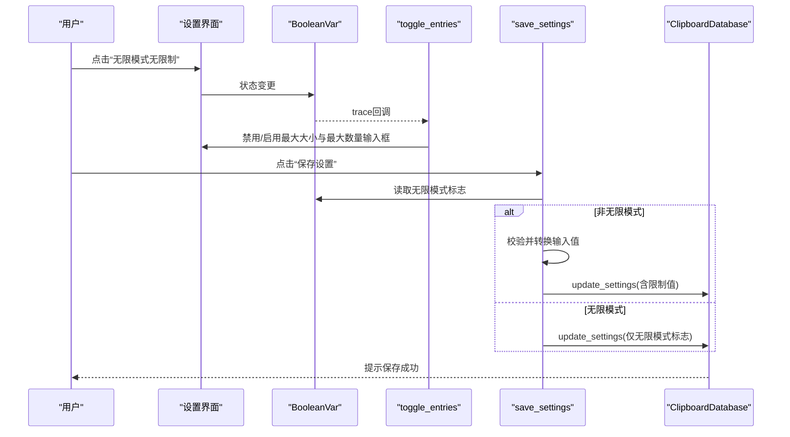
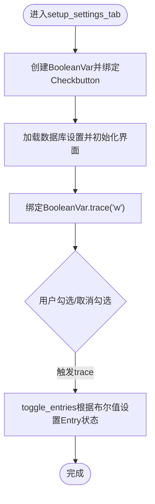
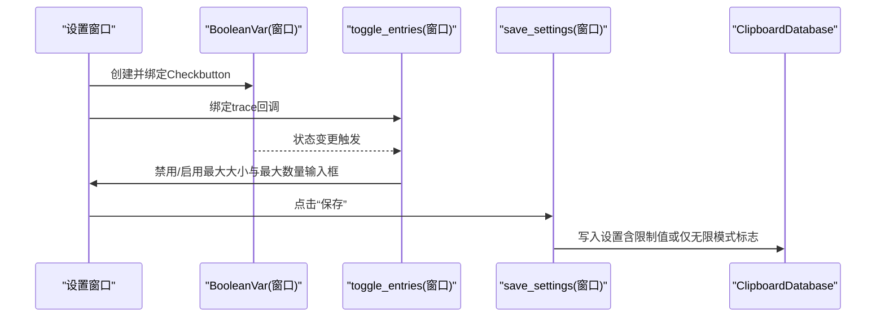
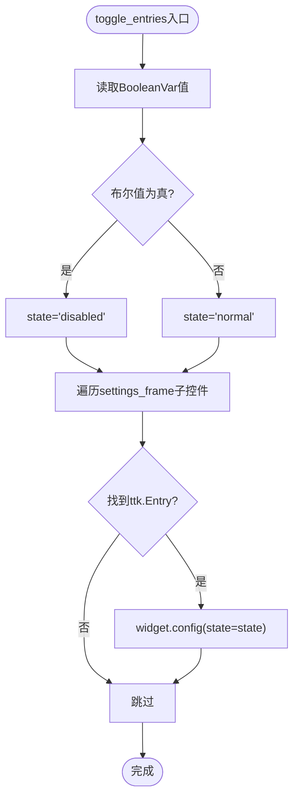
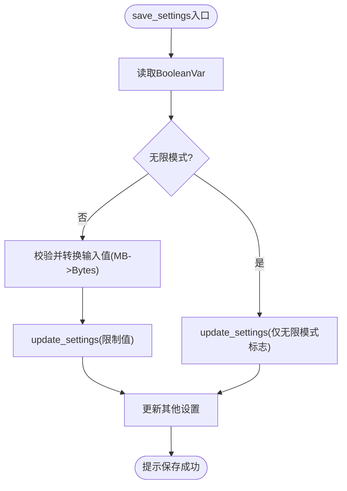
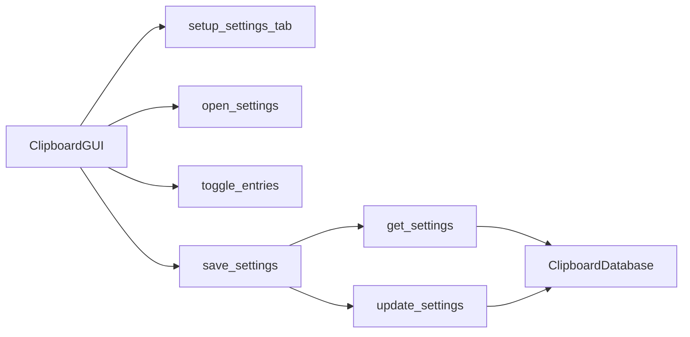

# 无限模式复选框

<cite>
**本文引用的文件**
- [clipboard_gui.py](file://clipboard_gui.py)
- [clipboard_db.py](file://clipboard_db.py)
</cite>

## 目录
1. [简介](#简介)
2. [项目结构](#项目结构)
3. [核心组件](#核心组件)
4. [架构总览](#架构总览)
5. [详细组件分析](#详细组件分析)
6. [依赖关系分析](#依赖关系分析)
7. [性能考量](#性能考量)
8. [故障排查指南](#故障排查指南)
9. [结论](#结论)

## 简介
本文件围绕“无限模式复选框”的设计与实现展开，重点说明：
- 如何使用 BooleanVar 将复选框与界面状态绑定；
- 如何通过 trace 方法监听状态变化；
- 当复选框状态改变时，如何调用 toggle_entries 动态启用/禁用最大大小与最大数量输入框；
- 在主设置标签页与独立设置窗口中的布局位置；
- 该交互如何提升用户体验，避免在无限模式下误输入无效限制值。

## 项目结构
本功能主要位于 GUI 层的设置界面中，涉及两个入口：
- 主界面设置标签页：在主窗口的“设置”标签页中创建无限模式复选框与相关输入框；
- 独立设置窗口：在弹出的设置窗口中同样提供无限模式开关与输入框。

图表来源
- [clipboard_gui.py](file://clipboard_gui.py#L328-L476)
- [clipboard_gui.py](file://clipboard_gui.py#L950-L1129)
- [clipboard_gui.py](file://clipboard_gui.py#L477-L533)
- [clipboard_db.py](file://clipboard_db.py#L359-L412)

章节来源
- [clipboard_gui.py](file://clipboard_gui.py#L328-L476)
- [clipboard_gui.py](file://clipboard_gui.py#L950-L1129)
- [clipboard_db.py](file://clipboard_db.py#L359-L412)

## 核心组件
- 无限模式 BooleanVar：用于绑定复选框状态，作为布尔标志位贯穿界面与持久化逻辑。
- 复选框控件：在主设置标签页与独立设置窗口分别创建，分别绑定各自的 BooleanVar。
- 输入框：最大复制大小与最大复制文件数量的输入框，在无限模式开启时被禁用。
- toggle_entries：根据 BooleanVar 的值统一切换输入框的可用状态。
- save_settings：保存设置时，若非无限模式则校验并转换输入值，否则仅保存无限模式标志。

章节来源
- [clipboard_gui.py](file://clipboard_gui.py#L344-L347)
- [clipboard_gui.py](file://clipboard_gui.py#L436-L438)
- [clipboard_gui.py](file://clipboard_gui.py#L463-L476)
- [clipboard_gui.py](file://clipboard_gui.py#L477-L533)
- [clipboard_gui.py](file://clipboard_gui.py#L973-L976)
- [clipboard_gui.py](file://clipboard_gui.py#L1118-L1125)

## 架构总览
无限模式复选框的交互流程如下：
- 用户在设置界面勾选/取消勾选“无限模式（无限制）”；
- 通过 BooleanVar 的 trace 监听状态变化；
- 触发 toggle_entries，根据布尔值统一禁用/启用最大大小与最大数量输入框；
- 保存设置时，若未勾选无限模式，则校验并转换输入值后写入数据库；若勾选无限模式，则仅写入无限模式标志。

图表来源
- [clipboard_gui.py](file://clipboard_gui.py#L344-L347)
- [clipboard_gui.py](file://clipboard_gui.py#L436-L438)
- [clipboard_gui.py](file://clipboard_gui.py#L463-L476)
- [clipboard_gui.py](file://clipboard_gui.py#L477-L533)
- [clipboard_gui.py](file://clipboard_gui.py#L973-L976)
- [clipboard_gui.py](file://clipboard_gui.py#L1118-L1125)
- [clipboard_db.py](file://clipboard_db.py#L387-L412)

## 详细组件分析

### 组件A：主设置标签页中的无限模式复选框
- 创建位置：在设置标签页的主框架中，使用网格布局定位。
- 绑定方式：创建 BooleanVar 并将其赋给 Checkbutton 的 variable 参数。
- 初始状态：加载数据库设置后，将 BooleanVar 设为对应值。
- 事件绑定：通过 trace("w", ...) 监听写入事件，回调 toggle_entries 切换输入框状态。
- 输入框联动：toggle_entries 遍历设置容器内的控件，查找 Entry 并按当前布尔值设置 state。

图表来源
- [clipboard_gui.py](file://clipboard_gui.py#L328-L476)

章节来源
- [clipboard_gui.py](file://clipboard_gui.py#L328-L476)

### 组件B：独立设置窗口中的无限模式复选框
- 创建位置：弹出设置窗口顶部，与主界面类似。
- 绑定方式：创建局部 BooleanVar 并绑定 Checkbutton。
- 事件绑定：通过 trace("w", ...) 监听写入事件，回调内部函数切换输入框状态。
- 输入框联动：内部函数根据布尔值直接设置最大大小与最大数量输入框的状态。

图表来源
- [clipboard_gui.py](file://clipboard_gui.py#L950-L1129)
- [clipboard_db.py](file://clipboard_db.py#L387-L412)

章节来源
- [clipboard_gui.py](file://clipboard_gui.py#L950-L1129)

### 组件C：toggle_entries 的实现与工作原理
- 作用：根据 BooleanVar 的当前值，统一启用/禁用最大大小与最大数量输入框。
- 实现要点：
  - 读取 BooleanVar 值，计算目标 state；
  - 遍历设置容器的子控件，定位到 Canvas -> Frame -> Entry；
  - 对每个 Entry 调用 config(state=state) 应用状态。

图表来源
- [clipboard_gui.py](file://clipboard_gui.py#L463-L476)

章节来源
- [clipboard_gui.py](file://clipboard_gui.py#L463-L476)

### 组件D：保存设置与输入校验
- 保存逻辑：
  - 读取 BooleanVar 值判断是否无限模式；
  - 若非无限模式：读取最大大小与最大数量，进行数值校验与单位转换（MB->Bytes），然后写入数据库；
  - 若无限模式：仅写入无限模式标志；
  - 其他设置（如保存天数、开机自启、悬浮图标）按需更新。
- 错误处理：捕获数值转换异常并提示用户输入有效数字。

图表来源
- [clipboard_gui.py](file://clipboard_gui.py#L477-L533)
- [clipboard_db.py](file://clipboard_db.py#L387-L412)

章节来源
- [clipboard_gui.py](file://clipboard_gui.py#L477-L533)
- [clipboard_db.py](file://clipboard_db.py#L387-L412)

## 依赖关系分析
- GUI 层依赖：
  - ClipboardGUI.setup_settings_tab 与 ClipboardGUI.open_settings 分别负责主界面与弹窗的设置界面；
  - toggle_entries 与 save_settings 是核心交互与持久化逻辑；
  - BooleanVar 作为状态源贯穿 UI 与持久化。
- 数据层依赖：
  - ClipboardDatabase.get_settings 与 update_settings 提供设置的读取与写入；
  - 设置表包含 max_copy_size、max_copy_count、unlimited_mode 等字段。

图表来源
- [clipboard_gui.py](file://clipboard_gui.py#L328-L533)
- [clipboard_gui.py](file://clipboard_gui.py#L950-L1129)
- [clipboard_db.py](file://clipboard_db.py#L359-L412)

章节来源
- [clipboard_gui.py](file://clipboard_gui.py#L328-L533)
- [clipboard_gui.py](file://clipboard_gui.py#L950-L1129)
- [clipboard_db.py](file://clipboard_db.py#L359-L412)

## 性能考量
- trace 回调在每次写入时触发，toggle_entries 遍历控件树，但设置界面规模有限，开销可忽略。
- 数值校验与单位转换发生在保存阶段，避免频繁转换带来的额外成本。
- 建议：若未来界面规模扩大，可考虑缓存 Entry 控件引用，减少遍历成本。

## 故障排查指南
- 症状：无限模式勾选后输入框仍可编辑
  - 排查：确认 BooleanVar 是否正确绑定到 Checkbutton；确认 trace 是否注册；确认 toggle_entries 是否被调用。
  - 参考路径：
    - [clipboard_gui.py](file://clipboard_gui.py#L344-L347)
    - [clipboard_gui.py](file://clipboard_gui.py#L436-L438)
    - [clipboard_gui.py](file://clipboard_gui.py#L463-L476)
- 症状：保存时报“请输入有效的数字”
  - 排查：确认非无限模式时输入框未被禁用；确认数值转换逻辑与单位换算正确。
  - 参考路径：
    - [clipboard_gui.py](file://clipboard_gui.py#L477-L533)
- 症状：设置未持久化
  - 排查：确认 update_settings 调用链路；确认数据库连接与事务提交。
  - 参考路径：
    - [clipboard_db.py](file://clipboard_db.py#L387-L412)

章节来源
- [clipboard_gui.py](file://clipboard_gui.py#L344-L347)
- [clipboard_gui.py](file://clipboard_gui.py#L436-L438)
- [clipboard_gui.py](file://clipboard_gui.py#L463-L476)
- [clipboard_gui.py](file://clipboard_gui.py#L477-L533)
- [clipboard_db.py](file://clipboard_db.py#L387-L412)

## 结论
无限模式复选框通过 BooleanVar 与 trace 机制实现了简洁而直观的状态同步，配合 toggle_entries 的统一状态切换，有效避免了在无限模式下误输入无效限制值的情况。该设计提升了用户体验，同时保证了设置保存流程的健壮性与一致性。