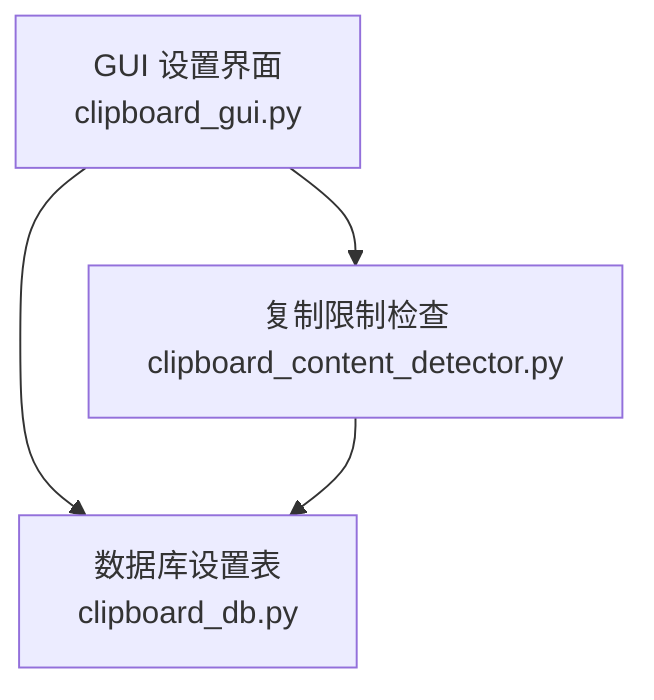
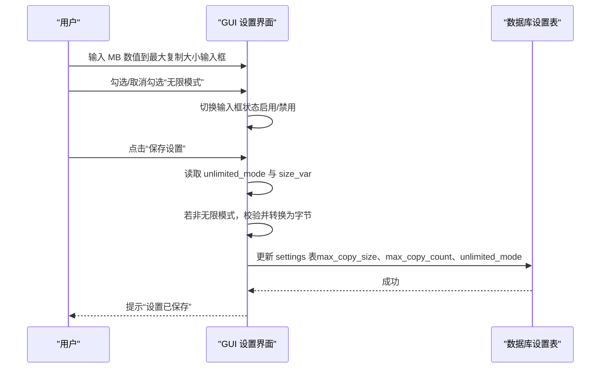
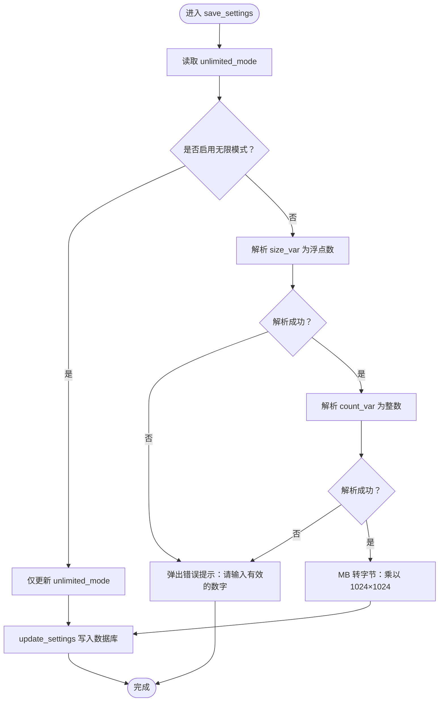

# 最大复制大小输入框

<cite>
**本文引用的文件**
- [clipboard_gui.py](file://clipboard_gui.py)
- [clipboard_db.py](file://clipboard_db.py)
- [clipboard_content_detector.py](file://clipboard_content_detector.py)
</cite>

## 目录
1. [简介](#简介)
2. [项目结构](#项目结构)
3. [核心组件](#核心组件)
4. [架构总览](#架构总览)
5. [详细组件分析](#详细组件分析)
6. [依赖关系分析](#依赖关系分析)
7. [性能考量](#性能考量)
8. [故障排查指南](#故障排查指南)
9. [结论](#结论)

## 简介
本文围绕“最大复制大小输入框”的实现机制展开，重点说明：
- size_var 作为 StringVar 如何与输入框进行数据绑定；
- 用户在界面输入的 MB 单位数值，如何在 save_settings 中被转换为字节并写入数据库；
- 当“无限模式”启用时，输入框如何被自动禁用；
- 输入验证过程中对浮点数转换异常的处理；
- 提供 size_frame 的布局结构与“MB”标签组合显示的参考路径。

## 项目结构
本功能涉及三个关键文件：
- GUI 界面与设置交互：clipboard_gui.py
- 数据库存储与设置读写：clipboard_db.py
- 复制限制检查（运行时校验）：clipboard_content_detector.py

图表来源
- [clipboard_gui.py](file://clipboard_gui.py#L328-L533)
- [clipboard_db.py](file://clipboard_db.py#L77-L112)
- [clipboard_content_detector.py](file://clipboard_content_detector.py#L143-L181)

章节来源
- [clipboard_gui.py](file://clipboard_gui.py#L328-L533)
- [clipboard_db.py](file://clipboard_db.py#L77-L112)
- [clipboard_content_detector.py](file://clipboard_content_detector.py#L143-L181)

## 核心组件
- 最大大小输入框所在容器 size_frame：用于承载“最大复制大小”输入项，包含 Entry 与“MB”标签。
- StringVar 绑定：size_var 通过 textvariable 绑定到 Entry，实现双向数据绑定。
- 无限模式开关：unlimited_var 控制输入框的启用/禁用状态。
- 保存设置逻辑：save_settings 负责读取用户输入、做数值校验、转换单位并写入数据库。

章节来源
- [clipboard_gui.py](file://clipboard_gui.py#L328-L533)

## 架构总览
最大复制大小输入框的端到端流程如下：
- 界面渲染：在 settings 主框架中创建 size_frame，内部放置 Entry（绑定 size_var）与“MB”标签。
- 用户输入：用户在 Entry 中输入 MB 数值。
- 无限模式控制：勾选“无限模式”时，toggle_entries 将 size_frame 内的 Entry 禁用。
- 保存设置：点击“保存设置”，save_settings 读取 unlimited_mode 与 size_var，进行数值转换与校验，最终写入数据库 settings 表。

图表来源
- [clipboard_gui.py](file://clipboard_gui.py#L328-L533)
- [clipboard_db.py](file://clipboard_db.py#L387-L412)

## 详细组件分析

### 组件一：size_frame 布局与 MB 标签
- size_frame 是“最大复制大小”设置的容器，采用网格布局，列权重配置保证右侧标签靠右显示。
- Entry 通过 textvariable 绑定到 size_var，宽度固定，便于对齐。
- “MB”标签紧邻 Entry，形成“数值 + 单位”的直观显示。

参考路径
- [clipboard_gui.py](file://clipboard_gui.py#L349-L358)

章节来源
- [clipboard_gui.py](file://clipboard_gui.py#L349-L358)

### 组件二：StringVar 与 Entry 的数据绑定
- size_var 为 StringVar 实例，用于承载用户输入的 MB 数值字符串。
- Entry 的 textvariable 指向 size_var，实现用户输入与变量的双向绑定。
- 界面初始化时，load_settings_display 将数据库中的字节值转换为 MB 并设置到 size_var，从而显示“MB”数值。

参考路径
- [clipboard_gui.py](file://clipboard_gui.py#L354-L358)
- [clipboard_gui.py](file://clipboard_gui.py#L446-L448)

章节来源
- [clipboard_gui.py](file://clipboard_gui.py#L354-L358)
- [clipboard_gui.py](file://clipboard_gui.py#L446-L448)

### 组件三：无限模式启用时的输入框禁用
- unlimited_var 为 BooleanVar，绑定到“无限模式”复选框。
- 通过 trace 监听 unlimited_var 的变化，触发 toggle_entries。
- toggle_entries 遍历 settings_frame 子树，定位 size_frame 内的 Entry 并将其状态设置为 disabled 或 normal。

参考路径
- [clipboard_gui.py](file://clipboard_gui.py#L345-L347)
- [clipboard_gui.py](file://clipboard_gui.py#L437-L438)
- [clipboard_gui.py](file://clipboard_gui.py#L463-L476)

章节来源
- [clipboard_gui.py](file://clipboard_gui.py#L345-L347)
- [clipboard_gui.py](file://clipboard_gui.py#L437-L438)
- [clipboard_gui.py](file://clipboard_gui.py#L463-L476)

### 组件四：save_settings 中的数值转换与存储
- 保存设置时，先读取 unlimited_mode。
- 若未启用无限模式：
  - 从 size_var 获取 MB 数值并转换为字节（乘以 1024×1024），同时将 count_var 的数值写入数据库。
  - 调用 update_settings 将 max_copy_size（字节）、max_copy_count、unlimited_mode 写入 settings 表。
- 若启用无限模式：仅更新 unlimited_mode。
- 异常处理：捕获 ValueError（如用户输入非有效数字），弹出错误提示。

参考路径
- [clipboard_gui.py](file://clipboard_gui.py#L477-L533)
- [clipboard_db.py](file://clipboard_db.py#L387-L412)

章节来源
- [clipboard_gui.py](file://clipboard_gui.py#L477-L533)
- [clipboard_db.py](file://clipboard_db.py#L387-L412)

### 组件五：运行时复制限制检查（与输入框的关系）
- 运行时检查由 clipboard_content_detector.py 的 check_copy_limits 负责。
- 当 settings['unlimited_mode'] 为真时，直接放行；否则对单文件大小与总大小进行比较。
- 该检查基于数据库中存储的字节值，确保与 GUI 设置一致。

参考路径
- [clipboard_content_detector.py](file://clipboard_content_detector.py#L143-L181)
- [clipboard_db.py](file://clipboard_db.py#L358-L386)

章节来源
- [clipboard_content_detector.py](file://clipboard_content_detector.py#L143-L181)
- [clipboard_db.py](file://clipboard_db.py#L358-L386)

### 组件六：输入验证与异常处理流程
- save_settings 中对 size_var 的浮点数转换异常进行捕获，统一弹窗提示“请输入有效的数字”。
- count_var 的整数转换同样在 save_settings 中进行，异常处理同理。

图表来源
- [clipboard_gui.py](file://clipboard_gui.py#L477-L533)

章节来源
- [clipboard_gui.py](file://clipboard_gui.py#L477-L533)

## 依赖关系分析
- GUI 依赖数据库模块进行设置读写。
- 运行时复制限制检查依赖数据库模块读取设置。
- 三者共同保证“界面输入（MB）—数据库存储（字节）—运行时校验（字节）”的一致性。

图表来源
- [clipboard_gui.py](file://clipboard_gui.py#L328-L533)
- [clipboard_db.py](file://clipboard_db.py#L358-L412)
- [clipboard_content_detector.py](file://clipboard_content_detector.py#L143-L181)

章节来源
- [clipboard_gui.py](file://clipboard_gui.py#L328-L533)
- [clipboard_db.py](file://clipboard_db.py#L358-L412)
- [clipboard_content_detector.py](file://clipboard_content_detector.py#L143-L181)

## 性能考量
- 单位转换为纯数值运算，开销极低，无需额外优化。
- 界面禁用输入框通过遍历子控件实现，控件数量有限，性能影响可忽略。
- 数据库写入为单次事务更新，性能稳定。

## 故障排查指南
- 输入无效导致保存失败
  - 现象：点击“保存设置”后弹出“请输入有效的数字”。
  - 排查：确认 size_var/count_var 是否包含非数字字符；检查无限模式是否启用但输入框仍处于启用状态。
  - 参考路径：[clipboard_gui.py](file://clipboard_gui.py#L520-L533)
- 无限模式启用后输入框仍可编辑
  - 现象：勾选“无限模式”后，最大复制大小输入框仍可输入。
  - 排查：确认 toggle_entries 是否被触发；检查 settings_frame 子树结构是否符合预期。
  - 参考路径：[clipboard_gui.py](file://clipboard_gui.py#L437-L438)，[clipboard_gui.py](file://clipboard_gui.py#L463-L476)
- 运行时复制被拒绝
  - 现象：复制文件被拒绝，提示超过限制。
  - 排查：确认 settings 表中 max_copy_size 是否为字节值；检查 unlimited_mode 是否为真；核对单文件与总大小是否超过限制。
  - 参考路径：[clipboard_content_detector.py](file://clipboard_content_detector.py#L143-L181)，[clipboard_db.py](file://clipboard_db.py#L358-L386)

章节来源
- [clipboard_gui.py](file://clipboard_gui.py#L437-L438)
- [clipboard_gui.py](file://clipboard_gui.py#L463-L476)
- [clipboard_gui.py](file://clipboard_gui.py#L520-L533)
- [clipboard_content_detector.py](file://clipboard_content_detector.py#L143-L181)
- [clipboard_db.py](file://clipboard_db.py#L358-L386)

## 结论
- size_var 通过 textvariable 与 Entry 实现强绑定，界面显示与用户输入均反映在 size_var 上。
- MB 到字节的转换在 save_settings 中完成，确保数据库始终以字节存储，运行时校验也基于字节值。
- 无限模式启用时，toggle_entries 会将 size_frame 内的 Entry 禁用，避免误操作。
- 输入验证对浮点/整数转换异常进行统一捕获与提示，提升用户体验。