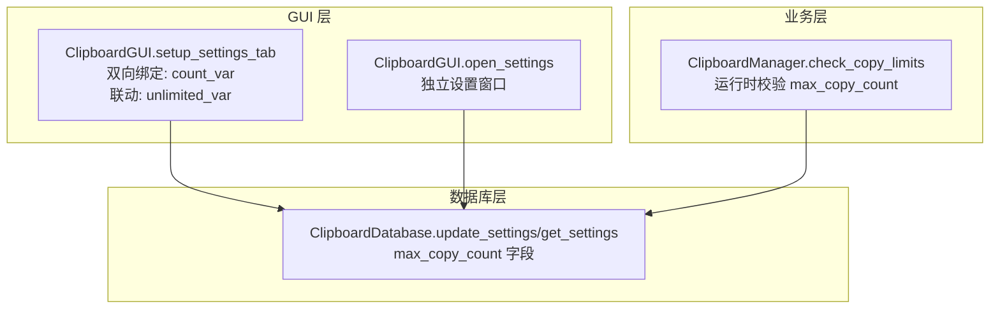
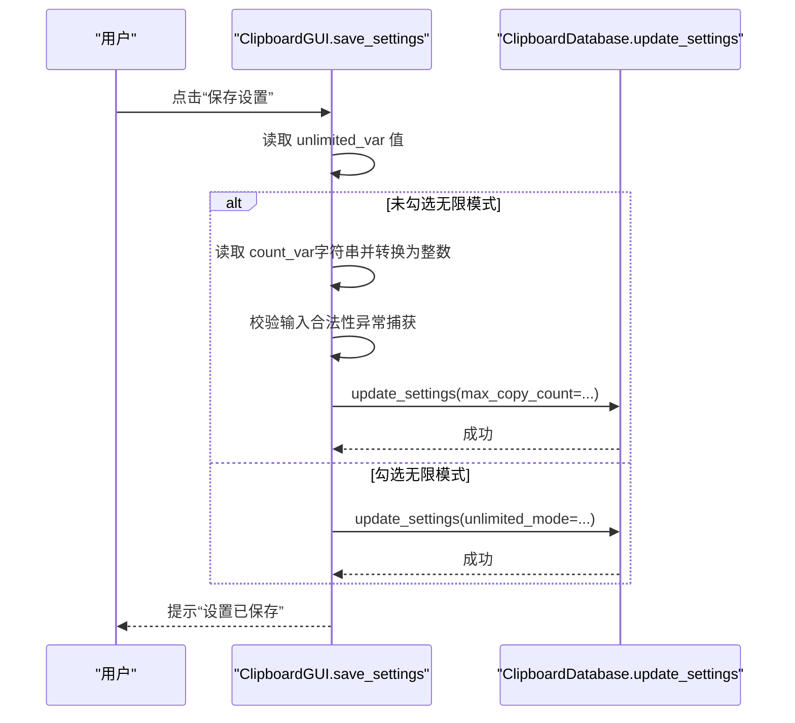
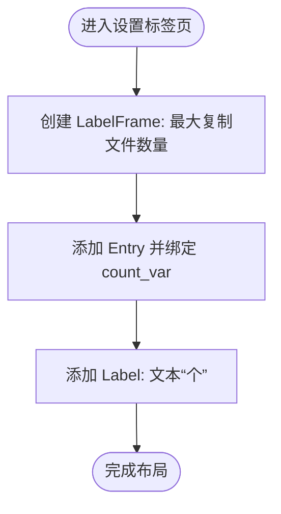
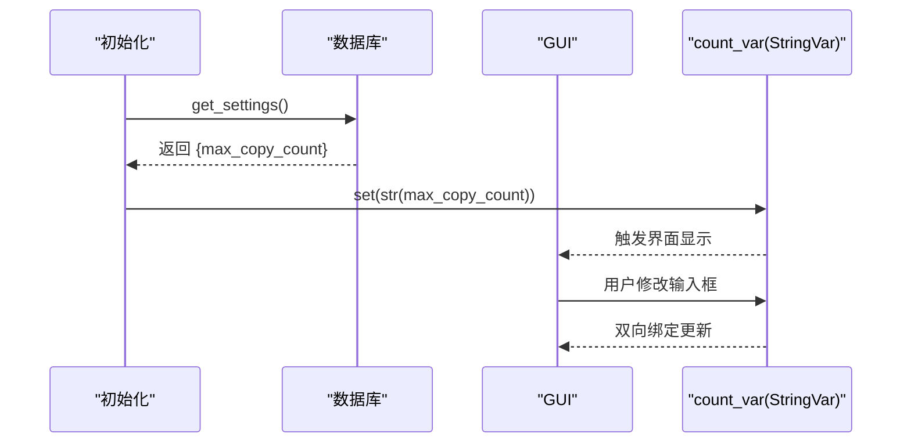
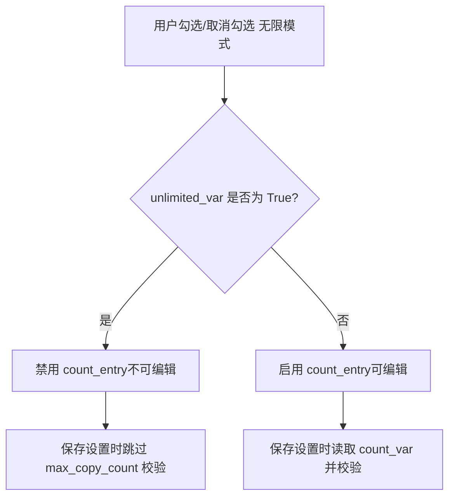
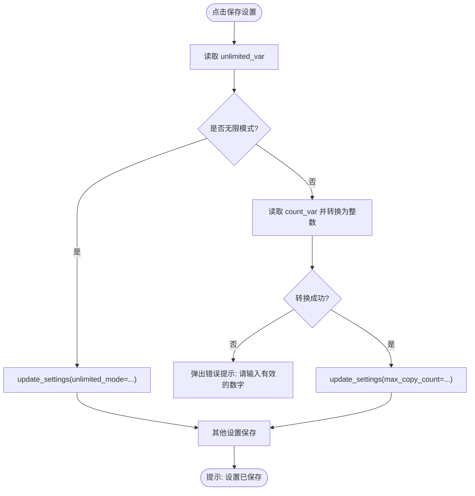
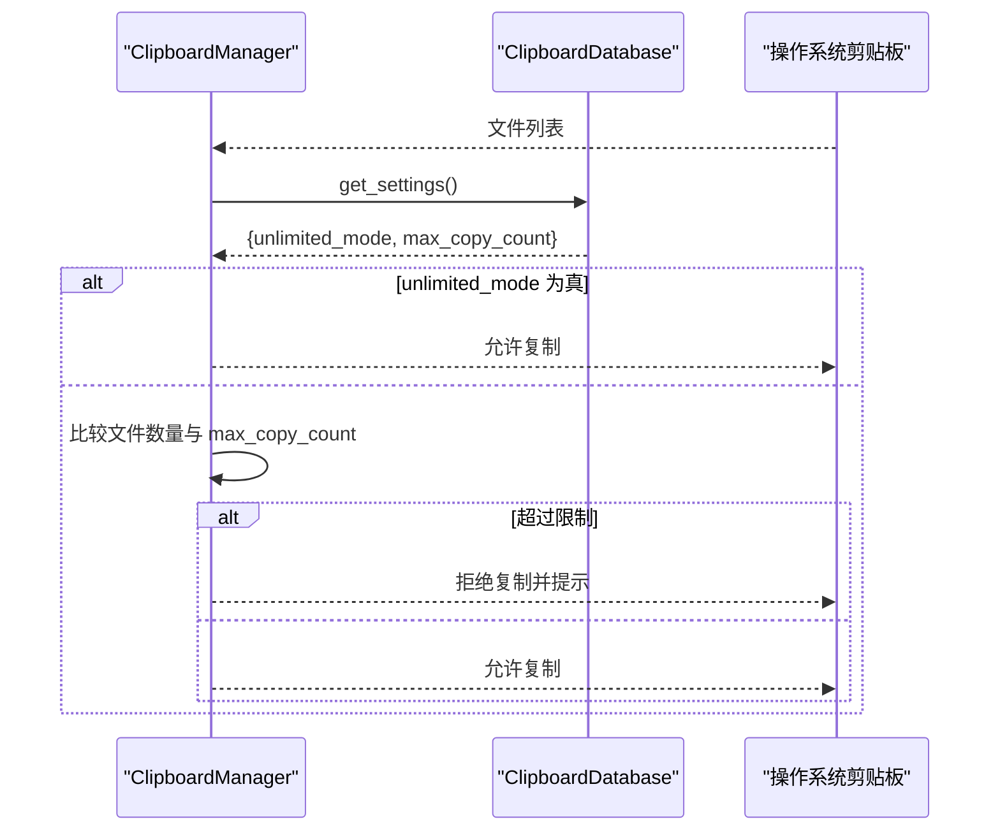
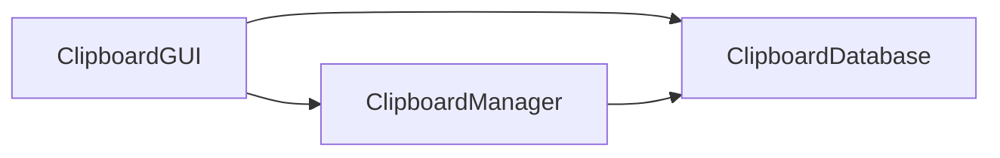

# 最大复制文件数量输入框

<cite>
**本文引用的文件**
- [clipboard_gui.py](file://clipboard_gui.py)
- [clipboard_manager_main.py](file://clipboard_manager_main.py)
- [clipboard_db.py](file://clipboard_db.py)
- [run_clipboard_manager.py](file://run_clipboard_manager.py)
</cite>

## 目录
1. [简介](#简介)
2. [项目结构](#项目结构)
3. [核心组件](#核心组件)
4. [架构总览](#架构总览)
5. [详细组件分析](#详细组件分析)
6. [依赖分析](#依赖分析)
7. [性能考虑](#性能考虑)
8. [故障排查指南](#故障排查指南)
9. [结论](#结论)

## 简介
本文件聚焦“最大复制文件数量输入框”的实现细节，围绕以下目标展开：
- count_var 变量如何与输入框建立双向数据绑定；
- 用户输入的整数值在保存设置时如何被验证并持久化到数据库的 max_copy_count 字段；
- 输入框与“无限模式”复选框的联动关系：当无限模式激活时，输入框自动变为不可编辑状态；
- 展示 count_frame 中的布局方式及与“个”标签的视觉组合，帮助用户理解输入值的含义。

## 项目结构
该项目采用 GUI 与业务逻辑分离的设计：
- GUI 层负责界面交互与设置项展示（含 count_var 的双向绑定、与无限模式联动、保存设置等）；
- 数据库层负责设置项的读写（settings 表中的 max_copy_count 字段）；
- 管理器层负责复制限制校验（在实际复制时依据设置进行判断）。

图表来源
- [clipboard_gui.py](file://clipboard_gui.py#L328-L476)
- [clipboard_gui.py](file://clipboard_gui.py#L950-L1130)
- [clipboard_db.py](file://clipboard_db.py#L359-L412)
- [clipboard_manager_main.py](file://clipboard_manager_main.py#L355-L410)

章节来源
- [clipboard_gui.py](file://clipboard_gui.py#L328-L476)
- [clipboard_gui.py](file://clipboard_gui.py#L950-L1130)
- [clipboard_db.py](file://clipboard_db.py#L359-L412)
- [clipboard_manager_main.py](file://clipboard_manager_main.py#L355-L410)

## 核心组件
- count_var：与“最大复制文件数量”输入框绑定的 Tkinter StringVar，负责双向数据绑定。
- count_frame：包含输入框与“个”标签的 LabelFrame 容器，用于在设置界面中呈现。
- unlimited_var：与“无限模式（无限制）”复选框绑定的 BooleanVar，控制输入框的可编辑状态。
- save_settings：保存设置时的处理流程，包含对 count_var 的验证与持久化。

章节来源
- [clipboard_gui.py](file://clipboard_gui.py#L328-L476)
- [clipboard_gui.py](file://clipboard_gui.py#L477-L533)

## 架构总览
下面的序列图展示了“保存设置”时，count_var 的值如何被读取、验证并写入数据库的完整流程。

图表来源
- [clipboard_gui.py](file://clipboard_gui.py#L477-L533)
- [clipboard_db.py](file://clipboard_db.py#L387-L412)

## 详细组件分析

### 组件一：count_frame 布局与“个”标签
- count_frame 是一个 LabelFrame，内部包含：
  - 一个 Entry 控件，使用 textvariable 绑定到 count_var；
  - 一个 Label 控件，显示“个”，用于明确单位。
- 该布局位于设置标签页中，便于用户直观理解输入值的含义。

图表来源
- [clipboard_gui.py](file://clipboard_gui.py#L359-L368)

章节来源
- [clipboard_gui.py](file://clipboard_gui.py#L359-L368)

### 组件二：count_var 的双向数据绑定
- 双向绑定通过 Tkinter 的 StringVar 实现：
  - 初始化时，count_var 由 GUI 从数据库读取的 max_copy_count 值设置；
  - 用户在界面上修改输入框，count_var 即刻反映变更；
  - 保存设置时，GUI 从 count_var 读取字符串并转换为整数，用于后续校验与持久化。

图表来源
- [clipboard_gui.py](file://clipboard_gui.py#L439-L462)
- [clipboard_gui.py](file://clipboard_gui.py#L477-L533)
- [clipboard_db.py](file://clipboard_db.py#L359-L385)

章节来源
- [clipboard_gui.py](file://clipboard_gui.py#L439-L462)
- [clipboard_gui.py](file://clipboard_gui.py#L477-L533)
- [clipboard_db.py](file://clipboard_db.py#L359-L385)

### 组件三：与无限模式复选框的联动
- unlimited_var 绑定“无限模式（无限制）”复选框；
- 当 unlimited_var 为 True 时，count_frame 中的 Entry 被禁用（不可编辑）；
- 当 unlimited_var 为 False 时，count_frame 中的 Entry 可编辑；
- 该联动通过 trace 监听 unlimited_var 的变化，并动态调整 Entry 的 state。

图表来源
- [clipboard_gui.py](file://clipboard_gui.py#L344-L348)
- [clipboard_gui.py](file://clipboard_gui.py#L436-L438)
- [clipboard_gui.py](file://clipboard_gui.py#L463-L476)
- [clipboard_gui.py](file://clipboard_gui.py#L477-L533)

章节来源
- [clipboard_gui.py](file://clipboard_gui.py#L344-L348)
- [clipboard_gui.py](file://clipboard_gui.py#L436-L438)
- [clipboard_gui.py](file://clipboard_gui.py#L463-L476)
- [clipboard_gui.py](file://clipboard_gui.py#L477-L533)

### 组件四：保存设置时的验证与持久化
- 保存设置流程：
  - 读取 unlimited_var；
  - 若未勾选无限模式：
    - 读取 count_var（字符串），转换为整数；
    - 校验输入是否为有效整数（异常捕获）；
    - 将 max_copy_count 写入数据库；
  - 若勾选无限模式：
    - 仅更新 unlimited_mode；
  - 其他设置（如保存天数、开机自启、悬浮图标）也在此处统一保存。

图表来源
- [clipboard_gui.py](file://clipboard_gui.py#L477-L533)
- [clipboard_db.py](file://clipboard_db.py#L387-L412)

章节来源
- [clipboard_gui.py](file://clipboard_gui.py#L477-L533)
- [clipboard_db.py](file://clipboard_db.py#L387-L412)

### 组件五：运行时复制限制校验（与 max_copy_count 的关系）
- 管理器在复制文件时会读取设置，若启用无限模式则跳过限制；
- 否则比较一次复制的文件数量与 max_copy_count，超限则拒绝；
- 该逻辑确保 GUI 中的设置在实际使用中得到执行。

图表来源
- [clipboard_manager_main.py](file://clipboard_manager_main.py#L355-L410)
- [clipboard_db.py](file://clipboard_db.py#L359-L385)

章节来源
- [clipboard_manager_main.py](file://clipboard_manager_main.py#L355-L410)
- [clipboard_db.py](file://clipboard_db.py#L359-L385)

## 依赖分析
- GUI 与数据库：
  - GUI 通过 ClipboardDatabase 的 get_settings/update_settings 读取与写入设置；
  - count_var 的值来源于 get_settings 返回的 max_copy_count；
  - 保存设置时调用 update_settings 写入 max_copy_count。
- GUI 与业务：
  - unlimited_var 的状态影响 count_entry 的可用性；
  - save_settings 的逻辑决定是否对 count_var 进行数值校验。
- 运行时校验：
  - ClipboardManager 在复制文件时读取设置并执行限制校验，保证设置在实际使用中生效。

图表来源
- [clipboard_gui.py](file://clipboard_gui.py#L439-L533)
- [clipboard_db.py](file://clipboard_db.py#L359-L412)
- [clipboard_manager_main.py](file://clipboard_manager_main.py#L355-L410)

章节来源
- [clipboard_gui.py](file://clipboard_gui.py#L439-L533)
- [clipboard_db.py](file://clipboard_db.py#L359-L412)
- [clipboard_manager_main.py](file://clipboard_manager_main.py#L355-L410)

## 性能考虑
- count_var 仅用于界面显示与保存设置阶段，不会参与高频计算；
- 保存设置时的整数转换与异常捕获开销极低；
- 无限模式启用时，count_entry 被禁用，减少不必要的用户交互成本；
- 运行时复制限制校验在文件列表较大时可能有遍历成本，但通常可忽略。

## 故障排查指南
- 保存设置时报错“请输入有效的数字”：
  - 检查 count_var 是否为空或包含非数字字符；
  - 确认未勾选无限模式时才需要输入有效整数；
  - 参考保存设置流程中的异常捕获逻辑。
- 无限模式勾选后输入框仍可编辑：
  - 检查 unlimited_var 的 trace 是否正确绑定；
  - 确认 toggle_entries 的状态切换逻辑；
  - 参考无限模式联动实现。
- 设置未生效：
  - 确认 update_settings 是否被调用且传入了 max_copy_count；
  - 检查数据库中 settings 表的 max_copy_count 字段是否更新；
  - 参考 get_settings/update_settings 的实现。

章节来源
- [clipboard_gui.py](file://clipboard_gui.py#L477-L533)
- [clipboard_gui.py](file://clipboard_gui.py#L463-L476)
- [clipboard_db.py](file://clipboard_db.py#L387-L412)

## 结论
- count_var 通过 Tkinter 的 StringVar 与输入框建立了稳定的双向数据绑定；
- “最大复制文件数量”输入框与“无限模式”复选框形成清晰的联动关系，提升用户体验；
- 保存设置时对 count_var 的整数转换与异常处理确保了数据一致性；
- 数据库层的 settings 表提供了持久化的 max_copy_count 字段，配合运行时校验保障功能落地。