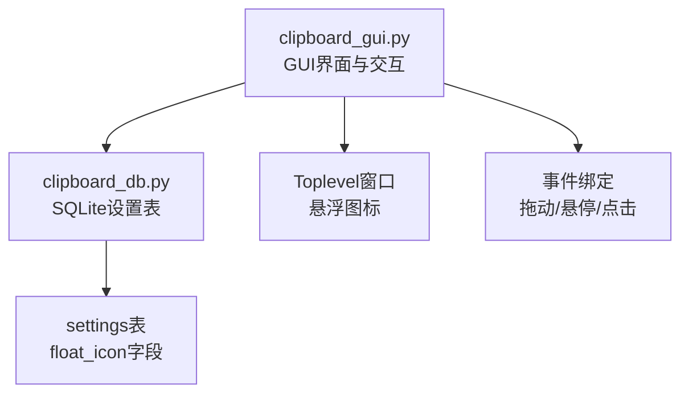
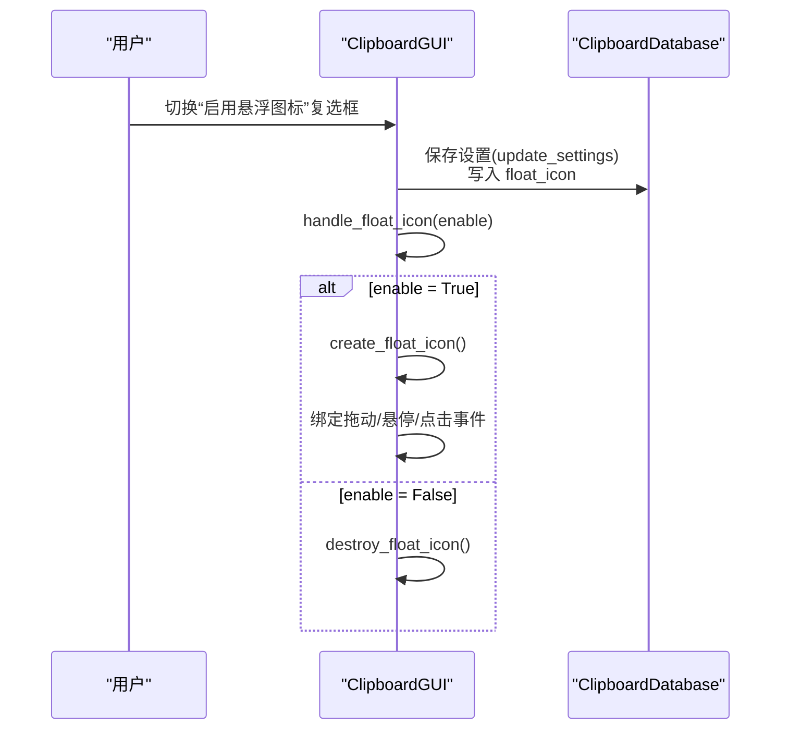
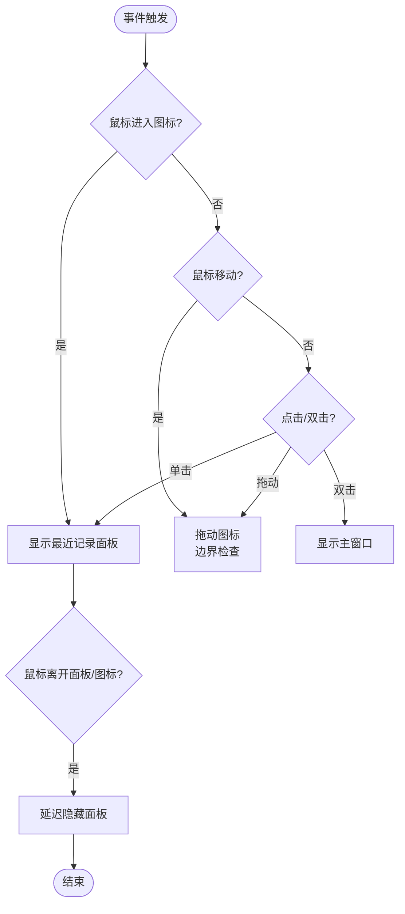
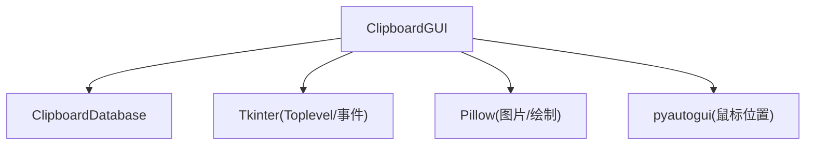

# 悬浮图标设置

<cite>
**本文引用的文件**
- [clipboard_gui.py](file://clipboard_gui.py)
- [clipboard_db.py](file://clipboard_db.py)
</cite>

## 目录
1. [简介](#简介)
2. [项目结构](#项目结构)
3. [核心组件](#核心组件)
4. [架构总览](#架构总览)
5. [详细组件分析](#详细组件分析)
6. [依赖关系分析](#依赖关系分析)
7. [性能考量](#性能考量)
8. [故障排查指南](#故障排查指南)
9. [结论](#结论)

## 简介
本章节聚焦“悬浮图标设置”区域的设计与实现，涵盖以下要点：
- 界面包含启用悬浮图标复选框及功能说明标签
- 数据库中通过 settings 表的 float_icon 字段持久化该功能开关
- GUI 层通过 float_icon_var 控制界面复选框状态，并在设置变更时调用 handle_float_icon 动态创建或销毁悬浮图标
- 程序启动时由 check_float_icon 方法读取设置并创建悬浮窗口
- 悬浮图标具备 50×50 像素、15% 透明度的视觉特性，支持拖动与点击显示主界面等交互行为

## 项目结构
悬浮图标功能涉及两个主要文件：
- GUI 层：负责界面展示、事件绑定、悬浮图标创建与销毁
- 数据层：负责设置项的读取与写入，包含 float_icon 字段

图表来源
- [clipboard_gui.py](file://clipboard_gui.py#L406-L416)
- [clipboard_db.py](file://clipboard_db.py#L105-L111)

章节来源
- [clipboard_gui.py](file://clipboard_gui.py#L406-L416)
- [clipboard_db.py](file://clipboard_db.py#L105-L111)

## 核心组件
- 设置界面区域：启用悬浮图标复选框与说明标签
- 设置读取与保存：从数据库读取设置，保存时写入 float_icon
- 启动检查：程序启动时根据设置创建悬浮图标
- 动态控制：用户更改设置后，根据布尔值创建或销毁悬浮图标
- 视觉与交互：固定尺寸、透明度、可拖动、悬停显示最近记录面板、双击显示主界面

章节来源
- [clipboard_gui.py](file://clipboard_gui.py#L406-L416)
- [clipboard_gui.py](file://clipboard_gui.py#L453-L462)
- [clipboard_gui.py](file://clipboard_gui.py#L510-L529)
- [clipboard_gui.py](file://clipboard_gui.py#L60-L88)
- [clipboard_gui.py](file://clipboard_gui.py#L1164-L1172)
- [clipboard_gui.py](file://clipboard_gui.py#L1173-L1234)

## 架构总览
悬浮图标设置的端到端流程如下：

图表来源
- [clipboard_gui.py](file://clipboard_gui.py#L510-L529)
- [clipboard_gui.py](file://clipboard_gui.py#L1164-L1172)
- [clipboard_gui.py](file://clipboard_gui.py#L1173-L1234)
- [clipboard_db.py](file://clipboard_db.py#L387-L412)

## 详细组件分析

### 设置界面与说明标签
- 界面标签：悬浮图标设置标题与说明文字，明确图标尺寸、透明度、可拖动、点击显示页面等特性
- 复选框变量：float_icon_var 用于绑定界面状态，便于统一读取与保存

章节来源
- [clipboard_gui.py](file://clipboard_gui.py#L406-L416)
- [clipboard_gui.py](file://clipboard_gui.py#L409-L411)

### 数据库字段与默认值
- settings 表新增 float_icon 字段，类型为整数（布尔映射），默认值为启用
- 读取设置时返回 float_icon 的布尔值
- 保存设置时将布尔值转换为整数写入

章节来源
- [clipboard_db.py](file://clipboard_db.py#L105-L111)
- [clipboard_db.py](file://clipboard_db.py#L362-L386)
- [clipboard_db.py](file://clipboard_db.py#L387-L412)

### 程序启动时的检查与创建
- 启动阶段调用 check_float_icon
- 从数据库读取设置，若启用则调用 create_float_icon 创建悬浮图标

章节来源
- [clipboard_gui.py](file://clipboard_gui.py#L60-L88)
- [clipboard_gui.py](file://clipboard_gui.py#L79-L88)

### 设置变更时的动态控制
- 保存设置后调用 handle_float_icon
- enable=True：创建悬浮图标
- enable=False：销毁悬浮图标

章节来源
- [clipboard_gui.py](file://clipboard_gui.py#L510-L529)
- [clipboard_gui.py](file://clipboard_gui.py#L1164-L1172)

### 悬浮图标的创建与销毁
- 创建流程：销毁旧图标（如存在）、创建 Toplevel 窗口、设置无边框、置顶、透明度、尺寸与初始位置
- 销毁流程：释放 Toplevel 引用

章节来源
- [clipboard_gui.py](file://clipboard_gui.py#L1173-L1234)
- [clipboard_gui.py](file://clipboard_gui.py#L1633-L1638)

### 视觉特性与交互行为
- 视觉特性
  - 尺寸：50×50 像素
  - 透明度：15%
  - 置顶显示
- 交互行为
  - 可拖动：记录鼠标按下位置，移动时进行边界检查并更新几何位置
  - 悬停显示最近记录面板：鼠标进入图标时显示面板，面板随图标位置调整
  - 单击显示面板：区分点击与拖动，点击时直接显示面板
  - 双击显示主界面：双击图标直接显示主窗口
  - 鼠标移出自动隐藏：面板与图标之间移动时延迟检测并隐藏

图表来源
- [clipboard_gui.py](file://clipboard_gui.py#L1173-L1234)
- [clipboard_gui.py](file://clipboard_gui.py#L1235-L1253)
- [clipboard_gui.py](file://clipboard_gui.py#L1254-L1359)
- [clipboard_gui.py](file://clipboard_gui.py#L1359-L1558)

### 最近记录面板与边界适配
- 面板尺寸：200×400 像素
- 显示最近记录：从数据库读取文本与文件记录，合并并按时间排序，最多 50 条
- 边界适配：优先在图标上方显示，若空间不足则显示在图标下方；超出屏幕范围时进行边界修正

章节来源
- [clipboard_gui.py](file://clipboard_gui.py#L1254-L1359)
- [clipboard_gui.py](file://clipboard_gui.py#L1453-L1558)

## 依赖关系分析
- GUI 依赖数据库设置项：读取与写入 float_icon
- GUI 依赖 Tkinter：创建 Toplevel、绑定事件、设置窗口属性
- GUI 依赖 Pillow：加载图标图片或绘制默认背景
- GUI 依赖 pyautogui：检测鼠标位置以判断隐藏面板时机

图表来源
- [clipboard_gui.py](file://clipboard_gui.py#L1173-L1234)
- [clipboard_gui.py](file://clipboard_gui.py#L1569-L1626)
- [clipboard_db.py](file://clipboard_db.py#L362-L412)

章节来源
- [clipboard_gui.py](file://clipboard_gui.py#L1173-L1234)
- [clipboard_gui.py](file://clipboard_gui.py#L1569-L1626)
- [clipboard_db.py](file://clipboard_db.py#L362-L412)

## 性能考量
- 图标透明度与置顶：使用窗口属性实现，开销较低
- 面板内容：最多 50 条记录，文本截断与禁用编辑提升渲染效率
- 鼠标位置检测：使用 pyautogui 获取全局坐标，建议在隐藏面板时避免频繁调用
- 边界检查：每次拖动均进行屏幕边界校验，建议在高频移动场景中减少不必要的重绘

## 故障排查指南
- 悬浮图标未显示
  - 检查设置是否启用：确认数据库 settings 表 float_icon 是否为真
  - 检查启动流程：确认 check_float_icon 是否被调用
  - 检查图片加载：若 2.jpg 加载失败，将使用默认背景与文本
- 图标无法拖动
  - 检查事件绑定：确认 <Button-1> 与 <B1-Motion> 是否正确绑定
  - 检查边界逻辑：确认屏幕边界计算与更新几何位置的逻辑
- 面板不显示或显示异常
  - 检查最近记录读取：确认 get_text_records 与 get_file_records 的返回
  - 检查面板定位：确认 position_float_panel_above_icon 与 position_float_panel_within_screen 的边界修正
- 鼠标移出不隐藏面板
  - 检查 _check_mouse_position_and_hide 与 _check_and_hide_float_panel 的调用链
  - 确认延迟隐藏逻辑与焦点事件绑定

章节来源
- [clipboard_gui.py](file://clipboard_gui.py#L60-L88)
- [clipboard_gui.py](file://clipboard_gui.py#L1173-L1234)
- [clipboard_gui.py](file://clipboard_gui.py#L1254-L1359)
- [clipboard_gui.py](file://clipboard_gui.py#L1359-L1558)
- [clipboard_gui.py](file://clipboard_gui.py#L1569-L1626)

## 结论
悬浮图标设置区域通过简洁的界面与完善的后台逻辑实现了“可拖动、可悬停查看最近记录、可双击显示主界面”的用户体验。其核心在于：
- 界面复选框与变量绑定
- 数据库 settings 表的 float_icon 字段持久化
- 启动时的 check_float_icon 与设置变更时的 handle_float_icon 动态控制
- 悬浮图标与面板的边界适配与交互细节