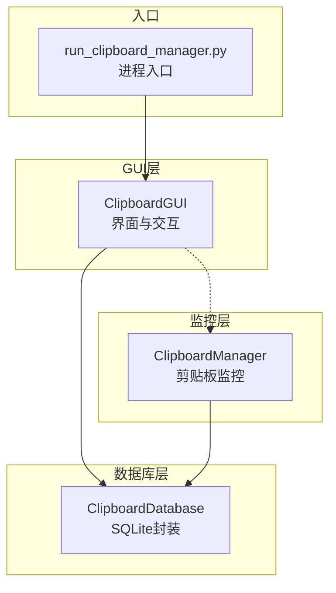
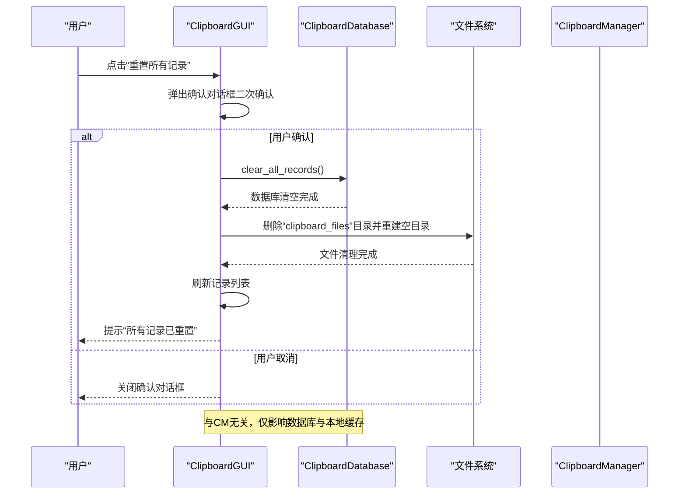
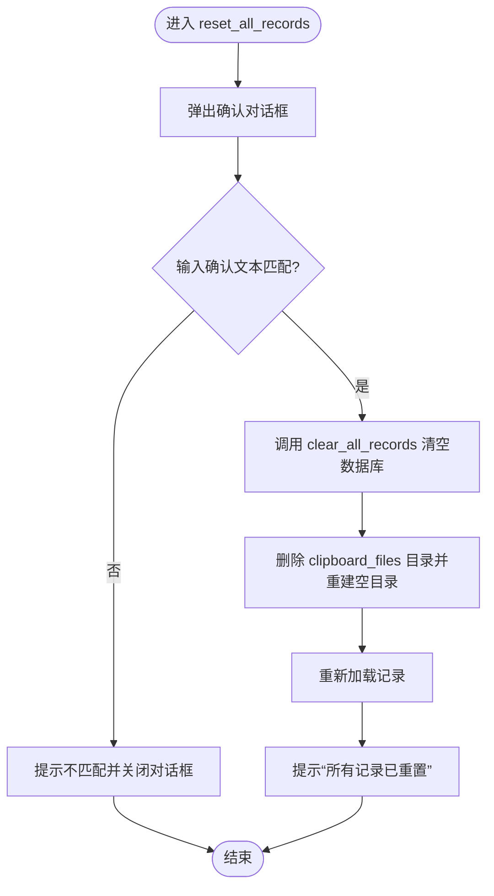
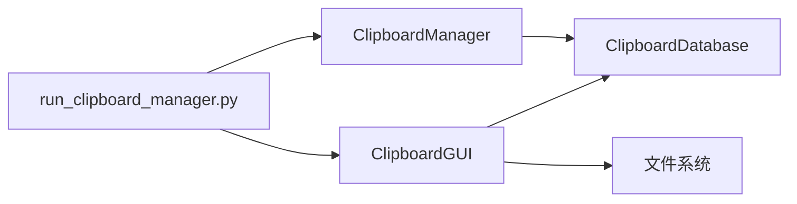

# 数据管理

<cite>
**本文引用的文件**
- [clipboard_gui.py](file://clipboard_gui.py)
- [clipboard_db.py](file://clipboard_db.py)
- [clipboard_manager_main.py](file://clipboard_manager_main.py)
- [run_clipboard_manager.py](file://run_clipboard_manager.py)
</cite>

## 目录
1. [简介](#简介)
2. [项目结构](#项目结构)
3. [核心组件](#核心组件)
4. [架构总览](#架构总览)
5. [详细组件分析](#详细组件分析)
6. [依赖关系分析](#依赖关系分析)
7. [性能考量](#性能考量)
8. [故障排查指南](#故障排查指南)
9. [结论](#结论)

## 简介
本章节聚焦“数据管理”区域，围绕“重置所有记录”这一高危操作展开，系统性说明其破坏性影响、执行流程、用户交互设计与后续反馈机制。文档特别强调：
- 重置操作会删除所有历史记录与本地缓存文件，属于不可逆的破坏性行为；
- reset_all_records 方法的完整执行路径：数据库清理 + 文件系统清理；
- 用户界面通过警告文本与独立按钮框架强化风险提示；
- 当前实现具备二次确认对话框，建议进一步引入标准消息框确认；
- 执行前后对用户状态的反馈与界面刷新策略。

## 项目结构
本项目采用“GUI + 数据库 + 监控器”的分层组织：
- GUI 层负责用户交互与界面展示；
- 数据库层负责持久化与检索；
- 监控器负责实时检测剪贴板变化并写入数据。

图表来源
- [clipboard_gui.py](file://clipboard_gui.py#L1-L120)
- [clipboard_db.py](file://clipboard_db.py#L1-L60)
- [clipboard_manager_main.py](file://clipboard_manager_main.py#L355-L420)
- [run_clipboard_manager.py](file://run_clipboard_manager.py#L32-L71)

章节来源
- [clipboard_gui.py](file://clipboard_gui.py#L1-L120)
- [clipboard_db.py](file://clipboard_db.py#L1-L60)
- [clipboard_manager_main.py](file://clipboard_manager_main.py#L355-L420)
- [run_clipboard_manager.py](file://run_clipboard_manager.py#L32-L71)

## 核心组件
- ClipboardGUI：提供“重置所有记录”按钮与确认对话框，负责调用数据库清理与文件系统清理，并在完成后刷新界面。
- ClipboardDatabase：提供 clear_all_records 等数据库清理接口，以及 delete_expired_records 等文件清理辅助能力。
- ClipboardManager：负责剪贴板内容采集与本地文件落盘，形成“clipboard_files”目录下的缓存文件集合。
- run_clipboard_manager.py：应用入口，负责进程互斥、后台监控线程与GUI启动。

章节来源
- [clipboard_gui.py](file://clipboard_gui.py#L889-L949)
- [clipboard_db.py](file://clipboard_db.py#L350-L358)
- [clipboard_manager_main.py](file://clipboard_manager_main.py#L355-L420)
- [run_clipboard_manager.py](file://run_clipboard_manager.py#L32-L71)

## 架构总览
“重置所有记录”涉及的跨层交互如下：

图表来源
- [clipboard_gui.py](file://clipboard_gui.py#L889-L949)
- [clipboard_db.py](file://clipboard_db.py#L350-L358)
- [clipboard_manager_main.py](file://clipboard_manager_main.py#L355-L420)

## 详细组件分析

### 重置所有记录按钮与界面设计
- 位置与外观：位于“设置”标签页的“数据管理”分组中，采用独立的 LabelFrame 包裹，明确区分于其他设置项。
- 风险提示：按钮上方显示“此操作将删除所有记录和本地缓存文件！”的红色警告文本，突出破坏性。
- 按钮行为：绑定到 reset_all_records 方法，触发二次确认对话框。

章节来源
- [clipboard_gui.py](file://clipboard_gui.py#L417-L425)

### reset_all_records 方法的执行流程
- 二次确认对话框：弹出模态窗口，要求用户输入固定确认文本以继续，避免误触。
- 数据库清理：调用 clear_all_records，清空 text_records 与 file_records 表。
- 文件系统清理：定位“clipboard_files”目录，若存在则递归删除并重建空目录，确保本地缓存彻底清除。
- 界面刷新：重新加载记录，使界面回到“空状态”。
- 用户反馈：确认成功后弹出提示框告知“所有记录已重置”。

图表来源
- [clipboard_gui.py](file://clipboard_gui.py#L889-L949)
- [clipboard_db.py](file://clipboard_db.py#L350-L358)

章节来源
- [clipboard_gui.py](file://clipboard_gui.py#L889-L949)
- [clipboard_db.py](file://clipboard_db.py#L350-L358)

### 数据库清理与文件系统清理的关联
- 数据库层面：clear_all_records 会清空两条核心表，确保历史记录归零。
- 文件系统层面：clipboard_files 是 ClipboardManager 的本地缓存根目录，存放按日期与类型分类的文件副本。重置操作会彻底删除该目录，避免残留文件占用磁盘空间。
- 与监控器的关系：重置操作不直接影响 ClipboardManager 的运行，但会清空其产生的历史数据与缓存，后续新复制的内容仍会被正常采集与保存。

章节来源
- [clipboard_db.py](file://clipboard_db.py#L350-L358)
- [clipboard_manager_main.py](file://clipboard_manager_main.py#L355-L420)

### 当前确认机制与改进建议
- 现状：reset_all_records 内部实现了自定义确认对话框，要求输入固定文本以继续。
- 建议：可替换为标准 tkinter.messagebox.askyesno，提升一致性与可用性。例如在确认对话框中使用“是否确认重置所有记录？”的询问，用户点击“是”后再执行清理流程。

章节来源
- [clipboard_gui.py](file://clipboard_gui.py#L889-L949)

### 执行后用户状态反馈
- 成功路径：清理完成后，界面会重新加载记录，提示“所有记录已重置”，用户可直观看到历史记录清空。
- 失败路径：若删除缓存文件过程中发生异常，会弹出错误提示，避免静默失败。

章节来源
- [clipboard_gui.py](file://clipboard_gui.py#L920-L949)

## 依赖关系分析
- GUI 依赖数据库层：reset_all_records 调用 ClipboardDatabase.clear_all_records。
- 数据库层依赖 SQLite：提供表级删除与统计等能力。
- 监控器与重置操作无直接耦合：重置不影响 ClipboardManager 的运行，但会清空其产生的历史数据与缓存。
- 进程入口负责启动 GUI 与后台监控线程，与数据管理功能无直接交互。

图表来源
- [clipboard_gui.py](file://clipboard_gui.py#L889-L949)
- [clipboard_db.py](file://clipboard_db.py#L350-L358)
- [clipboard_manager_main.py](file://clipboard_manager_main.py#L355-L420)
- [run_clipboard_manager.py](file://run_clipboard_manager.py#L32-L71)

章节来源
- [clipboard_gui.py](file://clipboard_gui.py#L889-L949)
- [clipboard_db.py](file://clipboard_db.py#L350-L358)
- [clipboard_manager_main.py](file://clipboard_manager_main.py#L355-L420)
- [run_clipboard_manager.py](file://run_clipboard_manager.py#L32-L71)

## 性能考量
- 重置操作涉及数据库全表删除与目录级文件删除，建议在用户确认后异步执行，避免阻塞主线程。
- 文件系统清理可能涉及大量小文件删除，建议在 UI 上提供进度提示或在后台线程执行。
- 界面刷新频率控制：ClipboardGUI 本身具有自动更新机制，重置后应避免频繁刷新，可在清理完成后一次性刷新。

## 故障排查指南
- 确认对话框无法关闭或卡死：检查 reset_all_records 中的确认逻辑与窗口生命周期管理。
- 删除缓存文件失败：查看异常捕获与错误提示，确认权限与路径是否存在。
- 数据库清空无效：确认 clear_all_records 是否被正确调用，以及数据库连接是否正常。
- 重置后记录未刷新：确认 load_records 是否被调用，以及界面刷新逻辑是否生效。

章节来源
- [clipboard_gui.py](file://clipboard_gui.py#L889-L949)
- [clipboard_db.py](file://clipboard_db.py#L350-L358)

## 结论
“重置所有记录”是一个高危操作，必须通过明确的界面提示与二次确认机制降低误操作风险。其实现由 GUI 触发、数据库清理与文件系统清理两部分组成，执行后需及时刷新界面并向用户反馈结果。建议在现有基础上引入标准消息框确认，统一交互体验，并在必要时优化异步执行与进度提示，以提升整体稳定性与用户体验。