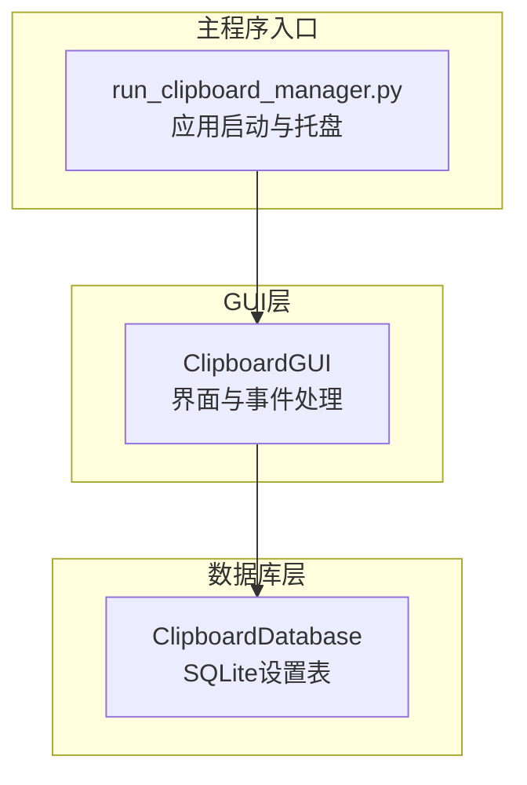
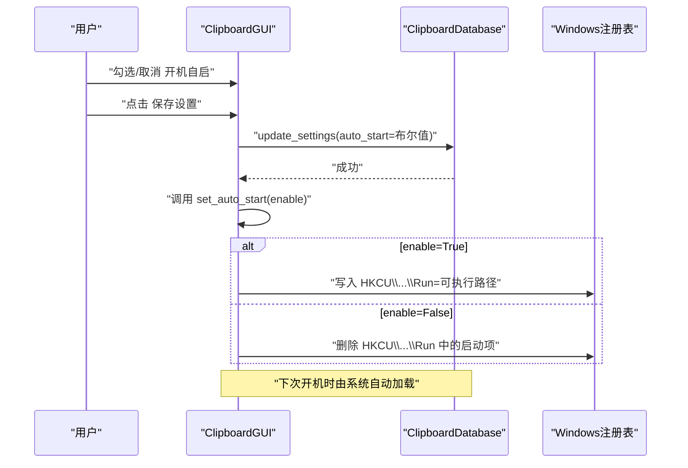
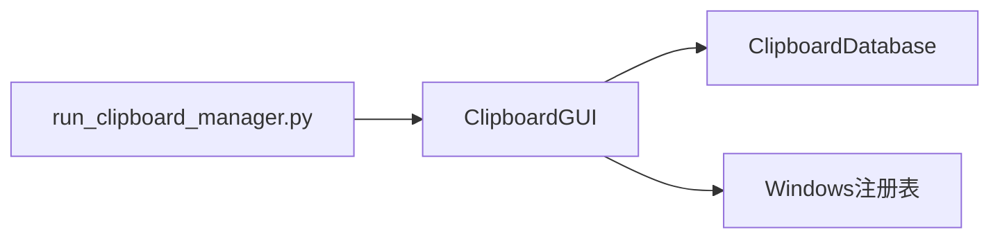

# 系统设置

<cite>
**本文引用的文件**
- [clipboard_gui.py](file://clipboard_gui.py)
- [clipboard_manager_main.py](file://clipboard_manager_main.py)
- [clipboard_db.py](file://clipboard_db.py)
- [run_clipboard_manager.py](file://run_clipboard_manager.py)
</cite>

## 目录
1. [简介](#简介)
2. [项目结构](#项目结构)
3. [核心组件](#核心组件)
4. [架构总览](#架构总览)
5. [详细组件分析](#详细组件分析)
6. [依赖关系分析](#依赖关系分析)
7. [性能考量](#性能考量)
8. [故障排查指南](#故障排查指南)
9. [结论](#结论)

## 简介
本章节聚焦“系统设置”区域的设计与实现，重点说明开机自启功能如何通过界面复选框与数据库字段协同工作，以及在程序启动时如何读取数据库设置并自动应用开机自启配置。同时，文档阐述了与Windows注册表的集成流程、权限要求及异常处理策略，帮助开发者与使用者全面理解该功能的实现细节与运行机制。

## 项目结构
系统设置功能主要分布在以下文件：
- GUI层：负责界面控件、事件绑定与用户交互
- 数据库层：负责设置项的持久化存储
- 主程序入口：负责应用启动与托盘集成

图表来源
- [clipboard_gui.py](file://clipboard_gui.py#L329-L533)
- [clipboard_db.py](file://clipboard_db.py#L77-L114)
- [run_clipboard_manager.py](file://run_clipboard_manager.py#L32-L66)

章节来源
- [clipboard_gui.py](file://clipboard_gui.py#L329-L533)
- [clipboard_db.py](file://clipboard_db.py#L77-L114)
- [run_clipboard_manager.py](file://run_clipboard_manager.py#L32-L66)

## 核心组件
- 界面设置标签页：包含“开机自启”复选框，绑定布尔变量，用于开启/关闭开机自启动。
- 数据库设置表：包含auto_start字段，用于持久化用户偏好。
- 启动检查逻辑：程序启动时读取数据库设置，若启用则调用注册表接口实现开机自启动。
- 注册表操作：通过winreg写入/删除HKCU\Software\Microsoft\Windows\CurrentVersion\Run下的启动项。

章节来源
- [clipboard_gui.py](file://clipboard_gui.py#L394-L413)
- [clipboard_gui.py](file://clipboard_gui.py#L88-L97)
- [clipboard_gui.py](file://clipboard_gui.py#L1131-L1163)
- [clipboard_db.py](file://clipboard_db.py#L360-L412)

## 架构总览
系统设置区域的交互流程如下：
- 用户在“设置”标签页勾选/取消“允许程序开机自启”，点击“保存设置”。
- GUI层将auto_start布尔值写入数据库settings表。
- 保存设置时，GUI层调用set_auto_start方法，根据enable参数对Windows注册表进行写入或删除。
- 程序启动时，GUI层在初始化阶段调用check_auto_start，从数据库读取auto_start，若为真则立即调用set_auto_start(True)应用开机自启动。

图表来源
- [clipboard_gui.py](file://clipboard_gui.py#L477-L533)
- [clipboard_gui.py](file://clipboard_gui.py#L1131-L1163)
- [clipboard_db.py](file://clipboard_db.py#L387-L412)

## 详细组件分析

### 界面设置标签页与控件绑定
- “开机自启”复选框控件位于“设置”标签页内，使用BooleanVar进行双向绑定，便于读取与更新。
- 界面初始化时会从数据库读取当前设置并同步到控件状态。
- 保存设置时，界面将当前控件状态写入数据库，并调用set_auto_start方法即时应用注册表变更。

章节来源
- [clipboard_gui.py](file://clipboard_gui.py#L394-L413)
- [clipboard_gui.py](file://clipboard_gui.py#L439-L462)
- [clipboard_gui.py](file://clipboard_gui.py#L477-L533)

### 数据库设置表与auto_start字段
- settings表包含auto_start字段，用于持久化开机自启偏好。
- 初始化时若字段不存在，会通过ALTER TABLE动态添加，并设置默认值。
- 读取设置时，get_settings返回包含auto_start在内的完整设置字典；更新设置时，update_settings将auto_start写回数据库。

章节来源
- [clipboard_db.py](file://clipboard_db.py#L77-L114)
- [clipboard_db.py](file://clipboard_db.py#L360-L412)

### 程序启动时的开机自启应用
- GUI初始化过程中会调用check_auto_start，从数据库读取auto_start。
- 若auto_start为真，则立即调用set_auto_start(True)，确保开机自启动生效。

章节来源
- [clipboard_gui.py](file://clipboard_gui.py#L60-L62)
- [clipboard_gui.py](file://clipboard_gui.py#L88-L97)

### 注册表操作与权限要求
- set_auto_start方法通过winreg对HKCU\Software\Microsoft\Windows\CurrentVersion\Run进行操作：
  - enable=True：写入启动项名称与可执行路径。
  - enable=False：删除对应启动项。
- 权限要求：
  - 写入HKCU路径通常不需要管理员权限，但需确保当前用户具有修改自身注册表的权限。
  - 若程序以非管理员身份运行，写入HKCU路径是可行的；若目标为HKLM路径，则需要管理员权限。
- 异常处理：
  - 对注册表操作进行try/except包裹，捕获异常并打印错误信息，避免影响主流程。
  - 删除不存在的值时捕获FileNotFoundError并忽略，保证幂等性。

章节来源
- [clipboard_gui.py](file://clipboard_gui.py#L1131-L1163)

### 与系统托盘的集成
- 应用启动后默认隐藏主窗口，仅保留系统托盘图标，用户可通过托盘图标显示界面。
- 程序入口通过互斥量避免重复运行，若已运行则激活已有实例窗口。

章节来源
- [run_clipboard_manager.py](file://run_clipboard_manager.py#L17-L46)
- [run_clipboard_manager.py](file://run_clipboard_manager.py#L55-L66)

## 依赖关系分析
- GUI层依赖数据库层提供的设置读写接口。
- GUI层在保存设置时直接调用注册表操作，耦合度较高；建议未来将注册表操作抽象为独立服务，以提升可测试性与可维护性。
- 程序入口负责应用生命周期管理，与GUI层通过事件驱动交互。

图表来源
- [clipboard_gui.py](file://clipboard_gui.py#L477-L533)
- [clipboard_gui.py](file://clipboard_gui.py#L1131-L1163)
- [clipboard_db.py](file://clipboard_db.py#L360-L412)
- [run_clipboard_manager.py](file://run_clipboard_manager.py#L32-L66)

章节来源
- [clipboard_gui.py](file://clipboard_gui.py#L477-L533)
- [clipboard_db.py](file://clipboard_db.py#L360-L412)
- [run_clipboard_manager.py](file://run_clipboard_manager.py#L32-L66)

## 性能考量
- 注册表操作为轻量级I/O，单次写入/删除耗时极短，对整体性能影响可忽略。
- 数据库设置读写采用SQLite，单次事务开销低，适合频繁读取与更新。
- 界面控件状态与数据库状态同步发生在保存设置时，避免了不必要的实时同步。

## 故障排查指南
- 无法开机自启动
  - 检查注册表是否正确写入：确认HKCU\Software\Microsoft\Windows\CurrentVersion\Run下是否存在对应启动项。
  - 确认程序以当前用户身份运行且具备修改注册表的权限。
  - 如删除启动项后仍无效，检查是否存在多个同名启动项或路径不正确。
- 设置未生效
  - 确认保存设置后调用了set_auto_start方法。
  - 检查数据库auto_start字段是否已更新。
- 程序重复运行
  - 若出现重复实例，检查互斥量逻辑是否正常，确认托盘图标是否正确创建。

章节来源
- [clipboard_gui.py](file://clipboard_gui.py#L1131-L1163)
- [clipboard_db.py](file://clipboard_db.py#L360-L412)
- [run_clipboard_manager.py](file://run_clipboard_manager.py#L17-L46)

## 结论
系统设置区域通过“开机自启”复选框与数据库auto_start字段的协同，实现了用户偏好的持久化与即时应用。程序启动时的check_auto_start进一步确保了开机自启动的可靠性。注册表操作封装在set_auto_start中，具备基本的异常处理能力。整体设计简洁清晰，易于扩展与维护。