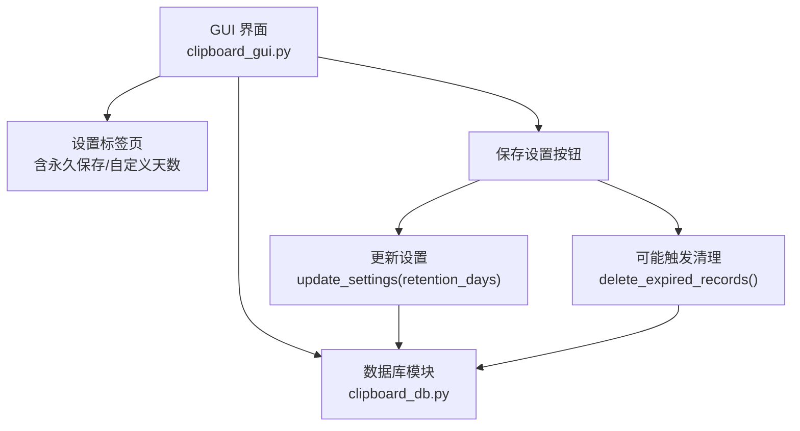
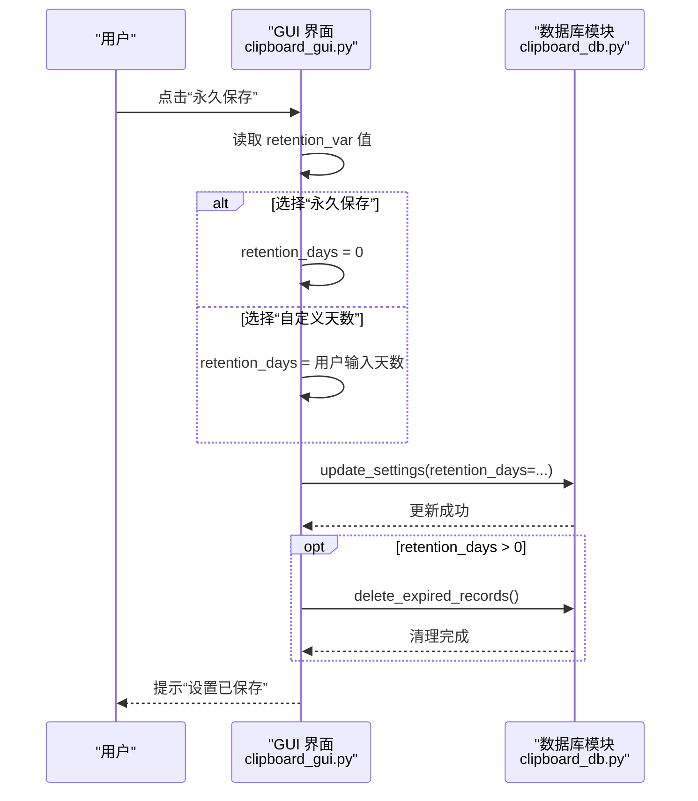
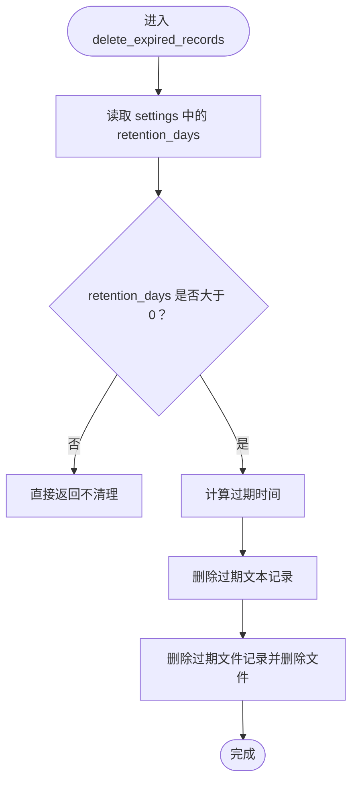
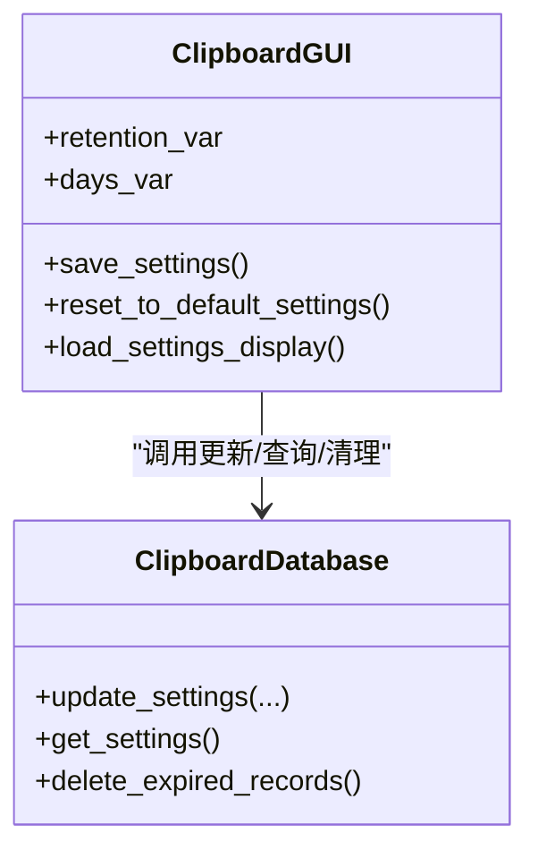
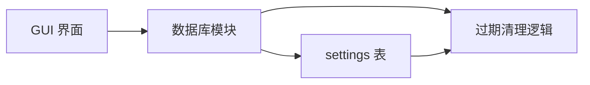

# 永久保存

<cite>
**本文引用的文件**
- [clipboard_gui.py](file://clipboard_gui.py)
- [clipboard_db.py](file://clipboard_db.py)
</cite>

## 目录
1. [简介](#简介)
2. [项目结构](#项目结构)
3. [核心组件](#核心组件)
4. [架构总览](#架构总览)
5. [详细组件分析](#详细组件分析)
6. [依赖关系分析](#依赖关系分析)
7. [性能考量](#性能考量)
8. [故障排查指南](#故障排查指南)
9. [结论](#结论)

## 简介
本篇文档围绕“永久保存”这一设置项展开，系统性说明：
- 用户在界面中选择“永久保存”后，系统如何将设置项 retention_days 设为 0 并写入数据库；
- 该设置如何影响 db.delete_expired_records() 的调用逻辑，使得当 retention_days ≤ 0 时不执行过期清理；
- 界面中 retention_var 变量与“永久保存”单选按钮的绑定机制；
- 从界面操作到数据库更新的完整流程示例路径。

## 项目结构
本仓库与“永久保存”相关的代码主要分布在 GUI 界面与数据库模块中：
- GUI 界面负责展示“永久保存/自定义天数”单选按钮、收集用户输入、调用数据库更新与清理逻辑；
- 数据库模块负责持久化设置、读取设置、以及过期记录清理。

图表来源
- [clipboard_gui.py](file://clipboard_gui.py#L367-L553)
- [clipboard_db.py](file://clipboard_db.py#L387-L454)

章节来源
- [clipboard_gui.py](file://clipboard_gui.py#L367-L553)
- [clipboard_db.py](file://clipboard_db.py#L77-L114)

## 核心组件
- 界面设置项
  - “永久保存”单选按钮绑定到变量 retention_var；
  - 当用户选择“永久保存”，界面将 retention_days 设为 0；
  - 当用户选择“自定义天数”，界面将 retention_days 设为用户输入的天数；
  - 保存设置时，界面调用数据库更新接口，写入 retention_days。
- 数据库设置项
  - settings 表包含 retention_days 字段，默认值为 0（永久保存）；
  - update_settings 接口支持更新 retention_days；
  - delete_expired_records 会读取 retention_days，当其小于等于 0 时不执行清理。

章节来源
- [clipboard_gui.py](file://clipboard_gui.py#L367-L553)
- [clipboard_db.py](file://clipboard_db.py#L77-L114)
- [clipboard_db.py](file://clipboard_db.py#L387-L454)

## 架构总览
下面的序列图展示了从用户在界面选择“永久保存”到数据库更新与清理逻辑的完整流程。

图表来源
- [clipboard_gui.py](file://clipboard_gui.py#L477-L533)
- [clipboard_db.py](file://clipboard_db.py#L387-L454)

## 详细组件分析

### 界面绑定与状态处理
- 单选按钮绑定
  - 设置标签页中，“永久保存”与“自定义天数”两个单选按钮绑定到同一个变量 retention_var；
  - 初始加载时，若 settings['retention_days'] 为 0，则默认选中“永久保存”。
- 输入框状态联动
  - 当选择“永久保存”时，自定义天数输入框 days_entry 被禁用；
  - 当选择“自定义天数”时，输入框启用。
- 保存设置逻辑
  - 保存时根据 retention_var 的值决定 retention_days；
  - 调用 update_settings 写入数据库；
  - 若 retention_days > 0，额外调用 delete_expired_records 执行清理。

章节来源
- [clipboard_gui.py](file://clipboard_gui.py#L367-L462)
- [clipboard_gui.py](file://clipboard_gui.py#L477-L533)

### 数据库设置与过期清理
- settings 表结构
  - settings 表包含 retention_days 字段，默认值为 0；
  - init_database 中通过 ALTER TABLE 为既有表添加该字段，兼容旧版本。
- 更新设置
  - update_settings 支持更新 retention_days；
  - 保存设置时，界面传入 retention_days=0 或自定义天数。
- 过期清理逻辑
  - delete_expired_records 读取 settings 中的 retention_days；
  - 当 retention_days ≤ 0 时，直接返回，不删除任何记录；
  - 当 retention_days > 0 时，计算过期时间并删除过期记录及对应文件。

章节来源
- [clipboard_db.py](file://clipboard_db.py#L77-L114)
- [clipboard_db.py](file://clipboard_db.py#L387-L454)

### 流程图：过期清理条件判断

图表来源
- [clipboard_db.py](file://clipboard_db.py#L413-L454)

### 类关系图：GUI 与数据库交互

图表来源
- [clipboard_gui.py](file://clipboard_gui.py#L367-L553)
- [clipboard_db.py](file://clipboard_db.py#L387-L454)

## 依赖关系分析
- 界面层依赖数据库层提供的设置读写与清理接口；
- 数据库层内部维护 settings 表，其中 retention_days 为关键字段；
- 过期清理逻辑与 retention_days 强耦合：retention_days ≤ 0 时跳过清理，> 0 时执行清理。

图表来源
- [clipboard_gui.py](file://clipboard_gui.py#L477-L533)
- [clipboard_db.py](file://clipboard_db.py#L387-L454)

章节来源
- [clipboard_gui.py](file://clipboard_gui.py#L477-L533)
- [clipboard_db.py](file://clipboard_db.py#L387-L454)

## 性能考量
- 过期清理仅在 retention_days > 0 时执行，避免了永久保存场景下的不必要扫描与删除开销；
- 清理过程涉及对 text_records 与 file_records 的扫描与删除，建议在数据量较大时谨慎开启自定义天数清理；
- 文件删除采用逐条遍历并删除对应文件，注意磁盘 IO 开销。

[本节为通用指导，不直接分析具体文件]

## 故障排查指南
- 问题：选择了“永久保存”，但系统仍提示清理过期记录
  - 检查是否误将 retention_days 设为正数；
  - 确认 update_settings 是否正确写入 retention_days=0；
  - 确认 delete_expired_records 是否被调用（仅在 retention_days > 0 时调用）。
- 问题：界面无法保存设置
  - 检查输入是否为有效数字（自定义天数）；
  - 确认 update_settings 是否抛出异常；
  - 查看界面弹窗提示或日志输出。
- 问题：数据库缺少 retention_days 字段
  - 确认 init_database 是否执行过 ALTER TABLE 添加字段；
  - 如需手动修复，可为 settings 表添加 retention_days 字段并设默认值 0。

章节来源
- [clipboard_gui.py](file://clipboard_gui.py#L477-L533)
- [clipboard_db.py](file://clipboard_db.py#L77-L114)
- [clipboard_db.py](file://clipboard_db.py#L387-L454)

## 结论
- “永久保存”通过将 retention_days 设为 0 实现；
- 数据库层在读取设置时默认值为 0，保证新安装或未迁移的用户默认永久保存；
- 过期清理逻辑严格依赖 retention_days 的值：≤ 0 时不清理，> 0 时清理；
- 界面层通过单选按钮与输入框联动，确保用户意图准确落地到数据库设置中。