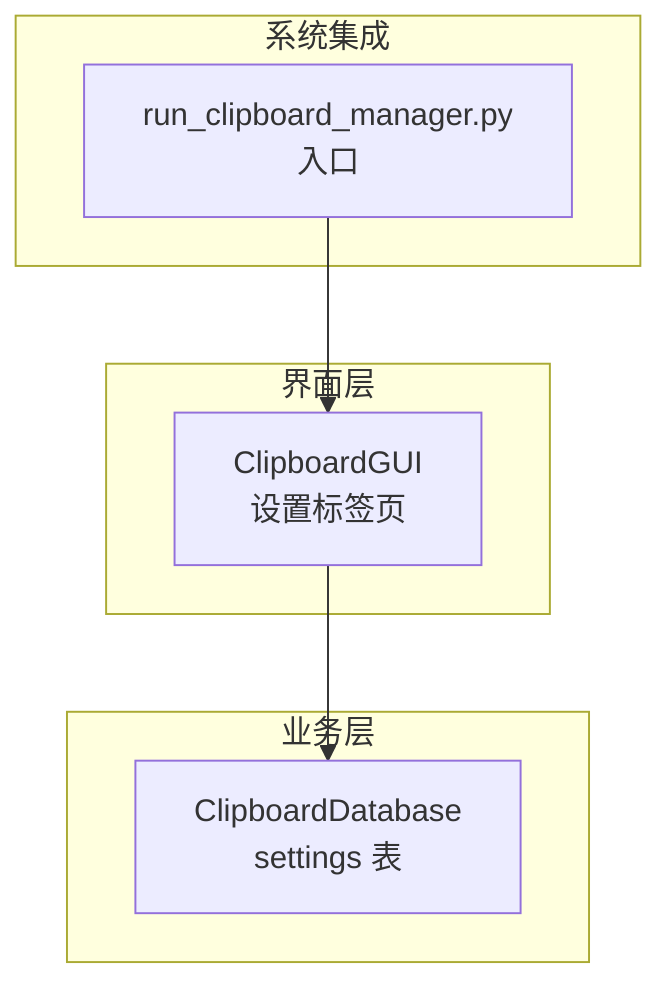
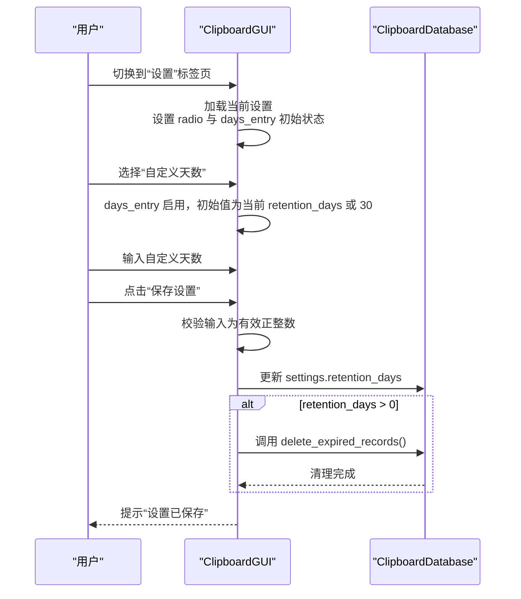
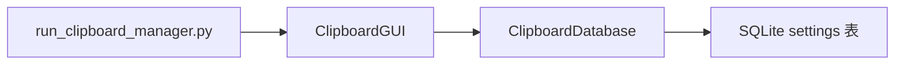

# 自定义天数保存

<cite>
**本文引用的文件**
- [clipboard_gui.py](file://clipboard_gui.py)
- [clipboard_db.py](file://clipboard_db.py)
- [run_clipboard_manager.py](file://run_clipboard_manager.py)
</cite>

## 目录
1. [简介](#简介)
2. [项目结构](#项目结构)
3. [核心组件](#核心组件)
4. [架构总览](#架构总览)
5. [详细组件分析](#详细组件分析)
6. [依赖关系分析](#依赖关系分析)
7. [性能考量](#性能考量)
8. [故障排查指南](#故障排查指南)
9. [结论](#结论)

## 简介
本文件聚焦“自定义天数保存”功能，围绕以下目标展开：
- 当用户选择“自定义天数”时，界面如何动态启用 days_entry 输入框，并在“永久保存”与“自定义天数”之间切换时正确设置输入框状态与初始值。
- 系统如何验证用户输入为有效正整数，并在保存设置时将天数写入数据库的 retention_days 字段。
- 当 retention_days > 0 时，系统如何自动清理过期记录。
- 界面状态切换逻辑：从永久保存切换到自定义天数时，输入框启用机制与初始值设置（默认30天或当前设置值）。

## 项目结构
本功能涉及 GUI 设置界面与数据库设置字段的协同：
- GUI 设置界面负责渲染“永久保存/自定义天数”单选框、自定义天数输入框及保存按钮。
- 数据库层负责持久化设置（含 retention_days），并提供删除过期记录的能力。

图表来源
- [clipboard_gui.py](file://clipboard_gui.py#L328-L533)
- [clipboard_db.py](file://clipboard_db.py#L359-L412)
- [run_clipboard_manager.py](file://run_clipboard_manager.py#L32-L66)

章节来源
- [clipboard_gui.py](file://clipboard_gui.py#L328-L533)
- [clipboard_db.py](file://clipboard_db.py#L359-L412)
- [run_clipboard_manager.py](file://run_clipboard_manager.py#L32-L66)

## 核心组件
- 界面设置组件（ClipboardGUI）
  - 负责渲染“永久保存/自定义天数”单选框、自定义天数输入框、保存按钮。
  - 负责在加载设置时根据 retention_days 的值启用/禁用输入框，并设置初始值。
  - 负责在保存设置时读取用户输入，校验为有效正整数，写入数据库，并在需要时触发清理过期记录。
- 数据库组件（ClipboardDatabase）
  - 负责 settings 表的读取与更新，包含 retention_days 字段。
  - 负责删除过期记录的清理逻辑。

章节来源
- [clipboard_gui.py](file://clipboard_gui.py#L328-L533)
- [clipboard_db.py](file://clipboard_db.py#L359-L412)
- [clipboard_db.py](file://clipboard_db.py#L413-L455)

## 架构总览
自定义天数保存的端到端流程如下：

图表来源
- [clipboard_gui.py](file://clipboard_gui.py#L328-L533)
- [clipboard_db.py](file://clipboard_db.py#L359-L412)
- [clipboard_db.py](file://clipboard_db.py#L413-L455)

## 详细组件分析

### 界面渲染与状态切换（设置标签页）
- 单选框与输入框
  - “永久保存”与“自定义天数”两个单选框，分别绑定到变量，用于控制 days_entry 的启用/禁用与初始值。
  - 自定义天数输入框 days_entry 通过文本变量绑定，支持设置初始值。
- 初始状态加载
  - 加载设置时，根据 settings.retention_days 是否为 0 决定 radio 选中项。
  - 若 retention_days > 0，则 days_entry 启用并显示当前值；否则禁用并显示默认值 30。
- 状态切换逻辑
  - 当用户选择“自定义天数”时，days_entry 启用；选择“永久保存”时，days_entry 禁用。
  - 初始加载时也应用该逻辑，保证界面与数据库状态一致。

章节来源
- [clipboard_gui.py](file://clipboard_gui.py#L328-L462)
- [clipboard_gui.py](file://clipboard_gui.py#L376-L393)
- [clipboard_gui.py](file://clipboard_gui.py#L439-L462)

### 输入验证与保存设置
- 输入验证
  - 保存设置时，若选择了“自定义天数”，会将 days_entry 的值转换为整数。
  - 若转换失败（非有效正整数），弹出错误提示。
- 写入数据库
  - 将 retention_days 写入 settings 表。
  - 若 retention_days > 0，保存后立即调用清理过期记录。
- 错误处理
  - 使用异常捕获处理非法输入，避免崩溃并提示用户修正。

章节来源
- [clipboard_gui.py](file://clipboard_gui.py#L477-L533)

### 过期记录清理逻辑
- 触发条件
  - 当 retention_days > 0 时，保存设置后自动执行清理。
- 清理策略
  - 读取当前 retention_days，计算过期时间点。
  - 删除早于过期时间的文本记录与文件记录。
  - 同步删除磁盘上对应的文件（若存在）。

章节来源
- [clipboard_db.py](file://clipboard_db.py#L413-L455)

### 数据模型与字段
- settings 表新增字段
  - retention_days：整型，表示记录保留天数；0 表示永久保存。
- 其他相关字段
  - max_copy_size、max_copy_count、unlimited_mode、auto_start、float_icon 等，与自定义天数保存功能协同工作。

章节来源
- [clipboard_db.py](file://clipboard_db.py#L359-L412)

## 依赖关系分析
- GUI 依赖数据库
  - GUI 在加载设置、保存设置、清理过期记录等场景均调用数据库接口。
- 数据库依赖 SQLite
  - 通过 SQLite 实现 settings 表的读写与过期记录删除。
- 入口脚本
  - run_clipboard_manager.py 启动 GUI 并运行剪贴板监控线程，为设置变更提供运行环境。

图表来源
- [clipboard_gui.py](file://clipboard_gui.py#L328-L533)
- [clipboard_db.py](file://clipboard_db.py#L359-L455)
- [run_clipboard_manager.py](file://run_clipboard_manager.py#L32-L66)

章节来源
- [clipboard_gui.py](file://clipboard_gui.py#L328-L533)
- [clipboard_db.py](file://clipboard_db.py#L359-L455)
- [run_clipboard_manager.py](file://run_clipboard_manager.py#L32-L66)

## 性能考量
- 清理过期记录的复杂度
  - 删除过期记录涉及对 text_records 与 file_records 的扫描与删除，复杂度与记录数量线性相关。
  - 建议在大量数据场景下合理设置 retention_days，避免频繁全量扫描。
- I/O 与磁盘清理
  - 删除文件记录后同步删除磁盘文件，需注意磁盘 I/O 成本，建议在低峰时段或批量执行。
- 界面响应
  - 清理过程可能阻塞 UI，建议在后台线程执行清理或采用分批删除策略。

## 故障排查指南
- 输入非正整数
  - 现象：保存设置时报错“请输入有效的数字”。
  - 排查：确认 days_entry 中输入为正整数，避免空值、负数或小数。
- 无法启用自定义天数输入框
  - 现象：切换到“自定义天数”后输入框仍不可用。
  - 排查：检查 radio 事件绑定与 days_entry 状态设置逻辑；确认加载设置时未错误地禁用输入框。
- 保存后未清理过期记录
  - 现象：设置 retention_days > 0 后未删除过期记录。
  - 排查：确认保存设置流程中调用了清理方法；检查数据库中 retention_days 是否正确写入；确认过期时间计算逻辑正常。
- 界面初始值不符合预期
  - 现象：首次进入设置时 days_entry 显示值与期望不符。
  - 排查：确认加载设置时根据 retention_days > 0 的分支正确设置初始值；检查默认值 30 的逻辑。

章节来源
- [clipboard_gui.py](file://clipboard_gui.py#L477-L533)
- [clipboard_gui.py](file://clipboard_gui.py#L439-L462)
- [clipboard_db.py](file://clipboard_db.py#L413-L455)

## 结论
自定义天数保存功能通过 GUI 与数据库的协作实现了完整的闭环：
- 界面层负责用户交互与输入校验，确保 days_entry 在“自定义天数”时启用，并在加载时正确设置初始值。
- 数据层负责持久化设置与清理过期记录，保障数据一致性与空间占用可控。
- 该设计具备清晰的状态切换逻辑与错误处理机制，满足日常使用需求。