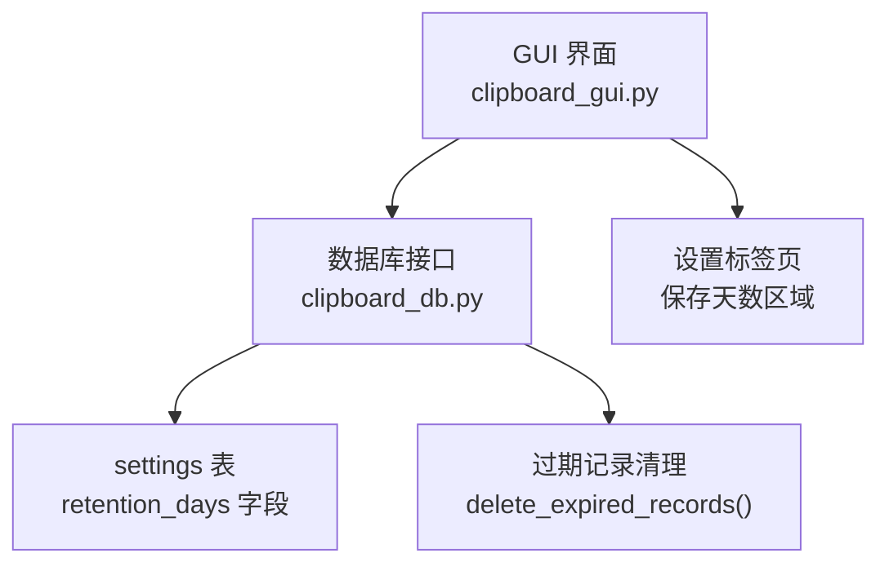
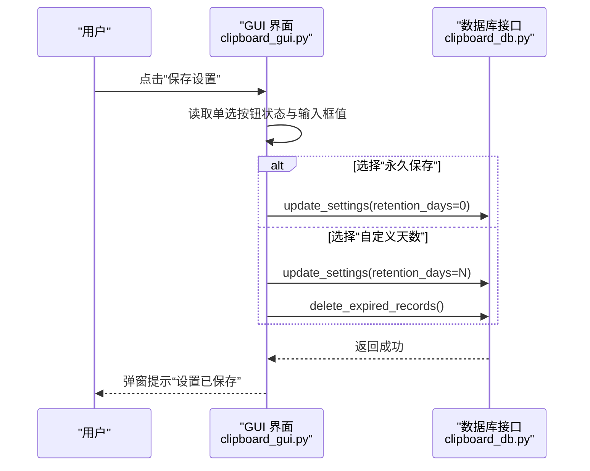
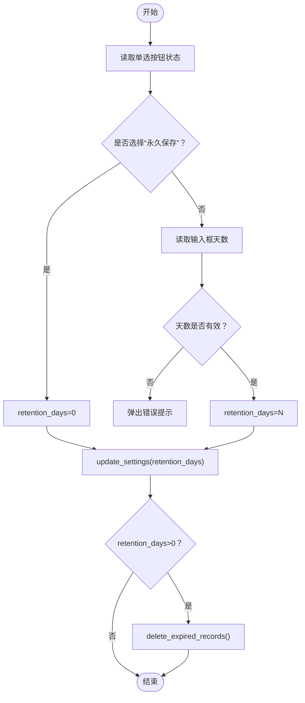
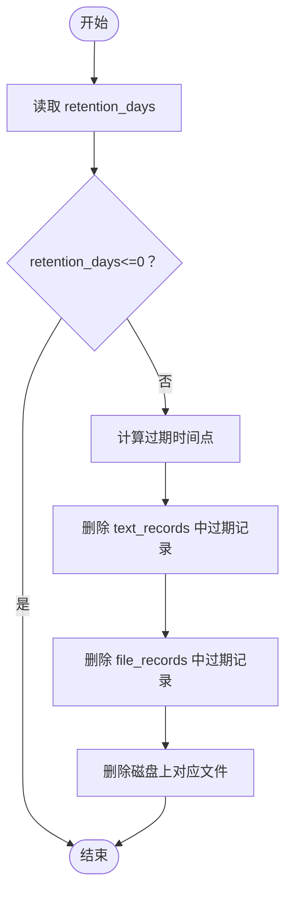
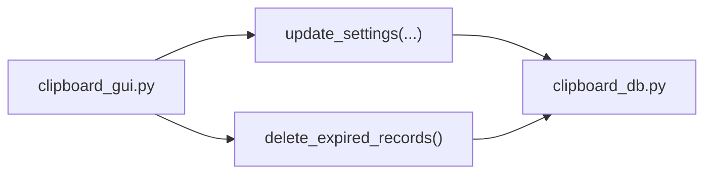

# 记录保存设置

<cite>
**本文引用的文件**
- [clipboard_gui.py](file://clipboard_gui.py)
- [clipboard_db.py](file://clipboard_db.py)
</cite>

## 目录
1. [简介](#简介)
2. [项目结构](#项目结构)
3. [核心组件](#核心组件)
4. [架构总览](#架构总览)
5. [详细组件分析](#详细组件分析)
6. [依赖关系分析](#依赖关系分析)
7. [性能考虑](#性能考虑)
8. [故障排查指南](#故障排查指南)
9. [结论](#结论)

## 简介
本章节聚焦“记录保存设置”的设计与实现，围绕界面中的“永久保存”和“自定义天数”两个单选选项展开，说明：
- retention_days 字段在数据库中的语义：0 表示永久保存，正整数表示保留天数。
- 单选按钮组通过变量管理状态切换，并在保存设置时根据选择更新数据库值。
- 当用户选择“自定义天数”时，系统会在保存后调用清理过期记录的方法。
- days_entry 输入框的初始状态由当前设置决定，并在状态切换时动态启用或禁用。

## 项目结构
本功能涉及 GUI 与数据库两部分：
- GUI 层负责渲染界面、收集用户输入、触发保存与清理流程。
- 数据库层负责持久化设置、提供清理过期记录的能力。

图表来源
- [clipboard_gui.py](file://clipboard_gui.py#L367-L533)
- [clipboard_db.py](file://clipboard_db.py#L387-L455)

章节来源
- [clipboard_gui.py](file://clipboard_gui.py#L367-L533)
- [clipboard_db.py](file://clipboard_db.py#L387-L455)

## 核心组件
- 单选按钮组与输入框
  - “永久保存”与“自定义天数”两个单选按钮，绑定到变量以管理状态。
  - “自定义天数”对应一个输入框，用于输入天数。
- 保存设置逻辑
  - 保存时根据单选按钮选择，将 retention_days 写入数据库。
  - 若选择“自定义天数”，且天数大于 0，则执行清理过期记录。
- 初始状态与动态启用/禁用
  - 界面加载时，根据当前设置决定“永久保存”或“自定义天数”被选中。
  - 当选择“永久保存”时，输入框禁用；选择“自定义天数”时，输入框启用。

章节来源
- [clipboard_gui.py](file://clipboard_gui.py#L367-L533)
- [clipboard_gui.py](file://clipboard_gui.py#L477-L533)
- [clipboard_gui.py](file://clipboard_gui.py#L998-L1040)
- [clipboard_gui.py](file://clipboard_gui.py#L1044-L1093)

## 架构总览
以下序列图展示了“保存设置并清理过期记录”的端到端流程。

图表来源
- [clipboard_gui.py](file://clipboard_gui.py#L477-L533)
- [clipboard_gui.py](file://clipboard_gui.py#L1044-L1093)
- [clipboard_db.py](file://clipboard_db.py#L387-L455)

## 详细组件分析

### 界面设计与交互
- 单选按钮组
  - “永久保存”：值为固定标识，表示永久保存。
  - “自定义天数”：值为固定标识，表示启用自定义天数。
  - 二者共享同一变量，实现互斥选择。
- 输入框 days_entry
  - 仅在“自定义天数”被选中时启用。
  - 初始值来自当前设置：若当前为永久保存，则默认显示某个参考值；若当前为自定义天数，则显示当前天数。
- 事件绑定
  - 单选按钮状态变化时，动态调整输入框的启用/禁用状态。
  - 保存按钮点击后，统一收集并校验输入，写入数据库。

章节来源
- [clipboard_gui.py](file://clipboard_gui.py#L367-L533)
- [clipboard_gui.py](file://clipboard_gui.py#L998-L1040)
- [clipboard_gui.py](file://clipboard_gui.py#L1044-L1093)

### 数据模型与字段语义
- settings 表新增字段 retention_days
  - 类型：整数
  - 语义：0 表示永久保存；正整数 N 表示保留最近 N 天的记录
- 读取与更新
  - 读取：从 settings 表获取 retention_days 的当前值
  - 更新：保存设置时将新的 retention_days 写回 settings 表

章节来源
- [clipboard_db.py](file://clipboard_db.py#L92-L112)
- [clipboard_db.py](file://clipboard_db.py#L387-L412)
- [clipboard_db.py](file://clipboard_db.py#L360-L386)

### 保存设置流程
- 读取单选按钮状态
  - 若为“永久保存”，retention_days=0
  - 若为“自定义天数”，retention_days=输入框的整数值
- 写入数据库
  - 调用 update_settings(retention_days=...)
- 清理过期记录
  - 当 retention_days>0 时，调用 delete_expired_records() 删除过期记录

图表来源
- [clipboard_gui.py](file://clipboard_gui.py#L477-L533)
- [clipboard_gui.py](file://clipboard_gui.py#L1044-L1093)
- [clipboard_db.py](file://clipboard_db.py#L387-L455)

章节来源
- [clipboard_gui.py](file://clipboard_gui.py#L477-L533)
- [clipboard_gui.py](file://clipboard_gui.py#L1044-L1093)
- [clipboard_db.py](file://clipboard_db.py#L387-L455)

### 过期记录清理算法
- 读取当前 retention_days
- 若为 0 或负数，直接返回（不删除）
- 计算过期时间点（当前时间减去 N 天）
- 删除 text_records 中早于过期时间点的记录
- 删除 file_records 中早于过期时间点的记录，并同步删除磁盘上的文件

图表来源
- [clipboard_db.py](file://clipboard_db.py#L413-L455)

章节来源
- [clipboard_db.py](file://clipboard_db.py#L413-L455)

## 依赖关系分析
- GUI 依赖数据库接口
  - 保存设置时调用 update_settings
  - 清理过期记录时调用 delete_expired_records
- 数据库层提供设置读取与更新能力
  - settings 表包含 retention_days 字段
  - 提供 delete_expired_records 实现

图表来源
- [clipboard_gui.py](file://clipboard_gui.py#L477-L533)
- [clipboard_gui.py](file://clipboard_gui.py#L1044-L1093)
- [clipboard_db.py](file://clipboard_db.py#L387-L455)

章节来源
- [clipboard_gui.py](file://clipboard_gui.py#L477-L533)
- [clipboard_gui.py](file://clipboard_gui.py#L1044-L1093)
- [clipboard_db.py](file://clipboard_db.py#L387-L455)

## 性能考虑
- 清理过期记录涉及全表扫描与删除，建议：
  - 控制清理频率（例如在设置变更后一次性清理，避免频繁触发）
  - 对 settings 表与记录表的时间戳字段建立合适索引（如 timestamp），以提升删除效率
  - 大量删除时可考虑分批处理，降低对 UI 的阻塞

## 故障排查指南
- 保存设置时报“请输入有效的数字”
  - 可能原因：输入框未启用但仍有非法值，或用户输入非数字
  - 排查步骤：确认单选按钮状态与输入框启用状态一致；检查输入是否为合法整数
- 选择“永久保存”后仍出现过期记录被删除
  - 可能原因：误以为“永久保存”会阻止清理，但清理逻辑仅在自定义天数>0 时执行
  - 说明：retention_days=0 时不会触发清理，这是预期行为
- 输入框无法编辑
  - 可能原因：当前处于“永久保存”状态，输入框被禁用
  - 处理：切换到“自定义天数”即可启用输入框

章节来源
- [clipboard_gui.py](file://clipboard_gui.py#L477-L533)
- [clipboard_gui.py](file://clipboard_gui.py#L998-L1040)
- [clipboard_gui.py](file://clipboard_gui.py#L1044-L1093)

## 结论
“记录保存设置”通过简洁的单选按钮组与输入框，实现了两种策略的快速切换：
- 永久保存：retention_days=0，不清理过期记录
- 自定义天数：retention_days=N（N>0），保存后清理过期记录
界面层负责状态管理与输入校验，数据库层负责持久化与清理实现，二者协作清晰、职责明确，满足用户对历史记录生命周期管理的需求。