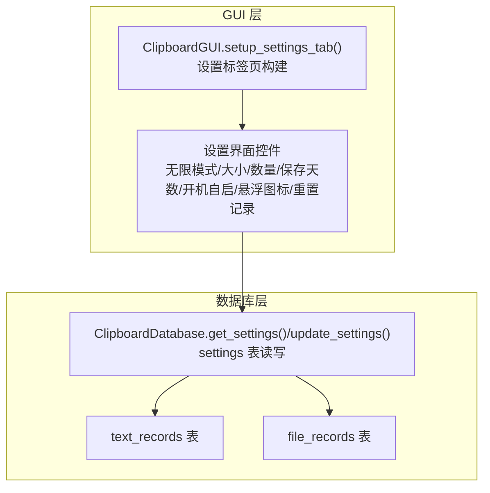
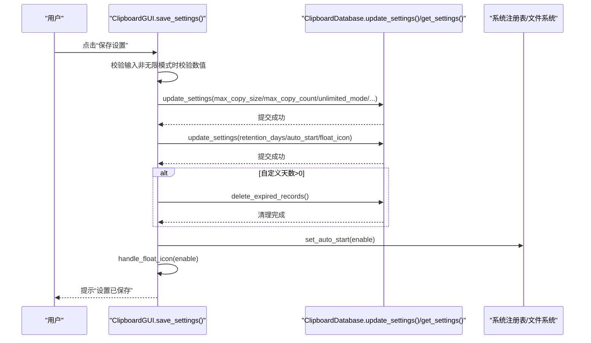
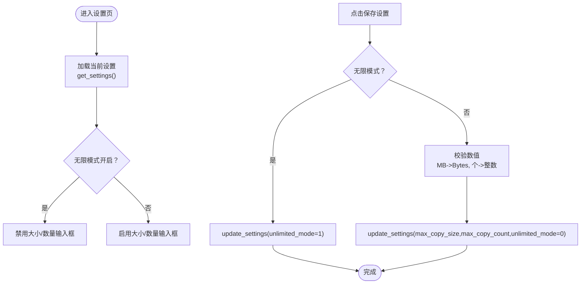
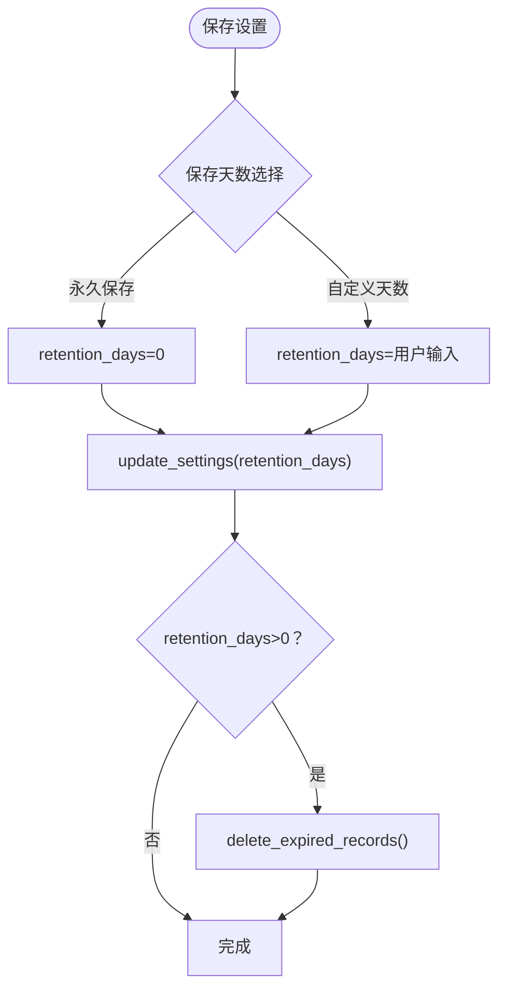
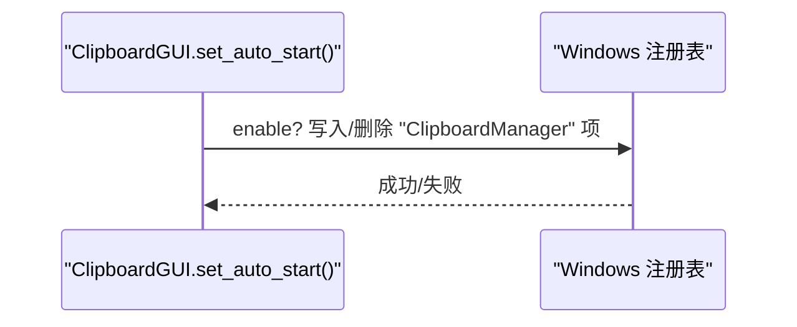
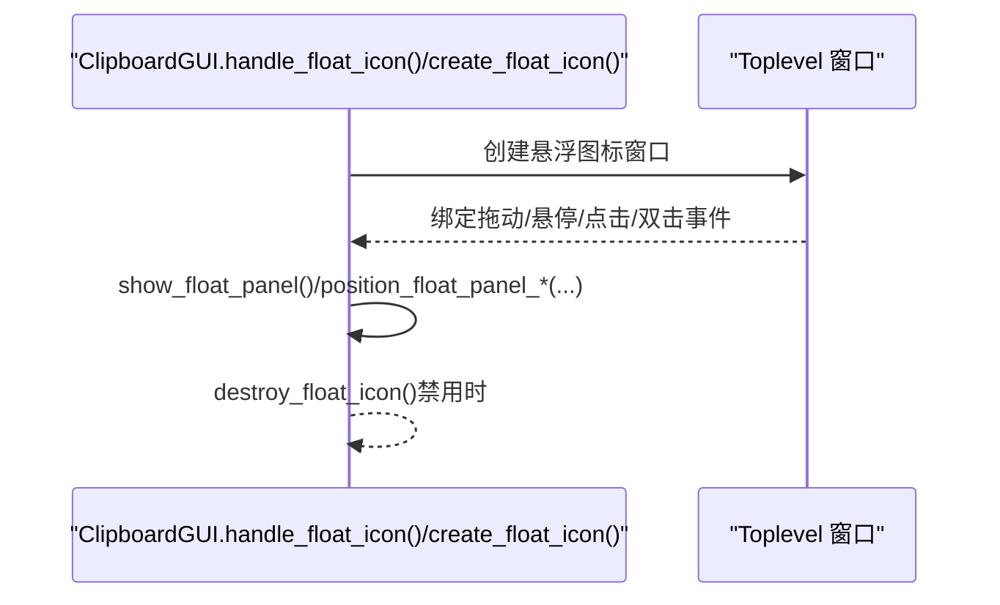
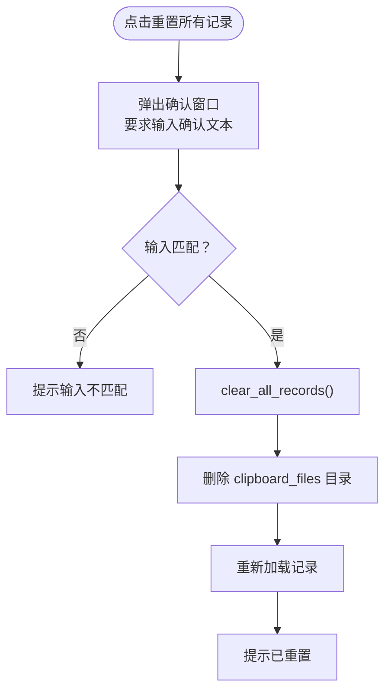
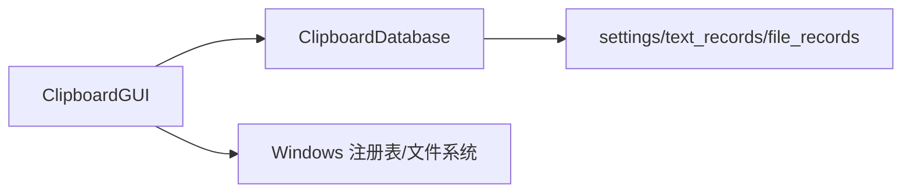

# 设置标签页

<cite>
**本文引用的文件**
- [clipboard_gui.py](file://clipboard_gui.py)
- [clipboard_db.py](file://clipboard_db.py)
</cite>

## 目录
1. [简介](#简介)
2. [项目结构](#项目结构)
3. [核心组件](#核心组件)
4. [架构总览](#架构总览)
5. [详细组件分析](#详细组件分析)
6. [依赖分析](#依赖分析)
7. [性能考虑](#性能考虑)
8. [故障排查指南](#故障排查指南)
9. [结论](#结论)

## 简介
本文件面向“设置标签页”的设计与实现，围绕界面五大功能区域展开：复制限制、记录保存、系统设置、悬浮图标、数据管理。文档将明确各设置项与数据库字段的映射关系，解释无限模式复选框如何动态启用/禁用大小与数量输入框，说明永久保存与自定义天数的单选逻辑，梳理保存设置时的输入校验与 db.update_settings 调用流程，以及恢复默认设置与重置所有记录的实现细节与安全提示。

## 项目结构
设置标签页位于 GUI 主界面中，采用 Notebook 的标签页组织，其中“设置”标签页负责承载复制限制、记录保存、系统设置、悬浮图标、数据管理等配置入口。数据库层提供设置的持久化能力，支持开机自启与悬浮图标的系统集成。

图表来源
- [clipboard_gui.py](file://clipboard_gui.py#L328-L531)
- [clipboard_db.py](file://clipboard_db.py#L359-L412)

章节来源
- [clipboard_gui.py](file://clipboard_gui.py#L328-L531)
- [clipboard_db.py](file://clipboard_db.py#L359-L412)

## 核心组件
- 设置标签页容器与布局：在 Notebook 中创建“设置”标签页，使用网格布局承载五大功能区域。
- 复制限制区域：包含“无限模式”复选框、“最大复制大小（MB）”输入框、“最大复制文件数量（个）”输入框。
- 记录保存区域：包含“永久保存”与“自定义天数（天）”单选逻辑，自定义天数输入框随单选联动启用/禁用。
- 系统设置区域：包含“开机自启”开关，通过注册表实现开机自启/取消开机自启。
- 悬浮图标区域：包含“启用悬浮图标”开关，支持创建/销毁悬浮图标与悬浮面板。
- 数据管理区域：包含“重置所有记录”按钮，执行危险操作前弹窗确认并要求输入确认文本。

章节来源
- [clipboard_gui.py](file://clipboard_gui.py#L328-L531)
- [clipboard_gui.py](file://clipboard_gui.py#L885-L943)
- [clipboard_gui.py](file://clipboard_gui.py#L1131-L1172)
- [clipboard_gui.py](file://clipboard_gui.py#L1173-L1234)

## 架构总览
设置标签页的交互流程如下：用户在界面修改设置后点击“保存设置”，GUI 层进行输入校验与状态转换，随后调用数据库层的 update_settings 方法持久化；同时根据设置项分别处理开机自启与悬浮图标的行为；若设置为自定义天数，还会触发过期记录清理逻辑。

图表来源
- [clipboard_gui.py](file://clipboard_gui.py#L477-L533)
- [clipboard_db.py](file://clipboard_db.py#L387-L412)
- [clipboard_db.py](file://clipboard_db.py#L413-L455)
- [clipboard_gui.py](file://clipboard_gui.py#L1131-L1172)

## 详细组件分析

### 复制限制区域
- 无限模式复选框：绑定变量后通过 trace 监听变更，触发 toggle_entries 动态启用/禁用大小与数量输入框。
- 大小与数量输入框：仅在非无限模式时可编辑；数值校验在保存时进行，单位换算与字节转换由 GUI 层完成。
- 数据库映射：
  - max_copy_size：字节（bytes），界面以 MB 输入，保存前转换为字节。
  - max_copy_count：整数（个），直接保存。
  - unlimited_mode：布尔（0/1），界面以复选框呈现。

图表来源
- [clipboard_gui.py](file://clipboard_gui.py#L439-L462)
- [clipboard_gui.py](file://clipboard_gui.py#L463-L476)
- [clipboard_gui.py](file://clipboard_gui.py#L477-L519)
- [clipboard_db.py](file://clipboard_db.py#L387-L412)

章节来源
- [clipboard_gui.py](file://clipboard_gui.py#L439-L462)
- [clipboard_gui.py](file://clipboard_gui.py#L463-L476)
- [clipboard_gui.py](file://clipboard_gui.py#L477-L519)
- [clipboard_db.py](file://clipboard_db.py#L387-L412)

### 记录保存区域
- 单选逻辑：
  - “永久保存”：对应 retention_days=0。
  - “自定义天数”：对应 retention_days>0，界面输入框启用。
- 保存设置时：
  - 若选择“永久保存”，retention_days=0；
  - 若选择“自定义天数”，retention_days=用户输入；
  - 保存后如为自定义天数，调用 delete_expired_records 清理过期记录。
- 数据库映射：
  - retention_days：整数（天），0 表示永久保存。

图表来源
- [clipboard_gui.py](file://clipboard_gui.py#L498-L519)
- [clipboard_db.py](file://clipboard_db.py#L413-L455)

章节来源
- [clipboard_gui.py](file://clipboard_gui.py#L498-L519)
- [clipboard_db.py](file://clipboard_db.py#L413-L455)

### 系统设置区域（开机自启）
- 控件：允许程序开机自启的复选框。
- 实现：通过 Windows 注册表 HKCU\Software\Microsoft\Windows\CurrentVersion\Run 下的项控制。
- 行为：
  - 启用：写入当前可执行路径；
  - 关闭：删除该项（若存在）。
- 数据库映射：
  - auto_start：布尔（0/1），界面以复选框呈现。

图表来源
- [clipboard_gui.py](file://clipboard_gui.py#L1131-L1163)

章节来源
- [clipboard_gui.py](file://clipboard_gui.py#L1131-L1163)

### 悬浮图标区域
- 控件：启用悬浮图标复选框。
- 行为：
  - 启用：创建悬浮图标窗口（50x50，透明度约15%，置顶，可拖动），绑定悬停/点击/双击事件，显示最近记录悬浮面板。
  - 禁用：销毁悬浮图标窗口。
- 数据库映射：
  - float_icon：布尔（0/1），界面以复选框呈现。

图表来源
- [clipboard_gui.py](file://clipboard_gui.py#L1164-L1234)
- [clipboard_gui.py](file://clipboard_gui.py#L1235-L1558)

章节来源
- [clipboard_gui.py](file://clipboard_gui.py#L1164-L1234)
- [clipboard_gui.py](file://clipboard_gui.py#L1235-L1558)

### 数据管理区域（重置所有记录）
- 危险操作警示：弹出确认窗口，要求用户输入固定确认文本，防止误操作。
- 执行逻辑：
  - 删除数据库中所有文本与文件记录；
  - 删除本地缓存目录 clipboard_files（若存在）；
  - 重新加载记录并提示“所有记录已重置”。

图表来源
- [clipboard_gui.py](file://clipboard_gui.py#L885-L943)

章节来源
- [clipboard_gui.py](file://clipboard_gui.py#L885-L943)

## 依赖分析
- GUI 与数据库：
  - GUI 通过 ClipboardDatabase.get_settings() 读取设置，通过 update_settings() 写入设置。
  - 保存设置时可能调用 delete_expired_records() 清理过期记录。
- GUI 与系统：
  - set_auto_start() 通过注册表实现开机自启控制。
  - 悬浮图标依赖 Tkinter Toplevel 与 PIL/Pillow 图像处理（如可用）。

图表来源
- [clipboard_gui.py](file://clipboard_gui.py#L359-L412)
- [clipboard_db.py](file://clipboard_db.py#L359-L455)

章节来源
- [clipboard_gui.py](file://clipboard_gui.py#L359-L412)
- [clipboard_db.py](file://clipboard_db.py#L359-L455)

## 性能考虑
- 输入校验与转换：
  - 非无限模式时进行数值校验与单位换算，避免无效设置写入数据库。
- 过期记录清理：
  - 仅当自定义天数>0 时触发 delete_expired_records()，减少不必要的磁盘扫描与删除操作。
- 悬浮图标：
  - 悬浮面板内容来自最近记录查询，建议在高频场景下注意查询范围与排序开销，当前实现限制了最近记录数量以平衡性能与体验。

## 故障排查指南
- 保存设置报错“请输入有效的数字”：
  - 检查“最大复制大小（MB）”与“最大复制文件数量（个）”是否为有效数值；无限模式下这些输入框应被禁用。
- 开机自启未生效：
  - 确认 set_auto_start() 是否抛出异常；检查当前用户权限与注册表写入路径。
- 悬浮图标无法显示或点击无响应：
  - 检查 PIL/Pillow 是否安装；若图片加载失败，将回退到默认背景与文本；确认事件绑定是否正常。
- 重置记录后仍提示旧记录：
  - 确认 clear_all_records() 是否执行；检查 clipboard_files 目录是否被正确删除并重建。

章节来源
- [clipboard_gui.py](file://clipboard_gui.py#L530-L533)
- [clipboard_gui.py](file://clipboard_gui.py#L1131-L1163)
- [clipboard_gui.py](file://clipboard_gui.py#L1173-L1234)
- [clipboard_gui.py](file://clipboard_gui.py#L885-L943)

## 结论
设置标签页通过清晰的功能分区与严谨的输入校验，实现了对复制限制、记录保存、系统设置、悬浮图标与数据管理的统一配置入口。其与数据库层的交互简洁可靠，配合注册表与文件系统的系统级集成，满足用户对使用体验与数据生命周期管理的需求。无限模式与单选逻辑的实现提升了配置灵活性，而危险操作的二次确认机制有效降低了误操作风险。