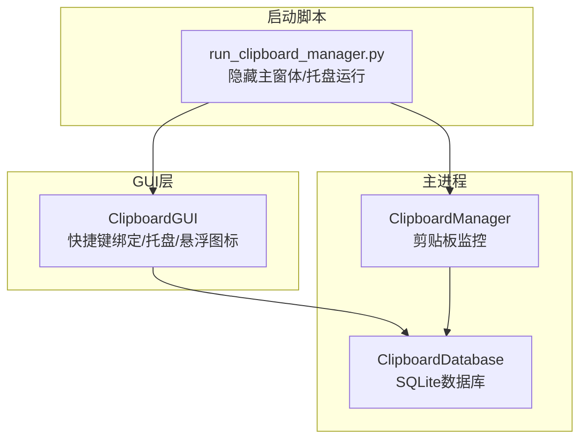
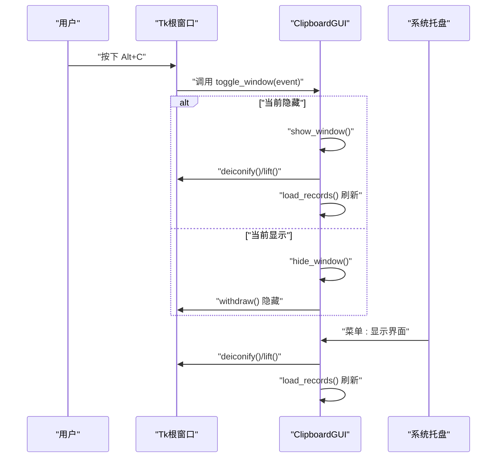
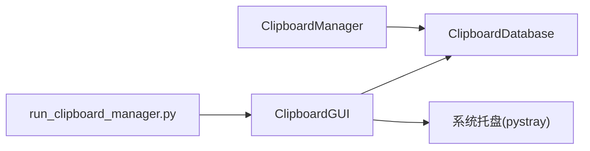

# 全局快捷键

<cite>
**本文引用的文件**
- [clipboard_gui.py](file://clipboard_gui.py)
- [run_clipboard_manager.py](file://run_clipboard_manager.py)
- [clipboard_manager_main.py](file://clipboard_manager_main.py)
</cite>

## 目录
1. [简介](#简介)
2. [项目结构](#项目结构)
3. [核心组件](#核心组件)
4. [架构总览](#架构总览)
5. [详细组件分析](#详细组件分析)
6. [依赖关系分析](#依赖关系分析)
7. [性能考量](#性能考量)
8. [故障排查指南](#故障排查指南)
9. [结论](#结论)

## 简介
本篇文档围绕全局快捷键 Alt+C 的实现机制展开，重点解析 tkinter 的 bind 方法如何捕获系统级键盘事件，说明快捷键绑定的时机选择、toggle_window 的切换逻辑、与系统托盘图标的协同工作方式，以及在不同窗口状态下的行为一致性与事件传播机制。同时提供冲突处理策略、调试方法与常见问题解决方案，帮助开发者与用户获得稳定一致的 Alt+C 使用体验。

## 项目结构
本仓库采用“GUI + 主进程”的组织方式：
- GUI 层负责界面与交互，包含快捷键绑定、托盘图标、悬浮图标等。
- 主进程负责剪贴板监控与数据持久化，GUI 通过数据库接口读写历史记录。
- 启动脚本控制应用生命周期与窗口可见性。

图表来源
- [clipboard_gui.py](file://clipboard_gui.py#L172-L226)
- [run_clipboard_manager.py](file://run_clipboard_manager.py#L55-L66)
- [clipboard_manager_main.py](file://clipboard_manager_main.py#L56-L111)

章节来源
- [clipboard_gui.py](file://clipboard_gui.py#L172-L226)
- [run_clipboard_manager.py](file://run_clipboard_manager.py#L55-L66)
- [clipboard_manager_main.py](file://clipboard_manager_main.py#L56-L111)

## 核心组件
- 快捷键绑定与切换
  - 在 UI 初始化完成后，通过 bind 将 Alt+C 与 toggle_window 绑定，并主动设置焦点以确保快捷键生效。
- 窗口显示/隐藏逻辑
  - hide_window 与 show_window 分别负责隐藏与显示主窗口；toggle_window 切换两者状态。
- 系统托盘协同
  - 创建托盘图标，提供“显示界面”菜单项，点击后调用 show_window。
- 焦点与事件传播
  - 通过 FocusIn/FocusOut 与 has_focus 标志位，配合 is_hidden 与 user_action_in_progress，控制自动刷新与事件传播。

章节来源
- [clipboard_gui.py](file://clipboard_gui.py#L220-L226)
- [clipboard_gui.py](file://clipboard_gui.py#L1697-L1722)
- [clipboard_gui.py](file://clipboard_gui.py#L144-L171)
- [clipboard_gui.py](file://clipboard_gui.py#L134-L143)

## 架构总览
Alt+C 的端到端流程如下：
- 用户按下 Alt+C
- Tk 根窗口捕获事件，回调绑定的 toggle_window
- toggle_window 根据 is_hidden 切换 show_window 或 hide_window
- show_window 会 lift 窗口并刷新记录；hide_window 仅隐藏
- 托盘图标提供“显示界面”菜单，等价于 show_window

图表来源
- [clipboard_gui.py](file://clipboard_gui.py#L220-L226)
- [clipboard_gui.py](file://clipboard_gui.py#L1697-L1722)
- [clipboard_gui.py](file://clipboard_gui.py#L144-L171)

## 详细组件分析

### 快捷键绑定与捕获机制
- 绑定位置与时机
  - 在 setup_ui 中完成 UI 构建后，立即绑定 Alt+c 与 Alt+C 至 toggle_window，并调用 focus_set 确保根窗口获得焦点，从而接收键盘事件。
- 事件捕获范围
  - bind 绑定在根窗口，属于 Tk 层事件系统，能捕获到系统级键盘事件（如 Alt+C），但不会拦截系统级热键（例如某些全局钩子）。若需跨应用的系统级热键，需引入第三方库（如 pynput/win32gui 等），当前实现基于 Tk 的 bind。
- 大小写处理
  - 同时绑定小写与大写，保证 Alt+c 与 Alt+C 均可触发。

章节来源
- [clipboard_gui.py](file://clipboard_gui.py#L220-L226)

### toggle_window 的实现逻辑
- 切换条件
  - is_hidden 为真时执行 show_window，否则执行 hide_window。
- show_window 行为
  - deiconify 显示窗口，lift 置顶，is_hidden 置假，并立即刷新记录。
- hide_window 行为
  - withdraw 隐藏窗口，is_hidden 置真。
- 与自动更新的协作
  - update_records 会在非隐藏、无用户操作、无焦点时定时刷新；toggle 切换时由 show_window 主动刷新，避免延迟。

章节来源
- [clipboard_gui.py](file://clipboard_gui.py#L1697-L1722)
- [clipboard_gui.py](file://clipboard_gui.py#L1686-L1696)

### 焦点管理与事件传播
- 焦点事件
  - 绑定 <FocusIn>/<FocusOut>，维护 has_focus 标志位，用于 update_records 的条件判断。
- 事件传播
  - 根窗口获得焦点后，Alt+C 事件优先在 Tk 层处理；若未消费，才会传递到系统层。当前实现通过 bind 直接拦截 Alt+C，避免与系统或其他应用冲突。
- 用户操作标记
  - user_action_in_progress 用于避免在用户操作期间频繁刷新，提升交互流畅度。

章节来源
- [clipboard_gui.py](file://clipboard_gui.py#L134-L143)
- [clipboard_gui.py](file://clipboard_gui.py#L1686-L1696)

### 与系统托盘的协同工作
- 托盘图标创建
  - 若可用，创建托盘图标，菜单包含“显示界面”和“退出”，点击“显示界面”等价于调用 show_window。
- 启动脚本默认隐藏主窗体
  - run 脚本启动时默认隐藏主窗口，仅保留托盘图标，用户可通过托盘或 Alt+C 访问界面。

章节来源
- [clipboard_gui.py](file://clipboard_gui.py#L144-L171)
- [run_clipboard_manager.py](file://run_clipboard_manager.py#L55-L66)

### 多途径访问界面的用户体验
- 快捷键 Alt+C：最快速直达主界面。
- 托盘图标：点击“显示界面”菜单项。
- 悬浮图标（可选）：悬浮图标支持悬停/点击显示最近记录面板，双击显示主窗口；设置中可开启/关闭。

章节来源
- [clipboard_gui.py](file://clipboard_gui.py#L1165-L1253)
- [clipboard_gui.py](file://clipboard_gui.py#L1254-L1380)

### 快捷键冲突与兼容性策略
- 与系统热键
  - 当前实现基于 Tk 的 bind，不会拦截系统级热键（如 Windows 的 Alt+Tab）。若需完全独占 Alt+C，需引入系统级钩子（非当前实现）。
- 与其他应用冲突
  - 若其他应用也绑定了 Alt+C，Tk 的事件优先级取决于事件冒泡与焦点归属。建议：
    - 在应用启动时确保根窗口获得焦点（已完成）。
    - 避免在应用内重复绑定相同组合键。
    - 如需更强的独占能力，可考虑系统级热键方案（需额外依赖与权限）。
- 与剪贴板监控的关系
  - 剪贴板监控独立于 GUI 事件，互不影响。监控线程在后台运行，不影响快捷键响应。

章节来源
- [clipboard_gui.py](file://clipboard_gui.py#L220-L226)
- [clipboard_manager_main.py](file://clipboard_manager_main.py#L717-L730)

### 不同窗口状态下的行为一致性
- 隐藏态：Alt+C -> 显示；托盘“显示界面” -> 显示。
- 显示态：Alt+C -> 隐藏；托盘“显示界面” -> 置顶并刷新。
- 自动更新：仅在显示且无用户操作、无焦点时定时刷新，避免干扰。
- 焦点与刷新：FocusIn/FocusOut 与 has_focus 协作，防止在用户编辑/选择时频繁刷新。

章节来源
- [clipboard_gui.py](file://clipboard_gui.py#L1686-L1696)
- [clipboard_gui.py](file://clipboard_gui.py#L134-L143)
- [clipboard_gui.py](file://clipboard_gui.py#L1697-L1722)

### 调试方法与常见问题
- 快捷键无效
  - 确认根窗口已获得焦点（setup_ui 中已 focus_set）。
  - 确认已绑定 Alt+c 与 Alt+C。
  - 确认未被其他应用占用（Alt+C 通常不会被系统拦截，但可能被其他应用绑定）。
- 窗口不显示/不隐藏
  - 检查 is_hidden 状态与 toggle_window 流程。
  - 检查 show_window 是否调用了 lift 与 load_records。
- 自动刷新异常
  - 检查 has_focus 与 user_action_in_progress 标志位，确认 update_records 的条件分支。
- 托盘不可用
  - 确认已安装 pystray 与 Pillow；否则会降级为不可用状态。

章节来源
- [clipboard_gui.py](file://clipboard_gui.py#L220-L226)
- [clipboard_gui.py](file://clipboard_gui.py#L1686-L1722)
- [clipboard_gui.py](file://clipboard_gui.py#L144-L171)

## 依赖关系分析
- GUI 与数据库
  - ClipboardGUI 通过 ClipboardDatabase 读取/统计/搜索记录，用于刷新界面。
- GUI 与托盘
  - create_tray_icon 创建托盘菜单，菜单项调用 show_window。
- 启动脚本与 GUI
  - run 脚本默认隐藏主窗体，仅保留托盘图标；用户可通过 Alt+C 或托盘访问界面。
- 主进程与数据库
  - ClipboardManager 通过 ClipboardDatabase 存储文本/文件记录，供 GUI 查询。

图表来源
- [run_clipboard_manager.py](file://run_clipboard_manager.py#L55-L66)
- [clipboard_gui.py](file://clipboard_gui.py#L144-L171)
- [clipboard_manager_main.py](file://clipboard_manager_main.py#L56-L111)

章节来源
- [run_clipboard_manager.py](file://run_clipboard_manager.py#L55-L66)
- [clipboard_gui.py](file://clipboard_gui.py#L144-L171)
- [clipboard_manager_main.py](file://clipboard_manager_main.py#L56-L111)

## 性能考量
- 自动刷新频率
  - update_records 每 2 秒刷新一次，仅在满足条件时执行，避免不必要的数据库与 UI 更新。
- 用户操作标记
  - user_action_in_progress 与 has_focus 避免在用户交互时频繁刷新，减少卡顿。
- 界面绘制
  - Treeview 与 Text 控件在刷新时尽量增量更新，避免全量重建。

章节来源
- [clipboard_gui.py](file://clipboard_gui.py#L1686-L1696)

## 故障排查指南
- 快捷键无效
  - 检查 setup_ui 中是否绑定 Alt+c/Alt+C 且 focus_set 是否执行。
- 窗口无法显示
  - 检查 show_window 是否调用 deiconify/lift/load_records。
- 窗口无法隐藏
  - 检查 hide_window 是否调用 withdraw 并设置 is_hidden。
- 托盘不可用
  - 安装 pystray 与 Pillow；否则托盘功能不可用。
- 自动刷新异常
  - 检查 has_focus 与 user_action_in_progress 的状态，确认 update_records 条件分支。

章节来源
- [clipboard_gui.py](file://clipboard_gui.py#L220-L226)
- [clipboard_gui.py](file://clipboard_gui.py#L1697-L1722)
- [clipboard_gui.py](file://clipboard_gui.py#L144-L171)
- [clipboard_gui.py](file://clipboard_gui.py#L1686-L1696)

## 结论
本实现通过在 UI 初始化完成后绑定 Alt+C 至 toggle_window，并在根窗口获得焦点的前提下，确保快捷键可靠捕获与响应。结合系统托盘与可选悬浮图标，提供了多入口访问界面的用户体验。通过焦点与状态标志位的协同，实现了在不同窗口状态下的一致行为与良好的事件传播控制。对于系统级热键独占的需求，当前实现基于 Tk 的 bind，若需更强的独占能力，可考虑引入系统级钩子方案。