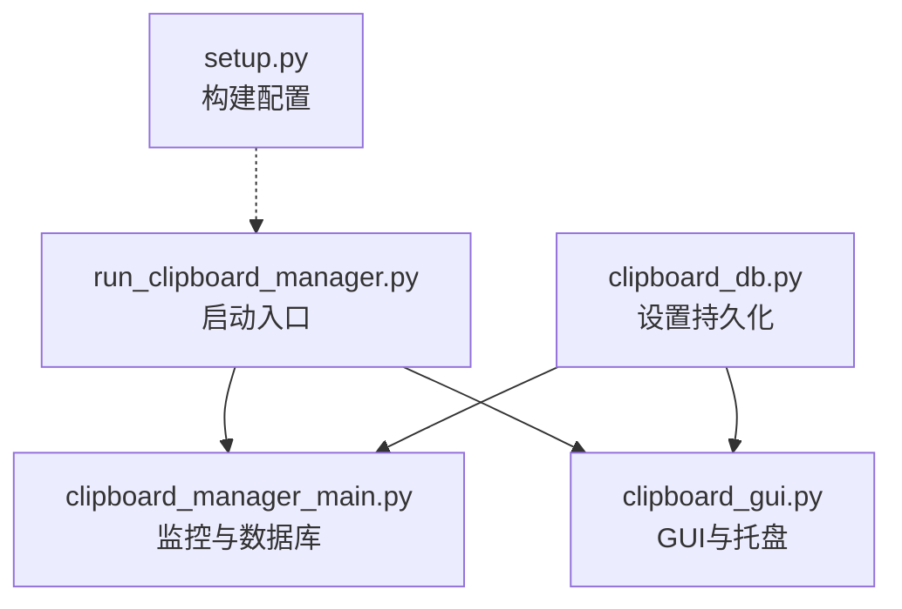
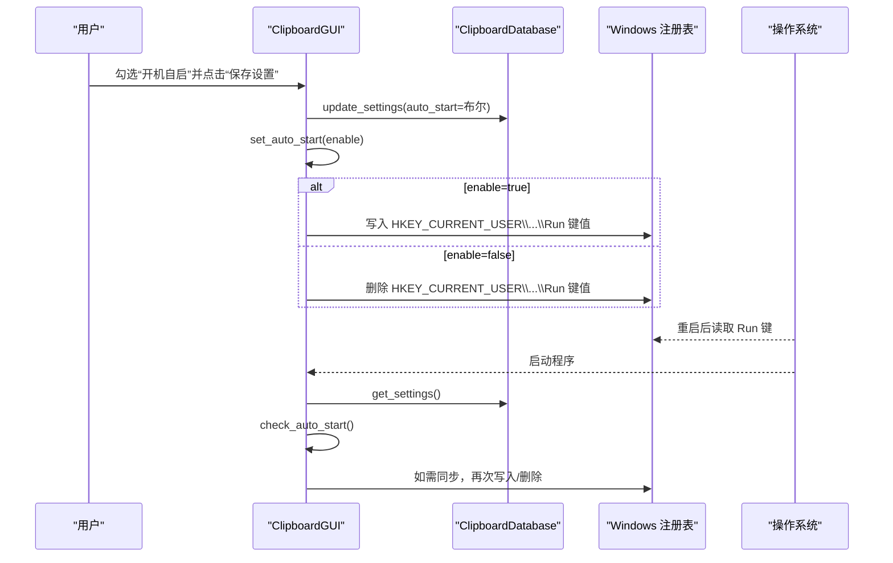
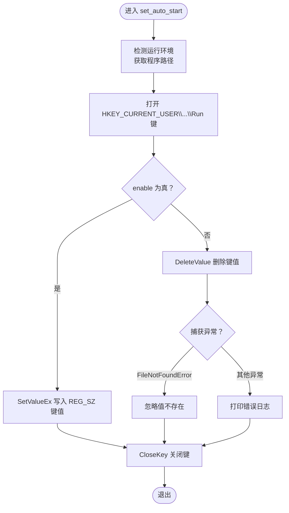
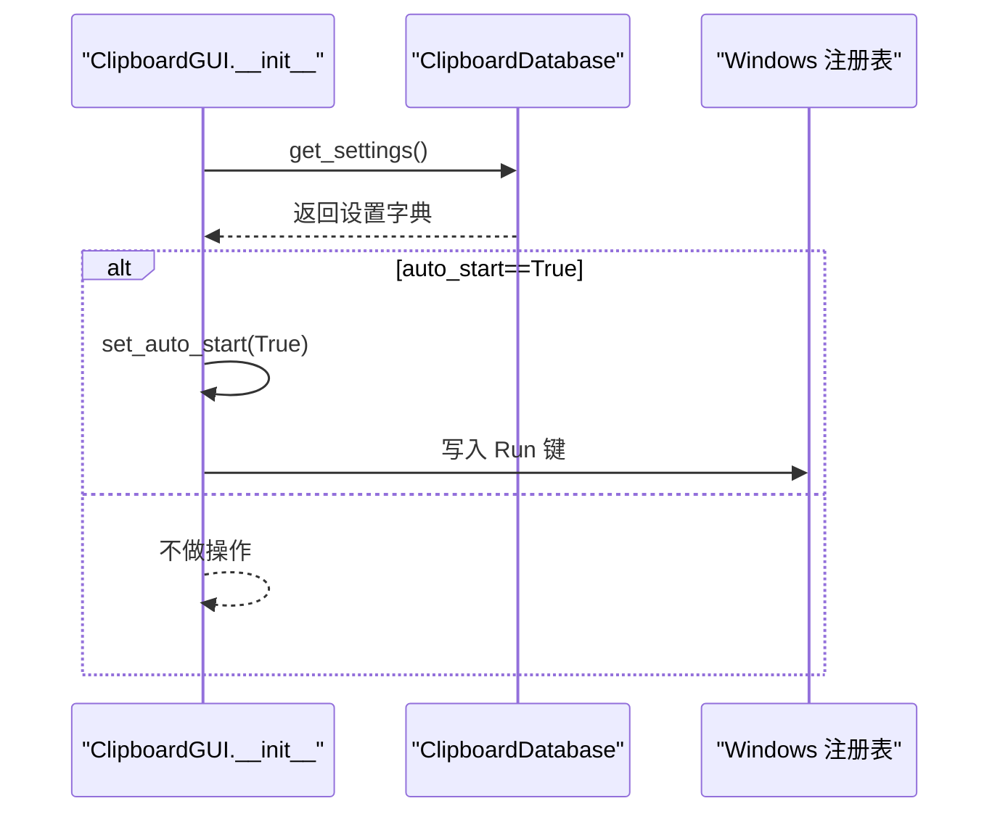
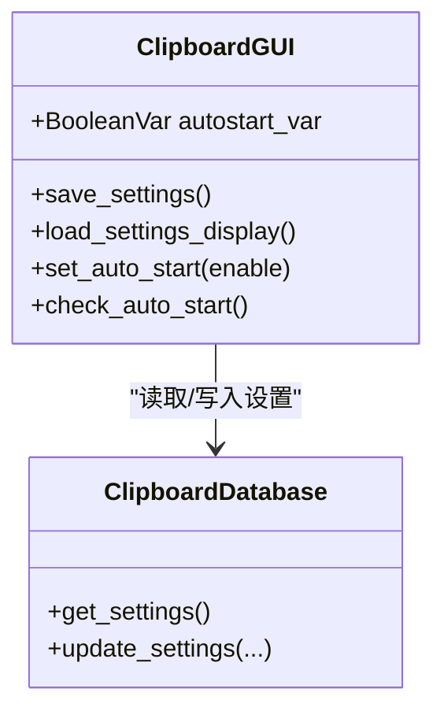
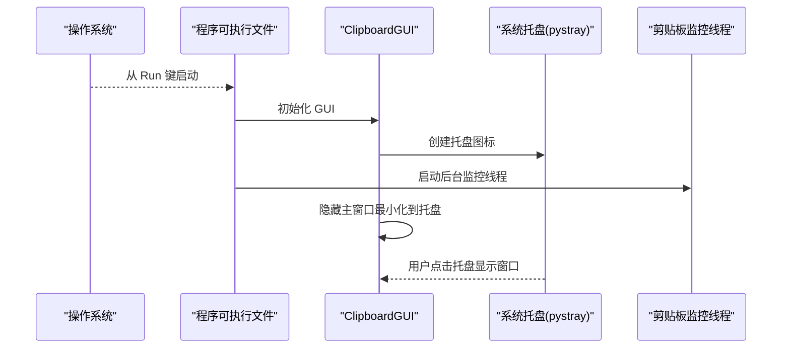
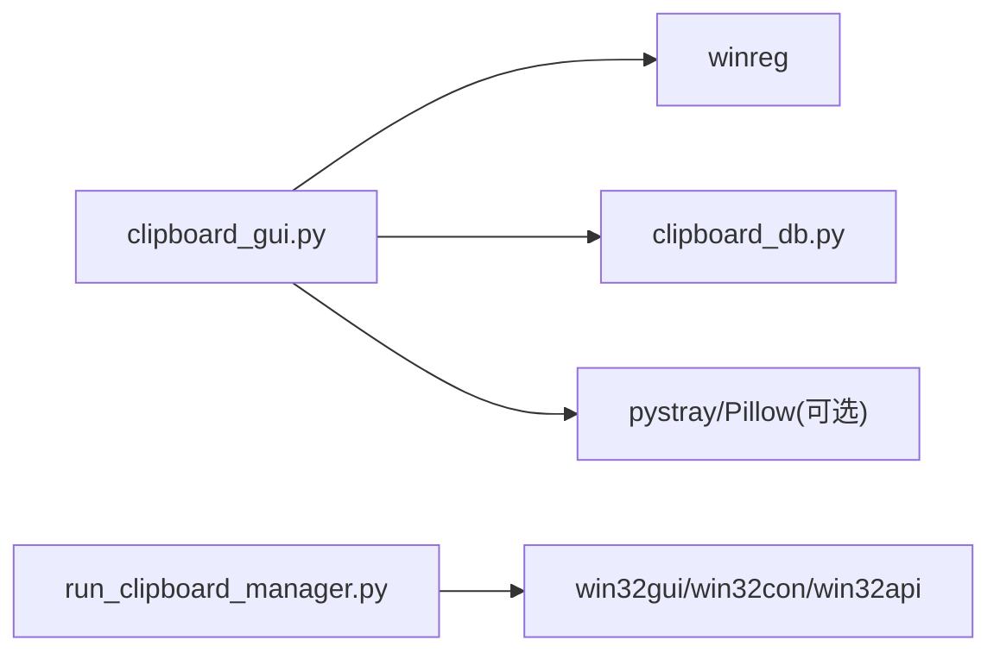

# 开机自启功能

<cite>
**本文引用的文件**
- [clipboard_gui.py](file://clipboard_gui.py)
- [clipboard_manager_main.py](file://clipboard_manager_main.py)
- [clipboard_db.py](file://clipboard_db.py)
- [run_clipboard_manager.py](file://run_clipboard_manager.py)
- [setup.py](file://setup.py)
</cite>

## 目录
1. [简介](#简介)
2. [项目结构](#项目结构)
3. [核心组件](#核心组件)
4. [架构总览](#架构总览)
5. [详细组件分析](#详细组件分析)
6. [依赖关系分析](#依赖关系分析)
7. [性能考量](#性能考量)
8. [故障排查指南](#故障排查指南)
9. [结论](#结论)

## 简介
本文件聚焦“开机自启”功能的实现原理，围绕 Windows 注册表 HKEY_CURRENT_USER\Software\Microsoft\Windows\CurrentVersion\Run 键值展开，系统性说明：
- set_auto_start 方法中注册表操作的具体实现（含 winreg 的读写流程）
- check_auto_start 方法在程序启动时如何检查并应用自启设置
- GUI 界面中开机自启复选框的状态绑定与事件处理逻辑
- 自启功能与系统托盘的协同工作流程，确保程序最小化启动时仍可正常运行
- 注册表操作的安全性考虑与错误处理策略

## 项目结构
本仓库采用“功能模块化 + GUI 主入口”的组织方式：
- clipboard_manager_main.py：剪贴板监控与数据库交互的核心逻辑
- clipboard_gui.py：图形界面与托盘、悬浮图标等 UI 功能
- clipboard_db.py：SQLite 数据库初始化与设置项持久化
- run_clipboard_manager.py：应用启动入口，负责互斥检查、后台监控线程与 GUI 启动
- setup.py：构建可执行文件的配置（与自启无关，但影响打包产物）

图表来源
- [run_clipboard_manager.py](file://run_clipboard_manager.py#L32-L71)
- [clipboard_manager_main.py](file://clipboard_manager_main.py#L731-L761)
- [clipboard_gui.py](file://clipboard_gui.py#L1-L120)
- [clipboard_db.py](file://clipboard_db.py#L1-L120)
- [setup.py](file://setup.py#L65-L84)

章节来源
- [run_clipboard_manager.py](file://run_clipboard_manager.py#L32-L71)
- [clipboard_manager_main.py](file://clipboard_manager_main.py#L731-L761)
- [clipboard_gui.py](file://clipboard_gui.py#L1-L120)
- [clipboard_db.py](file://clipboard_db.py#L1-L120)
- [setup.py](file://setup.py#L65-L84)

## 核心组件
- 注册表自启控制：在 HKEY_CURRENT_USER 下的 CurrentVersion\Run 键下写入/删除程序路径，实现开机自启。
- GUI 设置与事件：GUI 中的“开机自启”复选框与数据库设置联动，并在保存设置时调用注册表写入。
- 启动时应用：程序启动时读取数据库设置，若开启则立即写入注册表。
- 托盘与最小化：程序默认最小化到托盘运行，不影响自启效果。

章节来源
- [clipboard_gui.py](file://clipboard_gui.py#L89-L116)
- [clipboard_gui.py](file://clipboard_gui.py#L1131-L1163)
- [clipboard_db.py](file://clipboard_db.py#L360-L412)
- [run_clipboard_manager.py](file://run_clipboard_manager.py#L55-L66)

## 架构总览
开机自启涉及的关键交互如下：
- 用户在 GUI 设置页勾选“开机自启”
- 点击“保存设置”，GUI 将设置写入数据库，并调用 set_auto_start
- set_auto_start 使用 winreg 对 HKEY_CURRENT_USER\...\Run 键进行写入或删除
- 系统重启后，Windows 会从 Run 键读取程序路径并启动
- 程序启动时，GUI 读取数据库设置，如 auto_start 为真则再次写入注册表，保证一致性

图表来源
- [clipboard_gui.py](file://clipboard_gui.py#L477-L530)
- [clipboard_gui.py](file://clipboard_gui.py#L1131-L1163)
- [clipboard_gui.py](file://clipboard_gui.py#L89-L116)
- [clipboard_db.py](file://clipboard_db.py#L360-L412)

## 详细组件分析

### 注册表自启实现：set_auto_start
- 目标键值：HKEY_CURRENT_USER\Software\Microsoft\Windows\CurrentVersion\Run
- 关键步骤：
  - 判断当前运行环境（打包后的可执行文件或源码），确定要写入的程序路径
  - 打开注册表键（HKEY_CURRENT_USER 下对应路径）
  - enable 为真时写入 REG_SZ 类型的字符串值；为假时删除该值
  - 异常捕获：对 FileNotFoundError（删除不存在值）进行忽略，其他异常打印日志
- 安全性与错误处理：
  - 使用 try/except 包裹注册表操作，避免因权限不足或访问失败导致崩溃
  - 删除不存在值时捕获 FileNotFoundError 并忽略，保证幂等性
  - 其他异常统一打印错误信息，便于定位问题

图表来源
- [clipboard_gui.py](file://clipboard_gui.py#L1131-L1163)

章节来源
- [clipboard_gui.py](file://clipboard_gui.py#L1131-L1163)

### 启动时自启检查：check_auto_start
- 触发时机：GUI 初始化时调用 check_auto_start
- 流程：
  - 从数据库读取设置
  - 若 auto_start 为真，则调用 set_auto_start(True) 同步注册表
  - 异常捕获：出现异常时打印日志，不影响主流程
- 作用：确保即使用户手动删除了注册表项，程序启动后也能自动恢复

图表来源
- [clipboard_gui.py](file://clipboard_gui.py#L89-L116)
- [clipboard_gui.py](file://clipboard_gui.py#L1131-L1163)
- [clipboard_db.py](file://clipboard_db.py#L360-L385)

章节来源
- [clipboard_gui.py](file://clipboard_gui.py#L89-L116)
- [clipboard_db.py](file://clipboard_db.py#L360-L385)

### GUI 复选框状态绑定与事件处理
- 设置页 UI：
  - “开机自启”复选框变量：BooleanVar
  - 初始化时从数据库读取 auto_start 并设置到复选框
- 保存设置流程：
  - 读取复选框状态
  - 调用数据库 update_settings 更新 auto_start
  - 调用 set_auto_start 同步注册表
- 事件绑定：
  - 保存按钮触发保存逻辑
  - 复选框状态变化由 Tkinter 变量驱动，无需额外绑定

图表来源
- [clipboard_gui.py](file://clipboard_gui.py#L394-L462)
- [clipboard_gui.py](file://clipboard_gui.py#L477-L530)
- [clipboard_db.py](file://clipboard_db.py#L360-L412)

章节来源
- [clipboard_gui.py](file://clipboard_gui.py#L394-L462)
- [clipboard_gui.py](file://clipboard_gui.py#L477-L530)
- [clipboard_db.py](file://clipboard_db.py#L360-L412)

### 与系统托盘的协同工作流程
- 启动策略：
  - run_clipboard_manager.py 默认隐藏主窗口，创建托盘图标并启动后台监控线程
  - 即使最小化到托盘，剪贴板监控线程仍持续运行
- 自启与托盘的关系：
  - 注册表写入与托盘显示互不影响
  - 自启后程序会创建托盘图标并保持后台运行
- 界面切换：
  - 托盘菜单可显示主窗口
  - Alt+C 快捷键也可切换窗口显示状态

图表来源
- [run_clipboard_manager.py](file://run_clipboard_manager.py#L55-L66)
- [clipboard_gui.py](file://clipboard_gui.py#L144-L171)
- [clipboard_gui.py](file://clipboard_gui.py#L1698-L1722)

章节来源
- [run_clipboard_manager.py](file://run_clipboard_manager.py#L55-L66)
- [clipboard_gui.py](file://clipboard_gui.py#L144-L171)
- [clipboard_gui.py](file://clipboard_gui.py#L1698-L1722)

## 依赖关系分析
- 注册表操作依赖 winreg（Python 标准库）
- GUI 与数据库交互依赖 sqlite3
- 启动入口 run_clipboard_manager.py 依赖 win32gui/win32con/win32api 实现互斥与窗口管理
- 托盘功能依赖 pystray/Pillow（未安装时会降级）

图表来源
- [clipboard_gui.py](file://clipboard_gui.py#L1131-L1163)
- [clipboard_db.py](file://clipboard_db.py#L1-L120)
- [run_clipboard_manager.py](file://run_clipboard_manager.py#L17-L46)
- [clipboard_gui.py](file://clipboard_gui.py#L144-L171)

章节来源
- [clipboard_gui.py](file://clipboard_gui.py#L1131-L1163)
- [clipboard_db.py](file://clipboard_db.py#L1-L120)
- [run_clipboard_manager.py](file://run_clipboard_manager.py#L17-L46)
- [clipboard_gui.py](file://clipboard_gui.py#L144-L171)

## 性能考量
- 注册表写入为 O(1) 操作，开销极低，且仅在用户更改设置或启动时触发
- GUI 初始化时的 check_auto_start 仅进行一次数据库读取与一次条件判断
- 后台监控线程为守护线程，不影响主进程退出
- 托盘图标与悬浮图标均为轻量 UI 组件，对性能影响可忽略

## 故障排查指南
- 权限不足
  - 症状：set_auto_start 抛出异常
  - 排查：确认以当前用户身份运行；检查是否在受限账户下运行
  - 处理：提升权限或在管理员账户下运行
- 注册表访问失败
  - 症状：写入/删除键值失败
  - 排查：确认目标键路径正确；检查防病毒软件是否拦截
  - 处理：暂时关闭拦截或加入白名单
- 值不存在导致删除报错
  - 症状：删除时捕获 FileNotFoundError
  - 处理：代码已忽略该异常，属预期行为
- 自启无效
  - 症状：开机后未自动启动
  - 排查：确认注册表键值存在；确认程序路径有效
  - 处理：重新勾选并保存设置，或手动在注册表中添加键值
- 托盘不可见
  - 症状：最小化后看不到托盘图标
  - 排查：确认 pystray/Pillow 是否安装；检查系统托盘区域
  - 处理：安装 pystray 与 Pillow；或接受降级提示

章节来源
- [clipboard_gui.py](file://clipboard_gui.py#L1131-L1163)
- [clipboard_gui.py](file://clipboard_gui.py#L144-L171)

## 结论
本项目的开机自启功能通过 Windows 注册表 HKEY_CURRENT_USER\...\Run 键实现，结合 GUI 设置与数据库持久化，形成“用户设置—数据库—注册表—系统启动”的闭环。启动时的 check_auto_start 保证了设置的一致性；与系统托盘的配合使得程序可在最小化状态下稳定运行。整体实现简洁可靠，具备良好的错误处理与兼容性。