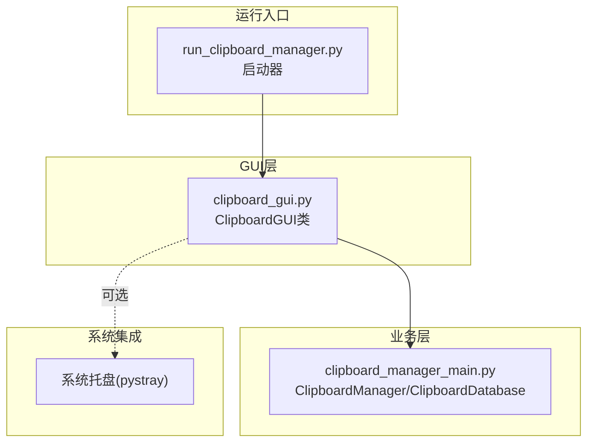
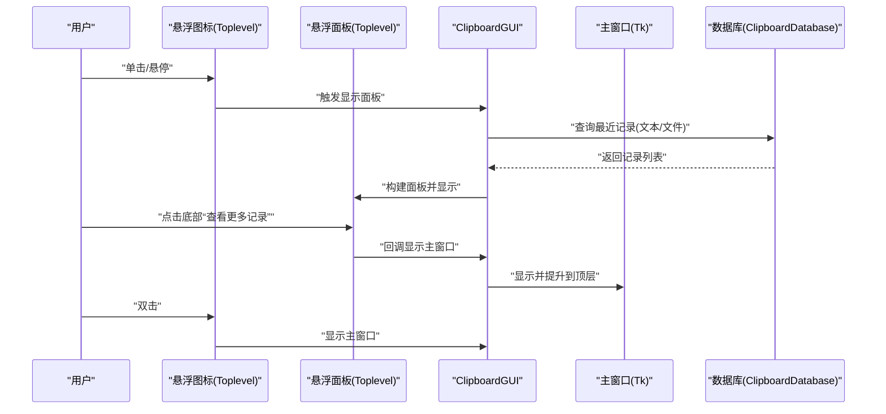
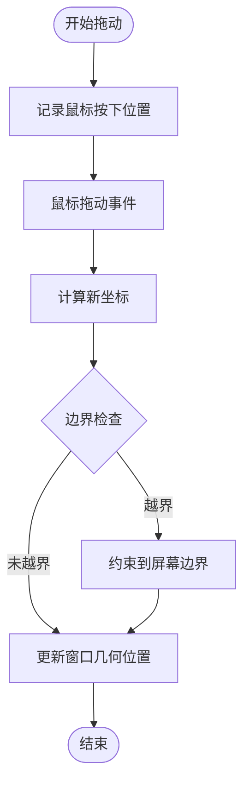
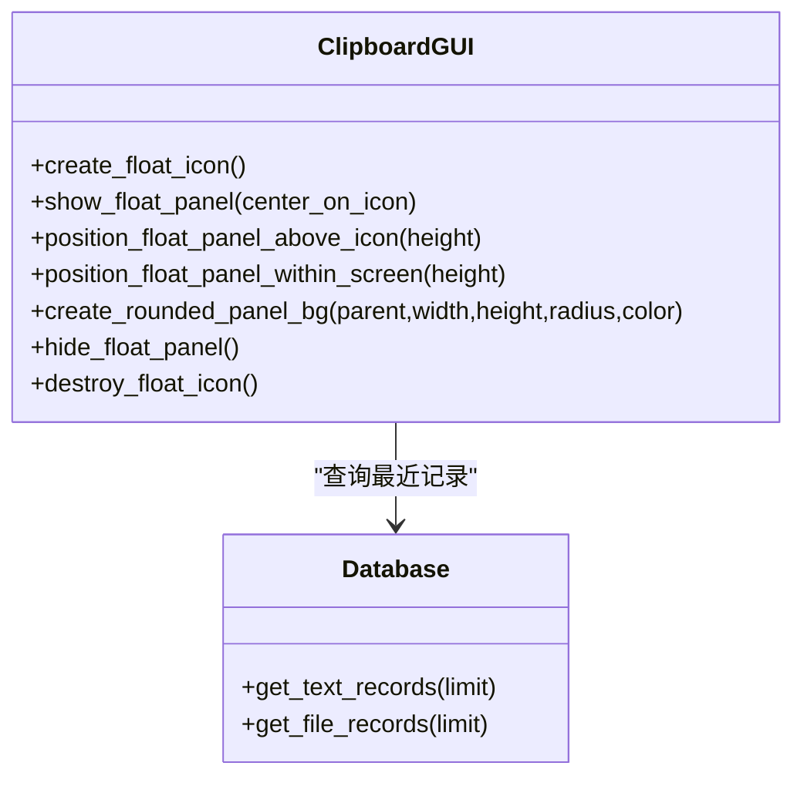
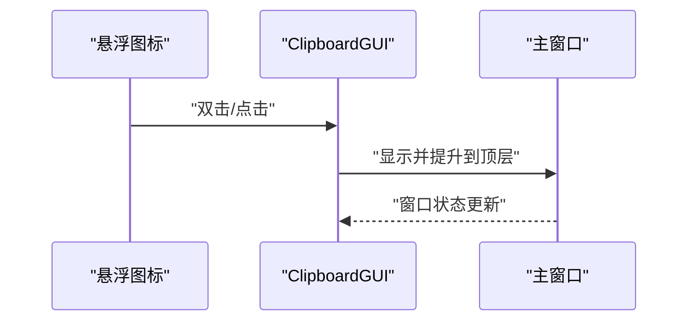
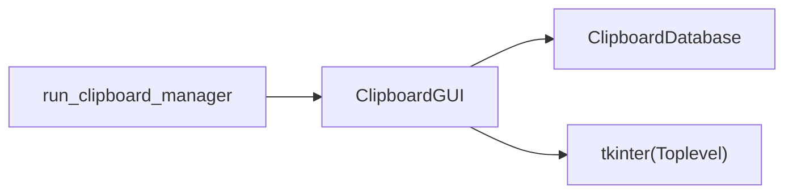

# 悬浮图标功能

<cite>
**本文引用的文件**
- [clipboard_gui.py](file://clipboard_gui.py)
- [run_clipboard_manager.py](file://run_clipboard_manager.py)
- [clipboard_manager_main.py](file://clipboard_manager_main.py)
</cite>

## 目录
1. [简介](#简介)
2. [项目结构](#项目结构)
3. [核心组件](#核心组件)
4. [架构总览](#架构总览)
5. [详细组件分析](#详细组件分析)
6. [依赖关系分析](#依赖关系分析)
7. [性能考虑](#性能考虑)
8. [故障排查指南](#故障排查指南)
9. [结论](#结论)

## 简介
本文件围绕“悬浮图标”功能进行全面技术说明，重点阐述如何基于 tkinter 的 Toplevel 窗口创建可拖动的悬浮图标，涵盖窗口属性配置（如置顶、透明度、去边框）、鼠标事件绑定（拖动、悬停、点击、双击）、悬浮面板的显示与隐藏策略、与主窗口的通信逻辑（点击图标显示主界面），以及视觉设计参数（尺寸、透明度、圆角背景等）。同时给出资源交互与异常处理建议，帮助在不同系统环境下稳定运行。

## 项目结构
悬浮图标功能位于 GUI 层，由 ClipboardGUI 类负责创建与管理悬浮图标及其面板，并通过数据库接口访问剪贴板历史记录。运行入口通过 run_clipboard_manager.py 启动，隐藏主窗口并默认显示系统托盘图标，悬浮图标由设置控制启用/禁用。

图表来源
- [run_clipboard_manager.py](file://run_clipboard_manager.py#L32-L70)
- [clipboard_gui.py](file://clipboard_gui.py#L37-L110)
- [clipboard_manager_main.py](file://clipboard_manager_main.py#L56-L111)

章节来源
- [run_clipboard_manager.py](file://run_clipboard_manager.py#L32-L70)
- [clipboard_gui.py](file://clipboard_gui.py#L37-L110)
- [clipboard_manager_main.py](file://clipboard_manager_main.py#L56-L111)

## 核心组件
- 悬浮图标窗口（Toplevel）：独立于主窗口，去边框、置顶、半透明，支持拖动与悬停显示面板。
- 悬浮面板（Toplevel）：显示最近记录列表，支持滚动与“查看更多记录”跳转。
- 主窗口控制：通过悬浮图标点击或双击显示主窗口；隐藏/显示主窗口。
- 数据访问：从数据库读取最近记录，用于悬浮面板展示。

章节来源
- [clipboard_gui.py](file://clipboard_gui.py#L1173-L1379)
- [clipboard_gui.py](file://clipboard_gui.py#L1448-L1669)
- [clipboard_manager_main.py](file://clipboard_manager_main.py#L181-L211)

## 架构总览
悬浮图标与主窗口的交互流程如下：

图表来源
- [clipboard_gui.py](file://clipboard_gui.py#L1173-L1379)
- [clipboard_gui.py](file://clipboard_gui.py#L1448-L1669)
- [clipboard_manager_main.py](file://clipboard_manager_main.py#L181-L211)

## 详细组件分析

### 悬浮图标窗口（Toplevel）创建与属性
- 窗口类型：使用 tkinter.Toplevel 创建独立窗口，作为悬浮图标载体。
- 关键属性：
  - 去边框：overrideredirect(True)，去除标题栏与边框，便于自由绘制与透明。
  - 置顶：attributes("-topmost", True)，确保始终显示在其他窗口之上。
  - 透明度：attributes("-alpha", 透明系数)，用于降低视觉干扰。
  - 尺寸：固定为 50x50 像素，适配小尺寸悬浮图标。
- 初始位置：默认右下角偏移，距离右侧与底部各若干像素，避免遮挡任务栏或常用区域。
- 图像回退：优先加载资源图片，失败时使用背景色与文字占位，保证可用性。

章节来源
- [clipboard_gui.py](file://clipboard_gui.py#L1173-L1217)

### 鼠标事件绑定与拖动实现
- 拖动支持：
  - 按下左键记录初始偏移量。
  - 拖动过程中计算新坐标，结合屏幕尺寸与图标尺寸做边界检查，确保图标始终在屏幕内。
- 悬停与点击：
  - 悬停显示面板：Enter 事件触发面板显示。
  - 单击显示面板：ButtonRelease-1 事件判断是否为点击（非拖动）后显示面板。
  - 双击显示主窗口：Double-Button-1 事件直接显示主窗口。
- 点击计数与拖动判定：通过比较按下与释放时的相对坐标差，避免拖动误判为点击。

图表来源
- [clipboard_gui.py](file://clipboard_gui.py#L1639-L1669)

章节来源
- [clipboard_gui.py](file://clipboard_gui.py#L1195-L1228)
- [clipboard_gui.py](file://clipboard_gui.py#L1639-L1669)

### 悬浮面板（Toplevel）显示与布局
- 面板尺寸：200x400 像素，去边框、置顶。
- 数据来源：从数据库读取最近记录（文本与文件），合并并按时间排序，最多 50 条。
- 视觉设计：
  - 圆角背景：通过 PIL 创建圆角矩形图像作为背景，失败时回退为纯色背景。
  - 标题栏与底部“查看更多记录”区域，底部区域绑定点击事件以显示主窗口。
  - 文本控件禁用编辑状态，仅用于展示，减少交互开销。
- 位置策略：
  - 默认在图标上方显示，若上方空间不足则显示在图标下方。
  - 若面板超出屏幕范围，自动调整至屏幕内，避免不可见。

图表来源
- [clipboard_gui.py](file://clipboard_gui.py#L1254-L1379)
- [clipboard_gui.py](file://clipboard_gui.py#L1380-L1401)
- [clipboard_gui.py](file://clipboard_gui.py#L1453-L1558)
- [clipboard_manager_main.py](file://clipboard_manager_main.py#L181-L211)

章节来源
- [clipboard_gui.py](file://clipboard_gui.py#L1254-L1379)
- [clipboard_gui.py](file://clipboard_gui.py#L1380-L1401)
- [clipboard_gui.py](file://clipboard_gui.py#L1453-L1558)
- [clipboard_manager_main.py](file://clipboard_manager_main.py#L181-L211)

### 与主窗口的通信逻辑
- 点击图标显示主窗口：单击或双击均可触发，调用 show_window，实现显示与提升到顶层。
- 隐藏主窗口：通过隐藏而非关闭，保留托盘图标与后台监控。
- 快捷键：支持 Alt+C 切换主窗口显示状态。
- 与托盘配合：默认隐藏主窗口，显示托盘图标，点击托盘菜单项也可显示主窗口。

图表来源
- [clipboard_gui.py](file://clipboard_gui.py#L1250-L1252)
- [clipboard_gui.py](file://clipboard_gui.py#L1702-L1722)
- [run_clipboard_manager.py](file://run_clipboard_manager.py#L55-L66)

章节来源
- [clipboard_gui.py](file://clipboard_gui.py#L1250-L1252)
- [clipboard_gui.py](file://clipboard_gui.py#L1702-L1722)
- [run_clipboard_manager.py](file://run_clipboard_manager.py#L55-L66)

### 视觉设计参数与用户体验优化
- 图标尺寸：50x50 像素，适配小尺寸悬浮图标。
- 透明度：设置为约 15%（具体数值取决于实现），降低视觉干扰。
- 圆角背景：面板采用圆角矩形背景，提升现代感。
- 位置策略：面板默认在图标上方，空间不足时自动切换到下方，确保可见性。
- 文本截断：面板中记录内容按长度截断并添加省略号，避免过长文本影响阅读。

章节来源
- [clipboard_gui.py](file://clipboard_gui.py#L1173-L1217)
- [clipboard_gui.py](file://clipboard_gui.py#L1294-L1300)
- [clipboard_gui.py](file://clipboard_gui.py#L1337-L1350)

### 系统资源交互与性能特性
- 独立线程监控：剪贴板监控在后台线程运行，避免阻塞 GUI。
- 自动更新策略：主窗口在无用户操作且无焦点时定期更新，减少不必要的数据库访问与界面刷新。
- 悬浮面板延迟隐藏：通过延时与鼠标位置检测，避免频繁闪烁与误隐藏。
- 图片加载与回退：优先使用资源图片，失败时快速回退到纯色背景与文字，保证可用性。

章节来源
- [clipboard_manager_main.py](file://clipboard_manager_main.py#L717-L760)
- [clipboard_gui.py](file://clipboard_gui.py#L1676-L1696)
- [clipboard_gui.py](file://clipboard_gui.py#L1559-L1626)

### 异常处理机制
- 图片加载失败：捕获异常并回退到默认背景与文字，避免崩溃。
- 鼠标位置检测：使用外部库获取鼠标位置，异常时直接隐藏面板，保证稳定性。
- 窗口销毁安全：面板与图标销毁时检查对象是否存在，避免重复销毁引发异常。
- 设置变更：启用/禁用悬浮图标时先销毁旧实例，再创建新实例，避免资源泄漏。

章节来源
- [clipboard_gui.py](file://clipboard_gui.py#L1195-L1217)
- [clipboard_gui.py](file://clipboard_gui.py#L1574-L1626)
- [clipboard_gui.py](file://clipboard_gui.py#L1633-L1638)

## 依赖关系分析
- ClipboardGUI 依赖 ClipboardDatabase 提供历史记录查询能力。
- 运行入口 run_clipboard_manager.py 控制主窗口的隐藏与托盘图标显示，间接影响悬浮图标的可见性。
- 悬浮图标与面板均为 tkinter 实现，不依赖第三方 GUI 框架，跨平台兼容性较好。

图表来源
- [clipboard_gui.py](file://clipboard_gui.py#L37-L110)
- [clipboard_manager_main.py](file://clipboard_manager_main.py#L56-L111)
- [run_clipboard_manager.py](file://run_clipboard_manager.py#L32-L70)

章节来源
- [clipboard_gui.py](file://clipboard_gui.py#L37-L110)
- [clipboard_manager_main.py](file://clipboard_manager_main.py#L56-L111)
- [run_clipboard_manager.py](file://run_clipboard_manager.py#L32-L70)

## 性能考虑
- 悬浮面板内容：仅展示最近记录摘要，避免一次性加载大量数据。
- 面板滚动：使用 Text + Scrollbar，滚动条按需显示，减少重绘成本。
- 自动更新：主窗口在无用户操作时才更新，降低数据库与界面刷新频率。
- 拖动边界检查：仅在拖动时进行简单坐标计算，避免复杂图形运算。

[本节为通用指导，无需列出章节来源]

## 故障排查指南
- 悬浮图标不显示：
  - 检查设置中是否启用悬浮图标。
  - 确认主窗口是否被隐藏（默认隐藏），可通过托盘菜单或快捷键显示。
- 图标无法拖动：
  - 检查鼠标事件绑定是否生效，确认未被其他控件拦截。
  - 确认边界检查逻辑未将图标卡在屏幕边缘。
- 面板不出现或闪烁：
  - 检查悬停与点击事件是否正确区分（单击 vs 双击）。
  - 查看鼠标位置检测逻辑，避免误判导致面板隐藏。
- 图片加载失败：
  - 确认资源文件路径与名称正确，或接受默认背景与文字回退。
- 系统兼容性：
  - 某些系统可能不支持某些窗口属性或透明度设置，建议在异常时回退到基础样式。

章节来源
- [clipboard_gui.py](file://clipboard_gui.py#L80-L88)
- [clipboard_gui.py](file://clipboard_gui.py#L1195-L1217)
- [clipboard_gui.py](file://clipboard_gui.py#L1559-L1626)

## 结论
悬浮图标功能通过 tkinter 的 Toplevel 窗口实现了轻量、可拖动、半透明的悬浮图标，并在悬停或点击时显示最近记录面板，双击或底部操作可直接显示主窗口。该实现兼顾了用户体验与系统资源占用，具备良好的可维护性与可扩展性。建议在部署时关注资源文件可用性与系统兼容性，确保在不同环境下稳定运行。