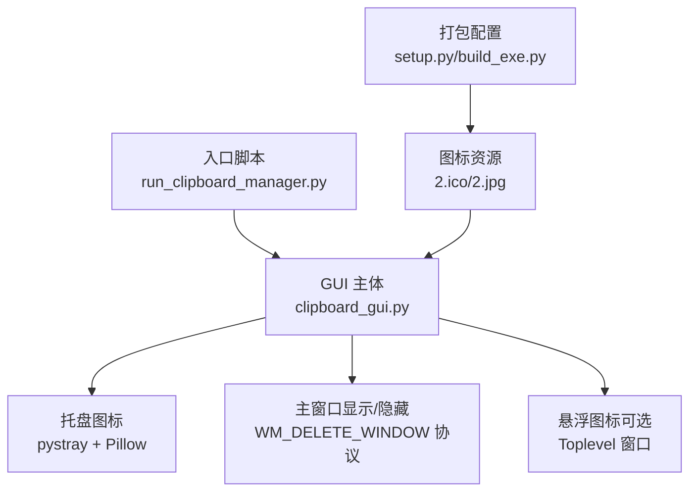
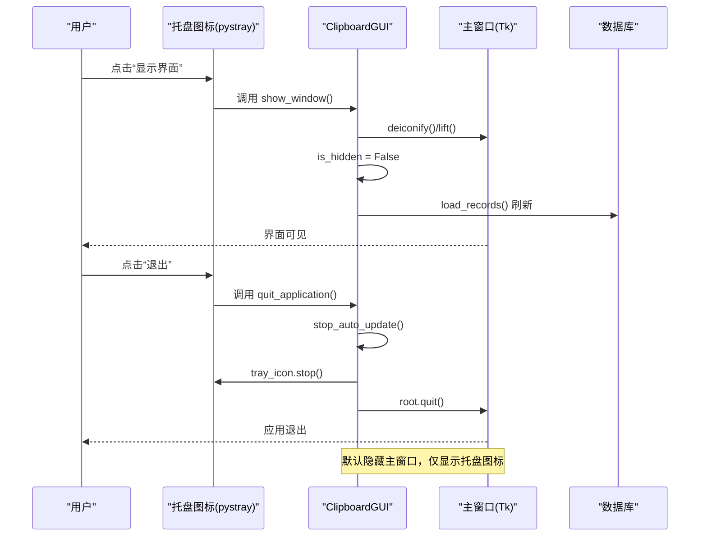
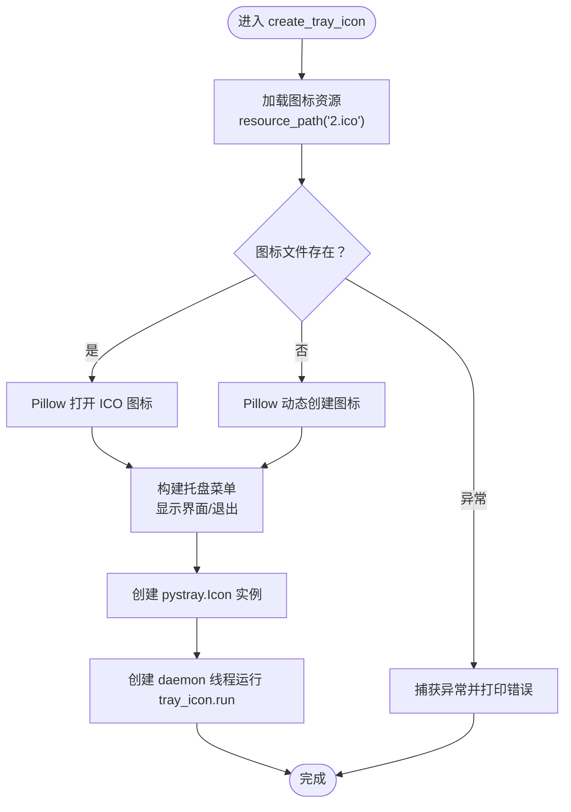
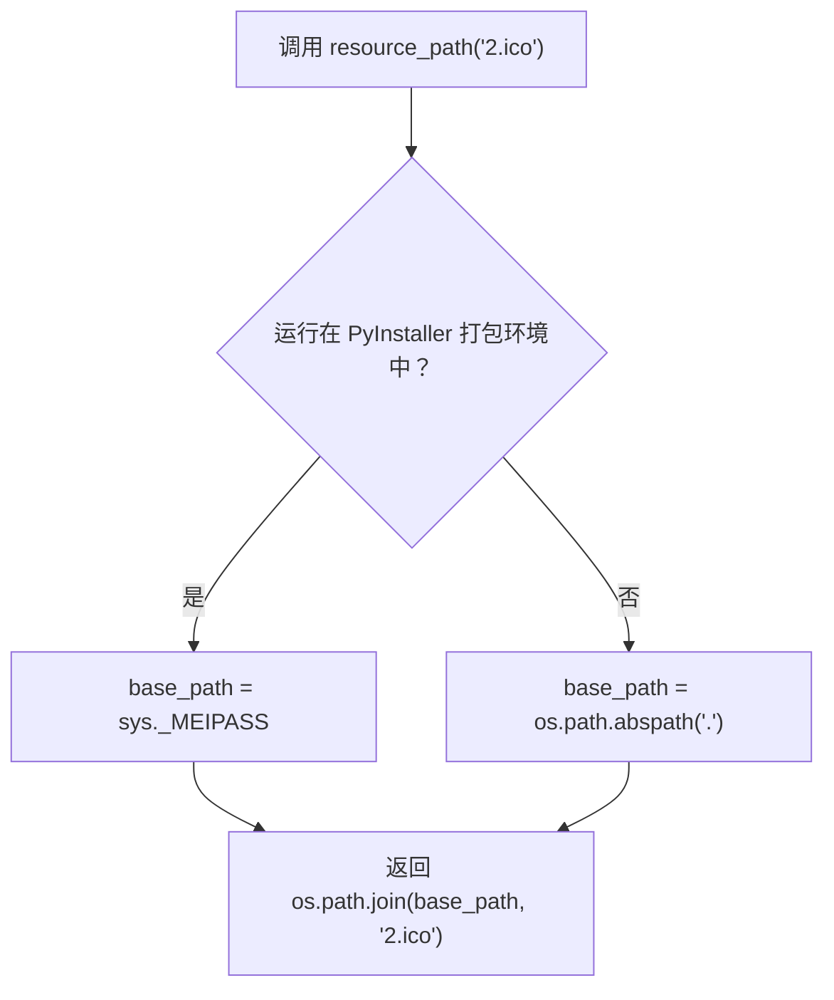
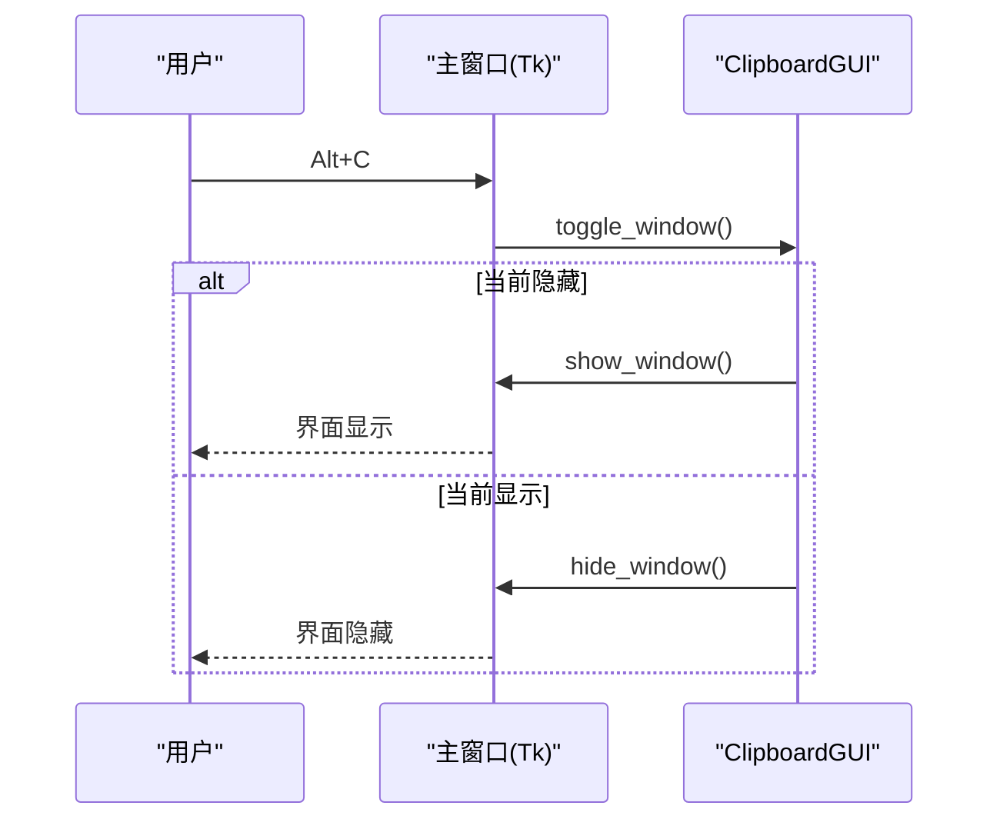
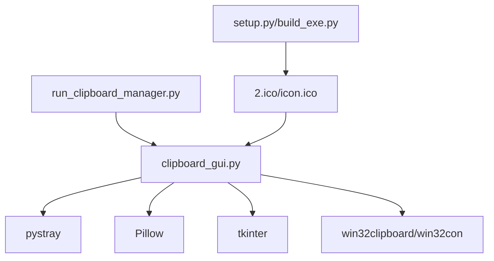

# 系统托盘集成

<cite>
**本文引用的文件**
- [clipboard_gui.py](file://clipboard_gui.py)
- [run_clipboard_manager.py](file://run_clipboard_manager.py)
- [clipboard_manager_main.py](file://clipboard_manager_main.py)
- [convert_to_ico.py](file://convert_to_ico.py)
- [build_exe.py](file://build_exe.py)
- [setup.py](file://setup.py)
</cite>

## 目录
1. [简介](#简介)
2. [项目结构](#项目结构)
3. [核心组件](#核心组件)
4. [架构总览](#架构总览)
5. [详细组件分析](#详细组件分析)
6. [依赖关系分析](#依赖关系分析)
7. [性能考量](#性能考量)
8. [故障排查指南](#故障排查指南)
9. [结论](#结论)
10. [附录](#附录)

## 简介
本文件围绕系统托盘图标的实现机制展开，重点说明如何使用 pystray 库创建托盘图标，解释 create_tray_icon 方法中图标资源的加载逻辑（包含 resource_path 函数对 PyInstaller 打包的支持），阐述托盘菜单的构建过程及事件绑定，说明托盘图标线程的创建与管理（daemon 线程安全运行），以及托盘图标与主 GUI 窗口的交互逻辑（点击托盘图标显示/隐藏窗口）。同时提供托盘功能的异常处理机制（当 pystray 或 Pillow 缺失时的降级处理），并讨论托盘图标的视觉设计原则与用户体验考虑。

## 项目结构
本项目采用“入口脚本 + GUI 主体 + 托盘与资源 + 打包配置”的组织方式：
- 入口脚本负责进程互斥、启动 GUI 并默认隐藏主窗口，仅保留托盘图标
- GUI 主体负责托盘图标创建、菜单项绑定、窗口显示/隐藏、悬浮图标等
- 资源与打包配置确保图标资源随程序一起分发，并兼容 PyInstaller 打包

图表来源
- [run_clipboard_manager.py](file://run_clipboard_manager.py#L32-L66)
- [clipboard_gui.py](file://clipboard_gui.py#L144-L171)
- [setup.py](file://setup.py#L14-L20)
- [build_exe.py](file://build_exe.py#L14-L20)

章节来源
- [run_clipboard_manager.py](file://run_clipboard_manager.py#L32-L66)
- [clipboard_gui.py](file://clipboard_gui.py#L144-L171)
- [setup.py](file://setup.py#L14-L20)
- [build_exe.py](file://build_exe.py#L14-L20)

## 核心组件
- 托盘图标创建与菜单
  - create_tray_icon：创建托盘图标，加载图标资源，构建菜单项，启动 daemon 线程运行托盘
  - 菜单项：显示界面、退出
  - 事件绑定：显示界面 -> show_window；退出 -> quit_application
- 图标资源加载
  - resource_path：兼容 PyInstaller 打包，定位 2.ico 或生成默认图标
- 线程管理
  - 使用 daemon=True 的线程运行托盘，确保主线程退出时托盘线程安全结束
- 主窗口交互
  - hide_window：隐藏窗口（withdraw），is_hidden 标志位
  - show_window：显示窗口（deiconify），lift 置顶，load_records 刷新
  - toggle_window：根据 is_hidden 切换显示/隐藏
  - WM_DELETE_WINDOW：协议绑定到 hide_window，避免直接关闭导致托盘不可用

章节来源
- [clipboard_gui.py](file://clipboard_gui.py#L144-L171)
- [clipboard_gui.py](file://clipboard_gui.py#L1699-L1722)
- [run_clipboard_manager.py](file://run_clipboard_manager.py#L55-L66)

## 架构总览
系统托盘与主 GUI 的交互流程如下：

图表来源
- [clipboard_gui.py](file://clipboard_gui.py#L144-L171)
- [clipboard_gui.py](file://clipboard_gui.py#L1699-L1722)
- [run_clipboard_manager.py](file://run_clipboard_manager.py#L55-L66)

## 详细组件分析

### 托盘图标创建与资源加载
- 资源加载策略
  - 优先使用 resource_path("2.ico") 定位图标文件
  - 若文件不存在，使用 Pillow 动态创建一张简单图标（RGB 64x64，绘制圆与字母）
- 菜单构建
  - “显示界面”菜单项绑定到 show_window
  - “退出”菜单项绑定到 quit_application
- 线程运行
  - 创建 pystray.Icon 实例
  - 在独立线程中调用 tray_icon.run，daemon=True，确保托盘线程随主线程退出而安全结束
- 异常处理
  - create_tray_icon 中捕获异常并打印错误信息，避免影响主流程

图表来源
- [clipboard_gui.py](file://clipboard_gui.py#L144-L171)

章节来源
- [clipboard_gui.py](file://clipboard_gui.py#L144-L171)

### 资源路径与 PyInstaller 兼容性
- resource_path 函数
  - 通过 sys._MEIPASS 获取 PyInstaller 临时目录，若不存在则回退到当前工作目录
  - 返回拼接后的绝对路径，确保在打包后仍能正确找到 2.ico
- 打包配置
  - setup.py/build_exe.py include_files 中包含 2.ico/icon.ico，确保资源随程序分发
  - 打包时显式包含 PIL/pystray 包，避免运行时缺失

图表来源
- [clipboard_gui.py](file://clipboard_gui.py#L27-L36)
- [setup.py](file://setup.py#L14-L20)
- [build_exe.py](file://build_exe.py#L14-L20)

章节来源
- [clipboard_gui.py](file://clipboard_gui.py#L27-L36)
- [setup.py](file://setup.py#L14-L20)
- [build_exe.py](file://build_exe.py#L14-L20)

### 托盘菜单与事件绑定
- 菜单项
  - “显示界面”：绑定到 ClipboardGUI.show_window
  - “退出”：绑定到 ClipboardGUI.quit_application
- 事件处理
  - show_window：deiconify/lift/刷新记录/is_hidden=False
  - quit_application：stop_auto_update/tray_icon.stop/root.quit
- 交互一致性
  - 默认隐藏主窗口，仅显示托盘图标；通过托盘菜单或快捷键 Alt+C 切换显示

章节来源
- [clipboard_gui.py](file://clipboard_gui.py#L144-L171)
- [clipboard_gui.py](file://clipboard_gui.py#L1699-L1722)
- [run_clipboard_manager.py](file://run_clipboard_manager.py#L55-L66)

### 线程创建与管理（daemon 线程）
- 托盘线程
  - 使用 threading.Thread(target=self.tray_icon.run, daemon=True)
  - daemon=True 确保主线程退出时托盘线程自动结束，避免僵尸进程
- 监控线程
  - run_clipboard_manager.py 中也使用 daemon=True 线程运行剪贴板监控
- 注意事项
  - 托盘线程需在主线程 mainloop 前启动
  - 退出时调用 tray_icon.stop，确保托盘优雅退出

章节来源
- [clipboard_gui.py](file://clipboard_gui.py#L164-L169)
- [run_clipboard_manager.py](file://run_clipboard_manager.py#L50-L54)

### 托盘图标与主 GUI 的交互逻辑
- 隐藏与显示
  - hide_window：root.withdraw() + is_hidden = True
  - show_window：root.deiconify() + root.lift() + is_hidden = False + load_records()
  - toggle_window：根据 is_hidden 切换
- 关闭协议
  - root.protocol("WM_DELETE_WINDOW", hide_window)，避免直接关闭导致托盘不可用
- 快捷键
  - 绑定 Alt+C 切换窗口显示状态

图表来源
- [clipboard_gui.py](file://clipboard_gui.py#L1699-L1722)

章节来源
- [clipboard_gui.py](file://clipboard_gui.py#L1699-L1722)

### 异常处理与降级方案
- 库缺失降级
  - 导入 pystray/Pillow 失败时，TRAY_ICON_AVAILABLE=False，跳过托盘创建
  - 打印提示信息，引导用户安装 pystray 与 Pillow
- 托盘创建异常
  - create_tray_icon 中 try/except 捕获异常并打印错误，不影响主流程
- 打包与资源异常
  - resource_path 无法找到 2.ico 时，使用 Pillow 动态创建图标，保证托盘可用
- 建议
  - 在发布前确认依赖已安装，或在安装包中包含图标资源

章节来源
- [clipboard_gui.py](file://clipboard_gui.py#L17-L26)
- [clipboard_gui.py](file://clipboard_gui.py#L144-L171)
- [convert_to_ico.py](file://convert_to_ico.py#L10-L48)

### 视觉设计原则与用户体验
- 图标设计
  - 优先使用 2.ico；若缺失，动态生成简洁易识别的图标（如圆形背景+字母）
  - 打包时包含多尺寸 ICO，提升不同 DPI 下的清晰度
- 菜单设计
  - 菜单项简洁明确：“显示界面”“退出”，避免冗余
  - 默认项可考虑“显示界面”，便于快速唤起
- 交互体验
  - 隐藏主窗口，仅保留托盘图标，减少桌面占用
  - 点击托盘图标显示界面，支持 Alt+C 快捷键
  - 退出时优雅停止托盘线程，避免残留进程
- 可靠性
  - 异常捕获与降级，确保托盘功能可用
  - 打包配置 include_files 包含图标资源，避免运行时找不到资源

章节来源
- [clipboard_gui.py](file://clipboard_gui.py#L144-L171)
- [convert_to_ico.py](file://convert_to_ico.py#L10-L48)
- [setup.py](file://setup.py#L14-L20)
- [build_exe.py](file://build_exe.py#L14-L20)

## 依赖关系分析
- 运行时依赖
  - pystray：托盘图标核心库
  - Pillow：图标加载与动态生成
  - tkinter：GUI 界面与主窗口
  - win32clipboard/win32con：剪贴板读写（与托盘功能关联）
- 打包依赖
  - PIL、pystray 需包含进包
  - 2.ico/icon.ico 需 include_files
- 进程互斥
  - run_clipboard_manager.py 使用互斥量避免重复启动

图表来源
- [run_clipboard_manager.py](file://run_clipboard_manager.py#L32-L66)
- [clipboard_gui.py](file://clipboard_gui.py#L144-L171)
- [setup.py](file://setup.py#L14-L20)
- [build_exe.py](file://build_exe.py#L14-L20)

章节来源
- [run_clipboard_manager.py](file://run_clipboard_manager.py#L32-L66)
- [clipboard_gui.py](file://clipboard_gui.py#L144-L171)
- [setup.py](file://setup.py#L14-L20)
- [build_exe.py](file://build_exe.py#L14-L20)

## 性能考量
- 托盘线程为 daemon 线程，避免阻塞主线程退出
- 图标加载尽量使用二值图标（ICO），减少内存占用
- 菜单项绑定的方法应避免长时间阻塞，必要时异步处理
- 打包时包含多尺寸图标，减少缩放带来的性能损耗

## 故障排查指南
- 无法创建托盘图标
  - 检查是否安装 pystray 与 Pillow
  - 确认 2.ico 是否随程序打包
  - 查看控制台输出的异常信息
- 托盘图标不显示
  - 确认 resource_path 返回有效路径
  - 若 2.ico 缺失，确认动态生成图标逻辑是否执行
- 退出后仍有托盘残留
  - 确保调用 tray_icon.stop
  - 检查线程是否为 daemon=True
- 快捷键无效
  - 确认主窗口已获得焦点
  - 检查 Alt+C 绑定是否生效

章节来源
- [clipboard_gui.py](file://clipboard_gui.py#L144-L171)
- [clipboard_gui.py](file://clipboard_gui.py#L1699-L1722)
- [run_clipboard_manager.py](file://run_clipboard_manager.py#L55-L66)

## 结论
本项目通过 pystray 与 Pillow 实现了稳定的系统托盘图标功能，结合 resource_path 的 PyInstaller 兼容性、daemon 线程的安全管理、以及与主 GUI 的紧密交互，提供了简洁可靠的用户体验。在依赖缺失或资源缺失时具备降级能力，确保托盘功能始终可用。建议在发布前完善依赖与资源打包配置，进一步提升稳定性与可维护性。

## 附录
- 图标转换工具
  - convert_to_ico.py：将 JPG 转换为 ICO，支持多尺寸输出
- 打包配置
  - setup.py/build_exe.py：包含 2.ico/icon.ico，包含 PIL/pystray 包

章节来源
- [convert_to_ico.py](file://convert_to_ico.py#L10-L48)
- [setup.py](file://setup.py#L14-L20)
- [build_exe.py](file://build_exe.py#L14-L20)