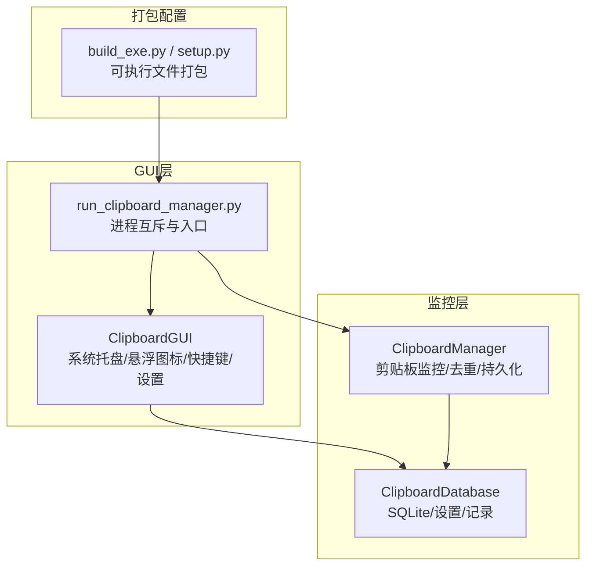
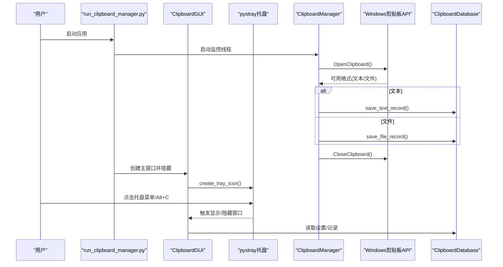
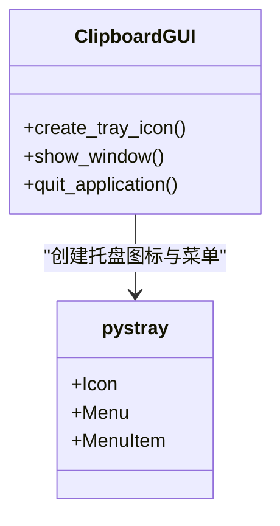
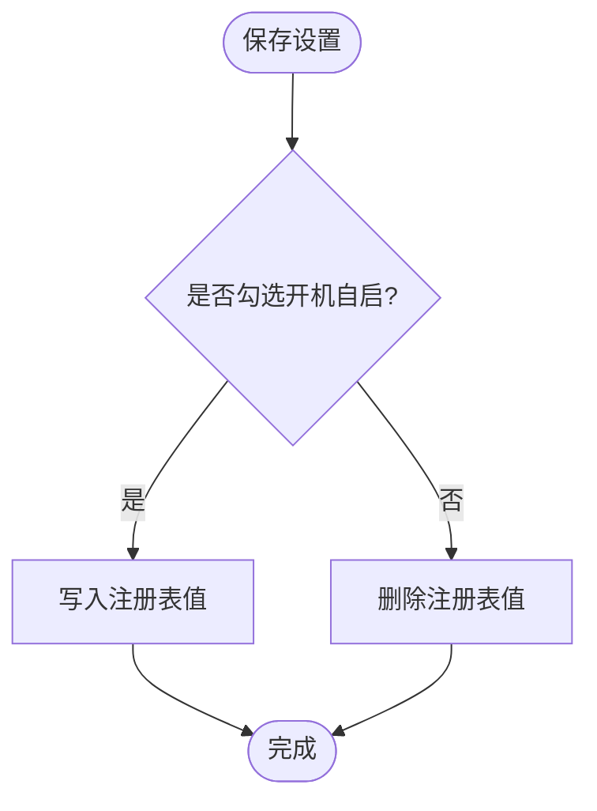
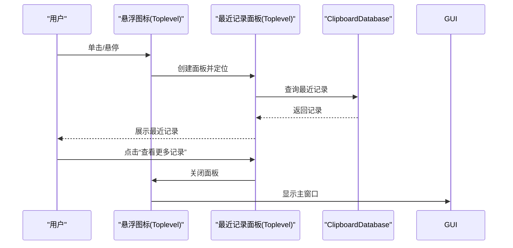
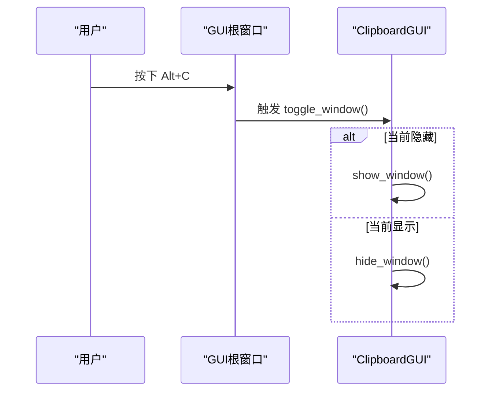
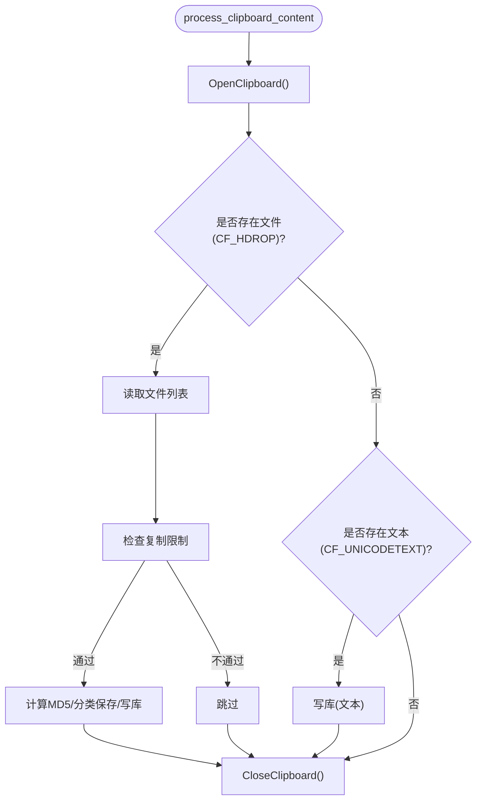
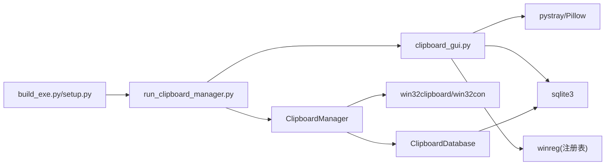

# 系统集成

<cite>
**本文引用的文件**
- [clipboard_gui.py](file://clipboard_gui.py)
- [run_clipboard_manager.py](file://run_clipboard_manager.py)
- [clipboard_manager_main.py](file://clipboard_manager_main.py)
- [clipboard_db.py](file://clipboard_db.py)
- [build_exe.py](file://build_exe.py)
- [setup.py](file://setup.py)
</cite>

## 目录
1. [简介](#简介)
2. [项目结构](#项目结构)
3. [核心组件](#核心组件)
4. [架构总览](#架构总览)
5. [详细组件分析](#详细组件分析)
6. [依赖关系分析](#依赖关系分析)
7. [性能考量](#性能考量)
8. [故障排查指南](#故障排查指南)
9. [结论](#结论)
10. [附录](#附录)

## 简介
本文件聚焦于应用程序与Windows系统的集成机制，围绕以下主题展开：
- 系统托盘集成：通过pystray实现图标显示、菜单构建与事件响应
- 开机自启：基于注册表HKEY_CURRENT_USER\Software\Microsoft\Windows\CurrentVersion\Run的设置与GUI切换
- 悬浮图标：利用Toplevel窗口与透明度、置顶等属性实现可拖动半透明悬浮图标及最近记录面板
- 全局快捷键：通过tkinter的bind_all实现Alt+C跨窗口捕获
- Windows剪贴板API交互：OpenClipboard/CloseClipboard的资源管理与格式探测
- 文件监控策略：对原始路径与缓存路径的处理
- 系统权限要求：是否需要管理员权限

## 项目结构
该项目采用“GUI + 后台监控”的双层架构：
- GUI层负责用户交互、托盘图标、悬浮图标、设置项（含开机自启与悬浮图标开关）、快捷键等
- 后台监控层负责周期性扫描剪贴板，识别文本与文件，去重与持久化

图表来源
- [clipboard_gui.py](file://clipboard_gui.py#L144-L171)
- [run_clipboard_manager.py](file://run_clipboard_manager.py#L32-L71)
- [clipboard_manager_main.py](file://clipboard_manager_main.py#L355-L496)
- [clipboard_db.py](file://clipboard_db.py#L18-L115)
- [build_exe.py](file://build_exe.py#L56-L81)
- [setup.py](file://setup.py#L65-L84)

章节来源
- [clipboard_gui.py](file://clipboard_gui.py#L144-L171)
- [run_clipboard_manager.py](file://run_clipboard_manager.py#L32-L71)
- [clipboard_manager_main.py](file://clipboard_manager_main.py#L355-L496)
- [clipboard_db.py](file://clipboard_db.py#L18-L115)
- [build_exe.py](file://build_exe.py#L56-L81)
- [setup.py](file://setup.py#L65-L84)

## 核心组件
- ClipboardGUI：系统托盘、悬浮图标、全局快捷键、开机自启与悬浮图标设置的GUI入口
- ClipboardManager：剪贴板监控、格式识别、去重、文件保存与数据库写入
- ClipboardDatabase：SQLite数据库封装、设置项与记录的增删改查
- run_clipboard_manager：进程互斥、隐藏主窗口、启动托盘与监控线程

章节来源
- [clipboard_gui.py](file://clipboard_gui.py#L144-L171)
- [clipboard_manager_main.py](file://clipboard_manager_main.py#L355-L496)
- [clipboard_db.py](file://clipboard_db.py#L18-L115)
- [run_clipboard_manager.py](file://run_clipboard_manager.py#L32-L71)

## 架构总览
应用启动流程与系统集成点如下：

图表来源
- [run_clipboard_manager.py](file://run_clipboard_manager.py#L32-L71)
- [clipboard_manager_main.py](file://clipboard_manager_main.py#L398-L496)
- [clipboard_gui.py](file://clipboard_gui.py#L144-L171)
- [clipboard_db.py](file://clipboard_db.py#L116-L183)

## 详细组件分析

### 系统托盘集成（pystray）
- 图标显示：优先加载资源文件2.ico；若不存在则动态绘制简单图标
- 菜单构建：包含“显示界面”和“退出”两项
- 事件响应：显示界面与退出应用
- 线程模型：托盘图标在独立线程中运行，避免阻塞GUI主线程

图表来源
- [clipboard_gui.py](file://clipboard_gui.py#L144-L171)

章节来源
- [clipboard_gui.py](file://clipboard_gui.py#L144-L171)

### 开机自启（注册表操作）
- 注册表路径：HKEY_CURRENT_USER\Software\Microsoft\Windows\CurrentVersion\Run
- 设置逻辑：启用时写入程序路径，禁用时删除对应值
- GUI联动：设置窗口中“允许程序开机自启”勾选框与保存设置流程对接

图表来源
- [clipboard_gui.py](file://clipboard_gui.py#L1131-L1163)

章节来源
- [clipboard_gui.py](file://clipboard_gui.py#L1030-L1117)
- [clipboard_gui.py](file://clipboard_gui.py#L1131-L1163)

### 悬浮图标（Toplevel + 透明度/置顶）
- 技术实现：使用Toplevel创建无边框、置顶、半透明窗口，支持拖动与悬停显示最近记录面板
- 交互细节：单击显示面板、双击显示主窗口、悬停显示面板、可拖动调整位置
- 数据展示：最近50条记录（文本/文件）按时间排序，底部“查看更多记录”跳转主界面

图表来源
- [clipboard_gui.py](file://clipboard_gui.py#L1173-L1372)
- [clipboard_db.py](file://clipboard_db.py#L185-L261)

章节来源
- [clipboard_gui.py](file://clipboard_gui.py#L1173-L1372)
- [clipboard_db.py](file://clipboard_db.py#L185-L261)

### 全局快捷键（Alt+C）
- 实现方式：在GUI初始化时绑定Alt+c与Alt+C到toggle_window，设置焦点确保捕获生效
- 效果：在托盘隐藏状态下通过Alt+C快速显示/隐藏主窗口

图表来源
- [clipboard_gui.py](file://clipboard_gui.py#L220-L226)
- [clipboard_gui.py](file://clipboard_gui.py#L1698-L1722)

章节来源
- [clipboard_gui.py](file://clipboard_gui.py#L220-L226)
- [clipboard_gui.py](file://clipboard_gui.py#L1698-L1722)

### Windows剪贴板API交互
- 资源管理：OpenClipboard在try块中调用，finally中保证CloseClipboard被调用，避免资源泄漏
- 格式识别：优先检测CF_HDROP（文件列表），其次检测CF_UNICODETEXT（文本）
- 去重策略：对文件使用MD5，对文本使用内容哈希，避免重复入库
- 保存策略：文件复制到分类目录（按类型/日期），记录原始路径与保存路径

图表来源
- [clipboard_manager_main.py](file://clipboard_manager_main.py#L398-L496)
- [clipboard_manager_main.py](file://clipboard_manager_main.py#L148-L179)
- [clipboard_manager_main.py](file://clipboard_manager_main.py#L362-L394)

章节来源
- [clipboard_manager_main.py](file://clipboard_manager_main.py#L398-L496)
- [clipboard_manager_main.py](file://clipboard_manager_main.py#L148-L179)
- [clipboard_manager_main.py](file://clipboard_manager_main.py#L362-L394)

### 文件监控与路径处理策略
- 原始路径：记录原始路径，便于后续打开文件位置
- 缓存路径：按类型/日期分类保存，文件名包含MD5片段，避免冲突
- 去重：以MD5为主键约束，重复内容仅增加计数
- 过期清理：根据设置的保留天数删除过期记录与对应文件

章节来源
- [clipboard_manager_main.py](file://clipboard_manager_main.py#L411-L458)
- [clipboard_db.py](file://clipboard_db.py#L116-L183)
- [clipboard_db.py](file://clipboard_db.py#L413-L455)

### 进程互斥与入口
- 进程互斥：通过命名互斥量确保同一时刻只有一个实例运行
- 入口行为：首次启动隐藏主窗口，仅显示托盘图标；若已运行则激活已有窗口

章节来源
- [run_clipboard_manager.py](file://run_clipboard_manager.py#L17-L46)
- [run_clipboard_manager.py](file://run_clipboard_manager.py#L55-L71)

## 依赖关系分析
- GUI依赖pystray与Pillow用于托盘图标与图像处理
- 监控依赖win32clipboard/win32con进行剪贴板读取
- 数据持久化依赖sqlite3与自定义数据库封装
- 打包依赖PyInstaller配置文件

图表来源
- [clipboard_gui.py](file://clipboard_gui.py#L17-L26)
- [clipboard_manager_main.py](file://clipboard_manager_main.py#L21-L23)
- [clipboard_db.py](file://clipboard_db.py#L18-L115)
- [build_exe.py](file://build_exe.py#L56-L81)
- [setup.py](file://setup.py#L65-L84)

章节来源
- [clipboard_gui.py](file://clipboard_gui.py#L17-L26)
- [clipboard_manager_main.py](file://clipboard_manager_main.py#L21-L23)
- [clipboard_db.py](file://clipboard_db.py#L18-L115)
- [build_exe.py](file://build_exe.py#L56-L81)
- [setup.py](file://setup.py#L65-L84)

## 性能考量
- 监控频率：默认每秒轮询一次，可通过命令行参数调整间隔
- 去重与I/O：文件MD5计算与SQLite写入为热点，建议在批量文件场景下适当降低监控频率
- GUI线程：托盘与悬浮面板均在独立线程中运行，避免阻塞主线程
- 资源释放：剪贴板API始终成对调用OpenClipboard/CloseClipboard，减少异常导致的资源占用

章节来源
- [clipboard_manager_main.py](file://clipboard_manager_main.py#L717-L730)
- [clipboard_manager_main.py](file://clipboard_manager_main.py#L398-L496)

## 故障排查指南
- 托盘图标不可用：确认已安装pystray与Pillow；若未安装，程序会打印提示
- 开机自启无效：检查注册表项是否成功写入/删除；确认当前用户权限
- 悬浮图标不显示：检查资源文件2.jpg是否存在；若不存在将回退到纯色背景与文字
- 快捷键无响应：确认窗口已获得焦点；Alt+c与Alt+C均绑定
- 剪贴板读取失败：关注OpenClipboard/CloseClipboard异常；避免长时间占用剪贴板

章节来源
- [clipboard_gui.py](file://clipboard_gui.py#L17-L26)
- [clipboard_gui.py](file://clipboard_gui.py#L1131-L1163)
- [clipboard_gui.py](file://clipboard_gui.py#L1173-L1217)
- [clipboard_gui.py](file://clipboard_gui.py#L220-L226)
- [clipboard_manager_main.py](file://clipboard_manager_main.py#L398-L496)

## 结论
本项目通过pystray实现系统托盘、通过注册表实现开机自启、通过Toplevel与透明度/置顶属性实现悬浮图标与最近记录面板、通过tkinter绑定实现全局快捷键Alt+C、通过win32clipboard实现剪贴板API交互，并以SQLite持久化记录与设置。整体设计清晰、模块职责明确，具备良好的可维护性与扩展性。

## 附录

### 系统权限要求
- 开机自启：修改HKEY_CURRENT_USER下的Run项，通常无需管理员权限
- 剪贴板读取：普通用户权限即可，但需注意并发访问与异常处理
- 悬浮图标与托盘：标准GUI权限即可

章节来源
- [clipboard_gui.py](file://clipboard_gui.py#L1131-L1163)